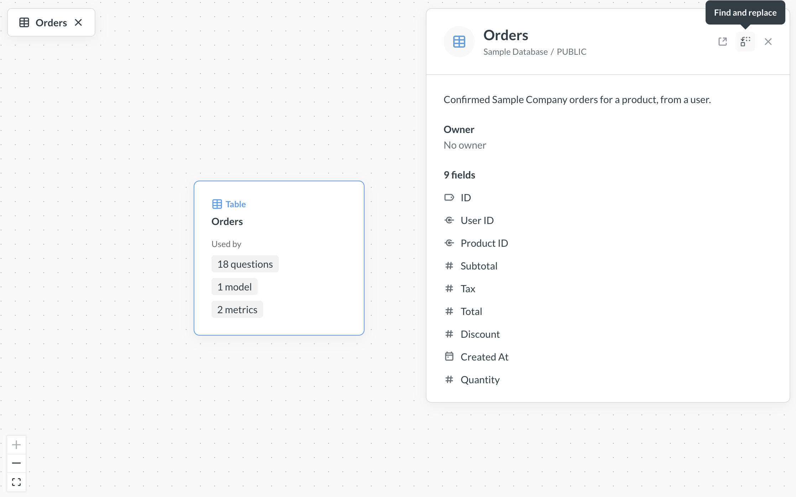
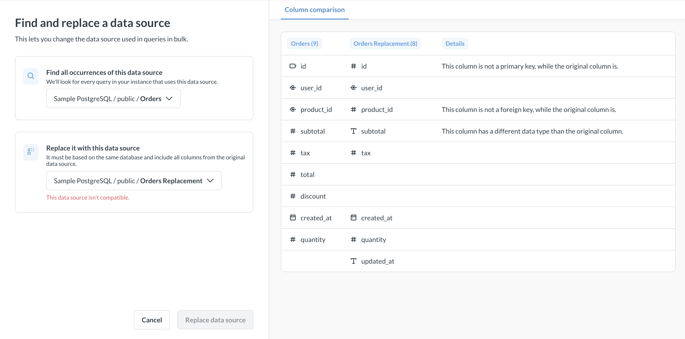
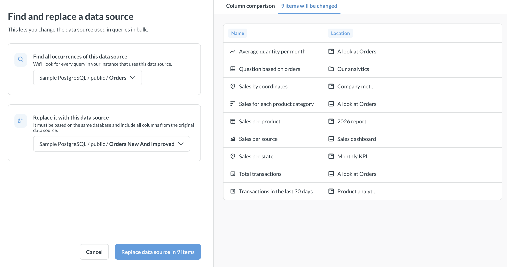

# Replace data sources



Admins can swap out a table, model, or saved question used across your Metabase and replace it with a different one across your entire Metabase. This is useful when you want to point existing content at a new or updated table, or when you're migrating from one data source to another.

## How replacing data sources works

- Only admins can replace data sources.

- Metabase uses the [dependency graph](./graph.md) to identify all content that depends on the original data source. "Data source" here means a table, model, or saved question - anything that's used as, well, a data source for a query.

- Once an admin [selects a replacement source](#find-and-replace-data-sources), Metabase [checks compatibility](#compatibility-requirements) of the original data source with the replacement data source.

- If data sources are compatible, Metabase walks through the entire dependency graph for the original data source and changes all queries to use the new data source instead. Metabase only swaps data sources where they're used specifically as _data sources_ for queries - and not, for example, lists of values or custom destinations, see [What gets replaced](#what-gets-replaced).

- The original data source is _not deleted_ after the replacement is finished.

## Compatibility requirements

You can replace a table, model, or saved question with any other table, model, or saved question, as long as the two sources satisfy the following requirements:

### General requirements

- **Original and new data sources must be in the same database**.

  For questions/models, this means that the underlying tables must be in the same database.

- **Original data source isn't used in any [row or column security policies](../../permissions/row-and-column-security.md)**.

  This is necessary to avoid accidentally exposing any data after the replacement is finished.

- **New data source can't depend on the original data source**.

  For example, you can't replace a table with a model based on the same table, or with an output of a transform built on the same table.

### Column requirements

- **All columns from the original source must be in the new data source.**

  Columns are matched by their database name (not their display name). New data source can have more columns than the original data source, but it can't have fewer columns.

- **Column types must match**.

  This means that, for example, if the column `user_id` is an integer in the old data source, it also must be an integer (and not a string or UUID) in the new data source.

- **If the original column is a Metabase _foreign_ key, the replacement column must be too.**

  For example, if `old_table` has `User ID` column with Metabase semantic type "Foreign key" to the `ID` column of `users` table, then the replacement source `new_table` also must have a `User ID` column with Metabase foreign key to `ID` from `users`.

  Only foreign keys defined in Metabase need to match. Database-defined foreign keys aren't checked.

- **If the original column is a Metabase _entity_ key, the replacement column must be too.**

  For example, if `old_table` has `ID` column with Metabase semantic type "Entity key", then the replacement source `new_table` also must have an `ID` column with Metabase semantic type "Entity key".

- If replacing a table, that **original table can't be a target of a Metabase's [semantic foreign keys](../../data-modeling/semantic-types.md)** from other tables.

  Foreign keys can still exist on the database level, but not on the level of Metabase semantic types. This requirement is necessary to avoid issues with implicit joins when swapping tables: for example, there can

  The old table can still have foreign keys _to_ other tables, it just can't be the _target_ of a foreign key.

## Find and replace data sources



Only admins can replace data sources.

To find and replace all entities that depend on a data source:

1. Go to **Data Studio** by clicking the **grid icon** in the top right and selecting **Data Studio**;
2. In Data Studio, click **Dependency graph** in the sidebar and search for the table, model, or question you want to replace.
3. Click the card for the data source and in the info panel on the right, click the **Find and replace** icon.
   
4. In the left sidebar, select replacement data source.
5. If Metabase can't go ahead with replacement, you'll see error messages next to data sources, and column compatibility errors in the "Column comparison table".

   

   Check out [Compatibility requirements](#compatibility-requirements).

6. If the sources are compatible, you can check out the list of items that will be changed:

   

7. Once you verified the changes, click U&&

### Running the replacement

Replacement can take a long time (potentially hours) on instances with thousands of questions.

Metabase runs the replacement asynchronously in the background. A status indicator appears at the bottom of the screen showing progress and completion. When complete, all affected items are updated to use the new data source.

If the replacement fails partway through, some items may already be updated. Check the status indicator for details.

You can cancel a replacement while it's running. Items that were already updated before you canceled won't be reverted.

Only one replacement can run at any time.

## What gets replaced

Items are replaced when (and only when) they are used as a query source. This includes:

- Data sources (including in joins) in questions, models, and metrics built with the query builder;
- Data sources for measures and segments;
- Tables in `FROM` statements in SQL queries;
- [Questions and models referenced from SQL questions](../../questions/native-editor/referencing-saved-questions-in-queries.md);
- Field filters;

Metabase **will not replace** tables/models/questions in:

- Snippets
- Question- or model-based sources for dropdown filter values in SQL questions and dashboards
- [Links](../../dashboards/introduction.md#link-cards) and [custom destinations](../../dashboards/interactive.md#custom-destinations) on dashboards;
- Targets for [actions](../../actions/introduction.md).

Metabase will **not allow** you to replace data sources that are used as:

- Row or column security policies
- Targets of foreign keys

## Permissions and data source replacement

Only admins can replace data sources in bulk.

Metabase **will not check** whether the data sources have comparable permissions. You need to make sure that new data source has appropriate permissions _before_ initiating the replacement to avoid blocking people from seeing questions, or exposing data they're not supposed to see.

For example, `old_table` might be configured to have view access for all users, but `new_table` might be blocked for everyone. If you replace `old_table` with `new_table`, then people will not be able to see any data in questions that used the `old_table` before replacement, because those questions will now use the blocked `new_table`.

Review both data and collection permissions for old and new sources before starting replacement.

## Avoid using data source replacement with remote sync enabled

Because old data sources can be used both in synced and unsynced collections, we do not recommend swapping data sources in bulk when remote sync is enabled.

## Limitations

- The source and target must be on the same database. Cross-database replacement isn't supported.
- Original and new data source have to satisfy [compatibility requirements](#compatibility-requirements).
- All uses of the original data sources are swapped for a new data source. You can't pick and choose the content to replace data sources in.
