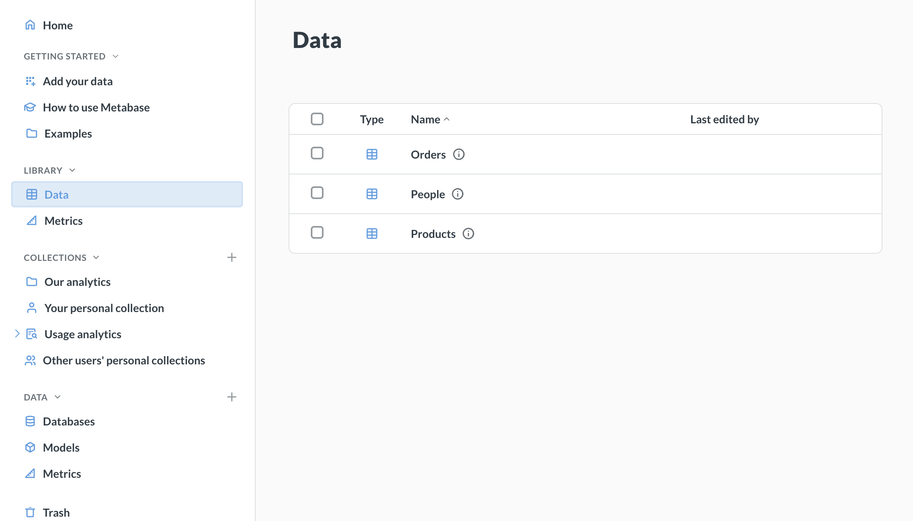
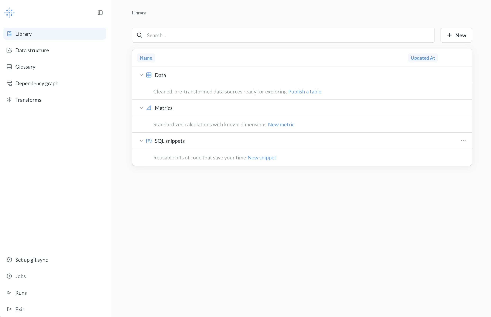
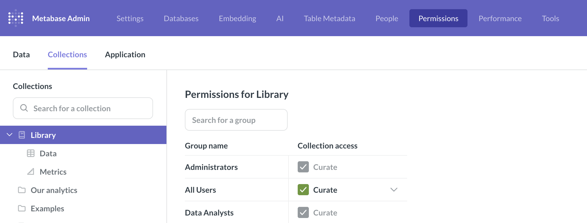

# Library



"I have always imagined that Paradise will be a kind of library."

― Jorge Luis Borges

The Library helps you create a source of truth for analytics by providing a centrally managed set of curated content. Use the Library to separate authoritative, reusable components from ad-hoc analyses.

## How the Library works

The Library is a special section in the navigation sidebar of the main Metabase app that you curate in [Data Studio](./overview.md) (and only in Data Studio).

You can use the Library to curate:

- Data: cleaned, pre-transformed data sources. Tables published to the Library appear first when people choose data sources, nudging them toward trusted data.
- [Metrics](../data-modeling/metrics.md): standardized calculations that people can trust.
- [SQL snippets](../questions/native-editor/snippets.md): reusable bits of code.

Unlike collections, each folder in the Library restricts which type of content it contains (which helps keep the Library tidy). For example, the Library's Metrics folder can only contain metrics.

## Adding items to the Library

1. Click the grid icon in the upper right.
2. Select **Data Studio**.
3. In the **Library** tab, click **+ New**.

You can add a metric or snippet, or publish a table. We use the word "publish" to suggest that the tables you include in your Library are meant to be finished, polished tables. Tables people can use to get answers they can trust. If your tables need to be cleaned or combined before they're ready for analytical queries, check out [transforms](../data-modeling/transforms.md).

You can also publish tables directly from the table view in the [Data Structures](./data-structures.md) tab.

In addition to being available for browsing in the library, published tables appear first when people pick data for new questions.

### Published tables can't have dependencies outside of the Library

Tables published to the Library can't depend on any tables outside of the Library. If, for example, you want to publish at table that includes data from another table, such as a [foreign-key remapping](../questions/visualizations/table.md#foreign-key-remapping), Metabase will publish those tables as well.

## Unpublishing tables

To unpublish a table from the Library:

1. Visit the table in Data Studio in the Library tab.
2. Click on the three-dot menu next to the table's name.
3. Click **Unpublish**.

If other tables depend on the table you want to unpublish, Metabase will unpublish those tables as well. You'll get a confirmation message explaining which tables Metabase would unpublish.

## Managing tables

Once a table is published, you can view and manage its metadata, and more.

- Overview
- [Fields](./data-editing.md)
- [Segments](/docs/data-modeling/segments.md)
- Measures
- [Dependencies](./dependency-graph.md).

To query a table from the Library in Data Studio:

1. Click on the table.
2. Click the three-dot menu.
3. Select **View**.

## Metrics in the Library

For how Metrics work, see [Metrics](../data-modeling/metrics.md).

## Snippets in the Library

For how snippets work, see [SQL snippets](../questions/native-editor/snippets.md).

## Versioning the Library

You can [sync Library content to version control](../installation-and-operation/remote-sync.md), giving you change history and the ability to publish content across environments.

## Permissions

Metabase uses the standard [collection permissions](../permissions/collections.md) to determine who can view and edit items in the Library. One difference to note is that people in the Data Analyst group always have Curate access to the Library. Like with the Admin group, you can't change the Data Analyst's Curate access to the Library.

[Data permissions](../permissions/data.md) work the same way in the Library as everywhere else in Metabase. One thing to call out: like with models, if you publish a table to the Library, it will grant query access to a group with view access to the database, even if their group has Create Queries set to No in [data permissions](../permissions/data.md) for that particular table.

## Further reading

- [Dependency graph](./dependency-graph.md)
- [Remote sync](../installation-and-operation/remote-sync.md)
- [Models](../data-modeling/models.md)
- [Metrics](../data-modeling/metrics.md)
