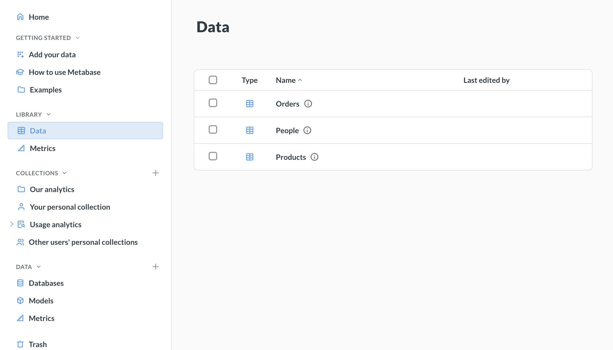
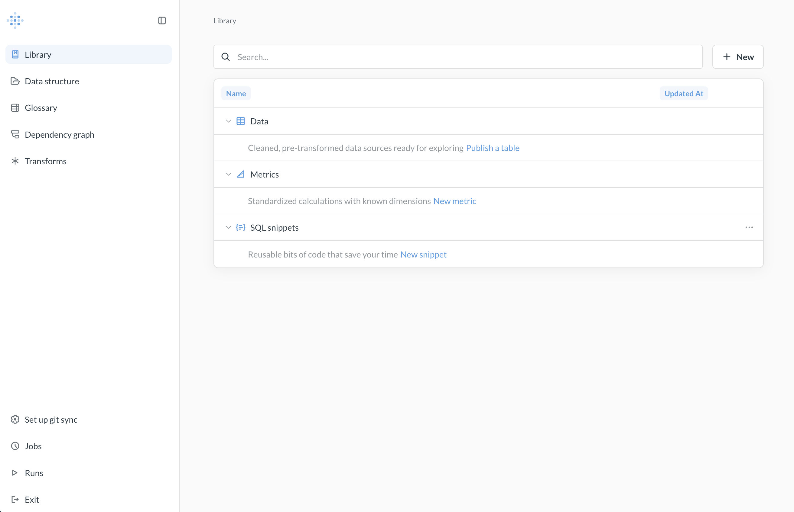
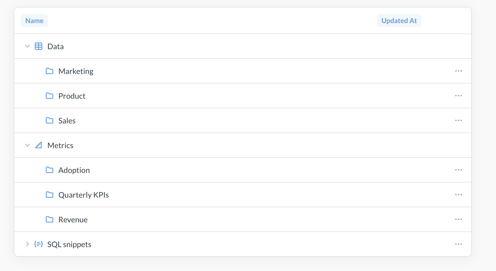
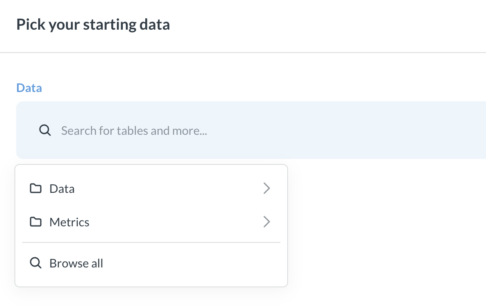
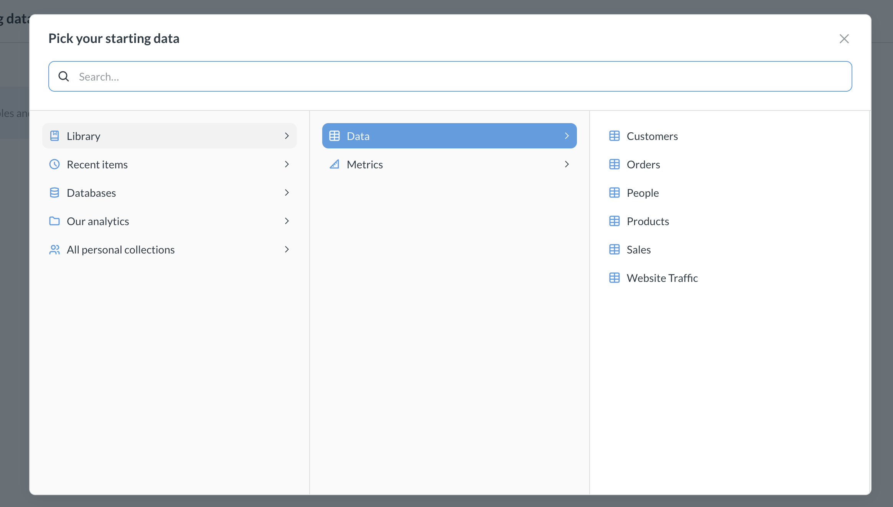
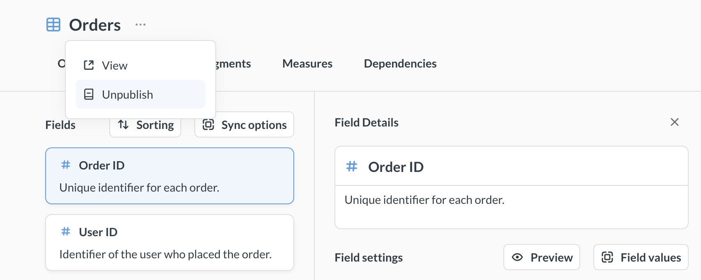
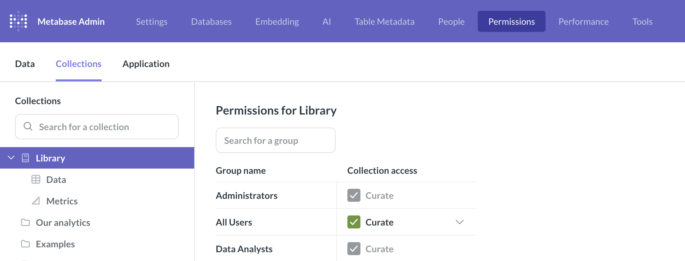

# Library



"I have always imagined that Paradise will be a kind of library."

― Jorge Luis Borges

The Library helps you create a source of truth for analytics by providing a centrally managed set of curated content. Use the Library to separate authoritative, reusable components from ad-hoc analyses.

## How the Library works

The Library is a special section in the navigation sidebar of the main Metabase app that you curate in [Data Studio](./overview.md) (and only in Data Studio). It has three root sections — **Data**, **Metrics**, and **Snippets** — each of which restricts the type of content it contains. You can create subcollections within Data and Metrics to further organize content - for example, you can group together tables useful for Marketing or Sales.

## Adding items to the Library

To add items to the Library:

1. Click the grid icon in the upper right.
2. Select **Data Studio**.
3. In the **Library** tab, click **+ New**.

You can:

- [Publish a table](#publishing-tables)
- [Create a metric](#metrics)
- [Create a SQL snippet or folder](#sql-snippets)
- [Create a subcollection or snippet folder](#library-organization)

## Library organization

Library is essentially a special collection. It has three special "subcollections":

- **Data** - for [published tables](#publishing-tables);
- **Metrics** - for [official metrics](#metrics);
- **Snippets** - for all the [SQL snippets](#sql-snippets) on your instance.

These special collections are predefined. You can't rename or archive them, (but you can use [ permissions](#library-permissions) to control who sees these collections).

Each of these special collections can have further subcollections. For example, if your Metabase has a lot of published tables, you might want to organize the **Library > Data** collection into "Sales", "Marketing", "Product" subcollections.

People will see the Library structure in the navigation sidebar and in the data picker in the query builder:

To create a new subcollection for one of the Library's special collections:

1. Go to **Data Studio > Library**.
2. Click **+ New** in the top right corner.
3. Under **Collection it's saved in**, select the parent collection.
4. Add the name and description for the collection and click **Create**.

## Publishing tables

Tables published to the Library appear first in the Data section when people choose data sources, nudging them toward trusted data.

You must explicitly publish tables to the Library. We use the word "publish" to suggest that the tables you include in your Library are meant to be finished, polished tables. If your tables need to be cleaned or combined before they're ready for analytical queries, check out [transforms](./transforms/transforms-overview.md).

Tables published to the Library remain available via the data browser as well.

To publish a table to the library:

1. Go to **Data Studio > Library**

### Managing tables

Once a table is published, you can view and manage its metadata, and more.

- Overview
- Fields
- [Segments](segments.md)
- [Measures](measures.md)
- [Dependencies](./dependencies/graph.md)

To query a table from the Library in Data Studio:

1. Click the table.
2. Click the three-dot menu.
3. Select **View**.

### Published tables can't have dependencies outside of the Library

Tables published to the Library can't depend on any tables outside of the Library. If, for example, you want to publish a table that includes data from another table, such as a [foreign-key remapping](../questions/visualizations/table.md#foreign-key-remapping), Metabase will publish those tables as well.

### Unpublishing tables

To unpublish a table from the Library:

1. Visit the table in Data Studio in the Library tab.
2. Click on the three-dot menu next to the table's name.
3. Click **Unpublish**.

If other tables depend on the table you want to unpublish, Metabase will unpublish those tables as well. You'll get a confirmation message explaining which tables Metabase would unpublish.

Unpublishing a table just removes the table from the Library. That table will still be available via the data browser and data pickers.

> **Archiving a subcollection unpublishes its tables.** If you archive a Data subcollection, Metabase will automatically unpublish all tables inside it, including tables in any nested subcollections.

## Metrics

[Metrics](../data-modeling/metrics.md) are standardized calculations that people can trust.

Metrics can live in any collection, but metrics in the Library will be prioritized in navigation, search, the query builder, and other places. Use the Library as a place for curated, "official" metrics, like your company's revenue.

To add an already existing metric to the Library, move the metric to the **Library > Metrics** collection (or any of its subcollections).

To create a new Library metric, go to **Data Studio > Library** and select **+ New > Metric**. See [creating metrics](../data-modeling/metrics.md#create-a-metric) for more on building metrics.

## SQL snippets

[SQL snippets](../questions/native-editor/snippets.md) are reusable bits of code. All snippets in your Metabase are available to the library, including snippets created elsewhere in your Metabase. You can also create snippet folders in the Library.

## Versioning the Library

You can [sync Library content to version control](../installation-and-operation/remote-sync.md), giving you change history and the ability to publish content across environments.

## Library permissions

Library is essentially a special collection. Metabase uses the standard [collection permissions](../permissions/collections.md) to determine who can view and edit items in the Library, with some caveats. Library collection permissions are only relevant to the Data and Metrics collections. Snippets permissions are handled by [permissions for snippet folders](../permissions/snippets.md).

To configure permissions for the library:

1. Go to **Admin > Permissions**.
2. Switch to **Collections** in the left sidebar.
3. Select **Curate**, **View**, or **No access** permissions for the Library and its subcollecitons.

   See below for the access that each permission level provides for each part of the Library.

### Curate permissions

- **Data** collection and its subcollections: The group can view tables in the Data collection, provided they have [data permissions](../permissions/data.md) for the tables. But they can't add, edit, or remove tables. The Admin and Data Analyst groups are the _only_ groups that can publish tables to the Library.
- **Metrics** collection and its subcollections: the group can add, edit, and archive metrics. Groups don't need access to Data Studio to curate metrics.

### View permissions

Controls whether a group can view the Library and its items.

- **Data** and its subcollections: The group can view tables in the Data collection, provided they have [data permissions](../permissions/data.md) for the tables.
- **Metrics** and its subcollections: the group can view the metrics and use them in their queries.

### No access

Groups with **No access** won't even see the Library (including in the navigation sidebar and the query builder).

The group may still have access to tables published to the Library, if they have [data permissions](../permissions/data.md) to those tables. Do not use collction permissions to **Library > Data** to block access to tables - use [data permissions](../permissions/data.md) instead.

### Permissions to edit the Library

Admins and people in the Data Analyst group always have Curate access to the Library.

There are some caveats through, depending on which part of the Library you're working with.

- **Data** (published tables):

  - Only [admins and data analysts](../people-and-groups/managing.md) can publish tables to the Data section of the Library;
  - Even if you give "Curate" permissions to **Library > Data** or its subcollections to a non-admin and non-analyst group, people in that group will **not** be able to publish tables. People can only publish tables if they have access to Data Studio, and only admins or data analysts can access Sata Studio.

- **Metrics**:

  - [Admins and data analysts](../people-and-groups/managing.md) can always manage metrics in the Library and its subollections;
  - If you give "Curate" permissions to **Library > Metrics** or its subcollections to a non-admin and non-analyst group, people in that group will be able to save or move metrics to those subcollections from the main app only. "Curate" permissions to **Library > Metrics** or subcolelcitons do _not_ give access to Data Studio.

- **Snippets**

  - Snippet management is controlled by [snippet permissions](../permissions/snippets.md) - not regular collection permissions.

The root sections (Data, Metrics, Snippets) have fixed properties and can't be renamed or deleted. Subcollections you create follow the normal collection permission rules.

## Permissions to use Library content

People who have View or Curate collection permissions to the **Library** subcollections will be able to use the content in their queries - with some caveats

- **Data** (published tables):

  - People who have View or Curate collection permissions to **Library > Data** or its subcollections will be able to see published tables the in the navigation sidebar, see the published tables in the query builder, and search for published tables (all restricted to subcollections they have access to, of course).

  - **Don't use collection permissions on the Data subcollections for restricting access to tables**. Use [Data permissions](../permissions/data.md) to control access to tables. Collection permissions on **Library > Data** subcollections only control what people see in navigation and data picker, but do not restrict data access. Collection permissions on Data subcollections are useful when you want to declutter the UI for your users - like removing Sales tables from the default view for Marketing group, without necessarily forbidding Marketing from accessing Sales tables altogether.

  - Use [Data permissions](../permissions/data.md) - not Library collection permissions to control access to the actual data in the tables published to **Library > Data**. Data permissions work the same way in the Library as everywhere else in Metabase.

  - Like with models, if you publish a table to the Library, it will grant query access to a group with view access to the database, even if their group has Create Queries set to No in [data permissions](../permissions/data.md) for that particular table.

- **Metrics**:

  - Only people who have View or Curate collection permissions to **Library > Metrics** or its subcollections will be able use the metrics from the appropriate collections. Removing collection access to a **Library > Metrics** subcollection also blocks any usage of metric there.

- **Snippets**:

  - Snippet access is controlled by [snippet permissions](../permissions/snippets.md) - not regular collection permissions.

## Further reading

- [Dependency graph](./dependencies/graph.md)
- [Remote sync](../installation-and-operation/remote-sync.md)
- [Metrics](../data-modeling/metrics.md)
- [Snippets](../questions/native-editor/snippets.md).
