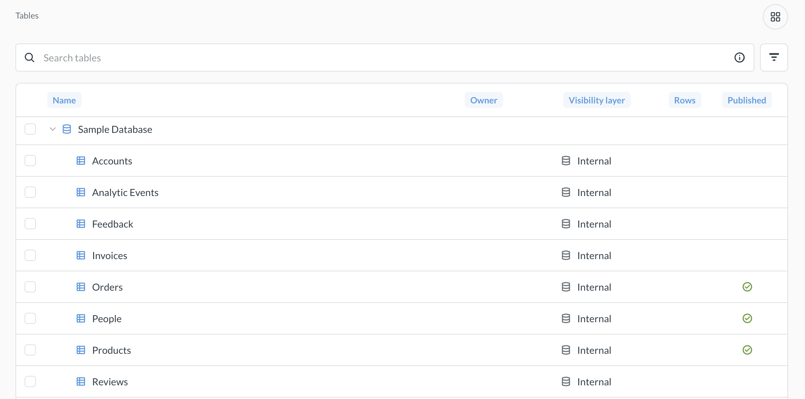
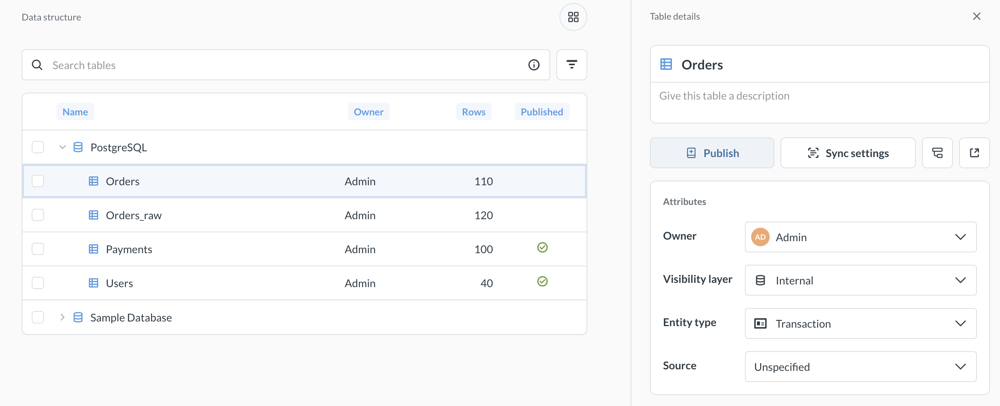

# Managing tables

_Data Studio > Tables_

You can manage table settings metadata to make it easier for people to work with your data in **Data Studio > Tables**.

You can do things like:

- Browse all the tables in your Metabase
- Publish tables to the Library
- Sync and scan tables
- Assign owners and other attributes to tables
- Set table and field visibility
- Edit table and column names and types
- Set data formatting settings
- Create measures and segments

## Permissions for managing tables in Data Studio

To access the Tables area of Data Studio, you need to be a member of the Admin group or the Data Analyst group (Data Analyst group is only available on Pro/Enterprise plans).

People in the Data Analyst group will have table metadata and data structure access to _all_ tables in your Metabase, even if they have limited View Data permissions for those tables. If you only want to give someone access to table metadata for some - but not all - tables, use the table metadata permissions and access the Table Metadata through Admin > Table metadata instead of Data Studio.

## Browse tables

_Data Studio > Tables_

You can see all tables in all databases connected to your Metabase in **Data Studio > Tables**, together with their owner, row count, and published state. For now, Metabase only displays row counts for PostgreSQL tables.

You can search for table names, but the search will only match beginnings of words in table names. So for example, if you search for "base", results will include names like "Baseball stats" and "All your base are belong to us", but the results won't include tables like "Metabase secrets".

You can also filter tables by attributes like owners, visibility, or source - for example, if you wanted to find all hidden tables, or all tables created from CSV uploads.

You can set [table attributes](#table-attributes), [edit metadata](#table-and-field-metadata), [publish the table](#publishing-and-unpublishing-tables) or create [segments](./segments.md) or [measures](./measures.md) on the table. You can also select tables in bulk to publish or assign attributes (including visibility) to multiple tables at once.

## Publishing and unpublishing tables

_Data Studio > Tables > Details_



Once you select a table in **Data Studio > Tables**, you can publish the table to add it to the Library. The Library is a special collection that helps you create a source of truth for analytics by providing a centrally managed set of curated content.

See [Publishing tables](./library.md#publishing-tables) in the [Library docs](./library.md).

## Find and replace tables

You can replace every occurrence of a table as a data source with another table. See [Replace data sources](./dependencies/replace-data-sources.md).

## Sync settings

_Data Studio > Tables > Details_

You can trigger manual re-sync of the table schema in **Data Studio > Tables** in the **Details** tab. Re-syncing can be useful if you have added or removed columns from the table, and you don't see those changes reflected in Metabase.

You can also re-scan field values for the table or discard cached field values, which is useful if you need to retrieve updated values for dropdown filters.

See [syncs and scans](../databases/sync-scan.md) for more information.

## Table attributes

_Data Studio > Tables > Details_

You can configure table attributes in **Data Studio > Tables** in the **Details** tab.

### Owner

Table **owner** can be a Metabase user or an arbitrary email address. Use this owner attribute to let people know who on your team is responsible for which table.

Table owner attribute is not exposed to people outside Data Studio.

### Visibility layer

The **Visibility layer** attribute controls whether people in your Metabase can see the table when building new queries. You can also use it to tag tables according to how ready for end-user consumption they are (for example, if you're using medallion architecture).

The options are:

- **Hidden**: the table isn't available in the query builder and isn't [synced](../databases/sync-scan.md). People with SQL access can still query the table.
- **Internal**: table visible in the query builder and synced.
- **Final**: table is visible in the query builder and synced.

Table visibility layer can be used as a tool to improve user experience of people working in your Metabase, and it should _not be used to control access_ - use [data permissions](../permissions/data.md) to control access instead.

### Entity type

You can use **entity type** to tell people what kind of information is contained in the table, for example "Transaction" or "Event". Metabase will try to detect and automatically assign appropriate entity types (like entity type "Person" for a `Users` table"), but you can always change it later.

Outside Data Studio, entity type determines the record icons in the [details view](../exploration-and-organization/exploration.md#view-details-of-a-record).

### Source

**Source** describes where the data comes from. It can be useful when you want to identify tables that are, for example, ingested tables, or tables coming from CSV uploads.

Metabase will automatically assign the source "Metabase transforms" to tables created by [Metabase transforms](./transforms/transforms-overview.md), and source "Uploaded data" to tables created by new [CSV uploads](../databases/uploads.md) (CSV uploads that you created before getting Data Studio will not be automatically tagged).

## Table and field metadata

_Data Studio > Tables > Fields_

You can edit field descriptions, types, visibility settings, and formatting. For example, you can choose to display a filter on a field as a dropdown, or display days as `21.03.2026` instead of `03/21/2026`.

See [Table metadata editing](../data-modeling/metadata-editing.md).

## Segments

Segments are saved filters on a table that people can use in the query builder. See [Segments](./segments.md).

## Measures

Measures are saved aggregations on a table that people can use in the query builder. See [Measures](./measures.md).

## Further reading

- [Table metadata editing](../data-modeling/metadata-editing.md)
- [Segments](./segments.md)
- [Measures](./measures.md)
