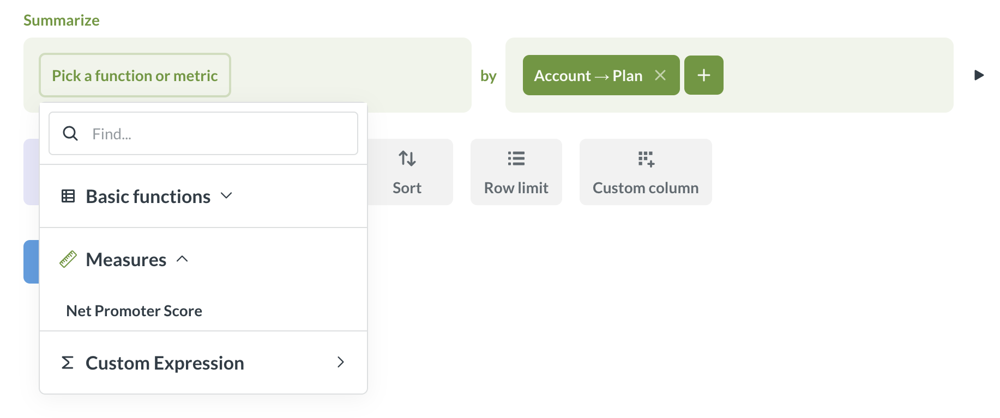
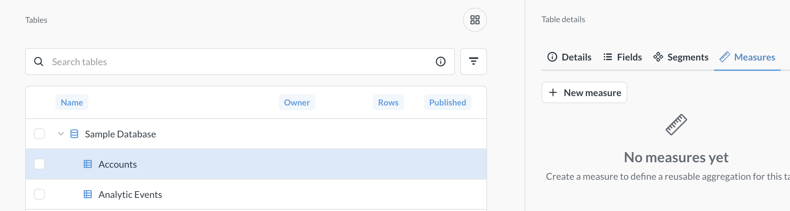
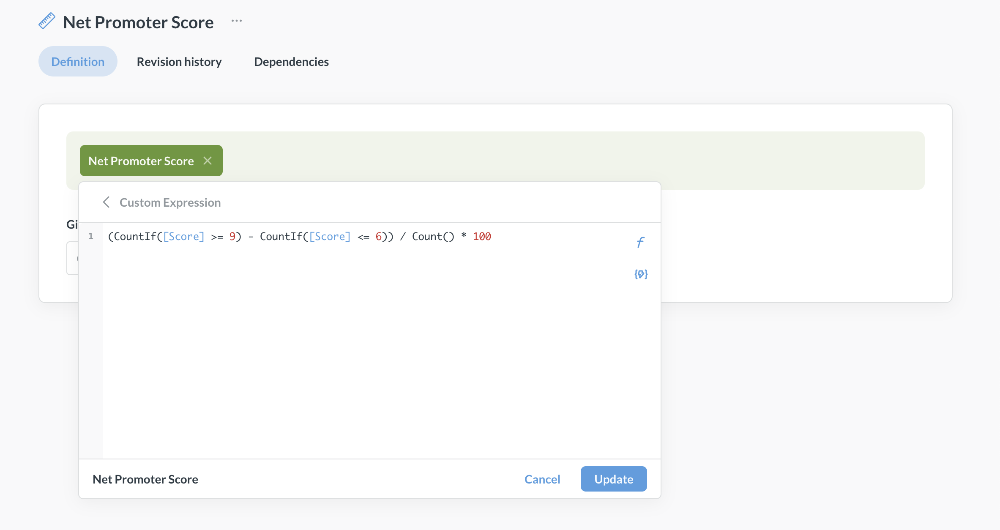
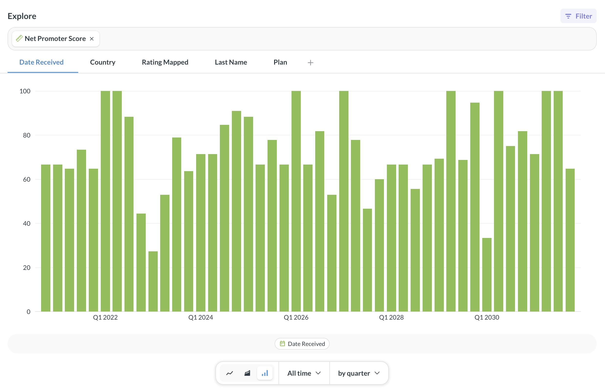

# Measures

Measures are saved aggregations associated with a table. You can use measures to create an official definition of a calculation—like Net Promoter Score—so everyone in your Metabase uses the same formula instead of writing their own versions.

People will see measures as options in the Summarize block of the [query builder](../questions/query-builder/editor.md).

## Create measures

> If your instance is in read-only [remote sync](../installation-and-operation/remote-sync.md) mode, and you enabled sync of the [Library](./library.md), you will not be able to create measures on tables published in the Library while in read-only mode.

Measures are created in [Data Studio](../data-studio/overview.md).

1. Go to **Data Studio** by clicking the **grid icon** in top right of the screen and selecting **Data Studio**.
2. In Data Studio, go to **Tables** in the left sidebar, and select the table to define a measure on.
3. In the right sidebar for the table, select **Measures**.

   

4. Click **+New measure**. You'll see an abridged version of Metabase's query builder that focuses on aggregation.

5. Add your aggregation formula. For more complex aggregations, check out [custom expressions](../questions/query-builder/expressions.md).

   For example, you can define a measure like `(CountIf([Score] >= 9) - CountIf([Score] <= 6)) / Count() * 100` to calculate Net Promoter Score.

   

6. To preview the results of the measure, click on the **three dots** icon next to the measure's name and select **Preview**.
7. Save.

## Use measures in the query builder

Measures allow people to use pre-defined aggregations to summarize their data.

To use a measure in the query builder:

1. Start a new question from the table that the measure is based on.
2. Select the measure in the **Summarize** block.

The measure's saved aggregation will be applied behind the scenes. You can use breakouts with a saved measure.

Measures will only appear in questions that use the measure's table as the primary data source. They will not appear in questions joining the measure's table, or in questions built on other questions or models, even if those questions or models use the measure's table as a source themselves.

## Delete measures

Deleting a measure will not break questions using it. The questions that use the measure will keep using the same aggregations as before.

1. Go to **Data Studio** by clicking the **grid icon** in top right of the screen and selecting **Data Studio**.
2. In Data Studio, go to **Tables**, and select the measure's table.
3. In the right sidebar for the table, select **Measures**.
4. Choose the measure you want to delete.
5. On the measure's page, click on the **three dots** icon next to the measure's name and select **Remove measure**.

## Explore measures

You can explore measures along dimensions and compare several measures in the [Metrics Explorer](../questions/metrics-explorer.md).

To see all measures on a table, select the table in [Data Studio > Managing tables](./managing-tables.md) and switch to the **Measures** tab.

## Permissions for measures

To **create, edit, or delete** measures, people need to:

- Be admins or members of the [Data Analysts](../people-and-groups/managing.md#data-analysts) group. This is needed to access Data Studio.
- Have [Create queries](../permissions/data.md#create-queries-permissions) permissions on the measure's table. This is needed to create the measure's query.

To **use** a measure, people need to:

- Have [Create queries](../permissions/data.md#create-queries-permissions) permissions on the measure's table.

## Only measures on published tables are synced to Git

When using [Remote Sync](../installation-and-operation/remote-sync.md):

- Measures on tables that are _not_ published to the [Library](./library.md) are _not_ synced;
- Measures on published tables are only synced if [_Library sync is enabled_](./library.md#versioning-the-library).

If your instance is in read-only Remote Sync mode, and the Library sync is enabled, you won't be able to create measures on published tables.

You can, however, sync [Metrics](../data-modeling/metrics.md) on any tables by syncing their collection.

## Limitations

- Measures are only available for use in the query builder. For defining reusable bits of SQL, check out [Snippets](../questions/native-editor/snippets.md).
- Measures are only available on questions that use the measure's table as the primary data source.
- All admins and people in the Data Analyst group can create measures on tables they have permissions to query. There aren't additional controls to restrict who can create measures beyond special groups and data permissions.
- [Only measures on published tables are synced to Git](#only-measures-on-published-tables-are-synced-to-git).

## Further reading

- [Library](./library.md)
- [Segments](./segments.md)
- [Metrics](../data-modeling/metrics.md)
- [SQL snippets](../questions/native-editor/snippets.md)
