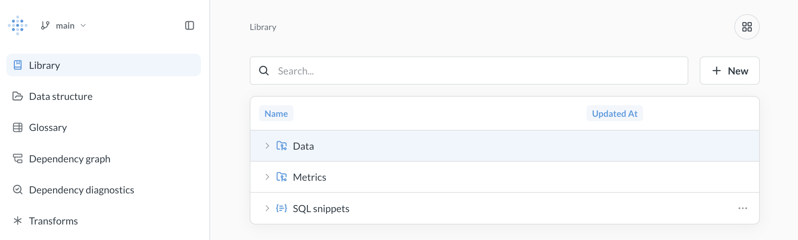

# Data Studio

Data Studio provides tools to shape and track your data so everyone can trust the numbers.

- **Create an easy-to-understand semantic layer** to match how people think about your business.
- **Speed up queries** by transforming tables to anticipate usage patterns.
- **View dependency graphs** to identify and fix problems before they impact reports.

## What's in Data Studio

- **[Library](./library.md)**\*: A curated space for your organization's most trusted analytics content—tables, metrics, and SQL snippets that your data team recommends.
- **[Data structure](./data-structure.md)**: Add table metadata to make tables easier to work with.
- **[Glossary](../exploration-and-organization/data-model-reference.md#glossary)**: Define terms relevant to your business, both for people and agents trying to understand your data.
- **[Dependency graph](./dependency-graph.md)**\*: A visual map of how your content connects, so you can understand the impact of changes before you make them.
- **[Dependency diagnostics](./dependency-diagnostics.md)**\*: See which items have broken dependencies, or that aren't used.
- **[Transforms](./transforms/transforms-overview.md)**: Wrangle your data in Metabase, write the query results back to your database, and reuse them in Metabase as sources for new queries.

\* Available on [Pro and Enterprise plans](https://www.metabase.com/pricing/).
