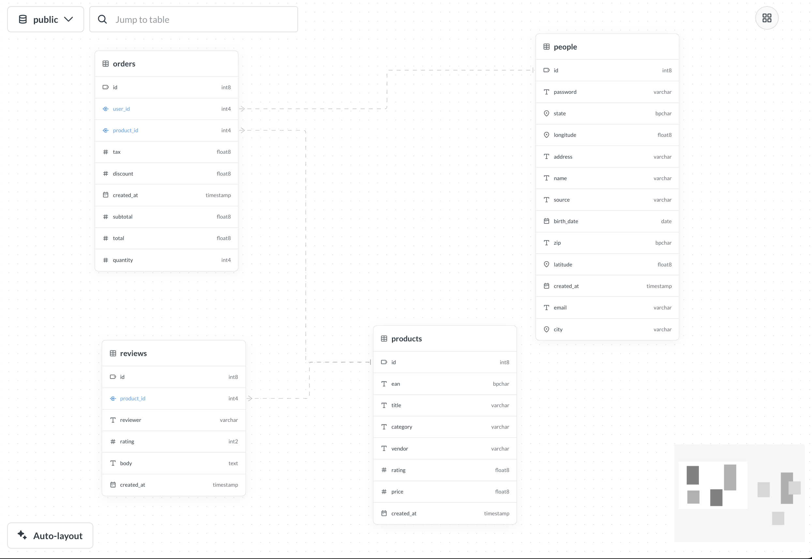

# Schema viewer

_Data Studio > Schema viewer_



The schema viewer helps you understand relationships between tables in your database.

If you're looking for a visual representation of dependencies between _Metabase entities_ (questions, metrics etc) and their underlying tables, check out the [dependency graph](./dependencies/graph.md) instead.

## What the schema viewer shows

For a particular schema (if your), the schema viewer will display:

- All tables in the schema (including hidden tables)
- Database names for tables and fields
- Database types for fields
- Foreign key relationships _set in Metabase_ (as arrows between tables)
- Entity keys _set in Metabase_

Schema viewer displays relationships based on the [Foreign Key semantic type](../data-modeling/metadata-editing.md) defined in Metabase, not based on constraints defined directly in your database. However, during [database sync](../databases/sync-scan.md), Metabase automatically maps database foreign key constraints to foreign key semantic types, so in most cases you won't need to set these manually.

If you've defined additional foreign key relationships in Metabase table metadata that don't have corresponding database constraints, schema viewer will display those as well.

Similarly, schema viewer displays entity keys based on the [Entity Key semantic type](../data-modeling/metadata-editing.md) defined in Metabase, not on primary key constraints in your database. During sync, Metabase automatically maps database primary keys to entity key semantic types, so they'll usually match. If you've manually set an entity key on a field that isn't a database primary key, schema viewer will display that as well.

## Using the schema viewer

To see the table relationships in the schema viewer:

1. Go to **Data Studio > Schema viewer**
2. In the top left, select a database.
3. (For databases that have schemas) Select a schema.

In the schema viewer, you can:

- Use the mini-map in the bottom right to focus on specific parts of your schema.
- Search for a table and center the schema viewer on that table.
- Drag and rearrange the tables.
- Click a table header to open an info panel.
- Click a foreign key field to navigate to the connected table.

## Permissions for schema viewer

The schema viewer is part of Data Studio, which only people in the Admin or [Data Analysts](../people-and-groups/managing.md#data-analysts) groups can access.

The Data Analyst group additionally needs to have at least [query builder](../permissions/data.md) permissions for one or more tables in a database to use the schema viewer for that database.

## Further reading

- [Managing tables](./managing-tables.md)
- [Table metadata](../data-modeling/metadata-editing.md)
- [Syncs and scans](../databases/sync-scan.md)
- [Dependency graph](./dependencies/graph.md)
