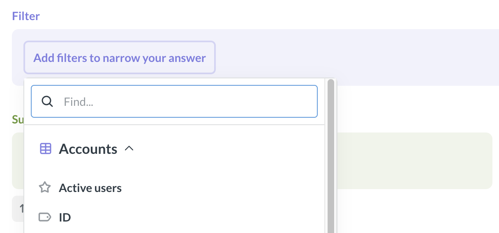
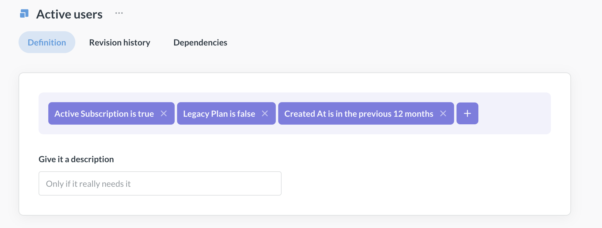

# Segments

Segments are saved filters on tables. You can use segments to create official definitions of a subset of customers, users, or products that everyone on your team can refer to consistently (for example what constitutes an "active user").

People will see segments as options in the Filter block of the [query builder](../questions/query-builder/editor.md).

For now, in addition to Data Studio, segments can also be managed through **Admin > Table Metadata**, see [Segments in table metadata](../data-modeling/segments.md).

To see all segments on a table, select the table in [Managing tables](./managing-tables.md) and switch to the **Segments** tab.

## Create segments

> If your instance is in read-only [remote sync](../installation-and-operation/remote-sync.md) mode, and you enabled sync of the [Library](./library.md), you will not be able to create segments on tables published in the Library while in read-only mode.

Segments are created in [Data Studio](../data-studio/overview.md).

1. Go to **Data Studio** by clicking the **grid icon** in top right of the screen and selecting **Data Studio**.
2. In Data Studio, go to **Tables** in the left sidebar, and select the table to define a segment on.
3. In the right sidebar for the table, select **Segments**.
4. Click on **+ New Segment**. You'll see an abridged version of Metabase's query builder.
5. Add the filters describing the segment (e.g. `Active = true`) and name the segment.

   

6. To preview the records in the segment, click on the **three dots** icon next to the segment's name and select **Preview**.
7. Save.

## Use segments in the query builder

Segments allow people to use pre-defined filters for their data.

To use a segment in the query builder:

1. Start a new question from the table that the segment is based on.
2. Select the segment in the **Filter** block. The segment's filters will be applied behind the scenes.

Segments will only appear in questions that use the segment's table as the primary data source. They will not appear in questions joining the segment's table, or in questions built on other questions or models, even if those questions or models use the segment's table as a source themselves.

## Delete segments

Deleting a segment will not break questions using it. The questions that use the segment will keep using the same filters as before.

1. Go to **Data Studio** by clicking the **grid icon** in top right of the screen and selecting **Data Studio**.
2. In Data Studio, go to **Tables**, and select the segment's table.
3. In the right sidebar for the table, switch to **Segments** tab
4. Choose the segment you want to delete.
5. On the segment's page, click on the **three dots** icon next to the segment's name and select **Remove segment**.

## Permissions for segments

To **create, edit, or delete** segments, people need to:

- Be admins or members of the [Data Analysts](../people-and-groups/managing.md#data-analysts) group. This is needed to access Data Studio.
- Have [Create queries](../permissions/data.md#create-queries-permissions) permissions on the segment's table. This is needed to create the segment's query.

To **use** a segment, people need to:

- Have [Create queries](../permissions/data.md#create-queries-permissions) permissions on the segment's table.

## Only segments on published tables are synced to Git

When using [Remote Sync](../installation-and-operation/remote-sync.md):

- Segments on tables that are _not_ published to the [Library](./library.md) are _not_ synced;
- Segments on published tables are only synced if [_Library sync is enabled_](./library.md#versioning-the-library).

If your instance is in read-only Remote Sync mode, and the Library sync is enabled, you won't be able to create segments on published tables.

## Limitations

- Segments are only available for use in the query builder. For defining reusable bits of SQL, check out [Snippets](../questions/native-editor/snippets.md).
- Segments are only available on questions that use the segment's table as the primary data source.
- All admins and people in the Data Analyst group can create segments on tables they have permissions to query. There aren't additional controls to restrict who can create segments beyond special groups and data permissions.
- [Only segments on published tables are synced to Git](#only-segments-on-published-tables-are-synced-to-git).

## Further reading

- [Library](./library.md)
- [Measures](./measures.md)
- [SQL snippets](../questions/native-editor/snippets.md)
