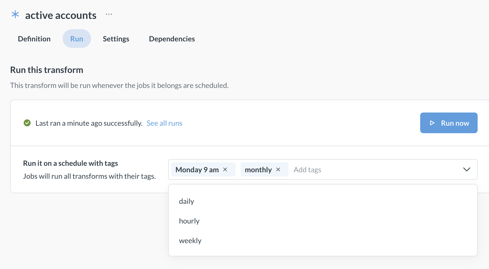
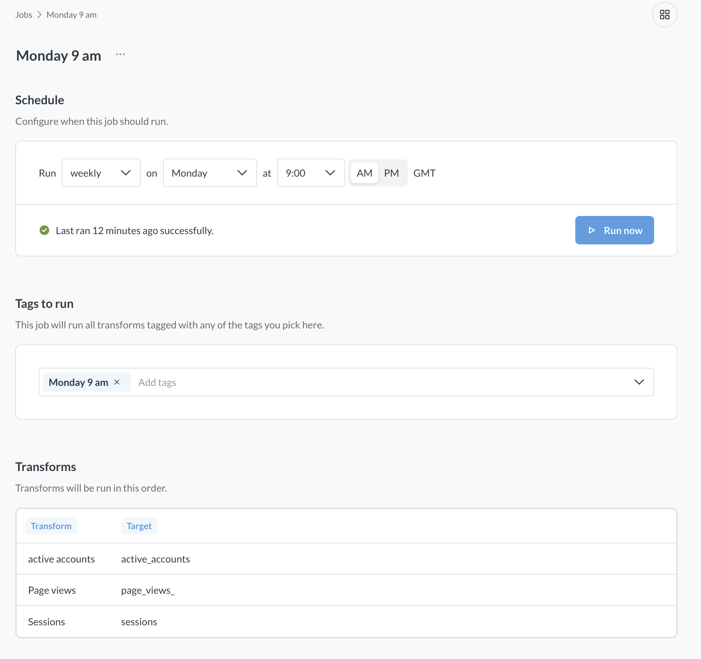
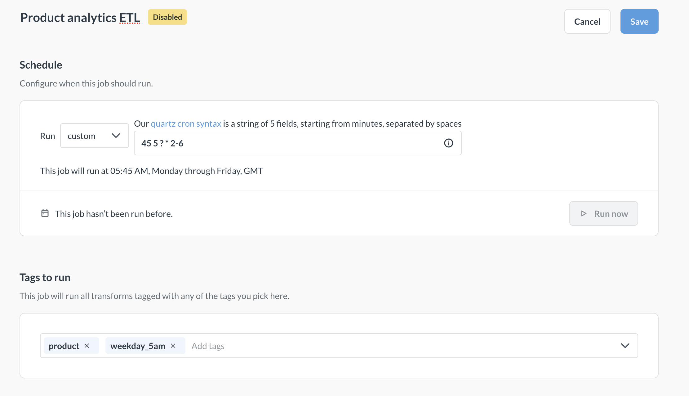
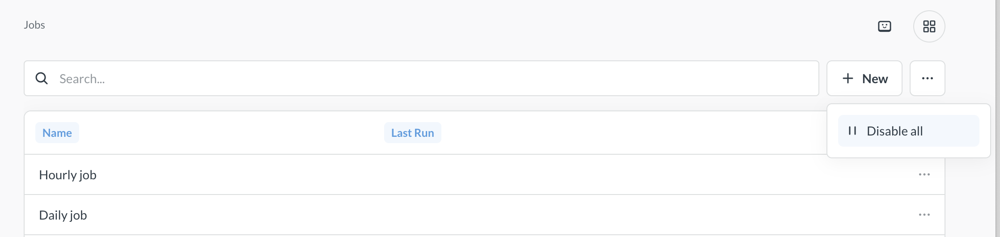
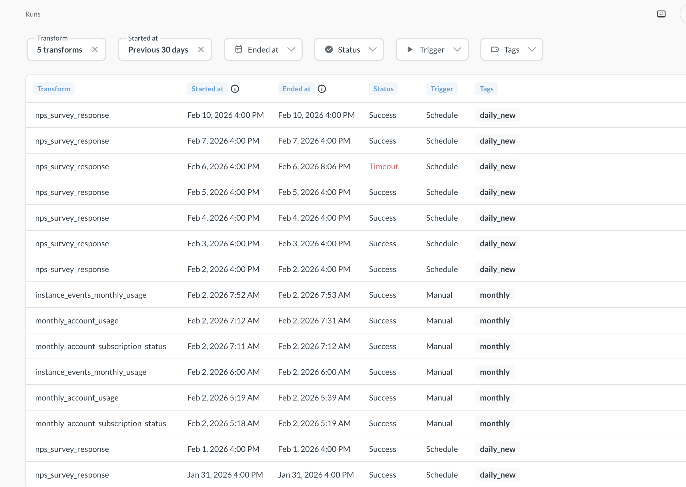

# Transform jobs

_Data Studio > Jobs_

Jobs are scheduled runs of transforms based on the transform's tags.

## Transform tags

Add tags to transforms so that you can use jobs to run the transforms on a schedule. For example, you could add a "Nightly" tag to a transform, and have a job that runs all the transforms with the "Nightly" tag at midnight every day.

To add a tag to a transform:

1. Make sure you have [permissions to edit transforms](./transforms-overview.md#permissions-for-transforms).
2. Visit the transform in **Data studio > Transforms**.
3. On the **Settings** page for a transform, add transform tags.

By default, Metabase comes with hourly, daily, weekly, and monthly tags and jobs that are run on the corresponding schedules, but you can remove or rename those tags, or create new tags. To create a new tag, just type the new tag's name in **Tags** field (either when viewing a transform or when viewing a job) and select **Create a tag**.

Once you've tagged a transform, you can create a job that uses that tag to run the transform on the job's schedule.

## Jobs

_Data Studio > Jobs_

Jobs run one or more transforms on schedule based on transform tags.

Jobs have two components: schedule and tags.

- **Schedule** determines when the job will be executed: daily, hourly, etc. You can specify a custom cron schedule (e.g. "Every weekday at 9:05 AM"). The times are given in your Metabase's system timezone.
- **Tags** determine _which_ transforms a job runs, not when the job runs. For example, you can create a `Weekdays` tag, add that tag to a few transforms, then create a job that runs all the transforms with the `Weekdays` tag every weekday at 9:05AM.

Jobs will run all transforms tagged with any of the tags, plus any transforms that the tagged transforms depend on, see [Jobs will run all dependent transforms](#jobs-will-run-all-dependent-transforms).

You can see which transforms a job will run and in which order on the job's page.

### See all jobs

To see all jobs, go to **Data Studio** and click the **Jobs** at the bottom of the left sidebar.

### Create a job

To create a new job:

1. Go to **Data Studio > Jobs**
2. Click the **+ New** button in the top right.
3. Specify the schedule: select one of the built-in schedules or use cron syntax to specify a custom schedule,

   

   Job can use multiple tags, and will run all transforms that have _any_ of those tags. For example, you can have a job "Weekend job" that is scheduled run at noon on Saturdays and Sundays that picks up all transforms tagged either "Saturday", "Sunday", or "Weekend".

### Disable jobs

You can disable jobs without deleting them. Unlike deletion (which is permanent), disabling a job just means it won't run until you re-enable it. This is useful when you want to temporarily stop transforms from running - for example, for debugging purposes. This way you don't your lose configuration settings like tags and schedules.

To disable a specific job:

1. Go to **Data studio > Jobs**.
2. Find the job you want to disable and click the **three dots** icon to the right of the job's name.
3. Select **Disable**

To disable all jobs:

1. Go to **Data studio > Jobs**.
2. Click the **three dots** icon above the table with all the jobs, and select **Disable all**.

   

Even if you disable all jobs, new jobs will still be created enabled by default.

### Re-enable jobs

If you [disabled any jobs](#disable-jobs), you can later re-enable them:

To re-enable a specific job:

1. Go to **Data studio > Jobs**.
2. Find the job you want to re-enable and click the **three dots** icon to the right of the job's name.
3. Select **Re-enable**

To re-enable all jobs:

1. Go to **Data studio > Jobs**.
2. Click the **three dots** icon above the table with all the jobs, and select **Re-enable all**.

### Delete a job

Deleting a job will not delete any transforms.

Deleted jobs can't be restored. If you want to temporarily stop a job from running, consider disabling the job instead.

To delete a job:

1. Go to **Data Studio > Jobs**.
2. Find the job you want to delete and click the **three dots** icon to the right of the job's name.
3. Select **Delete**.

## Jobs will run all dependent transforms

If one transform depends on another, Metabase will run the dependency first, even if that transform isn't tagged in the job. So if transform B depends on A, Metabase will first run A, even if A doesn't have a tag.

This means that you can explicitly tag transform A to run daily, and transform B hourly, but because transform B depends on transform A, transform A will _also_ run hourly (in addition to daily), despite not having the tag.

You can see which transforms a job will run (and in which order) on the job's page in **Data Studio > Jobs**.

## Runs

You can see all past and current transform runs (both manual and scheduled) by going to **Data Studio** and clicking on **Runs** at the bottom of the left sidebar. The transform run times will be given in Greenwich Mean Time (GMT).

You can click on any transform run to see more details about the run, like the error logs. To go to the transform definition from the transform run page, click on the icon next the transform name in the right sidebar.

The "Tags" column in the **Runs** table will only show the transform's specific tags. But the run might not have anything to do with those tags. Another job with different tags could have run the transform because [jobs will run _all_ dependent transforms](#jobs-will-run-all-dependent-transforms).
