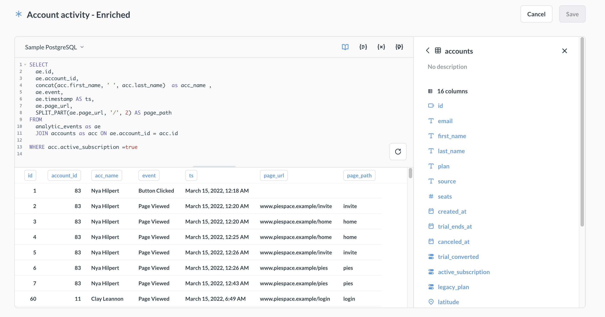

# Query-based transforms

> On Metabase Cloud, you need the **Transforms** add-on to run query-based transforms.

With query-based transforms, you can write a query in SQL or Metabase's query builder, and then write the results of the query back into the database on schedule.



For general information about Metabase transforms, see [Transforms](transforms-overview.md).

## How query-based transforms work

- In Metabase, you create a `SELECT` query either using SQL or Metabase's [graphical query builder](../../questions/query-builder/editor.md).
- When the transform first runs, your _database_ executes the transform's query.
- Your database writes the results of the query to a new table.
- The new table is synced to Metabase.
- On subsequent transform runs, your database will overwrite that table with the updated results unless you [configure your transform to be incremental](#incremental-query-transforms).

## Create a query-based transform

On Metabase Cloud, you need the **Transforms** add-on to create query-based transforms.

1. Go to **Data studio > Transforms**.

2. Click **+ New** and pick "Query builder", "SQL", or "Copy of existing question".

   Currently, you can't convert between different transform types (like converting a query builder transform to a SQL-based transform, or a SQL transform into a Python transform). If you want to change your transform built with the query builder into a SQL transform, you'll need to create a new transform with the same target and tags, and delete the old transform.

3. Write your transform query as you would normally write a query in Metabase. See [Query builder](../../questions/query-builder/editor.md) and [SQL editor](../../questions/native-editor/writing-sql.md) documentation for more information.

   Not all databases support transforms, see [Databases that support transforms](transforms-overview.md#databases-that-support-transforms).

4. To test your transform, press the **Run** button at the bottom of the editor.

   Previewing a query transform in the editor will _not_ write the result of the transform back to the database.

5. Click **Save** in the top right corner and fill out the transform information:

   - **Name** (required): The name of the transform.
   - **Schema** (required): Target schema for your transform. This schema can be different from the schema of the source table(s). You create a new schema by typing its name in this field. You can only transform data _within_ a database; you can't write from one database to another.
   - **Table name** (required): Name of the target table. Metabase will write the results of the transform into this table, and then sync the table in Metabase.
   - **Folder** (optional): The folder where the transform should live. Click on the field to pick a different folder or create a new one.
   - **Incremental transformation** (optional): see [Incremental query transforms](#incremental-query-transforms)

6. Optionally, assign tags to your transforms. Tags are used by [jobs](jobs-and-runs.md) to run transforms on schedule.

## Variables in SQL transforms

SQL transforms support [variables](../../questions/native-editor/sql-parameters.md) (`{{my_variable}} `), which are only useful when combined with [snippets](../../questions/native-editor/snippets.md).

For (a really simple) example, let's say you want to count rows per week across several tables. You could create a snippet called "rows per week" containing the full query with a `{{table}}` variable:

```sql

SELECT
  date_trunc('week', created_at) AS week,
  count(*) AS row_count
FROM {{table}}
GROUP BY week
ORDER BY week

```

That way you can use the snippet to create multiple transforms, each sourced from different tables. Each transform's entire SQL is just:

```sql
{{snippet: rows per week}}
```

In each transform's variable panel, set the default value of `table` to the target table (e.g., `orders`, `returns`, `subscriptions`). See [table variables](../../questions/native-editor/table-variables.md).

If you ever need to change the query (say, to switch from weekly to daily granularity), you update the snippet once and every transform picks up the change on its next run.

### Transform variable must be optional, or have a default value

Parameters in transforms must either:

- Wrap the variable in optional blocks (`[[ ]]`).
- Supply a default value.

The reason transform variables must have a default value (or be optional) is that transforms run on a schedule, so there's no way to pass a value to the variable when the job runs the transform.

The incremental `[[WHERE id > {{checkpoint}}]]` pattern shown in [Incremental query transforms](#incremental-query-transforms) is an example of this an optional variable in practice. See also [optional variables](../../questions/native-editor/optional-variables.md).

## Run a query transform

See [Run a transform](transforms-overview.md#run-a-transform). You'll see logs for a transform run on the transform's page.

## Incremental query transforms

By default, on every transform run after the first one, Metabase will process all the data in all input tables, then drop the existing target table, and create a new table with the processed data. You can tell Metabase to only write **new** data to your target table by marking your transform as incremental.

### Prerequisites for incremental transforms

Your data has to have certain structure for incremental transforms to work. See [Prerequisites for incremental transforms](transforms-overview.md#prerequisites-for-incremental-transforms).

### How incremental query transforms work

For a transform to run incrementally, you'll need to pick a column ("checkpoint") that Metabase needs to check for new values. Then, behind the scenes, Metabase will add a filter around your transform query that will filter the results of the query for values greater than the last written checkpoint value.

### Make a query transform incremental

#### Use table variables for incremental SQL transforms

If you built your transform in the graphical query builder, you can skip right to [marking the transform as incremental](#mark-transform-as-incremental).

If you are writing your incremental transform in raw SQL, you'll need to add a [table variable](../../questions/native-editor/table-variables.md) into your SQL code, with the table variable replacing the table with the checkpoint column.

For example, let's say you have a transform that retrieves order id, total and product title:

```sql
SELECT
  orders.id,
  orders.total,
  products.title
FROM
   orders JOIN products on orders.product_id = products.id
```

To make this transform incrementally load the data based on new values of `orders.id` column, you need to:

1. Add a table variable, for example `{{orders_var}}` replacing `orders` in the `FROM` statement;
2. In the table variable settings, connect the table variable to the `orders` table;
3. Replace other references to the table in your query with either:
    - The name of the table variable (if you have "Emit table alias" toggled on in variable's setting).
    - Your own handcrafted alias for the variable.

So your query will look like this:

```sql
SELECT
  orders_var.id,
  orders_var.total,
  products.title
FROM
   {{orders_var}} JOIN products on orders_var.product_id = products.id
```

In this query,`orders_var` is connected to the `orders` table in variable settings, and "Emit table aliases" toggled on in the variables sidebar.

Once your query has table aliases, you can mark the transform as incremental using the `orders.id` column in the transform's settings.

#### Mark transform as incremental

To make a query transform incremental:

1. Go to the transform's page in **Data studio > Transforms**.
2. Switch to **Settings** tab.
3. In **Column to check for new values**, select the column in one of the source tables that Metabase should check to determine which values are new. Only some columns are eligible. See [prerequisites for incremental transforms](./transforms-overview.md#prerequisites-for-incremental-transforms).
