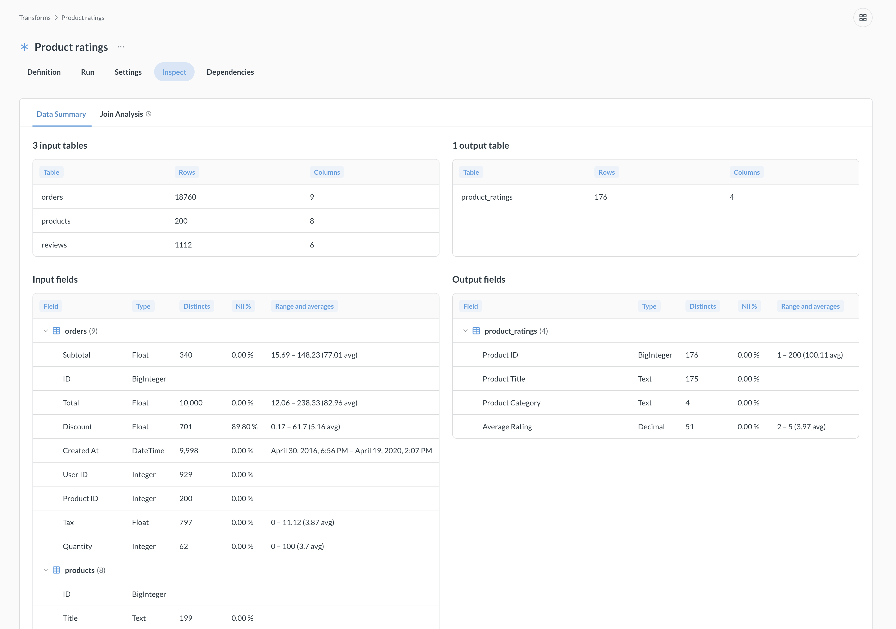
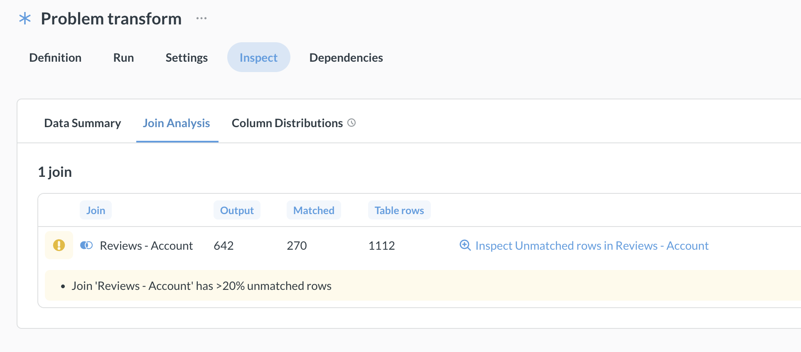
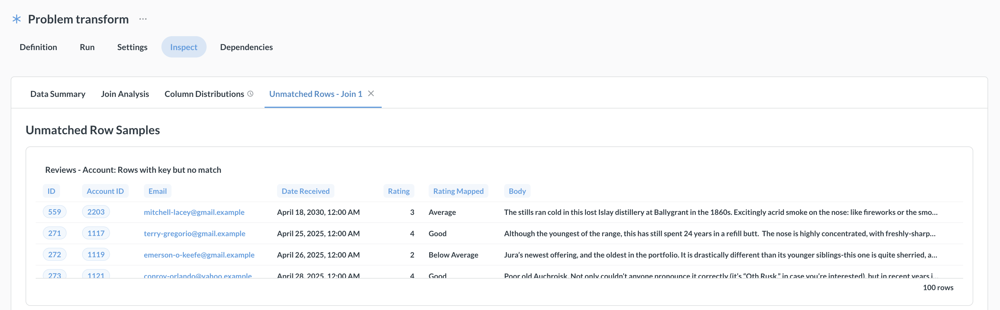
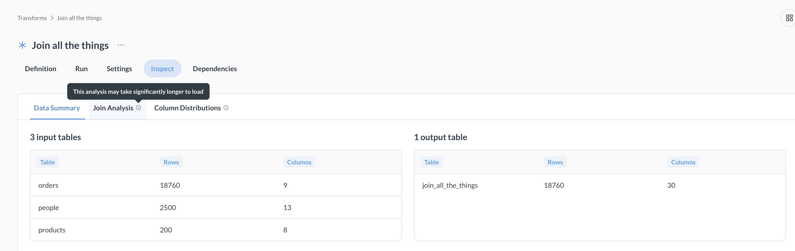

# Transform inspector

> Transform inspector requires the **Advanced transforms** add-on.

_Data Studio > Transforms > [transform name] > Inspect_

The transform inspector gives you a diagnostic view of your transforms. Instead of writing your own SQL to check row counts, join match rates, or column distributions, you can open the **Inspect** tab and let Metabase analyze your transform's inputs and outputs for you. The inspector is especially useful for catching data quality issues (like unmatched rows in joins) before they cause problems downstream.

To inspect a transform, you need to run the transform at least once, since the inspector analyzes actual data in the target and source tables. If you change the transform definition, you'll need to re-run the transform to refresh the inspector's analysis.

## Lenses

The inspector organizes its analysis into different lenses (displayed as tabs). Each lens focuses on specific aspects of your transform. Lenses other than the Data Summary only appear when relevant.

- [Data summary](#data-summary)
- [Column distributions](#column-distributions)
- [Join analysis](#join-analysis)
- [Drill lenses](#drill-lenses)

### Data summary

Data summary gives you a quick snapshot of the transform's input and output tables:

- **Input and output tables**: table name, row count, column count.
- **Field-level stats**: data type, distinct count, nil percentage (number of null values), range, and averages.

### Column distributions

The Column distributions lens visualizes how data distributions change through the transform. This lens can help you spot unexpected filtering or aggregation effects. This lens is only available when columns match between input and output tables (so you may not see it for transforms that aggregate data).

The Column distributions lens can be slow on large datasets because it computes distribution stats for every matched column.

### Join analysis

Available when the transform includes joins. Shows how well your joins match across tables:

- **Join name**, **output rows**, **matched rows**, and **table rows** for each join.
- Shows a warning when more than 20% of rows are unmatched. The warning appears inline in the join analysis results. You can click to open a [drill lens](#drill-lenses) to see the unmatched rows.

### Drill lenses

Drill lenses are dynamic tabs that appear based on analysis results. For example, if a join analysis finds unmatched rows, a tab like "Unmatched Rows - Join 1" will appear.

## Some lenses can take a while to load

Inspector lenses run queries against your database, and some lenses can take longer than others. A clock icon on a lens tab means the lens could run a long query, depending on how many rows of data you're working with. For large datasets, consider running these lenses during off-peak hours.

## Further reading

- [Transforms overview](transforms-overview.md)
- [Query-based transforms](query-transforms.md)
- [Python transforms](python-transforms.md)
