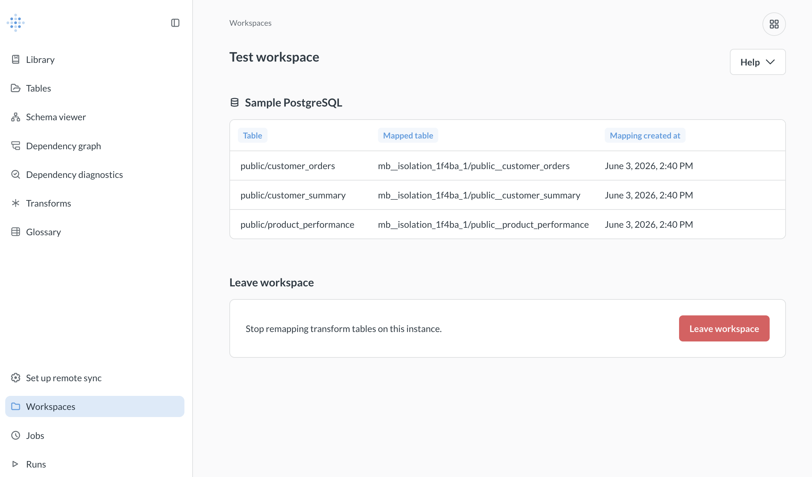

# Workspaces

Workspaces are isolation environments for AI agents. They let agents run data transforms and analyses without touching the databases where the real data lives.

## How workspaces work

Workspaces are Metabase configurations that remap tables so that an AI agent can test out new transforms safely, without polluting your production schema. When your development Metabase is in a workspace, it'll look like it's creating tables in production, and you can build dashboards, questions, and documents on top of those tables. But under the hood, transforms will write those tables to an isolated schema, so you (or an agent) are free to experiment.

Once you're happy with your transforms and content, you can use remote sync to push your changes to production, and everything will just work. Your transforms will target your production schema, and any content you built in the workspace will know to query those tables.

## Create a workspace

To create a workspace, go to your production Metabase.

1. Click the grid icon in the upper right.
2. Go to **Data Studio**.
3. Click **Workspaces** toward the bottom of the left sidebar.
4. Click **Create a workspace**.
5. In the **Databases to include** section, click **Add a database**. Select the database and the schemas to include. In the workspace, Metabase will remap all transforms that target these schemas to the isolated schema it creates.
6. Download the config file Metabase creates.

> Warning: keep this config file secret, as it contains credentials to your data warehouse!

To use the workspace, spin up a dev instance of Metabase, navigate to **Data Studio > Workspaces**, and upload the config.

## Agent workflow with workspaces

How you're most likely to use workspaces: to set up an environment where agents can write to your data warehouse safely. Paired with the Metabase CLI, you can put agents to work building your semantic layer.

The goal here is a setup where you prompt an agent to create a semantic layer for you. You can iterate on the agent's output, either with the agent or in the UI itself. Once you're happy, you can create a pull request to bring your changes into production using remote sync.

### Prerequisites

You'll need to have the following set up:

- [Remote sync](../installation-and-operation/remote-sync.md) set up on your production Metabase.
- Remote sync set up on your dev Metabase, pointing to the same repo.
- The Metabase CLI installed and logged into your dev Metabase.
- The `/metabase-cli` skill installed (from [Metabase skills](https://github.com/metabase/agent-skills)).
- An admin connection to your data warehouse.

#### Workspaces require an admin connection

For Metabase to be able to create workspaces, it needs a connection to your data warehouse that can create new users and schemas.

If you've (wisely) connected Metabase to your data warehouse using a user with limited, read-only permissions, and a separate writable connection for transforms, you'll need to set up an admin connection in order for Metabase to provision the users and schemas that make workspaces possible. Metabase will only route workspace creation requests through this connection.

### Set up the workspace and agent

1. [Create a workspace](#create-a-workspace) in your production Metabase and download its config file.

2. In your dev Metabase, navigate to **Data Studio > Workspaces** and upload the config file to put the dev instance into the workspace.

3. In your dev Metabase, [create a new branch](../installation-and-operation/remote-sync.md#creating-a-branch).

4. In your dev Metabase, [create an API key](../people-and-groups/api-keys.md#create-an-api-key). Assign the key to the Admin group.

5. Authenticate the Metabase CLI to your dev Metabase. In a terminal, run:

   ```
   mb auth login
   ```

   Follow the prompts. Call the profile "Dev" (or whatever you want, just something to remember that the profile is authenticated with your dev instance). Paste the API key when prompted. The CLI will use this key to authenticate its requests to your dev instance.


### Put the agent to work

1. Summon your agent and enter your prompt, starting with the slash skill command `/metabase-cli` to invoke the CLI skill. For example:

   ```
   /metabase-cli the Sample PostgreSQL database contains normalized tables. Use transforms to create a semantic layer for people so they can self-serve questions about our customers. Build transforms (3 transforms max) that pull together data from the orders, people, products, and reviews tables. Create a dashboard with questions built on the tables created by the transforms that helps people understand our customers. Include metrics, and prefer query-builder questions so we get drill-through out of the box. Put these items in a new collection called Customers.
   ```

2. The agent does its thing. Depending on your agent setup, it might follow up with some questions.

3. Log in to your Metabase and see what the agent created. If the agent created any tables, you can view the tables in the workspace:

   

   The **Table** column shows the table created by a transform. The **Mapped Table** column shows where Metabase actually wrote the table: in the isolated schema in your data warehouse. If you look at any questions built on top of one of these tables, it'll look like they are targeting the **Table**, but under the hood Metabase queries the **Mapped Table**.

4. Iterate on the agent's output. You can either prompt the agent again, or make changes in Metabase's handy UI (it's actually faster for a lot of things, like arranging cards on a dashboard, and helps you get a feel for the data).

### Bring your changes into production

Once you're happy with your tables and any questions, documents, or dashboards, use [remote sync](../installation-and-operation/remote-sync.md) to bring those changes into your production Metabase.

1. Push your changes from Metabase to your repo.

2. Put up a PR for the changes, then merge the branch into your main branch.

3. Pull the changes to main into your production Metabase.

4. If you created any transforms, you'll need to run those transforms in production to create the tables. The transforms in production will write to the tables they target (not to an isolated schema, since prod isn't—and shouldn't be—in a workspace). See [transforms](./transforms/transforms-overview.md#run-a-transform).

## Delete a workspace

When you leave a workspace, the database connection will remain, but Metabase will stop remapping tables.

To delete the workspace, and the isolated schema the workspace was using in your data warehouse:

1. Go to your prod Metabase (where you created the workspace initially).
2. Click the grid icon.
3. Select **Data Studio**.
4. Click **Workspaces** in the left sidebar.
5. Next to the workspace you want to delete, click the **Three-dot menu** next to the workspace's name.
6. Select **Delete**, and **Delete workspace** in the confirmation modal.

Metabase will delete both the database user it used to connect to your data warehouse, as well as the schema and tables (if any) it used for the workspace. You can't undo this.
