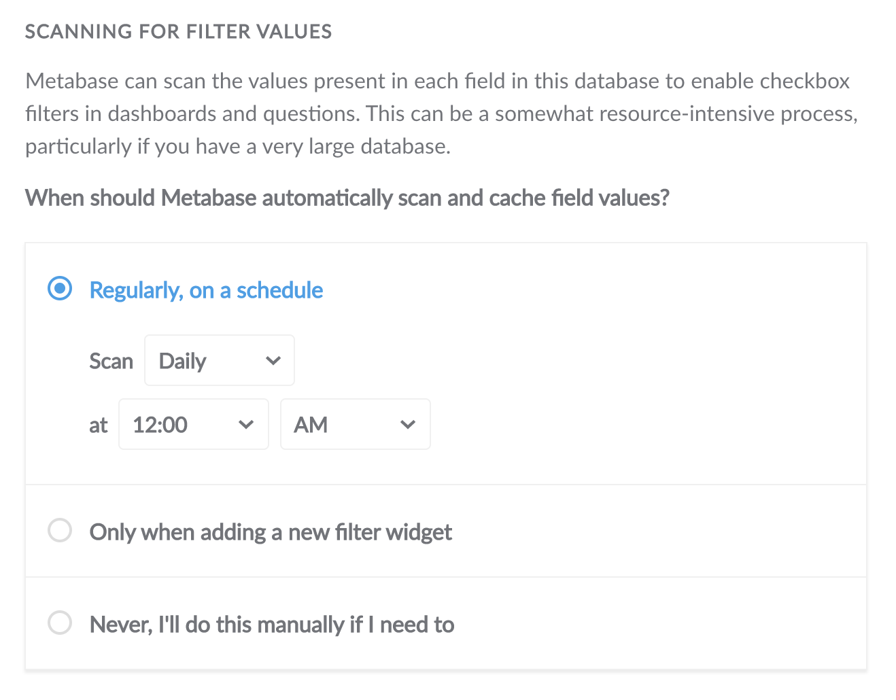
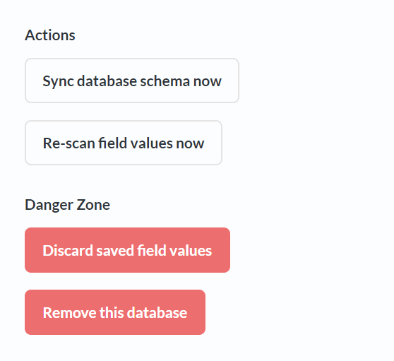
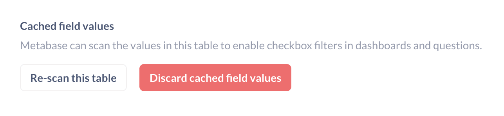

# Adding and managing databases

Connect Metabase to your data sources.

## Adding a database connection

At the top right of the screen, click on the **gear** icon > **Admin settings**.

Once in the Admin section, select the **Databases** tab from the navigation bar at the top of the screen. You’ll see a list of your connected databases (if any). To connect a database to Metabase, click **Add database** and follow the connection instructions for your database.

Although connection details differ database to database, in general you'll need to get connection info from your database admin, usually some combination of hostname (sometimes called endpoint), port, database username and password, and the name of the database.

## Connecting to supported databases

The databases listed below have official drivers maintained by the Metabase team. Customers on [paid plans](https://www.metabase.com/pricing) will get official support.

If you don't see your database listed here, see [partner and community drivers](../developers-guide/partner-and-community-drivers.md#partner-drivers).

- [BigQuery](./connections/bigquery.md) (Google Cloud Platform)
- Druid
- [Google Analytics](./connections/google-analytics.md)
- H2
- [MongoDB (version 3.6 or higher)](./connections/mongodb.md) <!-- MongoDB supported version is from https://www.mongodb.com/support-policy -->
- [MySQL (version 5.7 or higher, as well as MariaDB version 10.2 or higher)](./connections/mysql.md)
- [Oracle](./connections/oracle.md)
- [PostgreSQL](connections/postgresql.md)
- Presto
- Redshift (Amazon Web Services)
- [Snowflake](./connections/snowflake.md)
- SparkSQL
- [SQL Server](./connections/sql-server.md)
- SQLite
- [Vertica](./connections/vertica.md)

## Connecting to databases hosted by a cloud provider

For provider-specific connection details, like connecting to a PostgreSQL data warehouse on RDS:

- [AWS's Relational Database Service (RDS)](./connections/aws-rds.md)

## Database connection options

Connection options differ depending on which database you're connecting to. Here's an overview:

- [Use a secure connection (SSL)](#use-a-secure-connection-ssl)
- [Use an SSH-tunnel for database connections](#use-an-ssh-tunnel-for-database-connections)

**Advanced options**

- [Additional JDBC connection string options](#additional-jdbc-connection-string-options)
- [Re-run queries for simple explorations](#re-run-queries-for-simple-explorations)
- [Choose when Metabase syncs and scans](#choose-when-metabase-syncs-and-scans)
- [Periodically refingerprint tables](#periodically-refingerprint-tables)

### Use a secure connection (SSL)

Metabase automatically tries to connect to databases with SSL first, then without if that doesn't work. If it's possible to connect to your database with an SSL connection, Metabase will make that the default setting for your database. If you prefer to connect without this layer of security, you can always change this setting later, but we highly recommend keeping SSL turned on to keep your data secure.

### Use an SSH tunnel for database connections

See our [guide to SSH tunneling](./ssh-tunnel.md).

### Additional JDBC connection string options

Some databases allow you to append options to the connection string that Metabase uses to connect to your database.

### Re-run queries for simple explorations

Turn this option **OFF** if people want to click **Run** (the play button) before applying any [Summarize](../questions/query-builder/introduction.md#grouping-your-metrics) or filter selections.

By default, Metabase will execute a query as soon as you choose an grouping option from the **Summarize** menu or a filter condition from the [action menu](https://www.metabase.com/glossary/action_menu). If your database is slow, you may want to disable re-running to avoid loading data on each click.

### Choose when Metabase syncs and scans

Turn this option **ON** to manage the queries that Metabase uses to stay up to date with your database. For more information, see [Syncing and scanning databases](#syncing-and-scanning-databases).

### Scheduling database syncs

If you've selected **Choose when syncs and scans happen** > **ON**, you'll see the following options under **Database syncing**:

- **Scan** sets the frequency of the [sync query](#how-database-syncs-work) to hourly (default) or daily.
- **at** sets the time when your sync query will run against your database (in the timezone of the server where your Metabase app is running).

### Scheduling database scans

If you've selected **Choose when syncs and scans happen** > **ON**, you'll see the following options under **Scanning for filter values**:

- **Regularly, on a schedule** allows you to run [scan queries](#how-database-scans-work) at a frequency that matches the rate of change to your database. The time is set in the timezone of the server where your Metabase app is running. This is the best option for a small database, or tables with distinct values that get updated often.
- **Only when adding a new filter widget** is a great option if you want scan queries to run on demand. Turning this option **ON** means that Metabase will only scan and cache the values of the field(s) that are used when a new filter is added to a dashboard or SQL question.
- **Never, I'll do this manually if I need to** is an option for databases that are either prohibitively large, or which never really have new values added. Use the [Re-scan field values now](#manually-scanning-column-values) button to run a manual scan and bring your filter values up to date.

### Periodically refingerprint tables

Turn this option **ON** from **Advanced options** to scan a _sample_ of values every time a [sync](#how-database-syncs-work) is run.

A fingerprinting query examines the first 10,000 rows from each column and uses that data to guesstimate how many unique values each column has, what the minimum and maximum values are for numeric and timestamp columns, and so on. If you turn this option **OFF**, Metabase will only fingerprint your columns once during setup.

## Syncing and scanning databases

Metabase runs sync and scan queries in order to show tables and columns, populate dropdown menus with the right values, and suggest helpful visualizations. Metabase does _not_ copy any data from your database---it only maintains lists of the tables and columns.

### How database syncs work

A Metabase **sync** query gets a list of updated table names, column names, and column data types from your database. The query runs against your database during setup, and again every hour by default. It's very fast with most relational databases, but can be slower with MongoDB and some [community-built database drivers](../developers-guide/partner-and-community-drivers.md). Syncing can't be turned off completely, otherwise Metabase wouldn't work.

### How database scans work

A Metabase **scan** query caches the column _values_ for filter dropdowns by looking at the first 1,000 distinct records from each table. A scan is more intensive than a sync query, so it only runs once during setup, and again once a day by default. If you [disable scans](#scheduling-database-scans) entirely, you'll need to bring things up to date by running [manual scans](#manually-scanning-column-values).

### Getting tables, columns, and values for the first time

When Metabase first connects to your database, it performs a **scan** to determine the metadata of the columns in your tables and automatically assign each column a [semantic type]().

During the scan, Metabase also takes a sample of each table to look for URLs, JSON, encoded strings, etc. You can map table and column metadata to new values from **Admin settings** > **Data model**. For more on editing metadata, check out [the Data Model page: editing metadata](../data-modeling/metadata-editing.md).

### Manually syncing tables and columns

1. Go to **Admin settings** > **Databases** > your database.
2. Click on **Sync database schema now**.

### Manually scanning column values

To scan values from all the columns in a table:

1. Go to **Admin settings** > **Data model** > your database.
2. Select the table that you want to bring up to date with your database.
3. Click the **gear icon** at the top of the page.
4. Click **Re-scan this table**.

To scan values from a specific column:

1. Go to **Admin settings** > **Data model** > your database.
2. Select the table and find the column you want bring up to date with your database.
3. Click the **gear icon** in the panel for that column.
4. Click **Re-scan this field**.

### Clearing cached values

To forget the data that Metabase has stored from previous [database scans](#syncing-and-scanning-databases):

1. Go to **Admin settings** > **Data model** > your database.
2. Select the table.
3. Optional: select the column.
4. Click the **gear icon**.
5. Click **Discard cached field values**.

## Deleting databases

**Caution: Deleting a database is irreversible! All saved questions and dashboard cards based on the database will be deleted as well!**

Go to **Admin settings** > **Databases** > your database and click **Remove this database**.

## Troubleshooting

- [Troubleshooting database connections](../troubleshooting-guide/db-connection.md)
- [Troubleshooting syncs, scans, and fingerprinting](../troubleshooting-guide/sync-fingerprint-scan.md)
- Search or ask the [Metabase community](https://discourse.metabase.com/).
- Search for [known bugs or limitations](../troubleshooting-guide/known-issues.md).

## Further reading

- [Metadata editing](../data-modeling/metadata-editing.md).
- [Setting data access permissions](../permissions/data.md).
- [Metabase at scale](https://www.metabase.com/learn/administration/metabase-at-scale).
