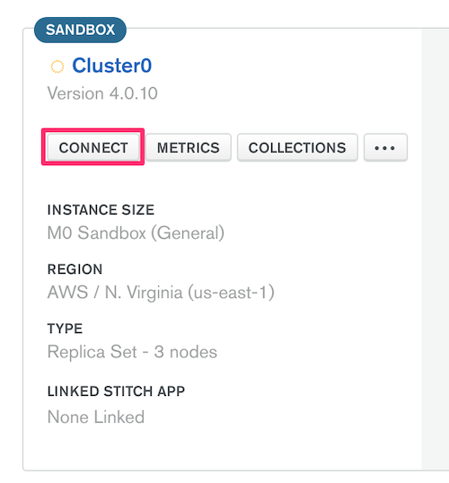
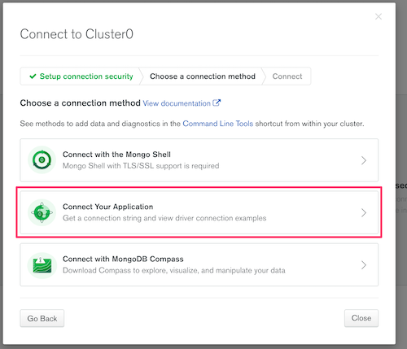

# Working with MongoDB in Metabase

Metabase supports MongoDB version 4.2 or higher.

## How Metabase syncs data in MongoDB

Because MongoDB contains unstructured data, Metabase takes a different approach to syncing your database's metadata. To get a sense of the schema, Metabase will scan the first ten thousand documents of each collection in your MongoDB. This sampling helps Metabase do things like differentiate datetime fields from string fields, and provide people with pre-populated filters. The reason Metabase only scans a sample of the documents is because scanning every document in every collection on every sync would be put too much strain on your database. And while the sampling does a pretty good job keeping Metabase up to date, it can also mean that new fields can sometimes fall through the cracks, leading to visualization issues, or even fields failing to appear in your results. For more info, check out our [troubleshooting guide](../../troubleshooting-guide/db-connection.md).

## Connecting to MongoDB

Go to Admin -> Databases, and click the **Add database** button. Select MongoDB from the dropdown, and enter your desired **Display name** for this database.

There are two ways to connect to MongoDB:

1. Using the [Metabase fields to input your connection details](#using-metabase-fields).
2. Pasting your [connection string](#using-a-connection-string).

### Using Metabase fields

The default way to connect to MongoDB is to fill out your connection details in the fields Metabase provides:

- Host
- Database name
- Port
- Username
- Password
- Authentication Database (optional)
- Additional connection string options (optional)

You'll also have the option to **Use a secure connection (SSL)**. Enable SSL and paste the contents of the server's SSL certificate chain in the input text box. This option is available for this method of connection only (i.e. you cannot include a certificate when connecting with a connection string).

## Advanced settings for direct connection

- **Use DNS SRV when connecting** Using this option requires that provided host is a FQDN. If connecting to an Atlas cluster, you might need to enable this option. If you don't know what this means, leave this disabled.

## Using a connection string

If you'd prefer to connect to MongoDB using a [connection string](https://docs.mongodb.com/manual/reference/connection-string/), click on **Paste a connection string**. The Metabase user interface will update with a field to paste your connection string.

Metabase currently does NOT support the following connection string parameters:

- `tlsCertificateKeyFile`
- `tlsCertificateKeyFilePassword`
- `tlsCAFile`

If you need to use a certificate, connect via the [default method](#using-metabase-fields) and enable **Use a secure connection(SSL)**.

## Settings common to both connection options

- **Use an SSH tunnel**: Some database installations can only be accessed by connecting through an SSH bastion host. This option also provides an extra layer of security when a VPN is not available. Enabling this is usually slower than a direct connection.
- **Rerun queries for simple exploration**: When this is on, Metabase will automatically run queries when users do simple explorations with the Summarize and Filter buttons when viewing a table or chart. You can turn this off if querying this database is slow. This setting doesn’t affect drill-throughs or SQL queries.
- **Choose when syncs and scans happen**: By default, Metabase does a lightweight hourly sync and an intensive daily scan of field values. If you have a large database, we recommend turning this on and reviewing when and how often the field value scans happen.
- **Periodically refingerprint tables**: This setting — disabled by default — enables Metabase to scan for additional field values during syncs allowing smarter behavior, like improved auto-binning on your bar charts.

## Configuring SSL via the command line

You can enter a self-signed certificate via the Metabase UI (though not when using a connection string), or you can use the command line to add a self-signed certificate.

```
cp /usr/lib/jvm/default-jvm/jre/lib/security/cacerts ./cacerts.jks
keytool -import -alias cacert -storepass changeit -keystore cacerts.jks -file my-cert.pem
```

Then, start Metabase using the store:

```
java -Djavax.net.ssl.trustStore=cacerts.jks -Djavax.net.ssl.trustStorePassword=changeit -jar metabase.jar
```

Learn more about [configuring SSL with MongoDB](http://mongodb.github.io/mongo-java-driver/3.0/driver/reference/connecting/ssl/).

## Connecting to a MongoDB Atlas cluster

To make sure you are using the correct connection configuration:

1. Log into your [Atlas cluster](https://cloud.mongodb.com)

2. Select the cluster you want to connect to, and click **Connect**.

   

3. Click **Connect Your Application**.

   

4. Select **Java** and version.

5. The resulting connection string has the relevant information to provide to Metabase's `Add a Database` form for MongoDB.

6. You will likely want to select the option `Use DNS SRV`, which newer Atlas clusters use by default.

## General connectivity concerns

- **Connect using `DNS SRV`**, which is the recommended method for newer Atlas clusters.
- **Have you checked your cluster host whitelist?** When testing a connection but seeing failure, have you tried setting the IP whitelist to `0.0.0.0/0`? Whitelisting this address allows connections from any IP addresses. If you know the IP address(es) or CIDR block of clients, use that instead.
- **Connect to the secondary server**. When connecting to a cluster, always use the `?readPreference=secondary` argument in the connection string, which allows Metabase to read from a secondary server instead of consuming resources from the primary server.

## I added fields to my database but don't see them in Metabase

Metabase may not sync all of your fields. Since any document in a MongoDB collection can contain any number of fields, the only way to get 100% coverage of all fields would be to scan every single document in every single collection. The reason Metabase doesn't do a full scan is because it would put too much strain on your database.

Instead, Metabase gets a sample of the fields in a collection by scanning a sample of 1000 documents in each collection (the first 500 documents and the last 500 documents in each collection).

If you're not seeing all of the fields show up for a collection in Metabase, one workaround is to include all possible keys in the first document of the collection, and give those keys null values. That way, Metabase will be able to recognize the correct schema for the entire collection.

## Further reading

See our troubleshooting guide for [troubleshooting your connection](../../troubleshooting-guide/db-connection.md).
