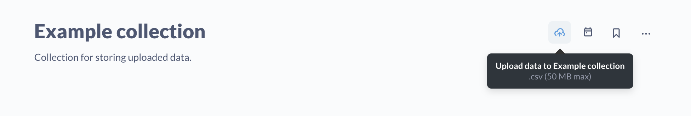

# Uploading data

Once you've [enabled uploads](#setting-up-uploads), you can [upload files](../exploration-and-organization/uploads.md) in CSV format to a collection in Metabase.

Uploading CSV data is best suited for ad hoc analysis of spreadsheet data. If you have a lot of data, or will need to update or add to that data regularly, we recommend setting up a way to load that data into a database directly, then connecting Metabase to that database.

## Managing upload settings

To manage upload settings, admins can hit cmd/ctrl + K and search for "Settings - Uploads", or click on the **gear** icon in the upper right and click through **Admin settings** > **Settings** > **Uploads**.

## Databases that support uploads

- [PostgreSQL](../databases/connections/postgresql.md)
- [MySQL](../databases/connections/mysql.md)
- [Redshift](../databases/connections/redshift.md)
- [ClickHouse](../developers-guide/partner-and-community-drivers.md#partner-drivers)

## Setting up uploads

There are a few things admins need to do to support CSV uploads:

- [Connect to a database using a database user account with write access](#connect-to-a-database-using-a-database-user-account-with-write-access). This way Metabase will be able to store the uploaded data somewhere.
- [Select the database and schema you want to store the uploaded data in](#select-the-database-and-schema-that-you-want-to-store-the-data-in).
- [(Optional) Specify a prefix for Metabase to prepend to the uploaded tables](#specify-a-prefix-for-metabase-to-prepend-to-the-uploaded-tables).
- [Add people to a group with view data and create query access to the upload schema database](#add-people-to-a-group-with-data-access-to-the-upload-schema).

## Connect to a database using a database user account with write access

To upload data to Metabase, an admin will need to connect your Metabase to a database that supports uploads using a database user account that has write access to that database.

You can also upload data to the Sample Database included with Metabase (an H2 database), though we don't recommend using the Sample Database for any data that you want to keep around.

For more, check out:

- [Adding and managing databases](./connecting.md)
- [Database users, roles, and privileges](./users-roles-privileges.md#privileges-to-enable-uploads)

## Select the database and schema that you want to store the data in

If Metabase is connected to a database using a database user account with write access, Admins can enable uploads by:

- Clicking on the **gear** icon in the upper right on the home page and navigating to **Admin settings** > **Settings** > **Uploads**.
- Selecting the database Metabase should use to store the data.

When people upload a CSV to a collection, Metabase will:

- Create a table to store that data in the database and schema that the Admin selected to store uploads.
- Create a [model](../data-modeling/models.md) that wraps the uploaded table, and save that model to the collection the person uploaded the CSV data to.

## Specify a prefix for Metabase to prepend to the uploaded tables

Admins can optionally specify a string of text to add in front of the table that Metabase creates to store the uploaded data.

## Add people to a group with data access to the upload schema

In order to upload CSVs, a person must be in a group with **View data** access of "Can view" and **Create queries** of Query builder access or higher to the schema you've selected to store your uploaded data. See [groups](../people-and-groups/managing.md) and [data permissions](../permissions/data.md).

## Primary key auto-generation

When you upload a CSV, Metabase will create an a unique primary key column, called `_mb_row_id`, as the first (left-most) column of the uploaded CSV table. This `_mb_row_id` column will contain automatically generated integers. Metabase will also ignore any columns in the upload that have a name that will be in the database with the same name as the auto-generated primary key column (e.g., `_MB row-ID` in the CSV will be `_mb_row_id` or `_MB_ROW_ID` in the database).

If you don't want this autogenerated ID column, you can always remove the column from the model Metabase created. Visit the model, click on the info **i** icon, then **Model details**. From the model details page, click the **Edit definition** button. In the Data section of the query builder, click on the down arrow next to the table, deselect the added ID column, and save your changes.

## Data type errors

Metabase will try to guess what the data type is for each column, but if some entries are not like the others, Metabase may not guess the type correctly. For example, if you have a column that starts with integers like 100, 130, 140, then later on a float 105.5, Metabase may reject the upload. To fix this, you'll need to use spreadsheet software to adjust the formatting so that all the integers are formatted as floats  (e.g., 100.00, 130.00, 140.00 and so on) before uploading.

## File size limit

CSV files cannot exceed 50 MB in size.

> While Metabase limits uploads to 50 MB, the server you use to run your Metabase may impose a lower limit. For example, the default client upload limit for [NGINX is 1 MB](https://nginx.org/en/docs/http/ngx_http_core_module.html#client_max_body_size). So you may need to change your server settings to allow uploads up to 50 MB. People on Metabase Cloud don't have to worry about this.

If you have a file larger than 50 MB, the workaround here is to split the data into multiple and [append those files to an existing model](../exploration-and-organization/uploads.md#appending-to-a-model-created-by-an-upload)

## Date formats

For now, Metabase only recognizes dates and datetimes from strings in uploaded CSVs with the following formats:

### Dates

Represents the year, month, and day without time information.

**Format**: `yyyy-MM-dd`

**Example**: `2023-01-01`

### Datetimes

Represents the year, month, day, hour. Minutes, seconds, and fractional seconds are optional.

**Format**: `yyyy-MM-ddTHH:mm:ss.SSS`. The "T" separator could also be a space (" ").

**Examples**:

- `2023-01-01 00`
- `2023-01-01 00:00:00.000`
- `2023-01-01T00:00:00.000`
- `2023-01-01 00:00:00.0000000`

### Datetimes with offsets

Represents the datetime with an offset from Coordinated Universal Time (UTC). Minutes and seconds in the offset are optional.

**Formats**:

Datetime formats:

- `yyyy-MM-ddTHH:mm`.
- `yyyy-MM-ddTHH:mm:ss`.
- `yyyy-MM-ddTHH:mm:ss.SSS` (and any number of S's).

The "T" separator could also be a space (" ").

Offsets:

- `Z` (for UTC)
- `+HH` or `-HH`
- `+HH:mm` or `-HH:mm`
- `+HH:mm:ss` or `-HH:mm:ss`

**Examples**:

- `2023-01-01 00:00:00+00:00:00`
- `2023-01-01T00:00:00+00:00:00`

## Deleting models and tables created by uploads

### Deleting models created by uploads



You can archive a model by clicking on the three dots in the upper right and selecting **Archive**.

For deleting models completely, see [Deleting items permanently](../exploration-and-organization/history.md#deleting-items-permanently).

### Deleting tables created by uploads



To delete tables created by uploads, go to **Admin settings** > **Settings** > **Uploads**.

Under **Manage uploads**, Metabase will list the tables underlying the models.

When you delete the table, Metabase will give you the option to **Also send all models and questions based on this table to the trash**.

## Note on uploading data to a MySQL database

For speeding up uploads to a MySQL database, we recommend that you set a `local_infile` to `ON`. You'll need to set this `local_infile` in MySQL, not Metabase. The command-line format is `--local-infile=ON`.

If `local_infile` is disabled (set to `OFF`), Metabase will automatically fall back to uploading CSVs in a much slower way.

For more context, check out:

- [Non-LOCAL Versus LOCAL Operation](https://dev.mysql.com/doc/refman/8.0/en/load-data.html#load-data-local)
- [Reference docs for the local_infile variable](https://dev.mysql.com/doc/refman/8.0/en/server-system-variables.html#sysvar_local_infile)
- [Security Considerations for LOAD LOCAL DATA](https://dev.mysql.com/doc/refman/8.0/en/load-data-local-security.html)
