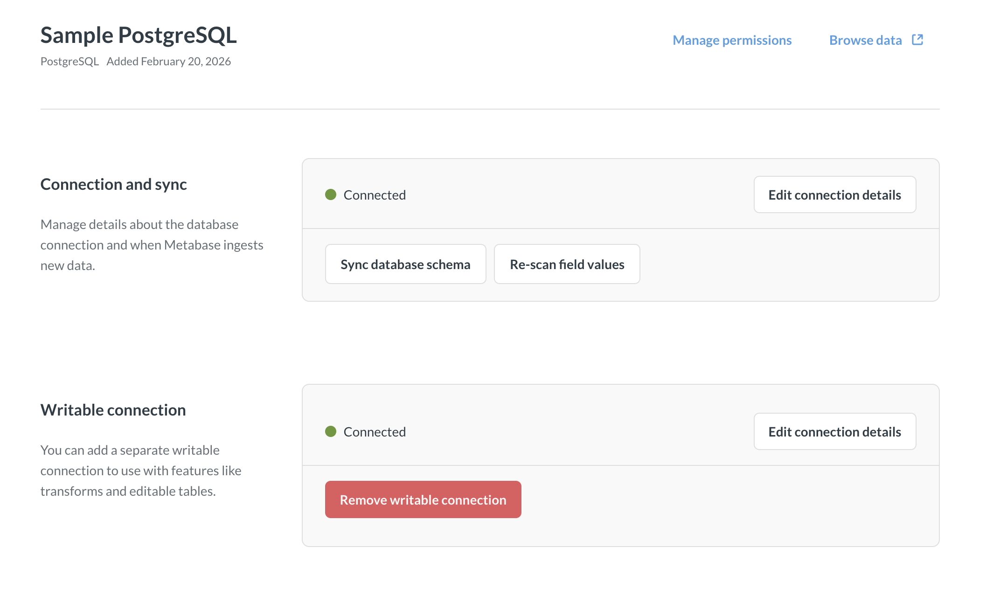

## Writeable connections



_Admin > Databases > Writeable connection_

Writeable connection is an optional connection that Metabase will use for functionality that involves writing into the database (for example, transforms or CSV uploads). This allows you to keep your main Metabase connection read-only, and only to switch to connection with write permissions for the operations that require write access.

## How writeable connection works

Writeable connection is an additional connection option added to an existing database connection.

When a writeable connection is configured for a database, Metabase automatically switches between connections behind the scenes based on what people are doing with the database. The main connection is used for querying, and the writeable connection is used for [features that require writes](#features-that-use-writeable-connection).

Writeable connection can use a different database user than the main connection, or even connect to a different database. For example, your main connection (used for querying) can go to a read replica, but the writeable connection can be to a primary database.

## Add a writeable connection

To add a writeable connection to a database:

1. Go to **Admin > Databases**.
2. Select the database to add a writeable connection to.
3. Under **Writeable connection**, click **Add writeable connection**.
4. Metabase will pre-fill some fields with information from your main connection. Input the credentials for the writeable connection.
5. Click **Save**. Metabase will try to connect using the new connection.

## Remove a writeable connection

To remove a writeable connection from a database:

1. Go to **Admin > Databases**.
2. Select the database you want to remove the writeable connection from.
3. Under **Writeable connection**, click **Remove writeable connection**.

Once writeable connection is removed, Metabase will revert to using the main connection for [features that need write access](#features-that-use-writeable-connection), so your main connection will need to have appropriate database permissions, see [Users, roles, and privileges](./users-roles-privileges.md)

## Features that use writeable connection

When configured, writeable connection will be used for:

- [Transforms](../data-studio/transforms/transforms-overview.md)
- [CSV uploads](../databases/uploads.md)
- [Editable tables](../data-modeling/editable-tables.md)
- [Actions](../actions/introduction.md)
- [Model persistence](../data-modeling/model-persistence.md)

Your writeable connection will need to have the privileges required for these operations. See [Users, roles, and privileges](./users-roles-privileges.md).

## Limitations

- Writeable connection can't be used with [database routing](../permissions/database-routing.md).

- Writeable connection must use the same database engine as the primary connection - so for example, if the primary connection is to a PostgreSQL database, the writeable connection must be to a PostgreSQL database as well.
