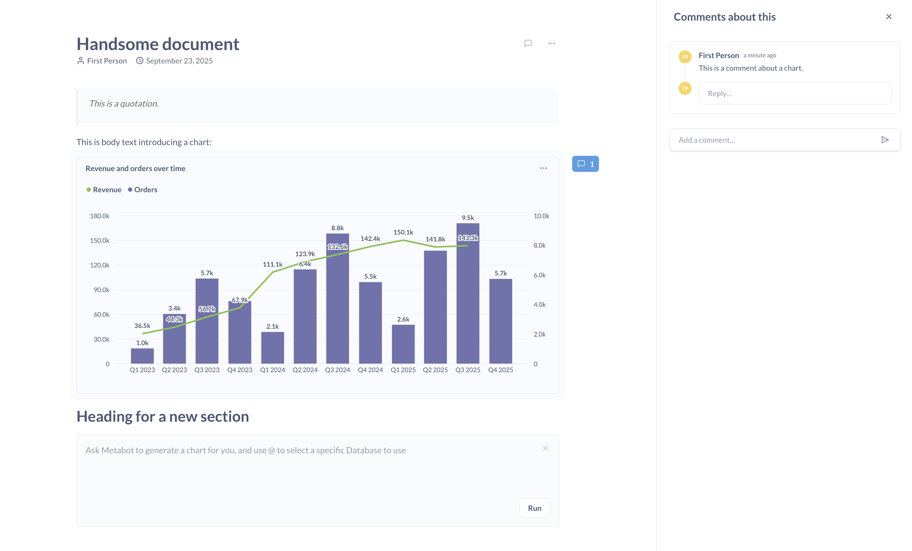
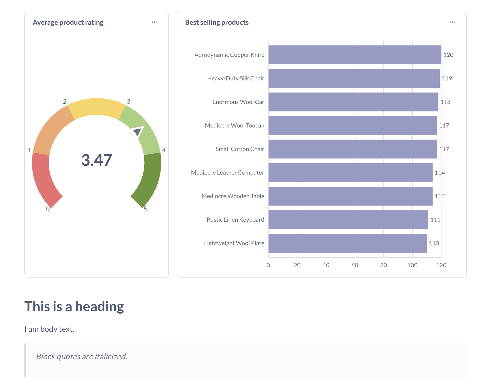
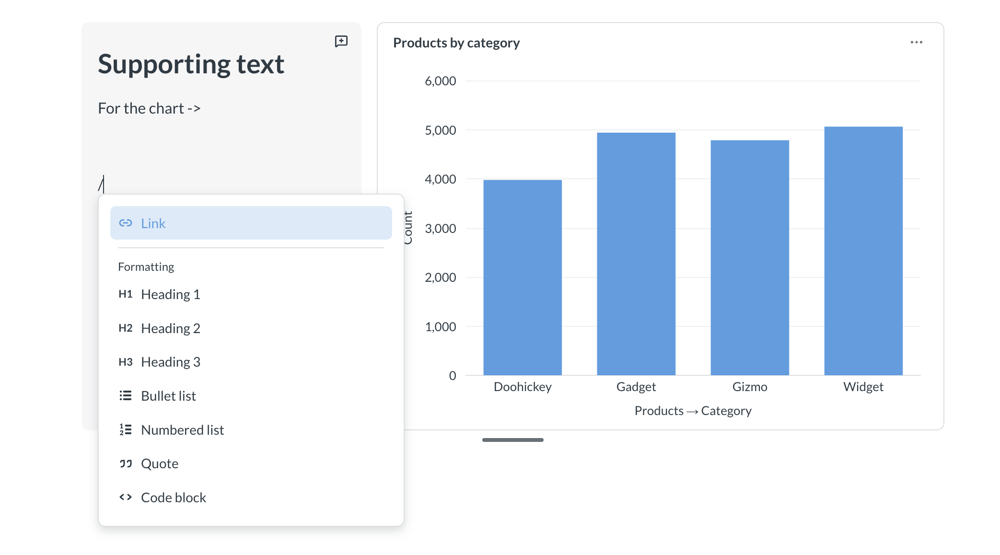

# Documents

Documents let you tell a story with your data by combining text, charts, and other content.

## Create a document

1. Click the **+ New** button in the top right.
2. Select **Document**.
3. Do stuff.
4. Click the **Save** button.

## List commands with `/`

Type `/` in your document to see available commands:

- **Ask Metabot** to chat with [Metabot](../ai/metabot.md) in the document.
- **Chart** to insert a table or chart from an existing question or model, or create a new question directly in the document. You can't add dashboards or other documents, but you can mention them (see the next section).
- **Link** to mention other items in your Metabase.

## Mention items with `@`

You can type `@` to mention items from your Metabase (mentions get a fancy little icon next to them).

## Add charts to documents

You can add [questions](../questions/start.md) and [models](../data-modeling/models.md) to a document. You can either insert existing questions from your collections or create new questions directly in the document.

### Creating new questions in documents

To create a new question directly in a document:

1. Type `/` to open the command menu.
2. Select **Chart**.
3. Select **New chart**.
4. Choose either:
   - **New Question** to use the [query builder](../questions/query-builder/editor.md).
   - **New SQL query** to use the [native SQL editor](../questions/native-editor/writing-sql.md).
5. Build your question and click **Save and use** to add it to the document.

Questions created this way are saved directly to the document and don't appear in your collections unless you explicitly save them there later. Deleting charts made in documents is permanent. You can't recover deleted charts from the [trash](../exploration-and-organization/delete-and-restore.md).

To enter the full-screen editor for a question, click on the question's title.

### Adding a chart copies it to the document

When you add a chart from a collection, Metabase creates a copy in the document. The original question remains in the collection. Changes to one copy won't affect the other; they're independent.

If you delete the document's copy, that copy is permanently deleted and can't be recovered from the [trash](../exploration-and-organization/delete-and-restore.md).

### Charts created in documents only exist in the document

Questions that are created directly in the document (either through [Metabot](../ai/metabot.md) or by creating a new question via the Chart command) are saved to the document itself and don't appear in your collections. If you delete these questions from the document, they're permanently deleted and can't be recovered from the trash.

## Editing charts

To edit a chart, click the **three-dot** menu in the chart's upper right. You can:

- **Add supporting text** to provide context next to the chart
- **Edit visualization** to change how the chart displays data
- **Edit query** to modify the underlying question
- **Replace** the chart with another question or model
- [**Download results**](../questions/exporting-results.md#exporting-results-from-document-cards)

Edits only affect the chart in the document. If you added the chart from a collection, Metabase will have created a copy of the chart. Any changes made to the chart in the document won't affect the original question.

## Arranging charts

To rearrange charts, simply click and hold on the chart and drag it to where you want it in the document.

You can put up to three items side by side in a group. This includes both charts and supporting text blocks. When you have multiple items in the same row, you can resize them horizontally by clicking between the items and sliding left or right to resize.

To resize a chart's height, click the bottom of the chart and resize the chart up or down.

After arranging your charts, save your changes!

## Adding supporting text to charts

You can add a supporting text block next to charts to provide context.

To add supporting text to a chart:

1. Hover over the chart.
2. Click the **three-dot** menu in the chart's upper right.
3. Select **Add supporting text**.
4. Type your text in the supporting text block.

You can only have one supporting text block per group of charts. A group can contain up to three items total (charts and supporting text block combined).

You can drag and drop a supporting text block to reorder them within a group of charts. You can only move supporting text within its current group; you can't drag it out to create a standalone text block.

Supporting text blocks support the same Markdown formatting as the rest of the document, including headings, lists, blockquotes, and code blocks. But you can't add charts in supporting text.

## Formatting text

Documents support Markdown syntax for:

- Headings: `#`
- Images: Use Markdown image syntax: ``. The image must start its own line in the document, and you may need to type out the closing parenthesis to let Metabase know to render the image. The image link must be a valid URL that your Metabase can access.
- Blockquotes: `> This is a blockquote`.
- Code blocks: Wrap with triple backticks (\`\`\`). Syntax highlighting isn't supported yet.

You can also access formatting options by typing `/`.

## Links

You can add links to documents in several ways:

- **Select text and add a link**: Select any text, then click the **Link** button in the formatting menu. Enter a URL and press Enter.
- **Paste a URL**: Paste a link into a document, and Metabase will turn it into a clickable link.
- **Use Markdown syntax**: Type a link using Markdown format: `[link text](url)`. When you type the closing parenthesis, Metabase will convert it to a clickable link.

### Editing links

To edit a link:

1. Hover over the link.
2. Click the **pencil icon** in the popup.
3. Update the URL.
4. Click the **check icon** to save, or the **trash icon** to remove the link entirely.

To edit the link's visible text, edit the text in the document itself.

## Commenting on documents

To comment on a text element, click the chat bubble next to the section. You can only comment on whole sections; you can't highlight text to comment on.

To comment on a chart:

1. Hover over the chart.
2. Click the three-dot menu.
3. Select **Comment**.

You can:

- React to comments with emojis (which are like pictures masquerading as words). For example, this is a gondola: 🚠.
- Mention other items or people in your Metabase (type `@` and then search for who/what you want to mention).
- Link to a comment. Click the **three-dot** menu and select **Copy link**.
- Resolve comments. Resolved comments appear in a separate tab.

### Comment notifications

If someone mentions you in a thread, or responds to a comment in a thread you're in, Metabase will send you an email to let you know.

Currently, there's no central place to view all of your threads and mentions, and no way to disable email notifications for comments.

### Deleting comments

If you never want to see a comment again:

1. Resolve the comment.
2. Find it in the Resolved tab.
3. Click on the **three-dot** menu.
4. Select **Delete**.

This deletion is permanent.

## Printing documents

To print a document, click on the **three-dot** menu and select **Print document**.

## Sharing documents

Admins can create [public links](../embedding/public-links.md#create-a-public-link-for-a-document) to share documents with anyone.

## When to use a document vs. a dashboard

Documents and dashboards both have their use cases.

### Prefer documents for exploration and narration

Documents work best for:

- Telling a story with data
- Opening analysis for comments
- Exploratory analysis

### Use dashboards for tracking metrics

Dashboards work best for:

- Regular analysis. Numbers you want to monitor every day, week, or month.
- Filtering results across multiple charts.
- More control over presentation.

## Document permissions

Whether someone can view or edit a document and its data depends on that person's collection and data permissions. See [Permissions](../permissions/introduction.md).
