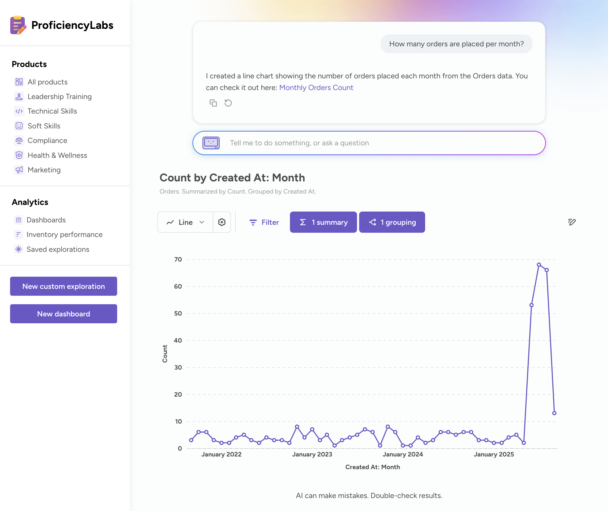
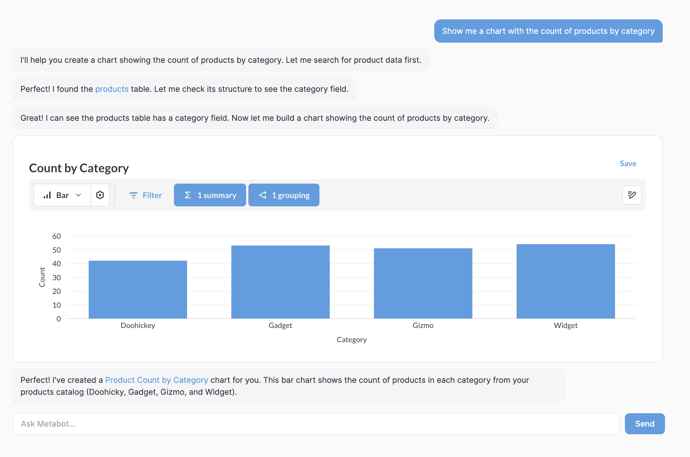
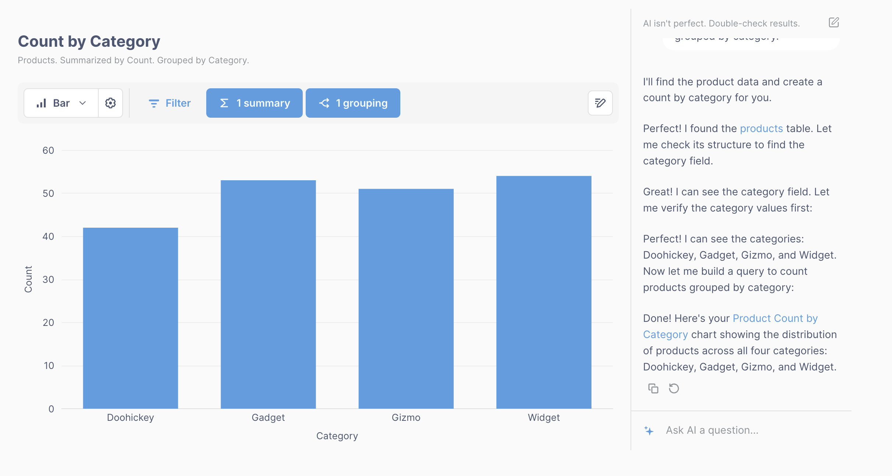

# Embed an AI chat





You can embed an AI chat in your app, so people can ask questions of their data in natural language. Embedded chat is a focused version of [Metabot](../ai/metabot.md): it builds a question in the query builder and charts the answer.

To build that question, embedded chat first searches your Metabase for the best thing to build on: a [metric](../data-modeling/metrics.md), a [model](../data-modeling/models.md), a saved question, or a table (tables drop out once you [scope the chat to a collection](#set-up-ai-chat-in-metabase)). Then it writes a query against whatever it picked. So embedded chat does look through your saved content, but as raw material for a new question, not as results to hand back. What people get back is always a new question they can drill into, and save if you [turn saving on](#let-people-save-questions-metabot-creates).

Embedded chat won't write SQL, build or edit dashboards, or create metrics and models — it builds on the ones you already have. It also won't work as a search box for finding existing content. For those, chat will suggest doing the work in Metabase itself.

AI chat requires the embed to use SSO authentication that signs people into your Metabase.

## Try the AI chat demo

For what AI chat looks like in action, check out the [AI chat component](https://embedded-analytics-sdk-demo.metabase.com/admin/analytics/new/ask-metabot) running on Shoppy, our modular embedding demo app. The demo's chat uses the [dedicated chart component](#ai-chat-with-dedicated-chart-panel).

## Set up AI chat in Metabase

An admin sets up embedded Metabot in your Metabase:

1. Click the **grid** icon in the upper right.
2. Select **Admin**.
3. Click the **AI** tab.
4. In the left sidebar, click **AI Settings**.
5. The first card on the page is your AI provider connection. If the card says **Connect to an AI provider**, [set one up](../ai/settings.md#enable-ai-features). If you're self-hosting, that means [bringing your own API key](../ai/settings.md#bring-your-own-api-key). If the card says **AI providers**, you're already connected.
6. In the **Metabot settings** card, click the **Embedded** tab.
7. Turn on **Enable Embedded Metabot**.
8. Under **Collection Embedded Metabot can use**, click **Pick a different collection** and choose the collection that holds the metrics, models, and saved questions embedded Metabot should build on.

The collection you pick narrows what embedded chat finds when it searches for something to build on: that collection and everything under it. It doesn't limit what embedded chat can query, since people can still get to any data they have [permissions](../permissions/embedding.md) for. And once you set a collection, tables drop out of the chat's search results, so pick a collection with the metrics and models you want people building on.

The **Embedded** tab configures Metabot in an embedded context, which is separate from the [Metabot](../ai/settings.md) in your own Metabase (which lives on the **Internal** tab). Both tabs control what each Metabot can see, not what it runs on: the AI provider, API key, and model are set once for the whole instance, above the **Metabot settings** card, and both Metabots use them.

With embedded Metabot set up, there are two ways to add the chat to your app:

- **[Web component](#web-component-ai-chat)**: the whole chat interface, chart and all, from a single tag.
- **[React SDK](#react-sdk-ai-chat)**: the same interface from the `MetabotQuestion` component, or the [`useMetabot`](#build-a-custom-ai-chat-ui-with-usemetabot-react-sdk-only) hook if you'd rather build the interface yourself.

Both the web component and `MetabotQuestion` let you [set where the chart appears](#set-where-the-chart-appears) and [whether people can save questions](#let-people-save-questions-metabot-creates).

## Web component AI chat

You can use the in-app wizard to generate the code:

1. Open the command palette with Ctrl/Cmd+K and type **New embed**.
2. For the experience, select **Metabot**.
3. Pick a [layout](#set-where-the-chart-appears) and decide whether people can [save questions](#let-people-save-questions-metabot-creates).
4. Click **Get code** and paste the snippet into your app.

The **Metabot** option only shows up once an admin has turned on embedded Metabot, and only for SSO authentication. For what the rest of the generated snippet does, see [modular embedding](./modular-embedding.md).

To render the AI chat interface:

```html
<metabase-metabot></metabase-metabot>
```

### Web component `metabase-metabot` attributes



Depending on the framework you're using, you may need to stringify attributes before passing them to the component. And if you surround an attribute's value with double quotes, use single quotes inside it.

For all modular embeds, you can also set a `locale` in your page-level configuration to [translate embedded content](./translations.md). But [Metabot's own text isn't translated](./translations.md#the-ai-chat-component-isnt-translated).

## React SDK AI chat



To embed an AI chat with the [SDK](./sdk/introduction.md), use the `MetabotQuestion` component. Wrap the component in the `MetabaseProvider` component with your auth config.

```typescript

```

### React SDK `MetabotQuestion` props

- [Component](./sdk/api/MetabotQuestion.html)
- [Props](./sdk/api/MetabotQuestionProps.html)



## Set where the chart appears

- [Web component](#web-component-chart-layout)
- [React SDK](#react-sdk-chart-layout)

The `layout` setting positions the chart relative to the chat interface:

- `auto` (default): Metabot uses the `stacked` layout on mobile screens, and a `sidebar` layout on larger screens.
- `stacked`: the chart stacks on top of the chat interface.
- `sidebar`: the chart appears to the left of the chat interface, which sits in a sidebar on the right.

`layout` only applies to the built-in chat component. If you're building your own interface with [`useMetabot`](#build-a-custom-ai-chat-ui-with-usemetabot-react-sdk-only), you position the chart yourself.

### Web component chart layout

Set the `layout` attribute:

```html
<metabase-metabot layout="stacked"></metabase-metabot>
```

### React SDK chart layout

Set the `layout` prop on `MetabotQuestion`:

```tsx
<MetabotQuestion layout="stacked" />
```

## Let people save questions Metabot creates

- [Web component](#web-component-question-saving)
- [React SDK](#react-sdk-question-saving)

Turning on the chat's save button lets people keep a question Metabot built. Saving is off by default.

Setting a target collection is optional, but it's worth doing: it picks the collection that new questions land in, so people's work doesn't scatter across your Metabase. It also hides the collection picker in the save modal, so nobody has to decide where their question goes.

### Web component question saving

Turn saving on with `is-save-enabled="true"`, and set the collection with `target-collection`:

```html
<metabase-metabot
  is-save-enabled="true"
  target-collection="123"
></metabase-metabot>
```

### React SDK question saving

The equivalent props on `MetabotQuestion` are `isSaveEnabled` and `targetCollection`:

```tsx
<MetabotQuestion isSaveEnabled targetCollection={123} />
```

## Build a custom AI chat UI with `useMetabot` (React SDK only)

If `MetabotQuestion`'s built-in layouts don't fit your app, use the `useMetabot` hook to read Metabot's conversation state directly and render your own UI. The hook gives you the messages, the chart the agent most recently produced, processing and error state, and actions to submit, cancel, retry, or reset the conversation.

### AI chat with inline charts



When an agent responds, the message can contain a `Chart` component. You can walk the agent's messages and render charts inline alongside the chat transcript:

```typescript

```

### AI chat with dedicated chart panel



The `CurrentChart` component is bound to the latest chart the agent produced. Render `CurrentChart` once, and it will swap in new charts as the agent creates them. You'll want to filter chart messages out of the transcript so they don't render twice:

```typescript

```

### React SDK `useMetabot` return values

- [Hook](./sdk/api/useMetabot.html)
- [Return values](./sdk/api/UseMetabotResult.html)



### Guard against null while the SDK bundle loads

`useMetabot` returns `null` until the SDK bundle has loaded and `<MetabaseProvider>` has mounted, so always guard before you use it. The SDK ships its Metabot internals in a code-split chunk that isn't available synchronously, which means an unguarded first render throws `Cannot read properties of null` as soon as you reach for `metabot.messages`, `metabot.submitMessage`, or anything else on the hook.

### Bring your own markdown renderer

`MetabotQuestion` renders agent text messages for you, markdown formatting and all, along with transcript scrolling and input styling. The `useMetabot` hook hands you the raw conversation state instead, so you can handle the markdown rendering.

Agent text messages (the ones where `message.type === 'text'`) contain markdown (like links, bold, lists, inline code). The snippets above render `message.message` as plain text to keep them short, but in production you'll want to pass that text through a markdown renderer, like `react-markdown` or `markdown-to-jsx`, so links and formatting come out right.

### Strip links back to Metabase

Agent text can include links pointing back to the Metabase it's running against, like a link to a chart the agent just created. Opening one requires an authenticated Metabase session, so people viewing your app will hit a login screen. Strip those links out when you render the message, or swap them for a route in your own app.

## Further reading

- [Modular embedding components](./components.md)
- [Metabot](../ai/metabot.md)
- [Metabot settings](../ai/settings.md)
- [Embed a chart](./chart.md)
- [Embed a dashboard](./dashboard.md)
- [Appearance](./appearance.md)
- [Authentication](./authentication.md)
- [Modular embedding](./modular-embedding.md)
- [Modular embedding SDK](./sdk/introduction.md)
