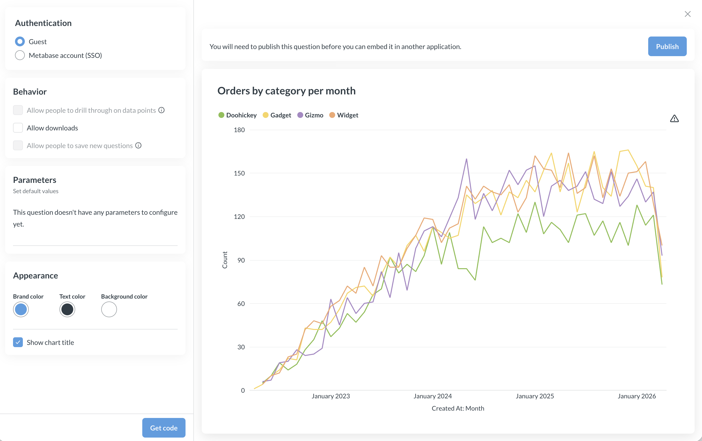

# Customizing the appearance of modular embeds

You can style your embedded [Metabase components](./components.md) with a **theme**.


Guest embeds on OSS/Starter plans come with two theme presets - light and dark. On Metabase Pro/Enterprise plans, you can customize individual colors, fonts, etc.

## Basic theming

You can choose light or dark theme for your embeds. On Pro/Enterprise plans, you can also configure granular appearance settings like background, fonts etc, see [Advanced theming](#advanced-theming).

To add a light or dark theme, pass a `theme` parameter with `preset` to the `defineMetabaseConfig()` function in your [embedding code snippet](./modular-embedding.md#add-the-embedding-script-to-your-app). For example, to specify a dark theme:

```js
defineMetabaseConfig({
  theme: {
    preset: "dark",
  },
  instanceUrl: "http://localhost:3000",
});
```

## Advanced theming



On Pro/Enterprise plan, you can configure granular appearance options, like background colors, font sizes etc. See the [list of all theming options]().

### Add an advanced theme to your embed



Some appearance options like brand, text, and background color are configurable in in the [embed wizard](./modular-embedding.md#create-a-new-embed).

For other appearance settings, use the `theme` parameter with `preset` in the `defineMetabaseConfig()` function in your [embedding code snippet](./modular-embedding.md#add-the-embedding-script-to-your-app). For example:

```js
defineMetabaseConfig({
  theme: {
    colors: {
      background: "#FFFFFF",
      "text-primary": "hsla(204, 66%, 8%, 0.84)",
      brand: "hsla(208, 72%, 60%, 1.00)",
      "background-hover": "rgb(236, 236, 236)",
      "background-disabled": "rgb(231, 231, 231)",
      "background-secondary": "rgb(233, 233, 233)",
      "background-light": "rgb(233, 233, 233)",
      "text-secondary": "rgba(9, 30, 44, 0.84)",
      "text-tertiary": "rgba(11, 37, 54, 0.84)",
      "brand-hover": "rgb(185, 216, 244)",
      "brand-hover-light": "rgb(238, 245, 252)",
    },
  },
  instanceUrl: "http://localhost:3000",
});
```

### Theme options



For advanced theme configuration options, you can configure the `theme` object in the object passed to the `defineMetabaseConfig` function, see [Add an advanced theme to your embed](#add-an-advanced-theme-to-your-embed). Here's the list of all options available for customization:

```json
{
  // Specify a font to use from the set of fonts supported by Metabase.
  // You can set the font to "Custom" to use the custom font
  // configured in your Metabase instance.
  "fontFamily": "Lato",

  // Override the base font size for every component.
  // This does not usually need to be set, as the components
  // inherit the font size from the parent container, such as the body.
  "fontSize": "16px",

  // Override the base line height for every component.
  "lineHeight": 1.5,

  // Match your application's color scheme
  "colors": {
    // The primary color of your application
    "brand": "#9B5966",

    // Lighter variation of the brand color. Used for hover and accented elements.
    "brand-hover": "#DDECFA",

    // Lightest variation of the brand color. Used for hover and accented elements.
    "brand-hover-light": "#EEF6FC",

    // The color of text that is most prominent
    "text-primary": "#4C5773",

    // The color of text that is less prominent
    "text-secondary": "#696E7B",

    // The color of text that is least prominent
    "text-tertiary": "#949AAB",

    // Default background color
    "background": "#FFFFFF",

    // Light background color for some control backgrounds.
    // Defaults are derived from `background` (slightly darker in light mode, much lighter in dark mode).
    "background-light": "#F0F2F5",

    // Slightly muted background color.
    "background-secondary": "#EDF2F5",

    // Slightly darker background color used for hover and accented elements
    "background-hover": "#F9FBFC",

    // Muted background color used for disabled elements, such as disabled buttons and inputs.
    "background-disabled": "#F3F5F7",

    // Color used for borders
    "border": "#EEECEC",

    // Color used for filters context
    "filter": "#7172AD",

    // Color used for aggregations and breakouts context
    "summarize": "#88BF4D",

    // Color used to indicate successful actions and positive values/trends
    "positive": "#BADC58",

    // Color used to indicate dangerous actions and negative values/trends
    "negative": "#FF7979",

    /** Color used to outline elements in focus */
    "focus": "#CAE1F7",

    /** Color used for popover shadows */
    "shadow": "rgba(0,0,0,0.08)",

    // Overrides the chart colors. Supports up to 8 colors
    // Limitation: this does not affect charts with custom series color
    "charts": [
      // can either be a hex code
      "#9B59B6",

      // or a color object. tint and shade represents lighter and darker variations
      // only base color is required, while tint and shade are optional
      { "base": "#E74C3C", "tint": "#EE6B56", "shade": "#CB4436" }
    ]
  },

  "components": {
    // Dashboard
    "dashboard": {
      // Background color for all dashboards
      "backgroundColor": "#2F3640",

      // Border color of the dashboard grid, shown only when editing dashboards.
      // Defaults to `colors.border`
      "gridBorderColor": "#EEECEC",

      "card": {
        // Background color for all dashboard cards
        "backgroundColor": "#2D2D30",

        // Apply a border color instead of shadow for dashboard cards.
        // Unset by default.
        "border": "1px solid #EEECEC"
      }
    },

    // Question
    "question": {
      // Background color for all questions
      "backgroundColor": "#2E353B",

      // Toolbar of the default interactive question layout
      "toolbar": {
        "backgroundColor": "#F3F5F7"
      }
    },

    // Tooltips
    "tooltip": {
      // Tooltip text color.
      "textColor": "#FFFFFF",

      // Secondary text color shown in the tooltip, e.g. for tooltip headers and percentage changes.
      "secondaryTextColor": "#949AAB",

      // Tooltip background color.
      "backgroundColor": "#2E353B",

      // Tooltip background color for focused rows.
      "focusedBackgroundColor": "#0A0E10"
    },

    // Data table
    "table": {
      "cell": {
        // Text color of cells, defaults to `text-primary`
        "textColor": "#4C5773",

        // Default background color of cells, defaults to `background`
        "backgroundColor": "#FFFFFF",

        // Font size of cell values, defaults to ~12.5px
        "fontSize": "12.5px"
      },

      "idColumn": {
        // Text color of ID column, defaults to `brand`
        "textColor": "#9B5966",

        // Background color of ID column, defaults to a lighter shade of `brand`
        "backgroundColor": "#F5E9EB"
      }
    },

    // Number chart
    "number": {
      // Value displayed on number charts.
      // This also applies to the primary value in trend charts.
      "value": {
        "fontSize": "24px",
        "lineHeight": "21px"
      }
    },

    // Cartesian chart
    "cartesian": {
      // Padding around the cartesian charts.
      // Uses CSS's `padding` property format.
      "padding": "4px 8px"
    },

    // Pivot table
    "pivotTable": {
      "cell": {
        // Font size of cell values, defaults to ~12px
        "fontSize": "12px"
      },

      // Pivot row toggle to expand or collapse row
      "rowToggle": {
        "textColor": "#FFFFFF",
        "backgroundColor": "#95A5A6"
      }
    },

    "collectionBrowser": {
      "breadcrumbs": {
        "expandButton": {
          "textColor": "#8118F4",
          "backgroundColor": "#767D7C",
          "hoverTextColor": "#CE8C8C",
          "hoverBackgroundColor": "#69264B"
        }
      }
    },

    // Popover are used in components such as click actions in interactive questions.
    "popover": {
      // z-index of the popover. Useful for embedding components in a modal. defaults to 4.
      "zIndex": 4
    }
  }
}
```

## Limitations

- CSS variables aren't yet supported. If you'd like Metabase to support CSS variables, please upvote this [feature request](https://github.com/metabase/metabase/issues/59237).
- Colors set in the visualization settings for a question will override theme colors.
