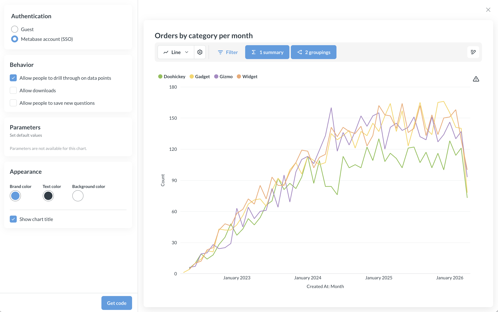

# Customizing the appearance of modular embeds



You can style your embedded Metabase components with a `theme`.

In your Metabase:

- Visit the item you want to embed
- Click on the sharing icon.
- Select **Embed**.


Change the colors, and the code snippet will include a `theme` object in the object passed to the `defineMetabaseConfig` function.

## Theme options

Here's an example that includes the various styling options available via the [embedded analytics React SDK](./sdk/introduction.md):

```ts

```


## Customizing the appearance of an SSO embed



Add a `theme` object to your config object:


```html
<script defer src="http://localhost:3000/app/embed.js"></script>
<script>
function defineMetabaseConfig(config) {
  window.metabaseConfig = config;
}
</script>

<script>
  defineMetabaseConfig({
    "theme": {
      "colors": {
        "background": "#FFFFFF",
        "text-primary": "hsla(204, 66%, 8%, 0.84)",
        "brand": "hsla(208, 72%, 60%, 1.00)",
        "background-hover": "rgb(236, 236, 236)",
        "background-disabled": "rgb(231, 231, 231)",
        "background-secondary": "rgb(233, 233, 233)",
        "background-light": "rgb(233, 233, 233)",
        "text-secondary": "rgba(9, 30, 44, 0.84)",
        "text-tertiary": "rgba(11, 37, 54, 0.84)",
        "brand-hover": "rgb(185, 216, 244)",
        "brand-hover-light": "rgb(238, 245, 252)"
      }
    },
    "instanceUrl": "http://localhost:3000"
  });
</script>

<metabase-dashboard dashboard-id="10"
  with-title="true"
  with-downloads="false"
  with-subscriptions="false"
  hidden-parameters='["category"]'
  drills="true">
</metabase-dashboard>
```

## Customizing the appearance of a guest embed


Add a `theme` object to your config object:

```html
<script defer src="http://localhost:3000/app/embed.js"></script>
<script>
function defineMetabaseConfig(config) {
  window.metabaseConfig = config;
}
</script>

<script>
  defineMetabaseConfig({
    "theme": {
      "colors": {
        "background": "#FFFFFF",
        "text-primary": "hsla(204, 66%, 8%, 0.84)",
        "brand": "hsla(208, 72%, 60%, 1.00)",
        "background-hover": "rgb(236, 236, 236)",
        "background-disabled": "rgb(231, 231, 231)",
        "background-secondary": "rgb(233, 233, 233)",
        "background-light": "rgb(233, 233, 233)",
        "text-secondary": "rgba(9, 30, 44, 0.84)",
        "text-tertiary": "rgba(11, 37, 54, 0.84)",
        "brand-hover": "rgb(185, 216, 244)",
        "brand-hover-light": "rgb(238, 245, 252)"
      }
    },
    "isGuest": true,
    "instanceUrl": "http://localhost:3000"
  });
</script>

<metabase-dashboard
  token=<TODO: Fetch the JWT token from your backend and programmatically pass it to this 'metabase-dashboard' component>
  with-title="true"
  with-downloads="false">
</metabase-dashboard>
```

## Example app with theming

Check out our [sample app](https://github.com/metabase/modular-embedding-sample-app). Bring your Metabase, embed a question or dashboard, and play around with changing colors.

## Customizing loader and error components

With the SDK, you can provide your own components for loading and error states by specifying `loaderComponent` and `errorComponent` as props to `MetabaseProvider`.

```tsx



```

## Limitations

- CSS variables aren't yet supported. If you'd like Metabase to support CSS variables, please upvote this [feature request](https://github.com/metabase/metabase/issues/59237).
- Colors set in the visualization settings for a question will override theme colors.
