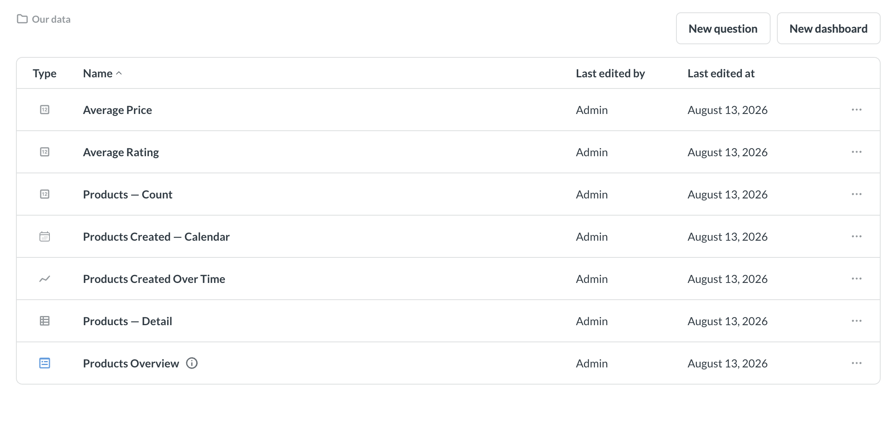

# Embed a collection browser





The collection browser lets people navigate through collections they have permission to view.

There are two ways to embed a collection browser:

- **[Web component](#web-component-collection-browser)**: a whole browser. Clicking an item opens it inside the embed, with breadcrumbs, create buttons, and [saving](#let-people-save-changes) already built.
- **[React SDK](#react-sdk-collection-browser)**: a list of items with breadcrumbs, plus a click handler. Nothing opens on its own, so you decide what a click does and build any create or save flow in your own app.

To see a collection browser, people need Metabase accounts, because Metabase uses [collection permissions](../permissions/collections.md) to work out what each person can see. So a collection browser only works in an [embed that signs people in with SSO](./introduction.md#components-with-sso-authentication); it won't work in a [guest embed](./guest-embedding.md).

## Web component collection browser

Point `<metabase-browser>` at the collection you want people to start in:

```html
<metabase-browser initial-collection="123"></metabase-browser>
```

`initial-collection` is the only required attribute. It takes:

- A collection ID, like `123` — the number in the collection's URL. On Pro and Enterprise plans, you can use the collection's [entity ID](../installation-and-operation/serialization.md#entity-ids-work-with-embedding) instead, which stays the same when you [serialize](../installation-and-operation/serialization.md) content from one Metabase to another.
- `"root"` for the top-level **Our analytics** collection.
- `"personal"` for the personal collection of whoever's viewing.
- `"tenant"` for the [tenant](./tenants.md) collection of whoever's viewing. People who aren't tenant members will get an error.

For the full list of attributes, see [web component attributes](./browser-reference.md#web-component-metabase-browser-attributes).

### Clicking an item opens it inside the embed

Clicking a dashboard or question opens it inside the embed, with breadcrumbs back to the collection. People can filter, summarize, and drill through anything they open.

By default, people won't be able to save questions to the collection.

### Let people save changes

If you want people to be able to edit _and_ save the dashboards and questions they open, set `read-only="false"`:

```html
<metabase-browser initial-collection="123" read-only="false"></metabase-browser>
```

Under the hood, `read-only` decides which dashboard component people land on: a read-only browser opens dashboards for exploring, while `read-only="false"` opens them for [editing](./dashboard.md#web-component-editable-dashboard).

Which collection people can save something to depends on whether it's a new item or not:

- **A new question or dashboard** will be saved in the collection they're browsing. The save dialog preselects that collection, and people can pick any other collection they can write to, which comes down to [collection permissions](../permissions/collections.md). Everyone can always write to their own personal collection, so that shows up as an option even if you've not given people [curate access](../permissions/collections.md#curate-access) to any collection.
- **Changes to a dashboard or question they opened from the browser** overwrite the original, wherever it lives. If they save a question as a new question instead, it goes to the collection they're browsing. Either way, there's no collection picker, so people can't file it somewhere else.

People in a [tenant](./tenants.md) see two writable options in that picker: their tenant collection, which Metabase labels **Our data**, and their own personal collection. Tenant collections and personal collections both give people curate access that you can't turn off, so a tenant collection browser will always offer somewhere to save. People in a tenant have no access to **Our analytics**, so it won't show up.

There's no `<metabase-browser>` attribute that fixes the save target to one collection, the way `target-collection` does on `<metabase-question>`. Check out [Let people save their changes](./chart.md#let-people-save-their-changes).

### Add new question and new dashboard buttons

The browser can show a **New question** button and a **New dashboard** button above the list of items.

- `with-new-question` defaults to `true`. **New question** ignores `read-only`, so the button shows up even on a read-only browser.
- `with-new-dashboard` also defaults to `true`, but **New dashboard** only shows up when you set `read-only="false"`.
- Either button only shows up for people with [curate access](../permissions/collections.md#curate-access) to the collection you named in `initial-collection`.

So a default `<metabase-browser>` gives people **New question** and nothing else. Add `read-only="false"` and they get both buttons. To turn a button off, set its attribute to `false`. Here, people get **New question** but not **New dashboard**:

```html
<metabase-browser
  initial-collection="123"
  read-only="false"
  with-new-dashboard="false"
></metabase-browser>
```

Because **New question** ignores `read-only`, people on a read-only browser can open the query builder and explore, but they won't be able to save what they build, or overwrite an existing question.

The new question button opens the query builder with every table, model, and saved question people have access to. To narrow down the list of entity types people can choose, list the entity types you want in `data-picker-entity-types`. Limiting people to [models](../data-modeling/models.md), for example, means they build on your curated data rather than on raw tables:

```html
<metabase-browser
  initial-collection="123"
  read-only="false"
  data-picker-entity-types="['model']"
></metabase-browser>
```

### Let people follow links to other dashboards and questions

By default, clicking a link (like from a [link card](../dashboards/introduction.md#link-cards)) from inside a dashboard does nothing, so people stay inside the collection you gave them. Turn on `enable-entity-navigation` to let them follow those links:

```html
<metabase-browser
  initial-collection="123"
  enable-entity-navigation="true"
></metabase-browser>
```

People can still only open content their collection permissions allow.

## React SDK collection browser



The SDK's `CollectionBrowser` lists what's in a collection and tells you when someone clicks an item. It has no create buttons and doesn't open anything on its own. You decide what a click does, and add whatever buttons you want. `CollectionBrowser` does render its own breadcrumbs, though, so people can navigate into subcollections and back out again.

```typescript

```

`collectionId` takes a collection ID (sequential or entity), or one of `"root"`, `"personal"`, or `"tenant"`. It defaults to `"personal"`, so unless you want people to start in their own personal collection, you should pass an explicit value.

For the full list of props, see [`CollectionBrowser` props](./browser-reference.md#react-sdk-collectionbrowser-props).

### Decide what happens when someone clicks an item

Use `onClick` to render a Metabase component, route somewhere in your app, or open a modal.

`onClick` hands you the `item` that was clicked. Check `item.model` to find out what was clicked. Here, `card` is a question, and `dataset` is a model.

One quirk: when someone clicks on a collection, `CollectionBrowser` navigates into that collection _and_ calls `onClick`. So skip `"collection"` in your handler, or you'll move people twice.

```typescript

```

## Further reading

- [Browser component reference](./browser-reference.md)
- [Embed a dashboard](./dashboard.md)
- [Embed a chart](./chart.md)
- [Embed the query builder](./query-builder.md)
- [Appearance](./appearance.md)
- [Collections](../exploration-and-organization/collections.md)
- [Collection permissions](../permissions/collections.md)
- [Authentication](./authentication.md)
- [Modular embedding SDK](./sdk/introduction.md)
- [Modular embedding components](./components.md)
