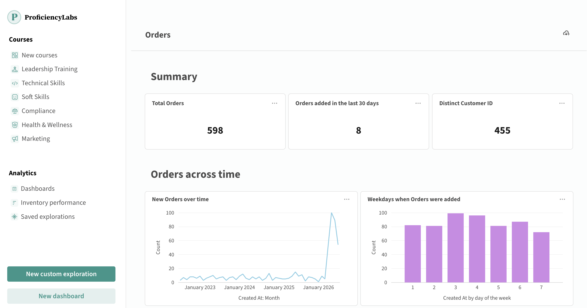
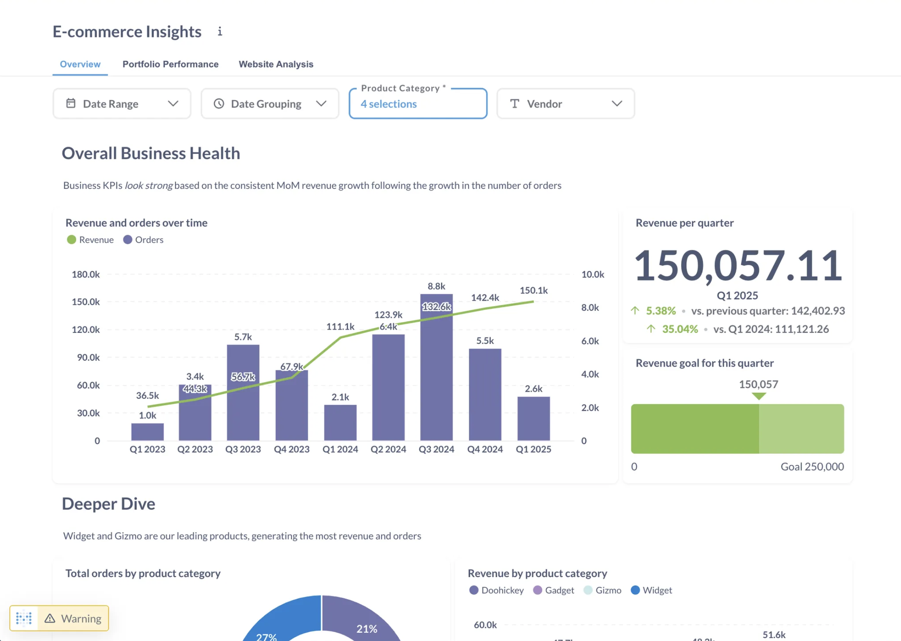
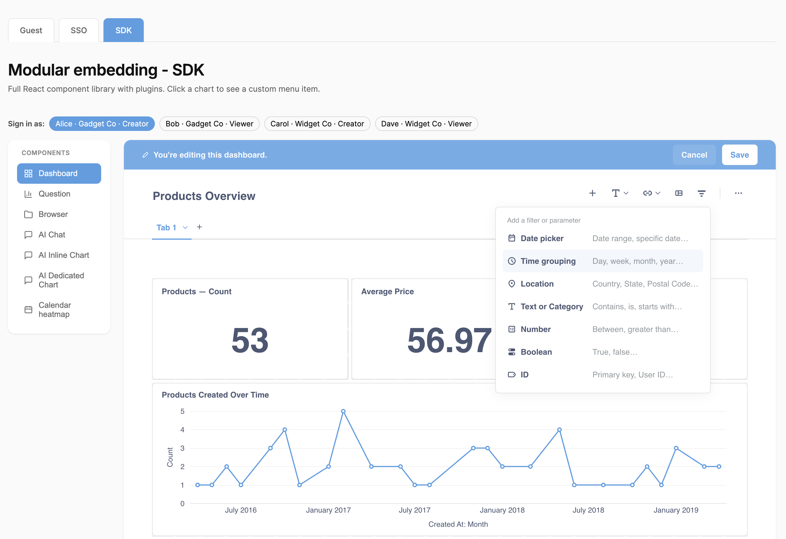

# Embed a dashboard



_Embedded dashboard from our SDK demo site, [Shoppy](https://embedded-analytics-sdk-demo.metabase.com)_

There are three ways you can embed a dashboard:

- [View-only dashboard](#embed-a-view-only-dashboard): people see the results, filter them, and that's it.
- [Interactive dashboard](#embed-an-interactive-dashboard): people can drill through the charts on the dashboard and explore the data behind them.
- [Editable dashboard](#embed-an-editable-dashboard): people also can add cards, rearrange the layout, and save the changes.

## Embed a view-only dashboard

A view-only (a.k.a. "static") dashboard displays results without letting people explore the data. Nobody can drill through the charts or change the questions behind them. You can, however, add editable filters that people can change to update the results, as well as locked filters you can use to filter results based on who is logged in to your app.

- [Web component](#web-component-view-only-dashboard)
- [React SDK](#react-sdk-view-only-dashboard)

View-only isn't tied to one kind of embed:

- **[Guest embeds](./introduction.md#components-with-guest-authentication)**: always view-only. Nobody logs in to a guest embed, so Metabase has no account to check permissions against.
- **[SSO embeds](./introduction.md#components-with-sso-authentication)**: interactive by default. To make one view-only, turn off drill-through with `drills="false"` (web component), or use `StaticDashboard` instead of `InteractiveDashboard` (SDK).

For view-only items, you'll almost always want to go with guest authentication (so you don't have to pay for each person viewing the item). If, however, you also want people to be able to self-serve data (in addition to displaying view-only items), go with SSO. Check out [SSO or guest embeds](./introduction.md#comparison-between-sso-and-guest-authentication).

### Web component view-only dashboard

You can use the in-app wizard to set up a view-only dashboard using web components. These steps walk through a guest embed.


Three things need to happen: you publish the dashboard embed in Metabase, you paste the dashboard code into your app (both frontend and backend), and your server signs a JWT. The in-app wizard writes most of the code for you.

1. Visit the dashboard in your Metabase.
2. Click the **Share** icon in the upper right.
3. Select **Embed** to open the embedding wizard.
4. For authentication, choose **Guest**, so your app won't need to log anyone in to your Metabase. An admin needs to [turn on guest embedding](./guest-embedding.md#turning-on-guest-embedding-in-metabase) first.
5. Click the **Publish** button (publishing only applies to embeds with guest authentication).
6. Under **Behavior**, Metabase gives you several options for customizing how the embed works. See [web component attributes](./dashboard-reference.md#web-component-metabase-dashboard-attributes) for what each attribute does. With guest embeds, you can only control whether people can download the data. If you'd picked SSO in step 4, this is where you'd make the embed view-only by turning off drill-through.
7. If your dashboard has filters, set each filter to **Editable** or **Locked**, or leave it as **Disabled**. Filters are disabled by default, which hides the filter and blocks both sides from setting it: your server can't pass a value for it in the JWT, and the person viewing can't change it in the UI. See [Choose parameter visibility in the embed wizard](./parameters.md#choose-parameter-visibility-in-the-embed-wizard).
8. Customize the [appearance](./appearance.md).
9. Click the **Get code** button. You'll get both the frontend and backend code based on the selections you made in the wizard.
10. Copy the client code and paste it in your app.
11. Replace the JWT the wizard pasted into your HTML. That token is a fixed string with an expiration baked into it, so an embed that ships with it will stop working.

You have two ways to hand the component a token that won't go stale:

- **Sign a token per page load.** Your server signs a fresh JWT for each request and renders it into the `token` attribute. See [Server-side code](./guest-embedding.md#server-side-code) for the signing code.
- **Let the embed fetch its own.** Leave the `token` attribute off, and point [`guestEmbedProviderUri`](./guest-embedding.md#refreshing-or-initializing-the-jwt-from-your-server) at an endpoint in your app. The embed calls that endpoint for its first token on load, and again whenever the current token expires, so the embed keeps working past that expiration.

The example below takes the second route.

#### Web component view-only dashboard example

Say you have a sales dashboard with a **Customer** filter, and you want to put it on each customer's account page in your app, showing only that customer's numbers.

Set the **Customer** filter to **Locked** in the dashboard's embed settings. Locked means your server picks the filter's value and puts it in the signed token, so the value never reaches the browser: the person on the page can't see it, and they can't change it. An embed on customer 13's account page returns customer 13's rows and nothing else. It has to work this way, because a guest embed doesn't sign anyone in to your Metabase---only your app knows whose account page this is.

Here's the frontend code:

```html
<!-- embed.js defines the <metabase-dashboard> element -->
<script defer src="https://your-metabase.example.com/app/embed.js"></script>
<script>
  function defineMetabaseConfig(config) {
    window.metabaseConfig = config;
  }
</script>

<script>
  // Page-level config, shared by every Metabase component on the page
  defineMetabaseConfig({
    instanceUrl: "https://your-metabase.example.com",
    isGuest: true,
    // Your app's token endpoint. The embed calls it for its first token on
    // load, and again whenever the current token expires.
    guestEmbedProviderUri: "/api/metabase-guest-token",
    theme: {
      colors: {
        brand: "#509EE3",
        "text-primary": "hsla(204, 66%, 8%, 0.84)",
      },
    },
  });
</script>

<!-- No token in the HTML. The embed gets one from your endpoint. -->
<metabase-dashboard
  dashboard-id="1"
  with-title="true"
  with-downloads="true"
></metabase-dashboard>
```

The `theme` key sets the dashboard's appearance. For the full theme object with all the options, check out [Appearance](./appearance.md).

And here's the endpoint that signs the token. The embed posts the dashboard's ID to it, along with your app's session cookie, so your server knows both which dashboard to sign for and who's asking:

```javascript
const jwt = require("jsonwebtoken");

// Your embedding secret key. Keep it on your server; it never reaches the browser.
const METABASE_SECRET_KEY = process.env.METABASE_SECRET_KEY;

app.post("/api/metabase-guest-token", (req, res) => {
  // Work out the customer from your app's own session, not from the request
  // body---the page never says whose account page it's on.
  const customerId = req.session?.customerId;

  if (!customerId) {
    return res.status(403).json({ error: "Not signed in" });
  }

  const { entityType, entityId } = req.body;

  // Authorize the request. The browser picks the entityType and entityId, so
  // check them against your own rule before signing for them.
  // This is just an example:
  if (!customerCanView(customerId, entityType, entityId)) {
    return res.status(403).json({ error: "Not allowed" });
  }

  const payload = {
    resource: { [entityType]: entityId },
    params: {
      // Key each param by the filter's slug. Here, the locked Customer filter.
      customer: [customerId],
    },
    exp: Math.round(Date.now() / 1000) + 10 * 60, // 10 minutes
  };

  res.json({ jwt: jwt.sign(payload, METABASE_SECRET_KEY) });
});
```

Your endpoint has to return an object with a single `jwt` field. Return anything else and the embed shows an error instead of the dashboard.

Remember to check permissions! With guest authentication, your endpoint is the only thing deciding who gets a token for which dashboard. An endpoint that signs whatever `entityId` it's handed will give anyone signed in to your app a token for any published dashboard.

For more on signing, check out [Locked parameters](./parameters.md#restrict-data-with-locked-parameters) and the [example token endpoint](./guest-embedding.md#refreshing-or-initializing-the-jwt-from-your-server). To get the signing code from the in-app wizard, set the **Customer** filter to **Locked**. To see the whole thing running, check out our [sample apps](./securing-embeds.md#sample-apps).

For all modular embeds, you can also set a `locale` in your page-level configuration. Metabase translates its own UI automatically; to translate content strings like dashboard names and filter labels, upload a [translation dictionary](./translations.md).

For the full list of attributes, see [web component attributes](./dashboard-reference.md#web-component-metabase-dashboard-attributes).

### React SDK view-only dashboard



To embed a view-only dashboard with the [SDK](./sdk/introduction.md), use the `StaticDashboard` component. Wrap the component in the `MetabaseProvider` component with your auth config.

> The React SDK doesn't support more than one dashboard component on the same page yet. That applies to `StaticDashboard`, `InteractiveDashboard`, and `EditableDashboard` alike, so a page can hold one of them, not two.

```typescript

```

For the full list of props, see [`StaticDashboard` props](./dashboard-reference.md#react-sdk-staticdashboard-props).

## Embed an interactive dashboard





An interactive dashboard lets people explore their data: they can drill through the charts on the dashboard, filter results, and open the questions behind the cards to summarize and group them.

Interactive dashboards require SSO, which you can set up with either web components or the React SDK.

- [Web component](#web-component-interactive-dashboard)
- [React SDK](#react-sdk-interactive-dashboard)

### Web component interactive dashboard

Reference an existing dashboard by ID. [Drill-through](../questions/visualizations/drill-through.md) is on by default:

```html
<metabase-dashboard dashboard-id="1"></metabase-dashboard>
```

`dashboard-id` takes the dashboard's sequential ID — the number in the dashboard's URL. On Pro and Enterprise plans, you can use the dashboard's [entity ID](../installation-and-operation/serialization.md#entity-ids-work-with-embedding) instead; entity IDs stay the same when you [serialize](../installation-and-operation/serialization.md) content from one Metabase to another, like from staging to production.

To control what people can do with the dashboard, check out [web component attributes](./dashboard-reference.md#web-component-metabase-dashboard-attributes).

#### Let people follow links to other dashboards and questions

By default, clicking a link to another dashboard or question does nothing, so people stay on the one thing you embedded. To let them navigate to linked content inside an SSO embed, turn on `enable-entity-navigation`:

```html
<metabase-dashboard
  dashboard-id="1"
  drills="true"
  enable-entity-navigation="true"
></metabase-dashboard>
```

Entity navigation needs `drills` set to `true`, because `drills="false"` renders a [view-only dashboard](#embed-a-view-only-dashboard) instead of an interactive one, and a view-only dashboard has nowhere to navigate to.

In the SDK, the equivalent prop is `enableEntityNavigation`, which is also off by default. Either way, people can still only open content they have [collection permissions](../permissions/collections.md) for.

### React SDK interactive dashboard

Use `InteractiveDashboard` when you want people to explore their data.

```typescript

```

For the full list of props, see [`InteractiveDashboard` props](./dashboard-reference.md#react-sdk-interactivedashboard-props).

#### Customize the drill-through question layout

Drilling through or clicking on a question card in the dashboard takes people to the question view with the [default layout](./question-reference.md#customize-the-layout-of-an-interactive-chart) for interactive questions.

To customize that layout, pass a `renderDrillThroughQuestion` prop to `InteractiveDashboard`, with your custom view as the child component.

```typescript



```

`renderDrillThroughQuestion` accepts a React component, which you can build out of the namespaced components inside `InteractiveQuestion`. See [customize the layout](./question-reference.md#customize-the-layout-of-an-interactive-chart).

## Embed an editable dashboard



An editable dashboard does everything an interactive dashboard does, and also lets people add and update questions and other cards, and rearrange the dashboard's layout.

- [Web component](#web-component-editable-dashboard)
- [React SDK](#react-sdk-editable-dashboard)

Editing requires SSO.

Whoever's editing needs [curate access](../permissions/collections.md#curate-access) to the collection the dashboard lives in. Dashboards in the [usage analytics](../usage-and-performance-tools/usage-analytics.md) collection are the exception: they're always read-only, whatever the permissions say.

People in a [tenant](./tenants.md) can only be granted **View** access to the shared collections you publish to every tenant, so they can never edit those dashboards. They can, however, edit dashboards in their own tenant collection.

If the dashboard renders but the edit pencil doesn't appear, the person viewing it lacks write access to that dashboard---check the `can_write` field on `GET /api/dashboard/:id` as that person.

### Web component editable dashboard



There's no `<metabase-dashboard>` attribute that turns on editing, so there's no built-in way to embed one editable dashboard with a web component. If you're building in React, [`EditableDashboard`](#react-sdk-editable-dashboard) in the SDK is the direct route.

Depending on your app, you may be able to get there with the [collection browser](./browser.md) instead. Set `read-only="false"`, and every dashboard people open from that browser comes with the editing pencil icon:

```html
<metabase-browser initial-collection="123" read-only="false"></metabase-browser>
```

The tradeoff: people have to find the dashboard by navigating the collection you point `initial-collection` at, since there's no attribute that opens the browser on one specific dashboard. That works if browsing is something you wanted in your app anyway; it's a detour if you only ever wanted to show one dashboard.

If you only want people editing one dashboard, give that dashboard a collection of its own and point `initial-collection` at it. People land on a one-item list and click through to an editable dashboard. The detour is one click, and there's nowhere else to wander.

Setting `read-only="false"` also adds a **New dashboard** button, so the same embed lets people create dashboards. Check out [Add new question and new dashboard buttons](./browser.md#add-new-question-and-new-dashboard-buttons).

For the full list of attributes, see [web component attributes](./browser-reference.md#web-component-metabase-browser-attributes).

### React SDK editable dashboard



`EditableDashboard` does everything `InteractiveDashboard` does, and also lets people add and update questions, content, and the dashboard's layout. Unlike the web component, you can point it at a single dashboard, with no collection browser around it.

```typescript

```

When someone adds a new question to a dashboard, `EditableDashboard` opens the query builder. To narrow what they can query, pass `dataPickerProps` with the entity types you want in the data picker: `"table"`, `"question"`, or `"model"`. For example, limiting people to tables keeps them building on the data you point them at, rather than on other people's saved questions:

```typescript

```

For the full list of props, see [`EditableDashboard` props](./dashboard-reference.md#react-sdk-editabledashboard-props).

## Let people create dashboards

- [Web component](#web-component-dashboard-creation)
- [React SDK](#react-sdk-dashboard-creation)

### Web component dashboard creation

There's no attribute that creates a dashboard on its own. Set `read-only="false"` on the [collection browser](./browser.md#add-new-question-and-new-dashboard-buttons), and people get a **New dashboard** button. Metabase suggests whichever collection the person is browsing as the place to save it, and the new dashboard opens ready to edit.

### React SDK dashboard creation

You can let people create new dashboards from your app with either the `useCreateDashboardApi` hook or the `CreateDashboardModal` component. Both create an empty dashboard, which you'd typically hand to `EditableDashboard` so people can fill it in.

#### `useCreateDashboardApi`

Use the hook when you want total control over the UI. Until the SDK is fully loaded and initialized, the hook returns `null`, so check for that before calling `createDashboard`.

```typescript

```

For the options you can pass, see [`useCreateDashboardApi` options](./dashboard-reference.md#react-sdk-usecreatedashboardapi-options).

#### `CreateDashboardModal`

Use the component when Metabase's own modal is good enough. It hands the new dashboard to `onCreate`:

```typescript

```

For the full list of props, see [`CreateDashboardModal` props](./dashboard-reference.md#react-sdk-createdashboardmodal-props).

## Customize the menu on dashboard cards (React SDK only)

Every card on an interactive dashboard gets an overflow menu in its top right corner, with actions like downloading results and editing the question. The `dashboardCardMenu` plugin lets you change what's in that menu, add your own actions, or replace the menu entirely. The plugin is React SDK only; there's no web component equivalent.

Pass the plugin through the `plugins` prop, under the `dashboard` key, on any dashboard component. You can also set it globally on `MetabaseProvider`; a component's own `plugins` prop wins over the global one. Here's `dashboardCardMenu` with its default values:

```typescript

```

For what each key does, see [`dashboardCardMenu` plugin](./dashboard-reference.md#react-sdk-dashboardcardmenu-plugin).

### Turn off the default actions

To remove the download button from the card's menu, set `withDownloads` to `false`. To remove the edit link, set `withEditLink` to `false`.

```typescript

```

### Add your own actions to the menu

Add custom actions by putting objects in the `customItems` array. Each element can be an object, or a function that receives `{ question }` and returns an item:

```typescript

```

Here's an example:

```typescript

```

### Replace the menu with your own component

To swap out the whole menu, pass a function that returns a React element. The function receives `{ question }`:

```typescript

```

### Customize what happens when someone clicks a card

To change the menu people get when they click a data point on a dashboard card, use the `mapQuestionClickActions` plugin. See [Customize what happens when someone clicks on a chart](./chart.md#customize-what-happens-when-someone-clicks-on-a-chart).

To send people somewhere instead---another dashboard, a question, or an external URL---set up a [custom destination](../dashboards/interactive.md#custom-destinations). In guest embeds, you can only use the **URL** option, and external URLs open in a new tab or window. You can propagate filter values into the URL, unless the filter is locked.

## Show people only their own data

Say you want to show each customer only their own numbers. How you restrict the rows depends on how you authenticate the embed.

### Lock a filter on a guest embed

Embeds with **Guest** authentication can [lock a filter](./parameters.md#restrict-data-with-locked-parameters). Your app sets the filter's value in the signed token on your server, so the value comes from your app rather than from whoever's clicking around the page. They can't see the value, and they can't change it. An embed on a customer's account page returns that account's rows, whether or not Metabase has any idea who's looking at it.

Unlike a question, which needs a SQL variable to lock onto, any dashboard filter can be locked, including filters wired up to query builder questions. Set the filter to **Locked** in the dashboard's embed settings, then pass its value in the token:

```javascript
const payload = {
  resource: { dashboard: 1 },
  params: {
    category: ["Gadget"], // Locked. Set by your app, not by whoever's viewing.
  },
  exp: Math.round(Date.now() / 1000) + 10 * 60,
};

const token = jwt.sign(payload, METABASE_SECRET_KEY);
```

A locked filter also narrows the options in every editable filter on the same dashboard, the way [linked filters](../dashboards/filters.md#linking-filters) do. And if the locked filter feeds a plain variable in a SQL question anywhere on the dashboard, only one value works for it. See [Locked parameters](./parameters.md#restrict-data-with-locked-parameters).

### Use permissions on an SSO embed

Embeds with **SSO** don't need to lock filters. Since Metabase knows who's viewing, you can apply [data permissions](../permissions/embedding.md) and let Metabase filter the rows, instead of locking filters by hand.

## Control dashboard filters from your app

To drive a dashboard's filters from your app's own code, set their values from the page. The embedding APIs call these values parameters. You can [set starting values](./parameters.md#set-starting-values) that people can still change, [hold the values in your app](./parameters.md#control-values-from-your-app) and get a callback when they change, and [hide Metabase's widgets](./parameters.md#hide-parameter-widgets) when your app supplies [its own filter UI](./parameters.md#build-your-own-filter-ui). Check out [Embedding parameters](./parameters.md) for all of it.

Your app sets these values in the browser, and people can change them, so they don't restrict what anyone can query. To restrict the data itself, see [Show people only their own data](#show-people-only-their-own-data).

## Let people set up dashboard subscriptions

You can let people set up [dashboard subscriptions](../dashboards/subscriptions.md) from an embedded dashboard.

- [Web component](#web-component-dashboard-subscriptions)
- [React SDK](#react-sdk-dashboard-subscriptions)

Either way, Metabase hides the subscriptions button unless all of these are true:

- Your Metabase has [email set up](../configuring-metabase/email.md). Slack on its own won't do it: the button checks for email specifically.
- The embed is an authenticated (SSO) embed. Guest embeds don't get subscriptions.
- The dashboard has at least one question card (i.e., not a text or heading card).

Whoever's viewing also needs [collection permissions](../permissions/collections.md) for the collection that holds the dashboard, and the [Subscriptions and alerts](../permissions/application.md#subscriptions-and-alerts) application permission to set one up. Metabase grants that permission to the All Users group by default, so admins have to set it to **No** to take it away.

Subscriptions sent from an embedded dashboard exclude links to Metabase items.

### Web component dashboard subscriptions

Set the [`with-subscriptions`](./dashboard-reference.md#web-component-metabase-dashboard-attributes) attribute:

```html
<metabase-dashboard
  dashboard-id="1"
  with-subscriptions="true"
></metabase-dashboard>
```

Drill-through also has to be on: `drills="false"` renders a view-only dashboard, and the web component doesn't pass `with-subscriptions` through to it.

### React SDK dashboard subscriptions

Pass `withSubscriptions` to a dashboard component:

```tsx

```

`StaticDashboard` takes `withSubscriptions` too, so you can show the button on a view-only dashboard.

## Refresh a dashboard automatically

To rerun a dashboard's cards on a timer, set a refresh interval in seconds. Each refresh re-queries your database, so pick an interval your database can keep up with.

- [Web component](#web-component-auto-refresh)
- [React SDK](#react-sdk-auto-refresh)

### Web component auto-refresh

Set `auto-refresh-interval`:

```html
<metabase-dashboard
  dashboard-id="1"
  auto-refresh-interval="60"
></metabase-dashboard>
```

### React SDK auto-refresh

Set `autoRefreshInterval`:

```tsx

```

## Customize dashboard appearance

You can customize colors, UI, and more.

- [Web component](#web-component-dashboard-appearance)
- [React SDK](#react-sdk-dashboard-appearance)

### Web component dashboard appearance

- **Title**: show or hide the dashboard title with `with-title`. Defaults to `true`.
- **Downloads**: show or hide the button that downloads the dashboard as a PDF, plus the download buttons on each card's results, with `with-downloads`. Defaults to `false`, so set it to `true` if you want people to be able to download results. Changing it requires a [Pro](https://www.metabase.com/product/pro) or [Enterprise](https://www.metabase.com/product/enterprise) plan.

To set the height, style the `<metabase-dashboard>` element with CSS. The element renders as a block, and the embed fills it:

```html
<style>
  metabase-dashboard {
    height: 800px;
  }
</style>

<metabase-dashboard dashboard-id="1"></metabase-dashboard>
```

The embed won't render shorter than 600 pixels, no matter which height you set.

### React SDK dashboard appearance

- **Title**: show or hide the dashboard title with `withTitle`. Defaults to `true`.
- **Card titles**: show or hide the title on each card with `withCardTitle`.
- **Downloads**: show or hide the button that downloads the dashboard as a PDF, plus the download buttons on each card's results, with `withDownloads`. Defaults to `false`, so set it to `true` if you want people to be able to download results.

Dashboard components fill the height of their container (`min-height: 100%`). Override that with the `style` or `className` props:

```tsx

```

### Theme an embedded dashboard

Set a light or dark preset, or (on Pro/Enterprise) customize colors and fonts. Web components take the theme in [`defineMetabaseConfig`](./appearance.md#add-an-advanced-theme-to-your-embed); the SDK takes it from [`defineMetabaseTheme`](./appearance.md#reuse-a-saved-theme-in-the-sdk) on `MetabaseProvider`. The theme object itself is the same either way.

The `dashboard` component in the theme has its own overrides:

```js
{
  components: {
    dashboard: {
      // Background color for all dashboards
      backgroundColor: "#2F3640",

      // Border color of the dashboard grid, shown only when editing dashboards
      gridBorderColor: "#EEECEC",

      card: {
        // Background color for all dashboard cards
        backgroundColor: "#2D2D30",

        // Apply a border color instead of shadow for dashboard cards
        border: "1px solid #EEECEC",
      },
    },
  },
}
```

Colors set in a card's visualization settings override theme colors. See also [appearance](./appearance.md).

### Remove the "Powered by Metabase" banner

On the OSS and Starter plans, Metabase adds a "Powered by Metabase" banner to guest embeds. See [Removing the "Powered by Metabase" banner](./guest-embedding.md#removing-the-powered-by-metabase-banner).

## Further reading

- [Dashboard component reference](./dashboard-reference.md)
- [Embed a chart](./chart.md)
- [Embed the query builder](./query-builder.md)
- [Appearance](./appearance.md)
- [Embedding parameters](./parameters.md)
- [Parameters reference](./parameters-reference.md)
- [Translating embeds](./translations.md)
- [Guest embeds](./guest-embedding.md)
- [Authentication](./authentication.md)
- [Modular embedding SDK](./sdk/introduction.md)
- [Modular embedding components](./components.md)
- [Embed an AI chat](./ai-chat.md)
