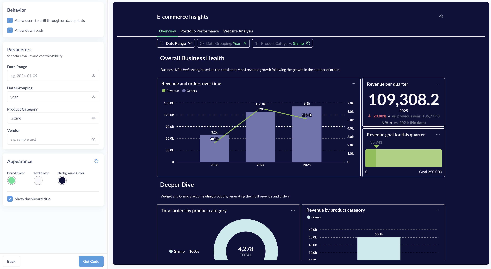

# Embedded Analytics JS

Embedded analytics JS allows you to embed Metabase entities like questions, dashboards, or even the query builder into your own application using customizable components.

Embedded Analytics JS is a JavaScript library built on top of Metabase's [Embedded Analytics React SDK](./sdk/introduction.md). But it does not require using React or setting up full SDK embedding.
Unlike with [interactive embedding](./interactive-embedding.md), where you embed the entire Metabase app in an iframe, Embedded Analytics JS lets you choose from a set of predefined components like a single chart, a dashboard with optional drill-through, or query builder, and customize those components.

Embedded Analytics JS uses [JWT](../people-and-groups/authenticating-with-jwt.md) or [SAML](../people-and-groups/authenticating-with-saml.md) to authenticate people and automatically apply the right permissions.

Currently you can choose to embed:

- A dashboard
- A question (chart). You can embed both questions built with the query builder and questions built with SQL.
- Full graphical [query builder](../questions/query-builder/editor.md) to enable people to build their own charts and explorations.

## Quickstart

### 1. Enable Embedded Analytics JS

1. In Metabase, go to **Admin Settings > Embedding > Modular embedding**.
2. Toggle on **Embedded Analytics JS**.
3. Under **Cross-Origin Resource Sharing (CORS)**, add the URLs of the websites where you want to embed Metabase (such as `https://*.example.com`). For testing embeds, you can use `localhost` which is always included in CORS policy.

### 2. Create a new embed

1. In Metabase, click on **+ New** button in top right corner and select **Embed**. Note that this will only be visible to admins.
2. Choose the type of entity to embed. Currently the available types are dashboard, question, and exploration (which will embed the Metabase query builder).
3. Next, select the entity you want to embed.

Once you selected what you want to embed, click Next to customize your embed.

### 3. Customize your embed

The exact customization options you see will depend on what type of entity you're embedding. You will see live preview of how the embed will look with your chosen options. See [Customizing embeds](#customizing-embeds) for more information on customization options.



You'll also be be able to pick brand, text, and background color used for all your embeds. To configure other colors (e.g. secondary colors, query builder colors etc), as well as font, you' can specify a theme in your embed code snippet, see [Theming](#theming).

All the customization options you select in this interactive flow will be reflected in the parameter values in the embed code, so you'll be able to adjust them later by editing the embed snippet.

Once you're done customizing your embed, click "Next".

### 4. Select authentication method

You'll get a choice between "Existing Metabase session" and "Single sign-on (SSO)".

- If you select **Existing Metabase session**, you'll be able to preview your embeds as the user you're currently logged into Metabase, and only in the same browser as your current session. Not all browsers are supported - we recommend using Google Chrome. To test out embedding in other contexts, you can use [API keys](#use-api-keys-to-test-embeds) instead. For production usage, use [SSO](#set-up-sso).

- If you set up JWT in your Metabase instance, you'll be able to select **Single sign-on (SSO)**, see [Set up SSO](#set-up-sso).

### 5. Add the embedding script into your app

Metabase will generate a code snippet that you can copy and paste into your app, see [Embed code snippets](#embed-code-snippets) for an example. You can later modify this code snippet to specify additional appearance options or change the behavior of some components.

Add the code snippet into your app, and refresh the page.

## Embed code snippets

The code snippets to embed Metabase entities using Embedded Analytics JS should have three parts:

1. Loading the Embedded Analytics JS library from your Metabase instance.
2. Global configuration settings to be used for all embeds, like the URL of your Metabase instance, appearance themes, etc. See [Configuring embeds](#configuring-embeds).
3. Components for Metabase entities to be embedded, with their parameters. See [Components](#components).

Here's an example of a script:

```html
<!-- Load embedding library -->
<!-- REPLACE WITH YOUR METABASE URL HERE -->
<script defer src="https://your-metabase-url/app/embed.js"></script>
<script>
  function defineMetabaseConfig(config) {
    window.metabaseConfig = config;
  }
</script>

<!-- Embedding configuration -->
<script>
  defineMetabaseConfig({
    instanceUrl: "https://your-metabase-url,
    theme: {
      colors: {
        background: "#ffffff",
      },
    },
  });
</script>

<!--Embedded entities -->
<metabase-question question-id="1"></metabase-question>

<metabase-dashboard dashboard-id="2" with-title="false"></metabase-dashboard>
```

Note the `defer` attribute and the reference to your Metabase URL in the script that loads `embed.js` library.

If you're embedding multiple entities on the same page, you only need to include the `<script>` tags once globally.

The code snipped for Embedded Analytics JS can also be generated interactively in Metabase through **+ New > Embed**, see [Quickstart](#quickstart).

## Customizing embeds

The exact customization options you see will depend on what type of entity you're embedding.

When you're creating a new embed using **+ New > Embed**, you'll see customization the following options in the interactive creating flow. These options correspond to parameters in components, see [Components](#components).

- **Allow users to drill through on data points**: determines whether users can interact with the chart (or charts on a dashboard). This includes drilling down to individual records from aggregated questions, filtering on click, zooming in, etc, see [Drill-through](/learn/metabase-basics/querying-and-dashboards/questions/drill-through). Disabling this option for an embedded _question_ will also disable people's ability to add filters and summaries.

- **Allow downloads**: determines whether people can download the results of questions and save the dashboard as a PDF.

- **Allow users to save new questions**: disabling this will disallow people from saving new questions. In particular, when embedding the query builder, this means that while people will be able to build their own explorations, they won't be able to save them.

- **Parameters**: for dashboard filters, SQL variables, and time grouping parameters, you can add default values. The default value you add to this option will override the default values for the parameter specified at the dashboard/question level. For dashboard filters and parameters, you can choose whether the parameter should be hidden from people viewing the dashboard.

- **Show title**: what it says on the tin.

## Configuring embeds

You can use the `defineMetabaseConfig()` function to define the configuration that applies to every embed in the page. The function `defineMetabaseConfig()` accepts the following parameters:

- `instanceUrl: "https://your-metabase-url"` (required): the URL of your Metabase instance, e.g. https://youlooknicetoday.metabaseapp.com

- `theme: {...}` (optional): appearance options for the embeds, see [Theming](#theming).

- `useExistingUserSession: true|false` (optional, for development only) - allows you to preview the embed locally by using your Metabase's admin user account session. Only supported in Google Chrome.

- `apiKey: mb_YourAPIKey` (optional, for development only) - alternative way of previewing the embeds locally using the API key.

### Theming

You can specify colors, fonts, configure spacing, etc in the `theme` parameter of the embed configuration.

For example, this will define the font, color, and size for text, color for backgrounds, and colors for filters and summaries:

```html
<script>
  defineMetabaseConfig({
    instanceUrl: "http://your-metabase-url",
    theme: {
      fontFamily: "Lato",
      fontSize: "16px",
      colors: {
        background: "#11123d",
        "text-primary": "#f9f9fc",
        brand: "#50e397",
        filter: "#7172AD",
        summarize: "#88BF4D",
      },
    },
  });
</script>
```

For the full list of theme settings, see [Appearance](./sdk/appearance.md).

## Authentication

### Use existing user session to test embeds

> Existing sessions can only be used for testing embeds locally. To make your embeds production-ready, you will need to implement SSO.

If you are signed into Metabase, you can leverage that existing session cookie to preview and test the embeds. This will only work in the same browser as you're using for your Metabase session.

To use the add `useExistingUserSession: true` to `defineMetabaseConfig()` in your embed code, see [Configuring embeds](#configuring-embeds).

```html
<script>
  defineMetabaseConfig({
    instanceUrl: "http://your-metabase-url",
    useExistingUserSession: true,
  });
</script>
```

Note that this will not work in some browsers, or in incognito mode. We recommend using Chrome if you'd like to use existing Metabase sessions to test your embeds.

### Use API keys to test embeds

> API keys can only be used for testing embeds locally. To make your embeds production-ready or deploy them to another domain, you will need to implement SSO.

To use an API key to test your embeds:

1. Create an [API key](../people-and-groups/api-keys.md)
2. Add `apiKey: "YOUR_API_KEY"` to `defineMetabaseConfig()`:

```html
<script>
  defineMetabaseConfig({
    instanceUrl: "http://your-metabase-url",
    apiKey: "mb_hopeyouhaveaniceday",
  });
</script>
```

Keep in mind that API keys should only be used for testing with trusted users. Anyone with access to the front-end can grab the API key and use it to make requests against the Metabase API. For this reason, we only allow using API keys on localhost.

### Set up SSO

SSO is required to embed in a domain other than localhost. You can use JWT or SAML SSO. To configure SAML, see (Authenticating with SAML)[./sdk/authentication#authenticating-with-saml-sso]. To configure JWT, see the steps below.

#### 1. In Metabase, configure [JWT SSO](../people-and-groups/authenticating-with-jwt.md).

#### 2. In your app's backend, add a new endpoint to handle authentication.

You’ll need add a library to your backend to sign your JSON Web Tokens.

For Node.js, we recommend jsonwebtoken:

```sh
npm install jsonwebtoken --save
```

Next, set up an endpoint on your backend (e.g., `/sso/metabase`) that uses your Metabase JWT shared secret to generate a JWT for the authenticated user. **This endpoint must return a JSON object with a `jwt` property containing the signed JWT.** For example: `{ "jwt": "your-signed-jwt" }`.

This example code for Node.js sets up an endpoint using Express:

```js
import express from "express";
import cors from "cors";
import session from "express-session";
import jwt from "jsonwebtoken";
import fetch from "node-fetch";

// Replace this with your Metabase URL
const METABASE_INSTANCE_URL = "YOUR_METABASE_URL_HERE";
// Replace this with the JWT signing secret you generated when enabling
// JWT SSO in your Metabase.
const METABASE_JWT_SHARED_SECRET = "YOUR_SECRET_HERE";

const app = express();

app.get("/sso/metabase", async (req, res) => {
  // Usually, you would grab the user from the current session
  // Here it's hardcoded for demonstration purposes
  // Example:
  // const { user } = req.session;
  const user = {
    email: "rene@example.com",
    firstName: "Rene",
    lastName: "Descartes",
    group: "Customer",
  };

  if (!user) {
    console.log("no user");
    res.status(401).json({
      status: "error",
      message: "not authenticated",
    });

    return;
  }

  const token = jwt.sign(
    {
      email: user.email,
      first_name: user.firstName,
      last_name: user.lastName,
      groups: [user.group],
      exp: Math.round(Date.now() / 1000) + 60 * 10, // 10 minutes expiration
    },
    METABASE_JWT_SHARED_SECRET,
  );
  // The user backend should return a JSON object with the JWT.
  res.status(200).json({ jwt: token });
});
```

See more examples in the [Embedding SDK docs](./sdk/authentication.md#2-add-a-new-endpoint-to-your-backend-to-handle-authentication).

#### 3. Embeds will use SSO automatically by default

Metabase will use JWT SSO by default if no other auth method is specified. Make sure you don't use `apiKey` or `useExistingUserSession` in your configuration to enable SSO use.

## Components

There are different components available that enable different experiences for the end-user.

> While you can use some component parameters to show or hide part of the embedded component, these parameters are not a substitute for setting up to prevent unwanted access to data or collections. Use these options as a way to streamline the user experience. Users could obtain their token from the front-end and use it to query the Metabase API.

### Dashboard

```html
<metabase-dashboard dashboard-id="1" with-title="true" with-downloads="false">
</metabase-dashboard>
```

Renders a dashboard.

**Required parameters:**

- `dashboard-id` - This can be a regular ID or an entity ID. [Using Entity IDs](../installation-and-operation/serialization.md#entity-ids-work-with-embedding) in your embeds will ensure sure that the IDs are stable when exporting from one Metabase and importing to another Metabase.

**Optional parameters:**

- `with-title` (default is true) - show dashboard title in the embed
- `with-downloads` (default is false) - show the button to download dashboard as PDF, and download results of questions
- `drills` (default is true) - lets you drill-through the dashboard
- `initial-parameters` - default value for dashboard filters, e.g. `{ 'productId': '42' }`.

  Make sure to use single quotes if you are surrounding your attribute value with double quotes:

  ```html
  <metabase-dashboard
    dashboard-id="1"
    initial-parameters="{ 'productId': '42' }"
  ></metabase-dashboard>
  ```

- `hidden-parameters` - list of filter names to hide from the dashboard, e.g. `['productId;]`

  Make sure to use single quotes if you are surrounding your attribute value with double quotes:

  ```html
  <metabase-dashboard
    dashboard-id="1"
    hidden-parameters="['productId']"
  ></metabase-dashboard>
  ```

### Question

```html
<metabase-question question-id="1"></metabase-question>
```

Renders a question (chart).

**Required parameters:**

- `question-id` - This can be a regular ID or an entity ID. [Using Entity IDs](../installation-and-operation/serialization.md#entity-ids-work-with-embedding) in your embeds will ensure sure that the IDs are stable when exporting from one Metabase and importing to another Metabase.

  Use `question-id="new"` to embed the query builder exploration interface.

**Optional parameters:**

- `drills` (default is true) - lets you drill-through the question
- `with-title` (default is true) - render the title or not
- `with-downloads` (default is false) - render the downloads or not
- `initial-sql-parameters` - default value for SQL parameters, only applicable to native SQL questions. e.g. `{ "productId": "42" }`
- `is-save-enabled` (default is false)
- `target-collection` - this is to enforce saving into a particular collection. Values: regular ID, entity ID, `"personal”`, `"root”`
