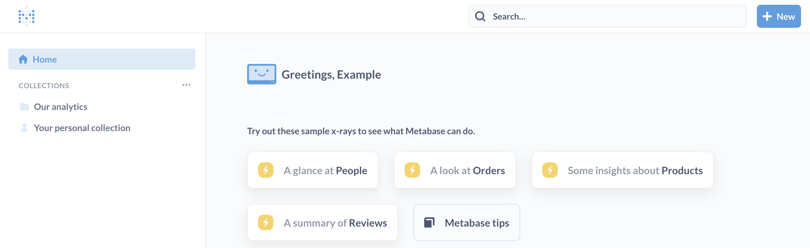

# Embedding all of Metabase in your web app



The open-source edition of Metabase allows you to [embed standalone charts or dashboards](./introduction.md) in your own web applications for simple situations. But what if you want to provide your users with a more interactive, browsable experience? Some plans allow you to embed the entire Metabase app within your own web app, allowing you to provide [drill-through](https://www.metabase.com/learn/basics/questions/drill-through.html) for your embedded charts and dashboards, or even embed the graphical query builder, or collections of dashboards and charts.

You'll be putting the whole Metabase app into an iframe, and the SSO integration you've set up with Metabase will be used to make sure the embedded Metabase respects the collection and data permissions you've set up for your user groups. Clicking on charts and graphs in the embed will do just what they do in Metabase itself. You can even display a specific Metabase collection in an embed to allow your users to browse through all the dashboards and questions that you've made available to them. The only difference is that Metabase's top nav bar and global search will not be rendered in your iframe.

## What you'll be doing

To get this going, you're going to need:

- A [paid plan of Metabase](https://www.metabase.com/pricing) that includes full-app embedding.
- A separate web application that you want to embed your dashboards and charts in.

## Enabling embedding in Metabase

First, let's enable embedding in your Metabase instance. Go to the Admin Panel, and under Settings, go to the “Embedding in other applications” tab. From there, click “Enable.”

Once you do, you'll see a set of options:

- **Embedding secret key:** You can ignore this setting, which is only for standalone chart or dashboard embeds.

- **Embedding the entire Metabase app:** Here's where you'll enter the base URLs of the web applications that you want to allow to embed Metabase. This value will be used to populate the `Content-Security-Policy` HTTP header's [`frame-ancestors` directive](https://developer.mozilla.org/en-US/docs/Web/HTTP/Headers/Content-Security-Policy/frame-ancestors), and should follow the same format.
  For example, `https://*.metabase.com http://my-web-app.example.com:8080/`. Leaving this empty will default to a `frame-ancestors` value of `'none'`.
  If you're a fancy person, you can specify this URL in the environment variable [`MB_EMBEDDING_APP_ORIGIN`](../operations-guide/environment-variables.md#mb_embedding_app_origin).

### Note on incognito mode

Some browsers, like Chrome, disable `localStorage` in Incognito mode, so people won't be able to login via FullApp embedded iframe unless they explicitly allow cookies from Metabase. You may want to remind Chrome users to go to chrome://settings/cookies and add the Metabase Site URL under "Sites that can always use cookies".

## Setting things up in your web app

To give you a picture of what you'll need to do in your app, we've created this [reference app](https://github.com/metabase/sso-examples/tree/master/app-embed-example). If you use React in your application, [this React component](https://github.com/metabase/sso-examples/blob/master/app-embed-example/src/MetabaseAppEmbed.js) may be helpful.

The main elements you'll need to embed Metabase in your app are:

- An SSO authentication endpoint in your application, typically JWT or SAML, and Metabase configured to use them.
- An `<iframe>` element in your application, with the `src` attribute set to either a URL in Metabase (e.x. `http://metabase.yourcompany.com/dashboard/1`), or directly to the authentication endpoint in your application, with a parameter specifying where to redirect back to (e.x. `http://yourcompany.com/api/auth?redirect=http%3A%2F%2Fmetabase.yourcompany.com%2Fdashboard%2F1`). The latter will avoid an extra redirect if the user has not been authenticated.
- Optional: when the embedding website is hosted under a domain _other_ than the one your Metabase instance is hosted under, you may need to set the environment variable `MB_SESSION_COOKIE_SAMESITE=None`. Setting the variable to `None` requires you to use HTTPS in Metabase, otherwise browsers will reject the request. Other options for the SameSite variable are `Lax` (default) or `Strict`. Visit MDN to learn more about [SameSite cookies](https://developer.mozilla.org/en-US/docs/Web/HTTP/Headers/Set-Cookie/SameSite).
- Optional: JavaScript using [postMessage](https://developer.mozilla.org/en-US/docs/Web/API/Window/postMessage) in your application for enabling communication to and from the embedded Metabase. Here are the types of `postMessage` messages we currently support:

## Supported `postMessage` messages _from_ embedded Metabase:

- `frame` message with `normal` mode: the current page in the embedded Metabase will fill whatever size `iframe` it is displayed in, e.x. the `/question` pages:

  { "metabase": { "type": "frame", "frame": { "mode": "normal" }}}

- `frame` message with `fit` mode: the current page in the embedded Metabase expects a specific aspect ratio, e.x. `/dashboard` pages, so the `iframe` should be set to specified height if you don't want it to scroll:

  { "metabase": { "type": "frame", "frame": { "mode": "fit", height: HEIGHT_IN_PIXELS }}}

- `location` message: the embedded Metabase changed URLs. Use this for deep-linking, etc (`location` mirrors `window.location`):

  { "metabase": { "type": "location", "location": LOCATION_OBJECT }}

## Supported `postMessage` messages _to_ embedded Metabase:

- `location` message: change the URL of the embedded Metabase:

  { "metabase": { "type": "location", "location": LOCATION_OBJECT_OR_URL }}

## Overriding selected full-app components with parameters

You can add query parameters to the URL to toggle various full-app features.

E.g., the URL

```
http://localhost:3000/?top_nav=false&side_nav=false
```

would disable the top and side nav:


### `top_nav`

Entire top navigation bar, with optional search and new button.


The top bar is hidden by default. Additionally, if you enable the top bar (`top_nav=true`), you can turn on other hidden-by-default top bar options:

- `search`: Search bar within the top nav.
- `new_button`: “New” CTA that lets users create questions and more.

### `side_nav`

The main navigation bar.



The navigation sidebar is hidden by default, aside from `/collection` and home page product routes. If you want people to be able to minimize the sidebar, you MUST enable the `top_nav`.

### `header`

The header, visible by default, only applies to dashboards and questions. The header refers to the info and buttons above a question or dashboard. The header includes the title, additional info, and the action buttons (Filter and Summarize).

If you enable the header, these sub-components are visible by default:

#### `additional_info`

Applicable to dashboards and questions. Refers to the gray text “Edited X days ago by FirstName LastName”, as well as the collection, database, and table information.


#### `action_buttons`

Applicable to questions. Refers to the **Save**, **Summarize**, and **Filter** action buttons, as well as the icon to bring up the query builder.


## Choosing what to embed

The exact next steps will differ depending on your specific needs and goals, but the basic tool you have at hand now is that you can make any link in your web app render a particular page from your Metabase instance.

So if you have for example a "Stats" or "Analytics" page in your web app, you could have that page display one of your Metabase dashboards. What's powerful about this type of embedding vs. standalone chart or dashboard embeds though is that your users will be able to click on the individual charts in that dashboard to see them in more detail, and further explore them using drill-through, or even Metabase's graphical query builder.

## A note on drill-through and permissions

One of the main differences between embedding the full Metabase app vs. standalone embeds is that charts and graphs will have drill-through enabled. This lets your users click on charts to zoom in, pivot, and generally explore more.

### What does drill-through let my users do exactly?

When clicking on any part of a chart — like a dot, bar, slice, or state — your users will see the drill-through action menu.


This will let them do things like:

- See the unaggregated rows for that point on the chart.
- Zoom in on the clicked point on a time series
- Pivot or break out the clicked point by an available dimension to see a new chart
- Use the X-ray or Comparison actions, if you haven't turned X-rays off in the Admin Panel, which will display an automatic analysis of the clicked point.

Drill-through also allows users to click on the title of a chart in a dashboard to see the detail view of that question. From the detail view, if they have data permissions, they can use Metabase's graphical query editor to explore further. If they've been given SQL editor permissions, they can also view the SQL for the question and edit it to explore more.

Depending on the collections permissions you set, your users can also save their explorations into collections. If you want to allow them to find these saved explorations, make sure your web application implements a link to view the collections directory.

Check out our article, [Create charts with explorable data](https://www.metabase.com/learn/basics/questions/drill-through.html).

### Using SSO to apply data or collection permissions to embeds

If you're using SSO to authenticate users in your web app and you've also connected your SSO to Metabase, users who authenticate into your web application will automatically have their Metabase group permissions applied when viewing the dashboards, charts, or collections you embed. This means that once you've set up sandboxes and data and collection permissions in Metabase, you don't need to think about what your web app users can see when exploring.

## Suggestions for Securing Embeds

Currently we use HTTP cookies to authenticate embedded Metabase users. A limitation of this is that the embedded Metabase is not automatically logged out when the user closes or logs out of the embedding application. For this reason you may want to set Metabase's `MAX_SESSION_AGE` environment variable to a smaller number of minutes than the default of 20,160 (two weeks), or set `MB_SESSION_COOKIES=true` to cause the cookies to be removed when the browser is exited. Also, you can force Metabase to log out by loading "https://metabase.yourcompany.com/auth/logout" (for example, in a hidden iframe on the logout page of your application).

When signing JWTs for either SSO (i.e., in full-app embedding) or standalone question/dashboard embedding, you should always include an expiration time `exp` property appropriate for your application. For SSO it can be very short (e.g., 1 minute) as the token is immediately used to create a session. For embedding it can be short if there are no parameters you expect the user to change, otherwise it should be as long as you expect the user to view and change parameters.

## Further reading

- [White labeling](whitelabeling.md)
- [Deliver analytics to your customers](https://www.metabase.com/learn/building-analytics/dashboards/linking-filters.html)
- [Embed Metabase in your app to deliver multi-tenant, self-service analytics](https://www.metabase.com/learn/developing-applications/advanced-metabase/multi-tenant-self-service-analytics.html)
- [Create charts with explorable data](https://www.metabase.com/learn/developing-applications/advanced-metabase/multi-tenant-self-service-analytics.html)
