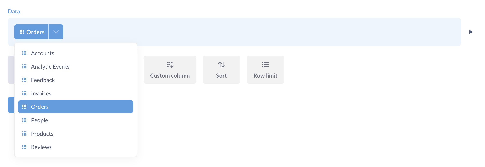
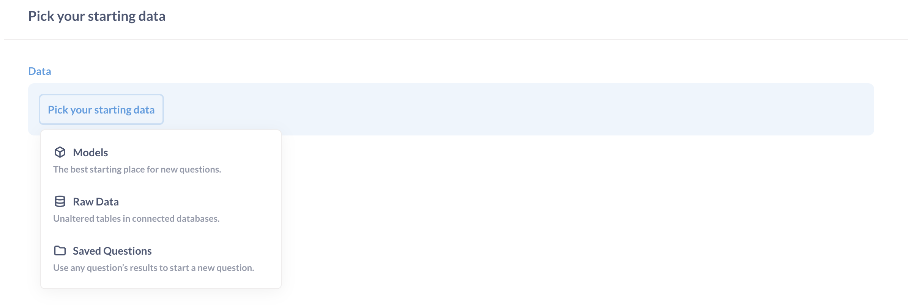
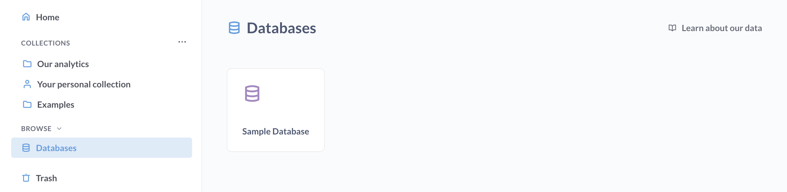

# Full app embedding UI components



To change the interface of your full app embed, you can add parameters to the end of your embedding URL. If you want to change the colors or fonts in your embed, see [Customizing appearance](../configuring-metabase/appearance.md).

> For more granular control of embedded components, consider using [Modular embedding](./modular-embedding.md) instead of full app embedding - it's an improved, more customizable option for embedding Metabase elements.

For example, you can disable Metabase's [top nav bar](#top_nav) and [side nav menu](#side_nav) like this:

```
your_embedding_url?top_nav=false&side_nav=false
```


Here's an example using the URL constructor to add parameters to the URL for the iframe:

```tsx
const mods = "logo=false&top_nav=true&search=true&new_button=true";

app.get("/sso/metabase", restrict, (req, res) => {
  const ssoUrl = new URL("/auth/sso", METABASE_SITE_URL);
  ssoUrl.searchParams.set("jwt", signUserToken(req.session.user));
  ssoUrl.searchParams.set("return_to", `${req.query.return_to ?? "/"}?${mods}`);

  res.redirect(ssoUrl);
});
```

Parameters include:

- [Action buttons](#action_buttons)
- [Additional info](#additional_info)
- [Breadcrumbs](#breadcrumbs)
- [Entity types](#entity_types)
- [Header](#header)
- [Locale](#locale)
- [Logo](#logo)
- [New button](#new_button)
- [Search](#search)
- [Side nav](#side_nav)
- [Top nav](#top_nav)

> To make sure that query parameters are preserved when using [click behavior](../dashboards/interactive.md#customizing-click-behavior), configure the [Site URL](../configuring-metabase/settings.md#site-url) Admin setting to be your Metabase server URL.

## `action_buttons`

Visible by default on question pages when the [header](#header) is enabled.

To hide the action buttons such as **Filter**, **Summarize**, the query builder button, and so on:

```
header=false&action_buttons=false
```


## `additional_info`

Visible by default on question and dashboard pages when the [header](#header) is enabled.

To hide the gray text "Edited X days ago by FirstName LastName", as well as the breadcrumbs with collection, database, and table names:

```
header=false&additional_info=false
```


## `breadcrumbs`

Shown by default in the top nav bar. Collection breadcrumbs show the path to the item (i.e., the collection(s) the item is in). This does not effect Data breadcrumbs if the user has Query Builder permissions. To hide the breadcrumbs:

```
breadcrumbs=false
```

## `data_picker`

`data_picker` controls the menu for selecting data sources in questions.



The default behavior for the data picker is:

- Show tables and models.
- Exclude metrics and questions.
- Display a simple dropdown menu. If there are 100 or more items, Metabase will display a souped-up data picker.

You can opt for the full data picker by setting `data_picker=staged`:



The above data picker has three entity types selected:

```
data_picker=staged&entity_types=table,model,question
```

## `entity_types`

You can show or hide different entity types in the data picker, sidebar, and the New button menu. For example, you may only want to show tables:

```
entity_types=table
```

If only tables are allowed, the sidebar won't show models:



Available entity types are:

- `table`
- `model`
- `question` (only works with `data_picker=staged`)

You can separate entity types with a comma:

```
entity_types=table,model
```

## `header`

Visible by default on question and dashboard pages.

To hide a question or dashboard's title, [additional info](#additional_info), and [action buttons](#action_buttons):

```
header=false
```

## `locale`

You can change the language of the user interface via a parameter. For example, to set the locale to Spanish:

```
locale=es
```

Read more about [localization](../configuring-metabase/localization.md).

## `logo`

Whether to show the logo that opens and closes the sidebar nav. Default is true. The logo's behavior depends on the `side_nav` setting:

| `logo` | `side_nav` | Result                                                                |
| ------ | ---------- | --------------------------------------------------------------------- |
| true   | true       | Shows your configured logo in the sidebar                             |
| true   | false      | No sidebar or logo functionality                                      |
| false  | true       | Shows a generic sidebar icon (gray when normal, brand color on hover) |
| false  | false      | No sidebar or logo, with breadcrumbs aligned to the left edge         |

## `new_button`

Hidden by default. To show the **+ New** button used to create queries or dashboards:

```
top_nav=true&new_button=true
```

## `search`

Hidden by default. To show the search box in the top nav:

```
top_nav=true&search=true
```

## `side_nav`

The navigation sidebar is shown on `/collection` and home page routes, and hidden everywhere else by default.

To allow people to minimize the sidebar:

```
top_nav=true&side_nav=true
```


## `top_nav`

Shown by default. To hide the top navigation bar:

```
top_nav=false
```


The `top_nav` parameter controls the visibility of the entire top navigation bar. When `top_nav` is set to `false`, all child elements (`search`, `new_button`, and `breadcrumbs`) are automatically hidden. When `top_nav` is set to `true`, you can individually control the visibility of these child elements.
