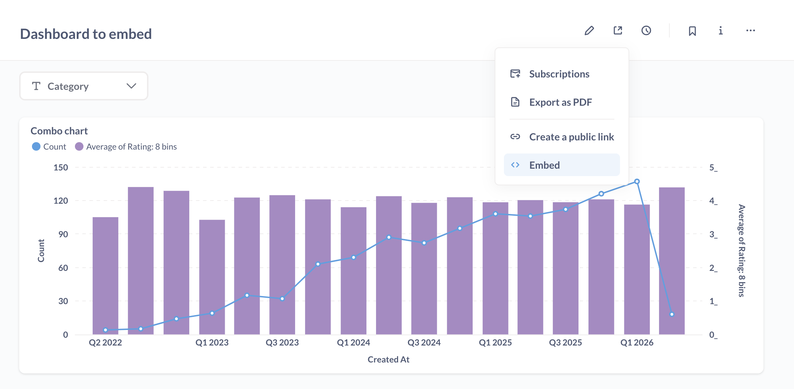

# Guest embeds



Guest embeds are a way to embed basic Metabase components in your app without requiring you to create a Metabase account for each person viewing the charts and dashboards. But not logging people in to your Metabase has some major tradeoffs: see [limitations](#guest-embed-limitations).

Even though you're not using SSO, guest embeds are still secure: Metabase will only load the embed if the request has a JWT signed with the secret shared between your app and your Metabase. The JWT also includes a reference to the resource to load (like the ID of the embedded item), and any values for parameters.

To restrict data in guest embeds for specific people or groups, use [locked parameters](#locked-parameters).

## Turning on guest embedding in Metabase

The path to embedding settings depends on your Metabase version:

- **OSS**: **Admin settings > Embedding**
- **Starter/Pro/Enterprise**: **Admin settings > Embedding > Guest embeds**

Toggle **Enable guest embeds**.

## Creating a guest embed



To create a guest embed:

1. Go to the item that you want to embed in your website. You can also open a command palette with Ctrl/Cmd+K and type "New embed".
2. Click the **sharing icon**.
3. Select **Embed**.
4. Under **Authentication**, select **Guest**.
5. Optional: [customize the appearance of the embed](./appearance.md)
6. Optional: [Add parameters to the embed](./components.md).
7. Click **Publish**.
8. Get the code snippet that the wizard generates and add it to your app.


## Notes on the code the wizard generates

You can edit the code (see [components](./components.md) and [appearance](./appearance.md)). But here's an overview of the code the wizard generates, and where to put it.

### Client-side code

Add the embed script and configuration to your HTML:

```html
<script defer src="YOUR_METABASE_URL/app/embed.js"></script>
<script>
  window.metabaseConfig = {
    isGuest: true,
    instanceUrl: "YOUR_METABASE_URL",
  };
</script>
```

Then add the component for the item you want to embed:

```html
<!-- For dashboards -->
<metabase-dashboard
  token="YOUR_JWT_TOKEN"
  with-title="true"
  with-downloads="false"
  initial-parameters='{"category":["Gizmo"]}'
></metabase-dashboard>

<!-- For questions -->
<metabase-question token="YOUR_JWT_TOKEN"></metabase-question>
```

> Never hardcode JWT tokens directly in your HTML. Always fetch the token from your backend and pass the token to the web component programmatically.

### Server-side code

Your server generates signed JWT tokens that authenticate the embed request. Here's an example using Node.js:

```javascript
const jwt = require("jsonwebtoken");

const METABASE_SECRET_KEY = "YOUR_METABASE_SECRET_KEY";

const payload = {
  resource: { dashboard: 10 }, // or { question: 5 } for questions
  params: {},
  exp: Math.round(Date.now() / 1000) + 10 * 60, // 10 minute expiration
};

const token = jwt.sign(payload, METABASE_SECRET_KEY);
```

Replace `YOUR_METABASE_SECRET_KEY` with your [embedding secret key](#regenerating-the-embedding-secret-key).

### Component attributes

You can set different attributes to enable/disable UI. Here are some example attributes:

| Attribute            | Description                                                           |
| -------------------- | --------------------------------------------------------------------- |
| `token`              | Required. The signed JWT token from your server.                      |
| `with-title`         | Show or hide the title. Values: `"true"` or `"false"`.                |
| `with-downloads`\*   | Enable or disable downloads. Values: `"true"` or `"false"`.           |
| `initial-parameters` | JSON string of parameter values. Example: `'{"category":["Gizmo"]}'`. |

\* Disabling downloads is only available on [Pro](https://www.metabase.com/product/pro) and [Enterprise](https://www.metabase.com/product/enterprise) plans.

Attributes will differ based on the type of thing you're embedding. Guest embeds have fewer options than embeds that use SSO. See more on [components and their attributes](./components.md).

### Customizing appearance of guest embeds

Appearance settings available for guest embeds depend on your Metabase plan. If you're running Metabase OSS/Starter, you can select light or dark theme. If you're running Metabase Pro/Enterprise, you'll have access to granular customization options, see [Appearance](./appearance.md).

## Configuring parameters

Parameters are disabled by default, which also makes them hidden from end-users. You can configure each parameter to be:

- **Disabled**: Hidden from end-users. Can't be set. This is the default.
- **[Editable](#editable-parameters)**: End-users can see and modify the parameter values.
- **[Locked](#locked-parameters)**: Hidden from end-users, set by your server (not the end-users) via the JWT.

To configure parameters:

1. Go to your embedded question or dashboard.
2. Click the **sharing icon** and select **Embed**.
3. Under **Parameters**, select the visibility option for each parameter, and optionally default value(s).
4. Click **Publish**.

### Editable parameters

When you set Editable parameters, you can set default values for the filters, but users can change these when viewing the question or dashboard.

**Server code**

On the server, you pass an empty `params` object:

```javascript
// you will need to install via 'npm install jsonwebtoken' or in your package.json

const jwt = require("jsonwebtoken");

const METABASE_SECRET_KEY = "YOUR_METABASE_SECRET_KEY";

const payload = {
  resource: { dashboard: 10 },
  params: {},
  exp: Math.round(Date.now() / 1000) + 10 * 60, // 10 minute expiration
};
const token = jwt.sign(payload, METABASE_SECRET_KEY);
```

**Client code**

You set default parameters on the client side with the `initial-parameters` key.

```html
<script defer src="YOUR_METABASE_URL/app/embed.js"></script>
<script>
  function defineMetabaseConfig(config) {
    window.metabaseConfig = config;
  }
</script>

<script>
  defineMetabaseConfig({
    isGuest: true,
    instanceUrl: "YOUR_METABASE_URL",
  });
</script>

<!--
THIS IS THE EXAMPLE!
NEVER HARDCODE THIS JWT TOKEN DIRECTLY IN YOUR HTML!

Fetch the JWT token from your backend and programmatically pass it to the 'metabase-dashboard'.
-->
<metabase-dashboard
  token="YOUR SIGNED TOKEN"
  with-title="true"
  with-downloads="false"
  initial-parameters='{"category":["Doohickey","Gizmo"]}'
>
</metabase-dashboard>
```

### Locked parameters

Locked parameters let you filter data without exposing the filter to the end-user. This is useful for restricting data based on who's viewing the embed (for example, showing each customer only their own data).

To use locked parameters, you need to:

1. Set the parameter to **Locked** in the embed settings.
2. Include the parameter value in your JWT token on the server.
3. Publish the item.

Here's an example of the server and client code that Metabase will generate if you lock a "category" parameter:

**Server code (Node.js)**

You set the locked parameter on the server, passing it in the token.

```javascript
// Install via 'npm install jsonwebtoken'
const jwt = require("jsonwebtoken");

const METABASE_SECRET_KEY = "YOUR_METABASE_SECRET_KEY";

const payload = {
  resource: { dashboard: 10 },
  params: {
    category: ["Gadget"], // Set the locked parameter value to Gadget
  },
  exp: Math.round(Date.now() / 1000) + 10 * 60, // 10 minute expiration
};

const token = jwt.sign(payload, METABASE_SECRET_KEY);
```

**Client code (HTML)**

The parameter is set by the JWT:

```html
<script defer src="YOUR_METABASE_URL/app/embed.js"></script>
<script>
  window.metabaseConfig = {
    isGuest: true, // Must be set to guest
    instanceUrl: "YOUR_METABASE_URL",
  };
</script>

<!--
IMPORTANT: Never hardcode JWT tokens directly in your HTML!
Fetch the token from your backend and pass it to the component programmatically.
-->
<metabase-dashboard
  token="YOUR_JWT_TOKEN"
  with-title="true"
  with-downloads="false"
></metabase-dashboard>
```

The end user won't see the "category" filter, but the dashboard will only show data for the "Gadget" category (or whatever you passed to the "category" array in the `params` object in the server payload you used to sign the JWT).

## Disabling embedding for a question or dashboard

1. Visit the embeddable question or dashboard.
2. Click the **sharing icon** (square with an arrow pointing to the top right).
3. Select **Embed**.
4. Select **Guest embedding**
5. Click **Unpublish**.

Admins can find a list of embedded items in **Admin settings > Embedding** (on Pro and Enterprise plans, check the **Guest embeds** tab).

## Removing the "Powered by Metabase" banner


The banner appears on guest embeds created with Metabase's open-source version. To remove the banner, you'll need to upgrade to a [Pro](https://www.metabase.com/product/pro) or [Enterprise](https://www.metabase.com/product/enterprise) plan.

## Regenerating the embedding secret key

Your embedding secret key is used to sign JWTs for all of your embeds.

1. Go to **Admin settings > Embedding**. On Pro and Enterprise plans, check the **Guest embeds** tab.
2. Under **Regenerate secret key**, click **Regenerate key**.

This key is shared across all guest embeds. Whoever has access to this key could get access to all embedded artifacts, so keep this key secure. If you regenerate this key, you'll need to update your server code with the new key.

## Custom destinations on dashboards in guest embeds

You can only use the **URL** option for [custom destinations](../dashboards/interactive.md#custom-destinations) on dashboards with guest embedding. External URLs will open in a new tab or window.

You can propagate filter values into the external URL, unless the filter is locked.

## Translating embeds

To translate an embed, set the `locale` in `window.metabaseConfig`:

```html
<script>
  window.metabaseConfig = {
    isGuest: true,
    instanceUrl: "YOUR_METABASE_URL",
    locale: "es",
  };
</script>
```

The `locale` setting works for all modular embeds (guest, SSO, and SDK). Metabase will automatically translate UI elements (like menus and buttons). To also translate content like dashboard titles and filter labels, you'll need to upload a [translation dictionary](./translations.md).

## How guest embedding works

Guest embeds use web components (`<metabase-dashboard>` and `<metabase-question>`) that communicate with your Metabase instance. Each embed request requires a JWT token signed with your secret key.

When a visitor views your page:

1. Your server generates a signed JWT token containing the resource ID (dashboard or question) and any locked parameters.
2. The web component sends the token to Metabase.
3. Metabase verifies the JWT signature using your secret key.
4. If valid, Metabase returns the embedded content.

For interactive filters, you can pass initial parameter values via the `initial-parameters` attribute. When a visitor changes a filter, the web component handles the update automatically.

The signed JWT is generated using your [Metabase secret key](#regenerating-the-embedding-secret-key). The secret key tells Metabase that the request can be trusted. Note that this secret key is shared for all guest embeds, so whoever has access to that key will have access to all embedded artifacts.

If you want to embed charts with additional interactive features, like [drill-down](https://www.metabase.com/learn/metabase-basics/querying-and-dashboards/questions/drill-through) and [self-service querying](../questions/query-builder/editor.md), see [Modular embedding](./modular-embedding.md).

## Using guest embeds with the SDK

If you're using the [Modular Embedding SDK](./sdk/introduction.md), and you also want to embed a question or dashboard using guest authentication, you'll still need to visit the item in your Metabase and publish the item. You can ignore the code the wizard generates, but in order for Metabase to know it's okay to serve the item, you need to publish it.

One limitation, however, is that you can only have one type of authentication per page of your app. For example, on a single page in your app, you can't have both one question using guest authentication and another question using SSO.

## Guest embed limitations

Because guest embeds don't require you to create a Metabase account for each person via SSO, Metabase can't know who is viewing the embed, and therefore can't give them access to all their data and all the cool stuff Metabase can do.

Guest embeds can't take advantage of:

- [Row and column security](../permissions/row-and-column-security.md)
- [Database routing](../permissions/database-routing.md)
- [Drill-through](https://www.metabase.com/learn/metabase-basics/querying-and-dashboards/questions/drill-through)
- [Usage analytics](../usage-and-performance-tools/usage-analytics.md)
- [Query builder](../questions/query-builder/editor.md)
- [AI chat](./sdk/ai-chat.md)

For those features, check out [Modular embedding with SSO](./modular-embedding.md).

## Further reading

- [Reference apps repo](https://github.com/metabase/embedding-reference-apps).
- [Strategies for delivering customer-facing analytics](https://www.metabase.com/learn/metabase-basics/embedding/overview).
- [Publishing data visualizations to the web](https://www.metabase.com/learn/metabase-basics/embedding/charts-and-dashboards).
- [Customizing Metabase's appearance](../configuring-metabase/appearance.md).
