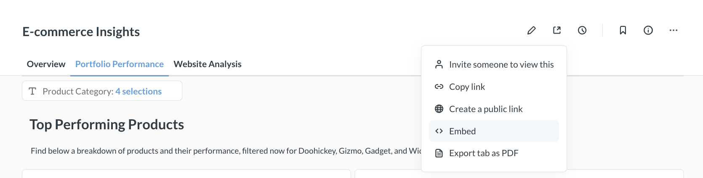
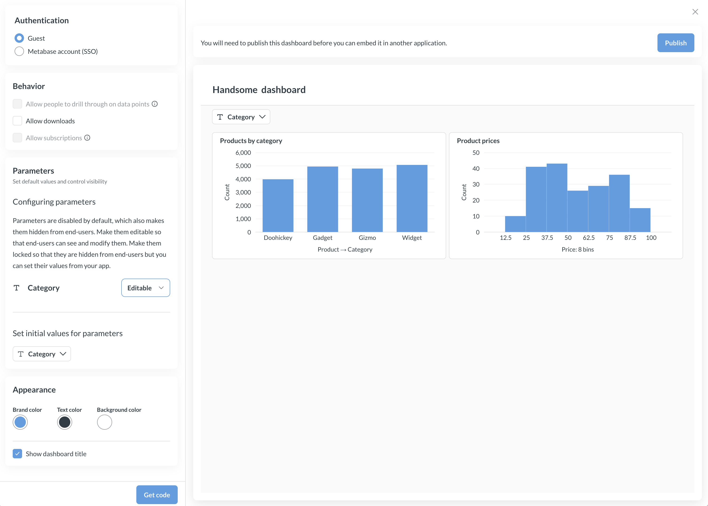

# Guest embeds

Guest embeds are a way to embed basic Metabase components in your app without requiring you to create a Metabase account for each person viewing the charts and dashboards. But not logging people in to your Metabase has some major tradeoffs: see [limitations](#guest-embed-limitations).

> Looking for static embedding? It's deprecated in favor of guest embeds. Check out [Static embedding is deprecated](./introduction.md#static-embedding-is-deprecated).

"Guest" refers to the authentication approach: Metabase doesn't create a session for each person. Authentication has nothing to do with data freshness. Dashboards and charts in guest embeds always show live data from your database.

Even though you're not using SSO, guest embeds are still secure: Metabase will only load the embed if the request has a JWT signed with the secret shared between your app and your Metabase. The JWT also includes a reference to the resource to load (like the ID of the embedded item), and any values for parameters.

To restrict data in guest embeds for specific people or groups, use [locked parameters](#locked-parameters).

## Turning on guest embedding in Metabase

The path to embedding settings depends on your Metabase version:

- **OSS**: **Admin > Embedding**
- **Starter/Pro/Enterprise**: **Admin > Embedding > Guest embeds**

Toggle **Enable guest embeds**.

## Creating a guest embed



To create a guest embed:

1. Go to the item that you want to embed in your website. You can also open a command palette with Ctrl/Cmd+K and type "New embed".
2. Click the **Share** icon.
3. Select **Embed**.
4. Under **Authentication**, select **Guest**.
5. Optional: [customize the appearance of the embed](./appearance.md)
6. Optional: [set the visibility of each parameter](#configuring-parameters).
7. Click **Publish**.
8. Get the code snippet that the wizard generates and add it to your app.



## Notes on the code the wizard generates

You can edit the code (see the [question component reference](./question-reference.md), the [dashboard component reference](./dashboard-reference.md), and [appearance](./appearance.md)). But here's an overview of the code the wizard generates, and where to put it.

### Client-side code

Add the embed script and configuration to your HTML:

```html
<script defer src="YOUR_METABASE_URL/app/embed.js"></script>
<script>
  window.metabaseConfig = {
    isGuest: true,
    instanceUrl: "YOUR_METABASE_URL",
    // Optional. Set this if you want the embed to fetch a fresh JWT
    // when the current one expires. See "Refreshing the JWT" below.
    // guestEmbedProviderUri: "/your/apps/endpoint",
  };
</script>
```

Then add the component for the item you want to embed:

```html
<!-- For dashboards -->
<metabase-dashboard
  token="YOUR_JWT_TOKEN"
  with-title="true"
  with-downloads="false"
  initial-parameters='{"category":["Gizmo"]}'
></metabase-dashboard>

<!-- For questions -->
<metabase-question token="YOUR_JWT_TOKEN"></metabase-question>
```

> Don't paste a fixed JWT into your HTML and leave it there. Tokens expire, so that embed will stop working. Either sign a fresh token on your server for each page load and render it into the `token` attribute, or set [`guestEmbedProviderUri`](#refreshing-or-initializing-the-jwt-from-your-server) and let the embed fetch and refresh its own token.

### Server-side code

Your server generates signed JWT tokens that authenticate the embed request. Here's an example using Node.js:

```javascript
const jwt = require("jsonwebtoken");

const METABASE_SECRET_KEY = "YOUR_METABASE_SECRET_KEY";

const payload = {
  resource: { dashboard: 10 }, // or { question: 5 } for questions
  params: {},
  exp: Math.round(Date.now() / 1000) + 10 * 60, // 10 minute expiration
};

const token = jwt.sign(payload, METABASE_SECRET_KEY);
```

Replace `YOUR_METABASE_SECRET_KEY` with your [embedding secret key](#regenerating-the-embedding-secret-key). These examples use sequential IDs — the number in the item's URL. On Pro and Enterprise plans, you can use [entity IDs](../installation-and-operation/serialization.md#entity-ids-work-with-embedding) instead; they stay the same when you [serialize](../installation-and-operation/serialization.md) content from one Metabase to another, like from staging to production. To use an entity ID, replace the sequential ID in the `resource` map with the item's entity ID, like `resource: { dashboard: "YOUR_ENTITY_ID" }`. If you don't serialize your Metabase, either ID works.

### Component attributes

You can set different attributes to enable/disable UI. Here are some example attributes:

| Attribute               | Description                                                                                                                                                                                                                                                                      |
| ----------------------- | -------------------------------------------------------------------------------------------------------------------------------------------------------------------------------------------------------------------------------------------------------------------------------- |
| `token`                 | Required. The signed JWT token from your server.                                                                                                                                                                                                                                 |
| `with-title`            | Show or hide the title. Values: `"true"` or `"false"`.                                                                                                                                                                                                                           |
| `with-downloads`\*      | Enable or disable downloads. Values: `"true"` or `"false"`.                                                                                                                                                                                                                      |
| `initial-parameters`    | JSON (or JSON5) string of starting parameter values (uncontrolled). Example: `'{"category":["Gizmo"]}'`. See [Embedding parameters](./parameters.md#set-starting-values).                                                                                                        |
| `parameters`            | JSON (or JSON5) string of parameter values (controlled). Example: `'{"category":["Gizmo"]}'`. See [Embedding parameters](./parameters.md#control-values-from-your-app).                                                                                                          |
| `hidden-parameters`     | JSON array of slugs whose widgets to hide. Only **Editable** parameters have a widget on a guest embed, so the wizard won't generate this for you. Hiding a widget doesn't restrict the value. See [Hide parameter widgets](./parameters.md#hide-parameter-widgets).             |
| `auto-refresh-interval` | Dashboards only. Auto-refresh interval in seconds.                                                                                                                                                                                                                               |
| `custom-context`        | Forwarded to your [`guestEmbedProviderUri`](#refreshing-or-initializing-the-jwt-from-your-server) endpoint as `customContext`. Either a string (e.g., `"gadgets-tab"`), or a JSON-stringified object like `initial-parameters` (e.g., `'{"tab":"gadgets","region":"us-east"}'`). |

\* Disabling downloads is only available on [Pro](https://www.metabase.com/product/pro) and [Enterprise](https://www.metabase.com/product/enterprise) plans.

Attributes will differ based on the type of thing you're embedding. Guest embeds have fewer options than embeds that use SSO. For every attribute, see the [dashboard component reference](./dashboard-reference.md) and the [question component reference](./question-reference.md).

### Customizing appearance of guest embeds

Appearance settings available for guest embeds depend on your Metabase plan. If you're running Metabase OSS/Starter, you can select light or dark theme. If you're running Metabase Pro/Enterprise, you'll have access to granular customization options, see [Appearance](./appearance.md).

## Configuring parameters

Parameters on a guest embed start out **Disabled**: the widget is hidden, and nobody can set the value. When you publish the embed, you can make each one **Editable** (people see the widget and can change the value, and your page can set a starting value) or **Locked** (your server sets the value in the JWT, and nobody sees the widget). Check out [Choose parameter visibility in the embed wizard](./parameters.md#choose-parameter-visibility-in-the-embed-wizard).

### Locked parameters

Locked parameters are how you restrict data in a guest embed. Your server puts the value in the `params` object of the token it signs, and Metabase applies the filter before anything reaches the browser. Every token you sign for that item has to include a value for every locked parameter, and `[]` turns a locked filter off for one token. For the walkthrough, check out [Restrict data with locked parameters](./parameters.md#restrict-data-with-locked-parameters); for the rules Metabase applies to `params`, check out [Params in a signed token](./parameters-reference.md#params-in-a-signed-token); and to drive a locked parameter from a widget you build yourself, check out [Change a locked value from your page](./parameters.md#change-a-locked-value-from-your-page).

## Refreshing or initializing the JWT from your server

JWTs that you sign for guest embeds have an expiration (`exp`). Once a token expires, the embed can't load fresh data. Swapping in a new token from your page reloads the embed, which resets any filter selections the viewer made in Metabase's widgets, though values your page holds in the [`parameters` attribute](./parameters.md#control-values-from-your-app) are applied again. To keep the embed alive without reloading the page, you can configure a guest token endpoint on your server to hand out fresh JWTs on demand.

The endpoint can serve two flows:

- **Refreshing tokens**: when the embed's current JWT is about to expire, the embed POSTs to your endpoint to get the new JWT, and swaps it in.
- **Initializing with a token** (optional): if you don't want to pre-render a JWT in the HTML at all, the embed can call the same endpoint on load to fetch that first JWT.

### Setting the endpoint URL in the guest embed

Add `guestEmbedProviderUri` to your `metabaseConfig`. The value is a path (or full URL) to an endpoint in your app:

```html
<script>
  window.metabaseConfig = {
    isGuest: true,
    instanceUrl: "YOUR_METABASE_URL",
    guestEmbedProviderUri: "/api/metabase-guest-token",
  };
</script>
```

When the embed needs a token, it sends a `POST` request to `guestEmbedProviderUri` with a JSON body, which includes cookies, so you can authenticate the request with your app's existing session.

Request:

```json
{
  "entityType": "dashboard",
  "entityId": 10,
  "customContext": "..."
}
```

| Field           | Description                                                                         |
| --------------- | ----------------------------------------------------------------------------------- |
| `entityType`    | `"dashboard"` or `"question"`.                                                      |
| `entityId`      | The ID of the dashboard or question being embedded, as you set it on the component. |
| `customContext` | Optional. The string or object you set on the `custom-context` attribute.           |

Response: a JSON object with a single `jwt` field:

```json
{ "jwt": "YOUR_NEWLY_SIGNED_JWT" }
```

### Refresh flow

Pre-render an initial JWT on the component (just like a regular guest embed) and configure `guestEmbedProviderUri`. When the JWT expires, the embed will call your endpoint to get a fresh one and swap it in.

```html
<script>
  window.metabaseConfig = {
    isGuest: true,
    instanceUrl: "YOUR_METABASE_URL",
    guestEmbedProviderUri: "/api/metabase-guest-token",
  };
</script>

<metabase-dashboard token="YOUR_INITIAL_JWT"></metabase-dashboard>
```

### Initialize the embed without a JWT in the HTML

If you don't want to render the JWT in the HTML at all, omit the `token` attribute and use `dashboard-id` (or `question-id`) instead. If you've set the `guestEmbedProviderUri`, then the embed will call that endpoint on load to fetch the first JWT.

```html
<metabase-dashboard dashboard-id="10"></metabase-dashboard>
```

This way you can keep all your token-issuing logic in one place on your server.

### Example endpoint (Node.js / Express)

```javascript
const jwt = require("jsonwebtoken");
const METABASE_SECRET_KEY = "YOUR_METABASE_SECRET_KEY";

app.post("/api/metabase-guest-token", (req, res) => {
  // Authenticate using your app's existing session.
  const user = req.session?.user;
  if (!user) {
    return res.status(403).json({ error: "Not signed in" });
  }

  const { entityType, entityId, customContext } = req.body;

  // Authorize the request. The browser picks the entityType and entityId, so
  // check them against your own rule before signing for them.
  // This is just an example
  if (!userCanView(user, entityType, entityId)) {
    return res.status(403).json({ error: "Not allowed" });
  }

  const payload = {
    resource: { [entityType]: entityId },
    params: paramsFor(user, customContext),
    exp: Math.round(Date.now() / 1000) + 10 * 60, // 10 minute expiration
  };

  res.json({ jwt: jwt.sign(payload, METABASE_SECRET_KEY) });
});
```

Because the embed's request includes your app's session cookie, your endpoint can:

- Refuse to issue a JWT (with a `403`) for visitors who aren't signed in to your app.
- Refuse to issue a JWT for a dashboard or question that this visitor shouldn't see. The `entityType` and `entityId` arrive from the browser, so an endpoint that signs them unchecked will give any signed-in visitor a token for any published item.
- Compute different `params` (i.e., locked filter values) per visitor.

### Sending custom context

When you embed the same dashboard or question more than once on a page, you can use the `custom-context` attribute to tell your endpoint which copy is requesting a token. The value you pass is forwarded to your endpoint as `customContext`.

For example, two copies of the same dashboard scoped to different categories:

```html
<metabase-dashboard
  dashboard-id="10"
  custom-context="gadgets-tab"
></metabase-dashboard>
```

You can also pass a JSON-stringified object (the embed parses it before forwarding it on, so your endpoint receives a real object):

```html
<metabase-dashboard
  dashboard-id="10"
  custom-context='{"tab":"gadgets","region":"us-east"}'
></metabase-dashboard>
```

Your endpoint can switch on `customContext` to set different locked parameters, like so:

```javascript
function paramsFor(user, customContext) {
  switch (customContext) {
    case "gadgets-tab":
      return { category: ["Gadget"] };
    case "doohickeys-tab":
      return { category: ["Doohickey"] };
    default:
      return {};
  }
}
```

## Editing a published embed

If you change an embed's settings in the wizard, like a parameter's visibility or its appearance:

1. Click **Publish** again.
2. Copy the code Metabase regenerates.
3. Update your server and page code to match. If you locked a parameter, every token you sign now has to include a value for it.

## Disabling embedding for a question or dashboard

1. Visit the embeddable question or dashboard.
2. Click the **Share** icon (square with an arrow pointing to the top right).
3. Select **Embed**.
4. Select **Guest embedding**
5. Click **Unpublish**.

Admins can find a list of embedded items in **Admin > Embedding** (on Pro and Enterprise plans, check the **Guest embeds** tab).

## Removing the "Powered by Metabase" banner


Metabase adds the banner to guest embeds (both charts and dashboards) on the OSS and Starter plans. To remove the banner, upgrade to a [Pro](https://www.metabase.com/product/pro) or [Enterprise](https://www.metabase.com/product/enterprise) plan.

## Regenerating the embedding secret key

Your embedding secret key is used to sign JWTs for all of your embeds.

1. Go to **Admin > Embedding**. On Pro and Enterprise plans, check the **Guest embeds** tab.
2. Under **Regenerate secret key**, click **Regenerate key**.

This key is shared across all guest embeds. Whoever has access to this key could get access to all embedded artifacts, so keep this key secure. If you regenerate this key, you'll need to update your server code with the new key.

## Custom destinations on dashboards in guest embeds

You can only use the **URL** option for [custom destinations](../dashboards/interactive.md#custom-destinations) on dashboards with guest embedding. External URLs will open in a new tab or window.

You can propagate filter values into the external URL, unless the filter is locked.

## Translating embeds

To translate an embed, set the `locale` in `window.metabaseConfig`:

```html
<script>
  window.metabaseConfig = {
    isGuest: true,
    instanceUrl: "YOUR_METABASE_URL",
    locale: "es",
  };
</script>
```

The `locale` setting works for all modular embeds (guest, SSO, and SDK). Metabase will automatically translate UI elements (like menus and buttons). To also translate content like dashboard titles and filter labels, you'll need to upload a [translation dictionary](./translations.md).

## How guest embedding works

Guest embeds use web components (`<metabase-dashboard>` and `<metabase-question>`) that communicate with your Metabase instance. Each embed request requires a JWT token signed with your secret key.

When a visitor views your page:

1. Your server generates a signed JWT token containing the resource ID (dashboard or question) and any locked parameters.
2. The web component sends the token to Metabase.
3. Metabase verifies the JWT signature using your secret key.
4. If valid, Metabase returns the embedded content.
5. If you've configured [JWT refresh](#refreshing-or-initializing-the-jwt-from-your-server), the embed will fetch a fresh JWT from your endpoint when it next needs to make a data request after the current token has expired — not on a background timer. An idle embed makes no refresh requests. (Optionally, the embed can also fetch the very first JWT from your endpoint on load.) The embed keeps working without a page reload.

For interactive filters, you can pass initial parameter values via the `initial-parameters` attribute. When a visitor changes a filter, the web component handles the update automatically.

The signed JWT is generated using your [Metabase secret key](#regenerating-the-embedding-secret-key). The secret key tells Metabase that the request can be trusted. Note that this secret key is shared for all guest embeds, so whoever has access to that key will have access to all embedded artifacts.

If you want to embed charts with additional interactive features, like [drill-down](../questions/visualizations/drill-through.md) and [self-service querying](../questions/query-builder/editor.md), see [Modular embedding](./modular-embedding.md).

## Using guest embeds with the SDK

If you're using the [Modular Embedding SDK](./sdk/introduction.md), and you also want to embed a question or dashboard using guest authentication, you'll still need to visit the item in your Metabase and publish the item. You can ignore the code the wizard generates, but in order for Metabase to know it's okay to serve the item, you need to publish it.

One limitation, however, is that you can only have one type of authentication per page of your app. For example, on a single page in your app, you can't have both one question using guest authentication and another question using SSO.

## Guest embed limitations

Because guest embeds don't require you to create a Metabase account for each person via SSO, Metabase can't know who is viewing the embed, and therefore can't give them access to all their data and all the cool stuff Metabase can do.

Guest embeds can't take advantage of:

- [Row and column security](../permissions/row-and-column-security.md)
- [Database routing](../permissions/database-routing.md)
- [Drill-through](../questions/visualizations/drill-through.md)
- [Usage analytics](../usage-and-performance-tools/usage-analytics.md)
- [Query builder](../questions/query-builder/editor.md)
- [AI chat](./ai-chat.md)
- [Custom visualizations](./custom-visualizations.md)

For those features, check out [Modular embedding with SSO](./modular-embedding.md).

## Further reading

- [Reference apps repo](https://github.com/metabase/embedding-reference-apps).
- [Strategies for delivering customer-facing analytics](https://www.metabase.com/learn/metabase-basics/embedding/overview).
- [Publishing data visualizations to the web](https://www.metabase.com/learn/metabase-basics/embedding/charts-and-dashboards).
- [Customizing Metabase's appearance](../configuring-metabase/appearance.md).
