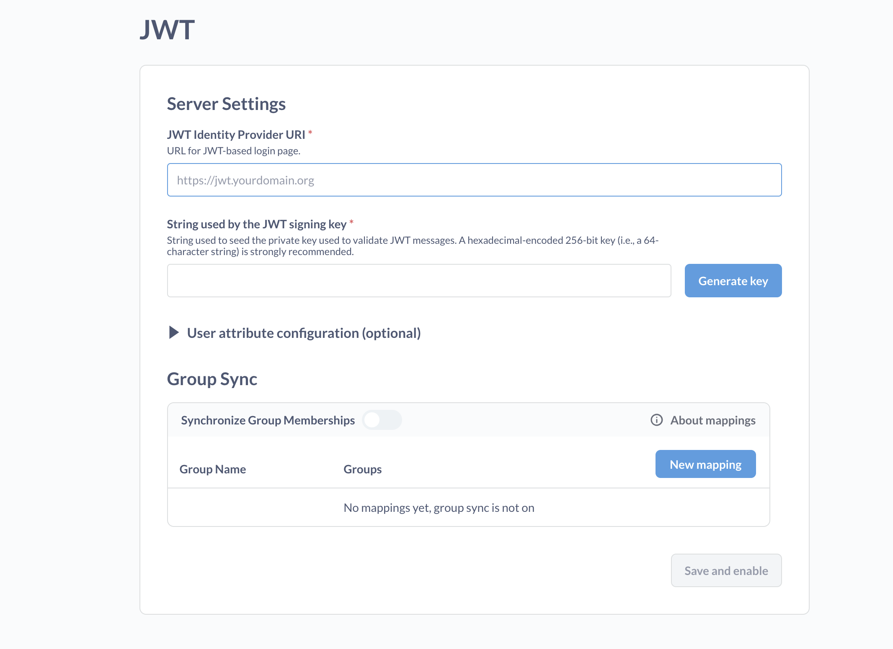

# Interactive embedding quick start

You'll embed the full Metabase application in your app. Once logged in, people can view a Metabase dashboard in your web app, and be able to use the full Metabase application to explore their data, and only their data.

## Prerequisites

- You have an app that you can embed Metabase in.
- You have a Pro or Enterprise subscription of Metabase. If you're unsure where to start, sign up for a free trial for [Pro On-Prem](https://www.metabase.com/product/pro). If you have Docker Desktop installed, you can just search for "metabase-enterprise" to find the Docker image and run it. Alternatively, you can follow [these instructions](../installation-and-operation/running-metabase-on-docker.md#pro-or-enterprise-quick-start).

The code featured in this guide can be found in our [sample repo](https://github.com/metabase/metabase-nodejs-express-interactive-embedding-sample).

## Set up SSO and interactive embedding in Metabase

### Create a dashboard in Metabase

You'll first need to create something to embed. In the left nav, go to **Browse** > **Databases** > **Sample Database**. Hover over the `Invoices` table and click on the lightning bolt to X-ray the table. Metabase will create a bunch of questions that you can save as a dashboard. Click the button to **Save this** as a dashboard. Metabase will save this dashboard in the collection called "Automatically generated dashboards".

Visit that dashboard in the "Automatically generated dashboards" collection and make a note of its URL. If that dashboard is the first dashboard you created, it's probably `/dashboard/1` followed by a description, e.g. `/dashboard/1-a-look-at-your-invoices-table`. You'll need to put this relative URL in your app, as you'll use the dashboard as the first page that logged-in people will see when they visit the analytics section in your app. It's enough to include the ID only and omit the rest of the URL, e.g. `/dashboard/1`.

### Enable interactive embedding

In Metabase, click on the **gear** icon in the upper right and go to **Admin settings** > **Settings** > **Embedding** and click on the **Enable** button.

Click on the **Interactive embedding** card. Under **Authorized origins**, add the URL of the website or web app where you want to embed Metabase. If you're running your app locally, you can add localhost and specify the port number, e.g. `http://localhost:8080`.

### Set up SSO with JWT in your Metabase

#### SameSite configuration

If you're embedding Metabase in a different domain, you may need to [set the session cookie's SameSite value to `none`](./interactive-embedding.md#embedding-metabase-in-a-different-domain)

#### Enable authentication with JWT

While still in the Admin panel's **Settings** section, click on **Authentication**.

On the card that says **JWT**, click the **Setup** button (you may have to scroll down to view the JWT card).



#### Set JWT Identity provider URI

In your app, you'll create a route for SSO at `/sso/metabase`. In the **JWT IDENTITY PROVIDER URI** field, enter the URL of your SSO route. For example, our sample app runs on port 8080, so in that case this JWT IDENTITY PROVIDER URI could be `http://localhost:8080/sso/metabase`.

#### Generate a JWT signing key

Click on the **Generate key** button to generate a signing key. Keep this key a secret. You'll use it on your server. If you generate another key, you'll overwrite the existing key, so you'll need to update the key in your app as well.

Copy this key, as you'll need it in the next section.

### Save and enable JWT authentication

We'll set up group synchronization later, but for now, be sure to click the **Save and enable** button to activate JWT authentication.

## Set up SSO with JWT in your app's server

### Add the signing key and Metabase site URL to your app

Here you'll need to input some values for your SSO to work.

You'll want to declare up two constants in your app:

- `METABASE_JWT_SHARED_SECRET`, paste the JWT signing key that you got from your Metabase here.
- `METABASE_SITE_URL`, which points to your Metabase's root path.

```javascript
const METABASE_JWT_SHARED_SECRET = "YOURSIGNINGKEY";
const METABASE_SITE_URL = "https://your-domain.metabaseapp.com";
```

The signing key should preferably be setup as an environment variable, to avoid accidentally committing your key to your app's repo.

### Add a JWT library to your app's server

Add a JWT library to your app. For example, if you're using a Node backend with JavaScript, we recommend using [jsonwebtoken](https://github.com/auth0/node-jsonwebtoken).

In your terminal:

```sh
npm install jsonwebtoken --save
```

And in your app, require the library:

```javascript
const jwt = require("jsonwebtoken");
```

### Restricting access to certain routes

Presumably, your app already has some way of making sure some routes are only accessible after having signed in. Our examples use a simple helper function named `restrict` that protects these routes:

```javascript
function restrict(req, res, next) {
  if (req.session.user) {
    next();
  } else {
    req.session.returnTo = req.originalUrl;
    req.session.error = "Access denied!";
    res.redirect("/login");
  }
}
```

### Add a function to sign users

We need to write a function to sign user JWTs, using the JWT library.

```javascript
const signUserToken = user =>
  jwt.sign(
    {
      email: user.email,
      first_name: user.firstName,
      last_name: user.lastName,
      exp: Math.round(Date.now() / 1000) + 60 * 10, // 10 minute expiration
    },
    METABASE_JWT_SHARED_SECRET,
  );
```

### Add a `sso/metabase` route

You'll need to add a route to sign people in to your Metabase via SSO using JWT. If the person isn't signed in to your app yet, your app should redirect them through your sign-in flow. In the code below, this check and redirection is handled by the `restrict` function we introduced earlier.

```javascript
app.get("/sso/metabase", restrict, (req, res) => {
  const ssoUrl = new URL("/auth/sso", METABASE_SITE_URL);
  ssoUrl.searchParams.set("jwt", signUserToken(req.session.user));
  ssoUrl.searchParams.set("return_to", req.query.return_to ?? "/");

  res.redirect(ssoUrl);
});
```

If the person has never signed in to Metabase before, Metabase will create an account for them.

### CHECKPOINT: sign in to your Metabase using SSO

Make sure you are signed out of your Metabase. From the Metabase sign-in page, click on "Sign in with SSO". You should be redirected to your app.

Log in to your app. Your app should redirect you to your Metabase welcome page. If the person doesn't yet have a Metabase account, Metabase should create an account for them.

## Embed Metabase in your app

Now to embed your Metabase in your app. You'll want to set up a route to serve your embedded analytics. Let's call it `/analytics`. Note that we're using the `restrict` helper function (defined above) because this page should only be viewable after people sign in to your app.

In this route, we need to render an iframe that will load your Metabase. The `src` attribute of the iframe should point to the relative path of the SSO endpoint of your app. Once the person signs in to your app (and therefore in to your Metabase), we add the query string parameter `return_to` so that the iframe displays the requested dashboard.

`METABASE_DASHBOARD_PATH` should be pointing to the relative path of the dashboard you created at the beginning of this guide.

```javascript
app.get("/analytics", restrict, function (req, res) {
  const METABASE_DASHBOARD_PATH = "/dashboard/1";
  var iframeUrl = `/sso/metabase?return_to=${METABASE_DASHBOARD_PATH}`;
  res.send(
    `<iframe src="${iframeUrl}" frameborder="0" width="1280" height="600" allowtransparency></iframe>`,
  );
});
```

The `METABASE_DASHBOARD_PATH` is just the first thing people will see when they log in, but you could set that path to any Metabase URL. And since you're embedding the full Metabase, people will be able to drill through the data and view other questions, dashboards, and collections.

### CHECKPOINT: view a Metabase dashboard in your app

People using your app should now be able to access `/analytics` and view your embedded Metabase dashboard.

How to test: Sign in to your app and visit the `/analytics` route. You should see the Metabase dashboard.

> If you're using the Safari browser, and you're serving Metabase and your app from different domains, you may need to go to Safari's settings and turn off [Prevent cross-site tracking](https://support.apple.com/guide/safari/prevent-cross-site-tracking-sfri40732/mac).

## Set up a group in Metabase

Now that you have SSO and interactive embedding set up, it's time to set up groups so that you can apply permissions to your embedded Metabase entities (questions, dashboards, collections, and so on).

### Add a `groups` key to your token

Recall the `signUserToken` function used to create the JWTs. Add a `groups` key to the signed token that maps to an array. Metabase will look at the values in that array to see if any of the values map to a group in Metabase (We'll walk through mapping groups in a bit).

```javascript
const signUserToken = user =>
  jwt.sign(
    {
      email: user.email,
      first_name: user.firstName,
      last_name: user.lastName,
      groups: ["Customer-Acme"],
      exp: Math.round(Date.now() / 1000) + 60 * 10, // 10 minute expiration
    },
    METABASE_JWT_SHARED_SECRET,
  );
```

### Create a group in Metabase

In Metabase, click the **gear** icon and go to **Admin settings** > **People** > **Groups**. Click the **Create a group** button. Add a group that corresponds with a group in your app. If you're using the sample app, add a group called `Customer Acme`.

### Synchronize groups between Metabase and your app

You'll map this string in the `groups` key to a Metabase group, so that when the person signs in via SSO, Metabase automatically assigns them to the appropriate Metabase group.

In Metabase's admin section, go to **Settings** > **Authentication**. Scroll to the **JWT** card and click **Edit**.

In the **Group schema** section, toggle on **Synchronize group memberships**. For each group you want to sync, add a group mapping. When you click **New mapping**, enter "Customer-Acme", the string that you included in the `groups` array in your JWT payload. You can then associate that group name with the Metabase group "Customer Acme" that we created earlier.


Be sure to **Save changes**.

### CHECKPOINT: verify that Metabase assigns people to groups when they log in

First, sign out of Metabase and sign in using SSO.

Then sign out and sign in to your Metabase as an admin and go to **Admin settings** > **People** section and verify that Metabase added the person to the appropriate group.

Note: only Metabase admins and group managers are aware of groups. Basic users have no concept of groups, and no way of knowing which groups they're a part of.

## Set permissions

Now to apply permissions to that group so that people only see data specific to their accounts.

### Reset permissions for the All Users group

Metabase ships with two initial groups: "Admins" and "All Users". By default, Metabase gives the "All Users" group access to connected data sources. And since Metabase grants people the privileges of their most permissive group, you'll want to restrict what the "All Users" groups can see before you add them to groups with limited or no access to data sources and collections.

To reset permissions for the All users group, click on the **gear** icon and go to **Admin settings** > **Permissions**. Under the **Data** tab, go to **Groups** and select **All Users**. For the **Sample Database** in the **View data** column, select "Blocked". Click **Save changes** and a modal will pop up summarizing what you're changing. Click **Yes**.


### Allow view access to the automatically generated dashboards collection

Still in the **Permissions** tab, click on the **Collections** sub-tab, then on the **Automatically generated dashboards** collection, and set the **Collection access** permissions for the **All Users** group to **View**.

Click **Save changes**, then **Yes**.

### Add a user attribute to the token

You can include user attributes in the JSON web token. Metabase will pick up any keys from the JWT payload and store them as user attributes. Among other use cases, you can use these user attributes to set row-level permissions on tables, so people can only see results tied to their accounts.

If you're using our sample app, edit the `signUserToken` function used to create the JWT by adding a key `account_id` with value `28`.

```javascript
const signUserToken = user =>
  jwt.sign(
    {
      email: user.email,
      first_name: user.firstName,
      last_name: user.lastName,
      // hard-coded account ID added to this object
      // just to test sandboxing with Metabase's Sample Database: Invoices table
      account_id: 28,
      groups: ["Customer-Acme"],
      exp: Math.round(Date.now() / 1000) + 60 * 10, // 10 minute expiration
    },
    METABASE_JWT_SHARED_SECRET,
  );
```

That user ID will correspond to the `Account ID` column in the Sample Database's Invoices table. We'll use this `account_id` user attribute to sandbox the Invoices table, so people will only see rows in that table that contain their account ID.

Note that to persist the user attribute in Metabase, you'll need to log in. Log in to your app as a non-admin, and visit the page with your embedded Metabase.

### Set row-level permissions with data sandboxing

In Metabase, go to **Admin settings** > **Permissions**. Under the **Data** tab on the left, click on a group. For "Sample Database", change its **Data access** column to **Granular**.

Metabase will display a list of the tables in the database. Next, change **Data access** for the "Invoices" table to **Sandboxed**.


Next, Metabase will prompt you with a modal to associate a column in that table with a user attribute.

Leave the **Filter by a column in a table** option checked, and associate the "Account ID" column in the Invoices table with the user attribute `account_id`. (Note that Metabase will only display the user attributes if the user has signed in through SSO before.)


Click **Save** to confirm your select. Then click the **Save changes** button in the upper right.

Metabase will ask if you're sure you want to do this. You are sure.

### CHECKPOINT: view sandboxed dashboard

Make sure you've logged out of your previous session.

Log in to your app, navigate to `/analytics`. The dashboard will now present different information, since only a subset of the data is visible to this person. Click on **Browse Data** at the bottom of the left nav. View your sandboxed **Invoices** table, and you should only see rows in that table that are associated with the person's account.

## Hiding Metabase elements

You can decide to [show or hide various Metabase elements](./interactive-embedding.md#showing-or-hiding-metabase-ui-components), like whether to show the nav bar, search or the **+New** button, and so on.

For example, to hide the logo and the top navigation bar of your embedded Metabase, you'd append the query string parameters `?logo=false&top_nav=false` to the `return_to` URL that you include in the SSO redirect.

In the handler of your `/sso/metabase` path, add the query parameters:

```javascript
ssoUrl.searchParams.set(
  "return_to",
  `${req.query.return_to ?? "/"}?logo=false&top_nav=false`,
);
```

### CHECKPOINT: verify hidden UI elements

Sign out and sign in to your app again and navigate to `/analytics`. Your embedded Metabase should not include the logo or the top navigation.

## Next steps

You can [customize how Metabase looks](../configuring-metabase/appearance.md) in your app: fonts, colors, and logos.
