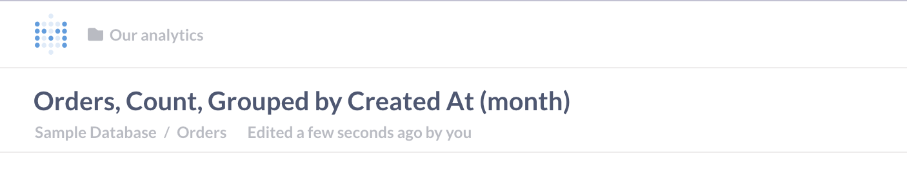
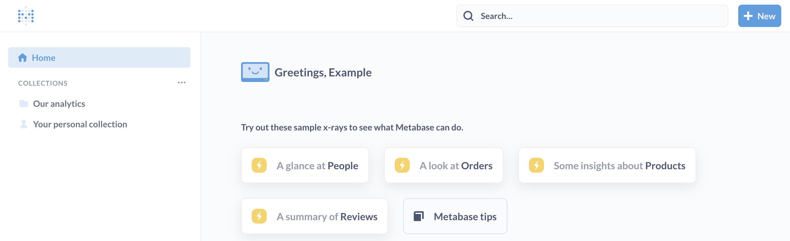

# Interactive embedding



**Interactive embedding** is what you want if you want to offer [multi-tenant, self-service analytics](https://www.metabase.com/learn/customer-facing-analytics/multi-tenant-self-service-analytics).

Interactive embedding is the only type of embedding that integrates with your [permissions](../permissions/introduction.md) and [SSO](../people-and-groups/start.md#authentication) to give people the right level of access to [query](https://www.metabase.com/glossary/query_builder) and [drill-down](https://www.metabase.com/learn/questions/drill-through) into your data.

## Interactive embedding demo

To get a feel for what you can do with interactive embedding, check out our [interactive embedding demo](https://www.metabase.com/embedding-demo).

To see the query builder in action, click on **Reports** > **+ New** > **Question**.

## Quick start

Check out the [Interactive embedding quick start](https://www.metabase.com/learn/customer-facing-analytics/interactive-embedding-quick-start).

## Prerequisites for interactive embedding

1. Make sure you have a [license token](../paid-features/activating-the-enterprise-edition.md) for a [Pro or Enterprise plan](https://store.metabase.com/checkout/login-details).
2. Organize people into Metabase [groups](../people-and-groups/start.md).
3. Set up [permissions](../permissions/introduction.md) for each group.
4. Set up [SSO](../people-and-groups/start.md#authentication) to automatically apply permissions and show people the right data upon sign-in. In general, **we recommend using [SSO with JWT](../people-and-groups/authenticating-with-jwt.md)**.

If you're dealing with a [multi-tenant](https://www.metabase.com/learn/customer-facing-analytics/multi-tenant-self-service-analytics) situation, check out our recommendations for [Configuring permissions for different customer schemas](https://www.metabase.com/learn/permissions/multi-tenant-permissions).

If you have your app running locally, and you're using the Pro Cloud version, or hosting Metabase and your app in different domains, you'll need to set your Metabase environment's session cookie samesite option to "none".

## Enabling interactive embedding in Metabase

1. Go to **Settings** > **Admin settings** > **Embedding**.
2. Click **Enable**.
3. Click **Interactive embedding**.
4. Under **Authorized origins**, add the URL of the website or web app where you want to embed Metabase (such as `https://*.example.com`).

## Setting up embedding on your website

1. Create an iframe with a `src` attribute set to:
   - the [URL](#pointing-an-iframe-to-a-metabase-url) of the Metabase page you want to embed, or
   - an [authentication endpoint](#pointing-an-iframe-to-an-authentication-endpoint) that redirects to your Metabase URL.
2. Optional: Depending on the way your web app is set up, set [environment variables](../configuring-metabase/environment-variables.md) to:
   - [Add your license token](../configuring-metabase/environment-variables.md#mb_premium_embedding_token).
   - [Embed Metabase in a different domain](#embedding-metabase-in-a-different-domain).
   - [Secure your interactive embed](#securing-interactive-embeds).
3. Optional: Enable communication to and from the embedded Metabase using supported [`postMessage`](https://developer.mozilla.org/en-US/docs/Web/API/Window/postMessage) messages:
   - [From Metabase](#supported-postmessage-messages-from-embedded-metabase)
   - [To Metabase](#supported-postmessage-messages-to-embedded-metabase)
4. Optional: Set parameters to [show or hide Metabase UI components](#showing-or-hiding-metabase-ui-components).

Once you're ready to roll out your interactive embed, make sure that people **allow** browser cookies from Metabase, otherwise they won't be able to log in.

### Pointing an iframe to a Metabase URL

Go to your Metabase instance and find the page that you want to embed.

For example, to embed your Metabase home page, set the `src` attribute to your [site URL](../configuring-metabase/settings.md#site-url), such as:

```
http://metabase.yourcompany.com/
```

To embed a specific Metabase dashboard, use the dashboard's URL, such as:

```
http://metabase.yourcompany.com/dashboard/1
```

### Pointing an iframe to an authentication endpoint

Use this option if you want to send people directly to your SSO login screen (i.e., skip over the Metabase login screen with an SSO button), and redirect to Metabase automatically upon authentication.

You'll need to set the `src` attribute to your auth endpoint, with a `return_to` parameter pointing to the encoded Metabase URL. For example, to send people to your SSO login page and automatically redirect them to `http://metabase.yourcompany.com/dashboard/1`:

```
https://metabase.example.com/auth/sso?return_to=http%3A%2F%2Fmetabase.yourcompany.com%2Fdashboard%2F1
```

If you're using [JWT](../people-and-groups/authenticating-with-jwt.md), you can use the relative path for the redirect (i.e., your Metabase URL without the [site URL](../configuring-metabase/settings.md#site-url)). For example, to send people to a Metabase page at `/dashboard/1`:

```
https://metabase.example.com/auth/sso?jwt=<token>&return_to=%2Fdashboard%2F1
```

You must URL encode (or double encode, depending on your web setup) all of the parameters in your redirect link, including parameters for filters (e.g., `filter=value`) and [UI settings](#showing-or-hiding-metabase-ui-components) (e.g., `top_nav=true`). For example, if you added two filter parameters to the JWT example shown above, your `src` link would become:

```
https://metabase.example.com/auth/sso?jwt=<token>&redirect=%2Fdashboard%2F1%3Ffilter1%3Dvalue%26filter2%3Dvalue
```

## Cross-browser compatibility

To make sure that your embedded Metabase works in all browsers, put Metabase and the embedding app in the same top-level domain (TLD). The TLD is indicated by the last part of a web address, like `.com` or `.org`.

Note that your interactive embed must be compatible with Safari to run on _any_ browser in iOS (such as Chrome on iOS).

## Embedding Metabase in a different domain

> Skip this section if your Metabase and embedding app are already in the same top-level domain (TLD).

If you want to embed Metabase in another domain (say, if Metabase is hosted at `metabase.yourcompany.com`, but you want to embed Metabase at `yourcompany.github.io`), you can tell Metabase to set the session cookie's SameSite value to "none".

You can set session cookie's SameSite value in **Admin settings** > **Embedding** > **Interactive embedding** > **SameSite cookie setting**.

SameSite values include:

- **Lax** (default): Allows cookies to be sent when someone navigates to the origin site from an external site (like when following a link).
- **None**: Allows all cross-site requests. Incompatible with most Safari and iOS browsers, such as Chrome on iOS. If you set this environment variable to "None", you must use HTTPS in Metabase to prevent browsers from rejecting the request.
- **Strict** (not recommended): Never allows cookies to be sent on a cross-site request. Warning: this will prevent users from following external links to Metabase.

You can also set the [`MB_SESSION_COOKIE_SAMESITE` environment variable](../configuring-metabase/environment-variables.md#mb_session_cookie_samesite).

If you're using Safari, you'll need to [allow cross-site tracking](https://support.apple.com/en-tj/guide/safari/sfri40732/mac). Depending on the browser, you may also run into issues when viewing emdedded items in private/incognito tabs.

Learn more about [SameSite cookies](https://developer.mozilla.org/en-US/docs/Web/HTTP/Headers/Set-Cookie/SameSite).

## Securing interactive embeds

Metabase uses HTTP cookies to authenticate people and keep them signed into your embedded Metabase, even when someone closes their browser session. If you enjoy diagrammed auth flows, check out [Interactive embedding with SSO](https://www.metabase.com/learn/customer-facing-analytics/securing-embeds).

To limit the amount of time that a person stays logged in, set [`MAX_SESSION_AGE`](../configuring-metabase/environment-variables.md#max_session_age) to a number in minutes. The default value is 20,160 (two weeks).

For example, to keep people signed in for 24 hours at most:

```sh
MAX_SESSION_AGE=1440
```

To automatically clear a person's login cookies when they end a browser session:

```sh
MB_SESSION_COOKIES=true
```

To manually log someone out of Metabase, load the following URL (for example, in a hidden iframe on the logout page of your application):

```sh
https://metabase.yourcompany.com/auth/logout
```

If you're using [JWT](../people-and-groups/authenticating-with-jwt.md) for SSO, we recommend setting the `exp` (expiration time) property to a short duration (e.g., 1 minute).

## Supported postMessage messages _from_ embedded Metabase

To keep up with changes to an embedded Metabase URL (for example, when a filter is applied), set up your app to listen for "location" messages from the embedded Metabase. If you want to use this message for deep-linking, note that "location" mirrors "window.location".

```json
{
  "metabase": {
    "type": "location",
    "location": LOCATION_OBJECT_OR_URL
  }
}
```

To make an embedded Metabase page (like a question) fill up the entire iframe in your app, set up your app to listen for a "frame" message with "normal" mode from Metabase:

```json
{
  "metabase": {
    "type": "frame",
    "frame": {
      "mode": "normal"
    }
  }
}
```

To specify the size of an iframe in your app so that it matches an embedded Metabase page (such as a dashboard), set up your app to listen for a "frame" message with "fit" mode from Metabase:

```json
{
  "metabase": {
    "type": "frame",
    "frame": {
      "mode": "fit",
      "height": HEIGHT_IN_PIXELS
    }
  }
}
```

## Supported postMessage messages _to_ embedded Metabase

To change an embedding URL, send a "location" message from your app to Metabase:

```json
{
  "metabase": {
    "type": "location",
    "location": LOCATION_OBJECT_OR_URL
  }
}
```

## Group strategies with sandboxing

If you want multiple people from a single customer account to collaborate on questions and dashboards, you'll need to set up one [group](../people-and-groups/managing.md#groups) per customer account.

You can handle [data sandboxing](../permissions/data-sandboxes.md) with a single, separate group that just sandboxes your data. For example, each person could be part of a customer group that sets up data permissions with sandboxing via a certain attribute that applies to everyone across all your customer accounts.

Additionally, each person within a single customer account could also be a member of a group specific to that customer account. That way they can collaborate on collections with other people in their organization, without seeing stuff created by people from other customers' accounts.

## Showing or hiding Metabase UI components

To change the interface of your interactive embed, you can add parameters to the end of your embedding URL. If you want to change the colors or fonts in your embed, see [Customizing appearance](../configuring-metabase/appearance.md).

For example, you can disable Metabase's [top nav bar](#top_nav) and [side nav menu](#side_nav) like this:

```
your_embedding_url?top_nav=false&side_nav=false
```


Options include:

- [Action buttons](#action_buttons)
- [Additional info](#additional_info)
- [Breadcrumbs](#breadcrumbs)
- [Header](#header)
- [Locale](#locale)
- [Logo](#logo)
- [New button](#new_button)
- [Search](#search)
- [Side nav](#side_nav)
- [Top nav](#top_nav)

### `action_buttons`

Visible by default on question pages when the [header](#header) is enabled.

To hide the action buttons such as **Filter**, **Summarize**, the query builder button, and so on:

```
header=false&action_buttons=false
```


### `additional_info`

Visible by default on question and dashboard pages, when the [header](#header) is enabled.

To hide the gray text "Edited X days ago by FirstName LastName", as well as the breadcrumbs with collection, database, and table names:

`header=false&additional_info=false`



### `breadcrumbs`

Shown by default in the top nav bar. Collection breadcrumbs show the path to the item (i.e., the collection(s) the item is in). To hide the breadcrumbs:

```
breadcrumbs=false
```

### `header`

Visible by default on question and dashboard pages.

To hide a question or dashboard's title, [additional info](#additional_info), and [action buttons](#action_buttons):

`header=false`

### `locale`

You can localize the user interface via a parameter. For example, to set the locale to Spanish:

```
locale=es-ES
```

Check out the [locales Metabase supports](https://github.com/metabase/metabase/tree/master/locales). And read more about [localization](../configuring-metabase/localization.md).

### `logo`

Whether to show the logo that opens and closes the sidebar nav. Default is true. How Metabase displays the logo depends on the `side_nav` setting. Here's a rough breakdown of how these two parameters interact:

If `logo=true` and:

- `side_nav=true`: Looks like regular Metabase (with whatever logo you have set).
- `side_nav=false`: There is no sidebar, so nothing happens when you hover over the logo.

If `logo=false` and:

- `side_nav=true`: Metabase shows the generic sidebar icon, with a gray color in normal state, and a brand color on hover.
- `side_nav=false`: There is no side nav nor logo, so the breadcrumbs move all the way to the left of the screen.

### `new_button`

Hidden by default. To show the **+ New** button used to create queries or dashboards:

```
top_nav=true&new_button=true
```

### `search`

Hidden by default. To show the search box in the top nav:

```
top_nav=true&search=true
```

### `side_nav`

The navigation sidebar is shown on `/collection` and home page routes, and hidden everywhere else by default.

To allow people to minimize the sidebar:

```
top_nav=true&side_nav=true
```



### `top_nav`

Shown by default. To hide the top navigation bar:

```
top_nav=false
```


`search`, `new_button`, and `breadcrumbs` all depend on `top_nav` being set to `true`. If these three children (`search`, `new_button`, and `breadcrumbs`) are all false, Metabase will hide the top nav bar.

## Reference apps

To build a sample interactive embed using SSO with JWT, see our reference apps:

- [Node.js + Express](https://github.com/metabase/metabase-nodejs-express-interactive-embedding-sample) (with [quick start guide](https://www.metabase.com/learn/customer-facing-analytics/interactive-embedding-quick-start))
- [Node.js + React](https://github.com/metabase/sso-examples/tree/master/app-embed-example)

## Further reading

- [Interactive embedding quick start](https://www.metabase.com/learn/customer-facing-analytics/interactive-embedding-quick-start)
- [Strategies for delivering customer-facing analytics](https://www.metabase.com/learn/embedding/embedding-overview).
- [Permissions strategies](https://www.metabase.com/learn/permissions/strategy).
- [Customizing Metabase's appearance](../configuring-metabase/appearance.md).
