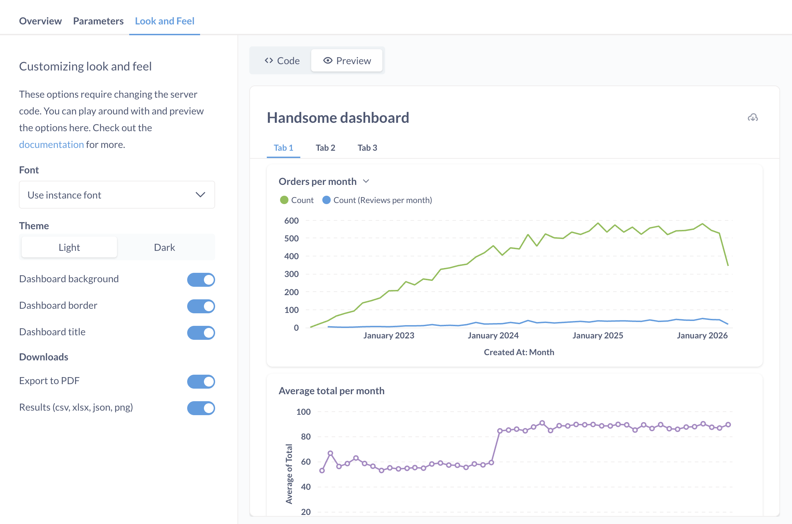

# Embedding Metabase in other applications

Metabase includes a powerful application embedding feature that allows you to embed your saved questions or dashboards in your own web applications. You can even pass parameters to these embeds to customize them for different users.

## Key Concepts

### Applications

An important distinction to keep in mind is the difference between Metabase and the embedding application. The charts and dashboards you will be embedding live in the Metabase application, and will be embedded in your application (i.e. the embedding application).

### Parameters

Some dashboards and questions have the ability to accept [parameters](../users-guide/13-sql-parameters). In dashboards, these are synonymous with [dashboard filters](../dashboards/filters.md). For example, if you have a dashboard with a filter on `Publisher ID`, this can be specified as a parameter when embedding, so that you could insert the dashboard filtered down to a specific `Publisher ID`.

SQL-based questions with template variables can also accept parameters for each variable. So for a query like:

```
SELECT count(*)
FROM orders
WHERE product_id = {{productID}}
```

you could specify a specific `productID` when embedding the question.

### Signed parameters

In general, when embedding a chart or dashboard, the server of your embedding application will need to sign a request for that resource.

If you choose to sign a specific parameter value, that means the user can't modify that value, nor is a filter widget displayed for that parameter. For example, if the `Publisher ID` is assigned a value and the request signed, that means the front-end client that renders that dashboard on behalf of a given logged-in user can only see information for that publisher ID.

## Enabling embedding

To enable embedding, go to the **Admin Panel** and select **Embedding in other Applications** from the left sidebar. When you click **Enable**, you'll see an **Embedding secret key** you can use later to sign requests. If you ever need to invalidate that key and generate a new one, just click on **Regenerate key**.


You can also see all questions and dashboards that have been marked as embedded here, as well as revoke any questions or dashboards that should no longer be embeddable in other applications.

Once you've enabled the embedding feature on your Metabase instance, next you'll want to set up individual questions and dashboards for embedding.

## Embedding charts and dashboards

To make a question or dashboard embeddable, click the **Sharing icon** (the box with an arrow pointing up and to the right) at the bottom right of the question.


For dashboards, the sharing icon is at the top of the dashboard:


Then select **Embed this question in an application**.


You'll see a preview of the question or dashboard as it will appear in your application, as well as a panel showing the code you'll need to insert in your application. You can alternate between the preview and code with the toggle near the top of the page.



## Publishing your embedded item

In order for the embedding to work, you'll need to hit **Publish**. You'll need to hit the **Publish** button whenever:

- You first set up a chart or dashboard for embedding
- *and* each time you change any embedding settings.

 Also, any changes you make to the embedding settings may require you to update the code in your own application so that it matches the latest code sample Metabase generates.


Metabase provides code samples for common frontend template languages, as well as some common backend web frameworks and languages. You can also use these code samples as starting points for writing your own versions in other platforms.

If you want to remove the **Powered by Metabase** label, you'll need to upgrade to a [paid plan](/pricing).

## Embedding charts and dashboards with locked parameters

If you wish to have a parameter locked down to prevent your embedding application's end users from seeing other users' data, you can mark parameters as "Locked." This will prevent that parameter from being displayed as a filter widget, so its value must instead be set by the embedding application's server code.


When using locked Field Filters with multiple selected values, then it is provided as a JSON array. Example:

```
...
params: {
  foo: ['Value1', 'Value2'],
},
...
```

## Hiding parameters

If you have parameters that aren't required, but that you'd like to be hidden, instead of marking them as Locked you can use the `hide_parameters` URL option to hide one or more parameters (i.e., prevent it from showing up as a filter widget on screen). You'll want to add this option to the Metabase URL specified in your embedding iframe.

For example, if you have a parameter called "ID," in this example the ID filter widget would be hidden:

```
/dashboard/42#hide_parameters=id
```

If you want, you can also simultaneously assign a parameter a value and hide the widget like this:

```
/dashboard/42?id=7#hide_parameters=id
```

Note that the name of the parameter in the URL should be specified in lower case, and with underscores instead of spaces. So if your parameter was called "Filter for User ZIP Code," you'd write:

```
/dashboard/42#hide_parameters=filter_for_user_zip_code
```

You can specify multiple parameters to hide by separating them with commas, like this:

```
/dashboard/42#hide_parameters=id,customer_name
```

To specify multiple values for filters, though, you'll need to separate them with ampersands (&), like this:

```
/dashboard/42?id=7&customer_name=janet
```

## Resizing dashboards to fit their content

Dashboards are a fixed aspect ratio, so if you'd like to ensure they're automatically sized vertically to fit their contents you can use the [iFrame Resizer](https://github.com/davidjbradshaw/iframe-resizer) script. Metabase serves a copy for convenience:

```
<script src="http://metabase.example.com/app/iframeResizer.js"></script>
<iframe src="http://metabase.example.com/embed/dashboard/TOKEN" onload="iFrameResize({}, this)"></iframe>
```

## Additional parameters

To change the look and feel of the embed, you can add additional parameters to the embedding URL:

- **Bordered**: true or false. Adds a visible border to the embed.
- **Titled**: true or false. Adds or removes the title to the embedding.
- **Theme**: light, transparent, or night. Shows the embedded iframe in light (theme is null), transparent (no background), or night (dark mode).

For example:

```
http://yourmetabaseurl.com/embed/dashboard/a_very_huge_hashed_url#theme=night&hide_parameters=category&titled=true&bordered=false
```

These settings can also be changed under **Style** when previewing the embedded question or dashboard and its code in Metabase.

## Embedding reference applications

To see code examples of how to embed Metabase in applications using a number of common frameworks, check out our [reference implementations](https://github.com/metabase/embedding-reference-apps) on Github.

## Customizing embeds

Paid plans include additional features for [customizing the appearance](./customize-embeds.md) of embedded items.

## Further reading

- [Embedding track](/learn/embedding) in Learn Metabase.
