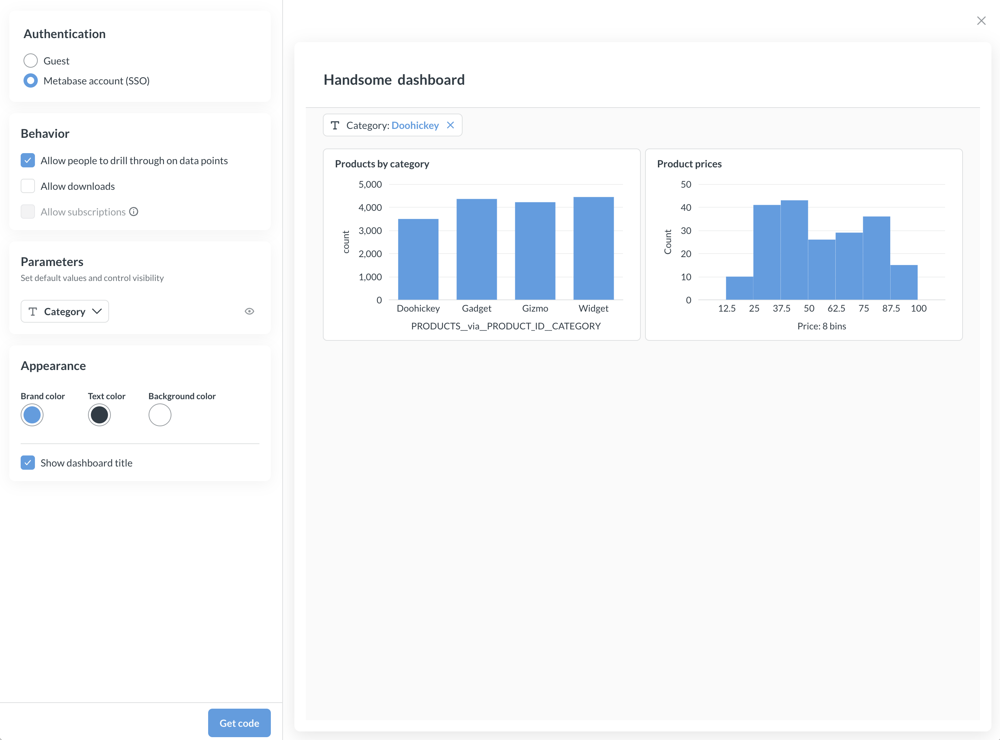
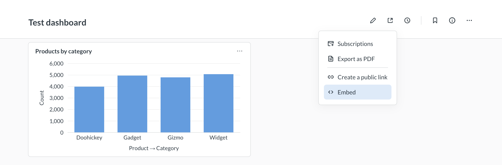
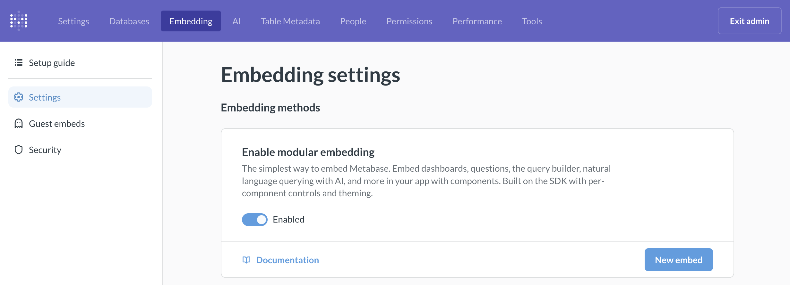
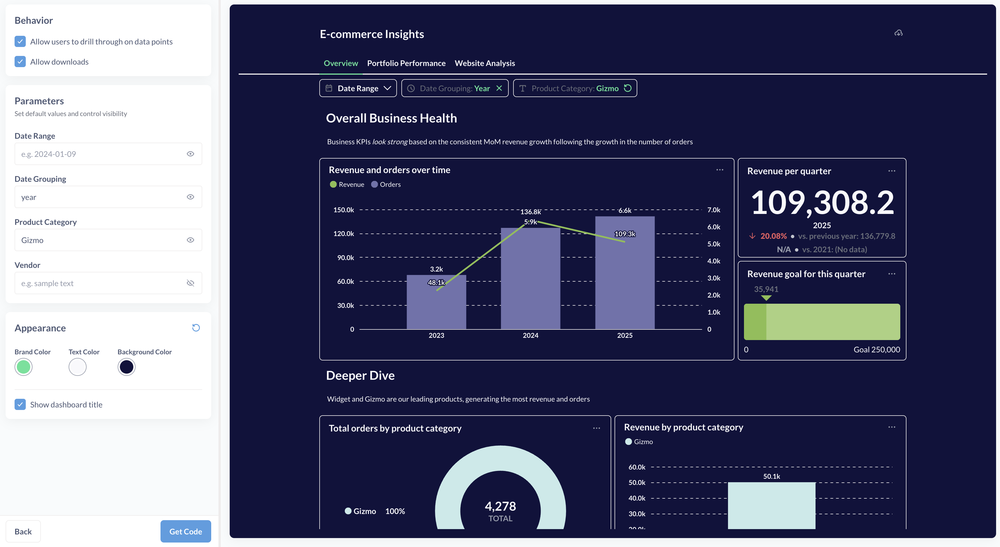

# Modular embedding





Modular embedding lets you embed and customize Metabase [components](./components.md) (like dashboards, the query builder, AI chat, and more) into your own application. You don't need to write embedding code on your own - just use the wizard to create a code snippet and paste it into your app.

If you're using React, check out the [Modular embedding SDK](./sdk/introduction.md).

> **Want guest embeds?** For modular embedding without authentication (available on all plans), see [Guest Embeds](./guest-embedding.md).

## Enable modular embedding

1. In Metabase, go to **Admin settings > Embedding**.
2. Toggle on **Enable modular embedding**.

**For guest embeds**: You're done! Skip to [Create a new embed](#create-a-new-embed) or see the [Guest embedding guide](./guest-embedding.md) for detailed setup instructions.

**For authenticated embeds** (Pro/Enterprise only), some more steps:

3. Under **Cross-Origin Resource Sharing (CORS)**, add the URLs of the websites where you want to embed Metabase (such as `https://*.example.com`). For testing embeds, you can use `localhost` which is always included in CORS policy.
4. If embedding on a different domain, see [Embedding Metabase in a different domain](./authentication.md#embedding-metabase-in-a-different-domain).

## Create a new embed

You can generate a code snippet for embedding a component by going through the embed wizard.

### 1. Open the embed wizard

In your Metabase:

1. Visit the item you want to embed.
2. Click the sharing icon.
3. Select **Embed**.



You can also open a command palette with Ctrl/Cmd+K, type "New embed". You'll get a wizard to help you set up your embed.

You can also go to **Admin settings > Embedding > Modular embedding** and click **New embed**.



### 2. Pick how to authenticate the embed



With SSO, Metabase can know who is viewing the embed, and it can unlock all of its bells and whistles (see this [comparison between SSO and guest embeds](./introduction.md#comparison-of-embedding-types)).

This page covers the [SSO setup for your Metabase](./authentication.md). If you don't need to set up SSO, check out the [guest embed docs](./guest-embedding.md).

### 3. Customize your embed

The exact customization options you see will depend on what type of entity you're embedding and which [Metabase plan](https://www.metabase.com/pricing) you're on. You'll see a live preview of the embed with your customizations.



If you are on Metabase OSS/Starter plans, you'll be able to select light or dark themes for your components. On Metabase Pro/Enterprise, you'll be also be able to pick specific colors for brand, text, and background in the embed wizard, and add more customization options through [appearance settings](./appearance.md) later.

All the customization options you select in this wizard will be reflected in code snippet that the embed wizard will generate for you, and you'll be able to add more options later.

For example, this code defines the font, color, and size for text, background colors, and colors for filters and summaries:

```html
<script>
  defineMetabaseConfig({
    instanceUrl: "https://your-metabase-url",
    theme: {
      fontFamily: "Lato",
      fontSize: "16px",
      colors: {
        background: "#11123d",
        "text-primary": "#f9f9fc",
        brand: "#50e397",
        filter: "#7172AD",
        summarize: "#88BF4D",
      },
    },
  });
</script>
```

For more look-and-feel twiddling, see [appearance](./appearance.md).

Once you're done customizing your embed, click **Next**.

## Add the embedding script to your app

If you [create an embed through the built-in embed wizard](#create-a-new-embed), Metabase will generate a code snippet that you can copy and paste into your app. See the example below. You can later modify this code snippet to specify additional appearance options or change the behavior of some components.

You'll add this code snippet to your app and refresh the page.

The code snippets:

- Loading the modular embedding library from your Metabase instance.
- Set global configuration settings, like the URL of your Metabase and the `theme`. See [Page-level config](#page-level-config).
- The component(s) to embed, with their parameters. See [Components](./components.md).

Here's an example snippet:

```html
<!-- Load embedding library -->
<!-- REPLACE WITH YOUR METABASE URL HERE -->

<script defer src="https://your-metabase-url/app/embed.js"></script>

<!-- Embedding configuration -->
<script>
  function defineMetabaseConfig(config) {
    window.metabaseConfig = config;
  }
</script>

<script>
  defineMetabaseConfig({
    instanceUrl: "https://your-metabase-url",
    theme: {
      colors: {
        background: "#ffffff",
      },
    },
  });
</script>

<!--Embedded entities -->
<metabase-question question-id="1"></metabase-question>

<metabase-dashboard dashboard-id="2" with-title="false"></metabase-dashboard>
```

Note the `defer` attribute and the reference to your Metabase URL in the script that loads `embed.js` library.

If you're embedding multiple components in a single page, you only need to include the `<script>` tags once globally.

## Each end user should have their own Metabase account



With SSO embeds, each end-user must have their own Metabase account. If you can't provision accounts for every end user, you have to use [Guest embeds](./guest-embedding.md) instead.

The problem with having end-users share a Metabase account is that, even if you filter data on the client side via the modular embedding, all end-users will still have access to the session token, which they could use to access Metabase directly via the API to get data they’re not supposed to see.

If each end-user has their own Metabase account, however, you can configure permissions in Metabase and everyone will only have access to the data they should.

In addition to this, we consider shared accounts to be unfair usage. Fair usage of modular embedding involves giving each end-user of the embedded analytics their own Metabase account.

## Customizing authenticated embeds

The exact customization options you see will depend on which type of entity you're embedding. These are the settings for authenticated embeds available on [Pro](https://www.metabase.com/product/pro) and [Enterprise](https://www.metabase.com/product/enterprise) plans. For guest embeds (OSS and paid), see [guest embedding options](./guest-embedding.md#component-attributes).


When you're creating a new embed using **Admin > Embedding > Setup guide > Embed in your code**, you'll see some or all the following customization options in the interactive creation flow. These options correspond to parameters in [components](./components.md).

- **Allow people to drill through on data points**: determines whether people can interact with the chart (or charts on a dashboard). Interactivity includes [drilling down](https://www.metabase.com/learn/metabase-basics/querying-and-dashboards/questions/drill-through) to individual records from aggregated questions, filtering on click, zooming in, etc. Disabling drill-through for an embedded _question_ also disables people's ability to add filters and summaries.

- **Allow downloads**. Determines whether people can download question results and save dashboards as PDFs.

- **Allow people to save new questions**. If you embed the query builder but disable this option, people can still do their own explorations, they just won't be able to save them.

- **Parameters**: for dashboard filters, SQL variables, and time grouping parameters, you can add default values. Default values set here override the default values set at the dashboard or question level. For dashboard filters and parameters, you can choose whether to hide the parameter.

- **Show title**: what it says on the tin.

- **Allow editing dashboards and questions**: lets people create and edit dashboards or questions in the current collection. When disabled, they can still perform actions like filter, summarize, and drill-through, but won't be able to save results.


## Page-level config

To define the configuration that applies to every embed on the page, use the `defineMetabaseConfig()` function. Its parameters include:

- `instanceUrl: "https://your-metabase-url"` (required): the URL of your Metabase instance, like `https://youlooknicetoday.metabaseapp.com`

- `theme: {...}` (optional): [appearance options for the embeds](./appearance.md).

- `useExistingUserSession: true|false` (optional, for development only) - lets you preview the embed locally using your Metabase admin account session. Only supported in Google Chrome.

- `apiKey: mb_YourAPIKey` (optional, for development only) - another way to preview embeds locally using an API key.

- `fetchRequestToken: () => Promise<{ jwt: string }>` (optional) - you can customize how the SDK fetches the refresh token for JWT authentication by specifying the `fetchRequestToken` function. See [customizing JWT authentication](./authentication.md#customizing-jwt-authentication).

## Authentication

For authentication setup including API keys for local testing, SSO with JWT/SAML, and cross-domain configuration, see [Modular embedding - authentication](./authentication.md).
