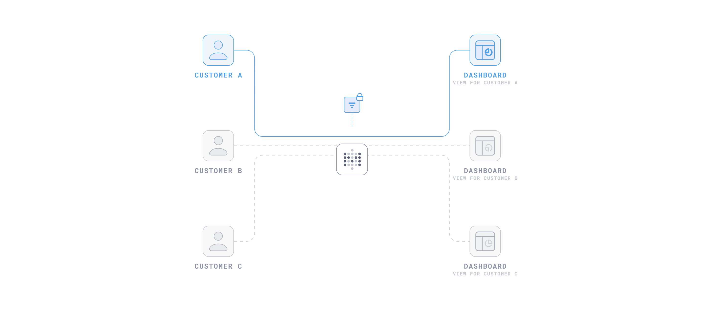

# Embedding parameters

This page covers how to pass parameter values to embedded dashboards and SQL questions.

## Parameters differ based on whether you use guest or SSO authentication

When you embed a dashboard or SQL question, the embedding wizard will offer different parameter options depending on which authentication method you pick.

With **SSO** authentication, you can set a default value and choose whether to hide a parameters widget. On an SSO embed, you don't need locked parameters. With SSO, your Metabase knows who's viewing, so [data permissions](../permissions/embedding.md) and [row and column security](../permissions/row-and-column-security.md) filter the rows for you.

With **guest** authentication, however, every parameter starts out **Disabled**, and for each parameter you can pick from:

- **Disabled**: no widget, and nobody can set a value.
- **Editable**: the widget shows, people can change the value, and your page can set a [starting value](#set-starting-values).
- **Locked**: no widget. Your server sets the value in the signed token. Check out [Restrict data with locked parameters](#restrict-data-with-locked-parameters).

You can't disable a filter that [always requires a value](../dashboards/filters.md#make-a-filter-or-parameter-required).

## Restrict data with locked parameters



Say you want each customer to see only their own rows. On an embed with guest authentication, nobody's signed in to your Metabase, so permissions can't scope rows per person. Instead, you can lock the parameter: your server sets the parameter's value in the signed token, and Metabase applies the value before running anything. And because the value is set by the token, the viewer won't be able to change it.

### Lock a parameter

1. Visit the dashboard or question, click the **Share** icon, and select **Embed**.
2. Under **Parameters**, set the parameter to **Locked**.
3. Optional: pick a value under **Preview locked parameters**. The wizard writes it into the server code it generates, so you can see the exact format Metabase expects.
4. Click **Publish**.
5. On your server, put the value in the `params` object when you sign the token:

```javascript

```

Then pass the token to the component, as the `token` attribute on `<metabase-dashboard>` or the `token` prop on `StaticDashboard` in the SDK, or have the embed fetch it from your server. On a legacy [static embed](./introduction.md#static-embedding-is-deprecated), the token goes in the iframe URL instead. The dashboard shows only customer 13's rows, with no **Customer ID** widget. For fetching and refreshing the token, check out [Guest embeds](./guest-embedding.md#refreshing-or-initializing-the-jwt-from-your-server).

Some notes on locked parameters:

- **Every token has to include every locked parameter.** Leave out a parameter, and Metabase refuses the request.
- **A locked value narrows the options in editable widgets.** Lock **State** to Vermont, and an editable **City** filter on the same dashboard only lists Vermont cities (like [linked filters](../dashboards/filters.md#linking-filters)).
- **Multiple locked parameters combine with AND.** To skip a locked parameter for a given token, pass `[]` as its value.
- **The key in `params` is the filter's slug.** If you rename a locked dashboard filter, update the key in your server code to match. Locked parameters connected to a [SQL variable](../questions/native-editor/sql-parameters.md) keep the variable's name, so renaming the widget doesn't affect them.
- **A locked filter only restricts the cards it's connected to.** A dashboard filter with no connected cards still shows up in the wizard, still has to be in the token, but it won't do anything. The embed renders fine, so nothing in the browser tells you.
- **Connect a locked filter to a field filter if your server may send more than one value.** A field filter expands `["Gadget", "Widget"]` to `IN (...)`. A plain SQL variable substitutes a comma-separated list, which is a SQL error after `=`. Wrap the tag in `[[ ]]` so the clause disappears when the token passes `[]`.

See [params in a signed token](./parameters-reference.md#params-in-a-signed-token).

## Set starting values

To open an embed with some set-and-forget filters already applied, pass starting values keyed by slug. From there, people can change the value via the filter widgets.

If instead you want your app to be able to push values, or see when people change a widget's values, use [controlled values](#control-values-from-your-app).

- [Web component](#web-component-starting-values)
- [React SDK](#react-sdk-starting-values)

### Web component starting values

```html
<metabase-dashboard
  dashboard-id="1"
  initial-parameters='{"state": "NY", "category": ["Gadget", "Gizmo"]}'
></metabase-dashboard>

<metabase-question
  question-id="42"
  initial-sql-parameters='{"product_id": 50}'
></metabase-question>
```

Changing the attribute after load reloads the embed and discards whatever people had picked.

### React SDK starting values



Dashboards take `initialParameters`:

```typescript

```

SQL questions take `initialSqlParameters`:

```typescript

```

## Control values from your app

> _Don't_ combine controlled values with starting values: if you pass both, the embed uses the controlled values and logs a warning to the console.

When your app needs to be the source of truth for filter values, use the controlled props. They work like a controlled `<input>` in React: you hold the values, the embed applies whatever you hand it, and it calls you back whenever someone changes the value in the filter widget. Use controlled values when you want to [build your own filter widgets](#build-your-own-filter-ui).

Controlled values work with either authentication method. On a [guest embed](./guest-embedding.md), they apply to parameters you've set to **Editable** in the embed wizard. To restrict data rather than just set a value, [lock the parameter](#restrict-data-with-locked-parameters) instead.

- [Web component](#web-component-controlled-values)
- [React SDK](#react-sdk-controlled-values)

### Web component controlled values

Set the value as an attribute. To catch edits people make in Metabase's widgets, listen for `parameters-change` on the element:

```html
<metabase-dashboard
  id="my-dashboard"
  dashboard-id="1"
  parameters='{"state": "NY"}'
></metabase-dashboard>

<script>
  const el = document.getElementById("my-dashboard");

  // Fires on load, when someone changes a widget, and when Metabase
  // normalizes a value you pushed. `source` says which.
  el.addEventListener("parameters-change", (event) => {
    const { source, parameters } = event.detail;
    console.log(source, parameters);
  });

  // Push a new value. The embed re-queries without reloading.
  el.parameters = { state: "CA" };
</script>
```

For a SQL question, use the `sql-parameters` attribute or `sqlParameters` property on `<metabase-question>`, and listen for `sql-parameters-change`.

To hand control back to the embed, assign `null` or `undefined` to the `parameters` or `sqlParameters` property. That removes the attribute and returns the element to uncontrolled mode, with the last applied values still in place.

### React SDK controlled values



Pair `parameters` with `onParametersChange`, and keep the values in state:

```typescript

```

For SQL questions, pair `sqlParameters` with `onSqlParametersChange`:

```typescript

```

You must update your state from the callback. If you don't, the embed reverts to the values in your prop on the next render (which may wipe out edits people have made).

The [callback's payload](./parameters-reference.md#change-payload) includes the applied values, each parameter's default, and a `source` that says why it fired. To clear one filter, pass `null` for its slug. Te reset the value to its default, omit the slug. See [Value formats by parameter type](./parameters-reference.md#value-formats-by-parameter-type).

Push values as arrays, even single ones: `{ min_rating: [4] }`. Metabase stores dashboard values as arrays and hands them back that way.

## Hide parameter widgets

On an [SSO embed](./introduction.md#components-with-sso-authentication), every parameter shows a widget by default. To hide a parameter's widget without disabling the parameter, list its slug in `hidden-parameters` (web component) or `hiddenParameters` (SDK). Both work on dashboards and SQL questions.

- [Web component](#web-component-hidden-widgets)
- [React SDK](#react-sdk-hidden-widgets)

### Web component hidden widgets

```html
<metabase-dashboard
  dashboard-id="1"
  initial-parameters='{"state": "NY"}'
  hidden-parameters='["state"]'
></metabase-dashboard>
```

### React SDK hidden widgets



```typescript

```

The same prop works on `StaticQuestion` and `InteractiveQuestion`.

On a [guest embed](./guest-embedding.md), only **Editable** parameters get a widget in the first place, so the embed wizard won't generate `hidden-parameters` for you. To remove a widget in a guest embed, set the parameter to **Disabled** or **Locked** in the wizard. You can still add `hidden-parameters` by hand to hide a widget for a parameter you've made editable.

Hiding a widget doesn't restrict anything: the value is still set from the browser, which means that anyone can open the console to change the value. To restrict what people can query, [lock the parameter](#restrict-data-with-locked-parameters) on a guest embed, or use [permissions](../permissions/embedding.md) on an SSO embed.

## Build your own filter UI

If Metabase's widgets don't fit your app, you can hide them and make your own. How you push values to the charts depends on what the parameter is for. If your widget just sets a value that anyone could set, control the value from the page. That works on SSO embeds and on guest embeds where the parameter is **Editable**.

- [Editable parameters](#editable-parameters-control-the-values-and-hide-the-widgets)
- [Locked parameters on guest embeds](#locked-parameters-on-guest-embeds-re-sign-the-token)

### Editable parameters: control the values and hide the widgets

Hold the values in your app with the [controlled props](#control-values-from-your-app), hide Metabase's widgets, and the embed re-queries whenever your widget changes the value. On a guest embed, the parameter has to be **Editable** in the embed wizard.

#### Web component custom filter UI

Push your widget's value with the `parameters` property, and hide Metabase's widget with `hidden-parameters`:

```html
<select id="state-picker">
  <option value="NY">New York</option>
  <option value="CA">California</option>
</select>

<metabase-dashboard
  id="my-dashboard"
  dashboard-id="1"
  parameters='{"state": "NY"}'
  hidden-parameters='["state"]'
></metabase-dashboard>

<script>
  const el = document.getElementById("my-dashboard");

  document
    .getElementById("state-picker")
    .addEventListener("change", (event) => {
      // Your widget owns the value. The embed re-queries without reloading.
      el.parameters = { state: event.target.value };
    });
</script>
```

#### React SDK custom filter UI

Pass your widget's value in `parameters`, and hide Metabase's widget with `hiddenParameters`:

```typescript

```

If you'd rather keep Metabase's SQL widgets, the SDK's `InteractiveQuestion.SqlParametersList` renders them wherever you put them in a [custom layout](./question-reference.md#customize-the-layout-of-an-interactive-chart).

### Locked parameters on guest embeds: re-sign the token

You may want to resign tokens one viewer is allowed more than one value, but not every value. Say an account manager covers three customers. The **Customer ID** parameter has to stay locked so the manager can't query a fourth customer, but they still need to switch between their three. A widget on your page picks the customer, your server signs a new token with that value in `params`, and you hand the token to the component. The embed re-queries with the new locked value.

Because the parameter is locked, your server should check that the viewer is allowed the value before it signs the new token. If the endpoint signs whatever value it's sent, anyone can request a token for any value, and the parameter is basically an editable parameter that you've [hidden](#hide-parameter-widgets).

#### Web component re-signed token

```html
<metabase-dashboard
  id="my-dashboard"
  token="INITIAL_SIGNED_TOKEN"
></metabase-dashboard>

<script>
  async function onRegionChange(region) {
    // Your endpoint checks that this user may see `region`,
    // then signs a token with params: { region: [region] }
    const response = await fetch(`/api/metabase-token?region=${region}`);
    const { jwt } = await response.json();
    document.getElementById("my-dashboard").setAttribute("token", jwt);
  }
</script>
```

Render the first token into the `token` attribute yourself rather than letting [`guestEmbedProviderUri`](./guest-embedding.md#refreshing-or-initializing-the-jwt-from-your-server) fetch it. An embed that starts without a token fetches one on load, and that token would overwrite the value your widget just set.

The same thing happens when a token expires. If you've set `guestEmbedProviderUri`, the embed asks that endpoint for a fresh token, and the request carries only the resource id and the `custom-context` attribute, not the value your widget picked. Unless the endpoint can work the value out on its own, from `custom-context` or from your app's session, the locked value snaps back to whatever the endpoint signs by default. The `/api/metabase-token` endpoint in the example above is separate from the provider endpoint: one signs a token for a value your page passes, the other signs the token the embed asks for when it needs one. Check out [Sending custom context](./guest-embedding.md#sending-custom-context) for the shape the provider endpoint receives.

#### React SDK re-signed token

Hold the token in state and pass it to the `token` prop on `StaticDashboard`. Guest embeds in the SDK need `isGuest: true` in the `MetabaseProvider` auth config, and a page can use only one authentication method. Check out [Using guest embeds with the SDK](./guest-embedding.md#using-guest-embeds-with-the-sdk).

```typescript

```

## Parameters in iframe embeds

Everything above applies to [modular embeds](./modular-embedding.md). The iframe-based embeds set parameters through the URL instead:

- **[Public links and public embeds](./public-links.md#public-embed-parameters)**: add `?slug=value` to set a filter, and `#hide_parameters=slug` to hide its widget. Anyone can edit the URL, so these don't restrict data.
- **[Static embeds](./introduction.md#static-embedding-is-deprecated)** (deprecated): same token and rules as guest embeds. Set a parameter to **Locked** and pass its value in `params`. Editable parameters get a widget in the iframe, and take starting values from the URL with the same syntax as public embeds.
- **[Full app embedding](./full-app-embedding.md)**: filter values go in the Metabase URL you load in the iframe, the same way as in Metabase itself.

## Further reading

- [Parameters reference](./parameters-reference.md)
- [Guest embeds](./guest-embedding.md)
- [Data isolation methods](../permissions/data-isolation-methods.md)
