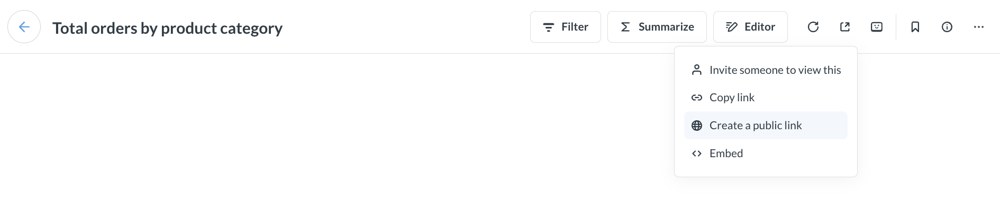
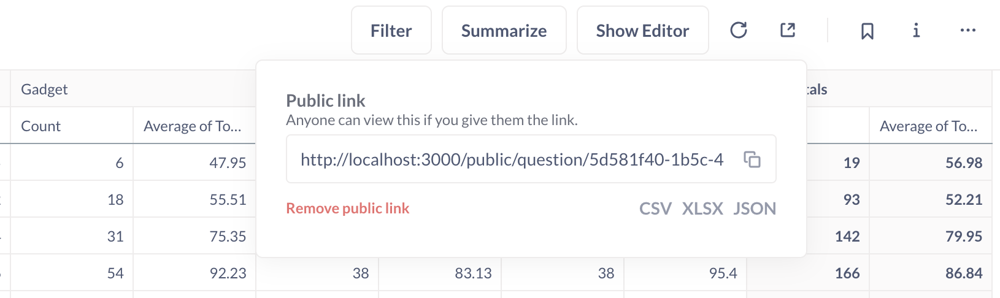
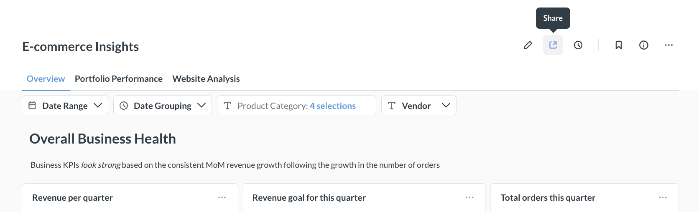
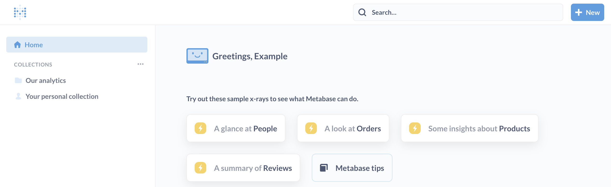
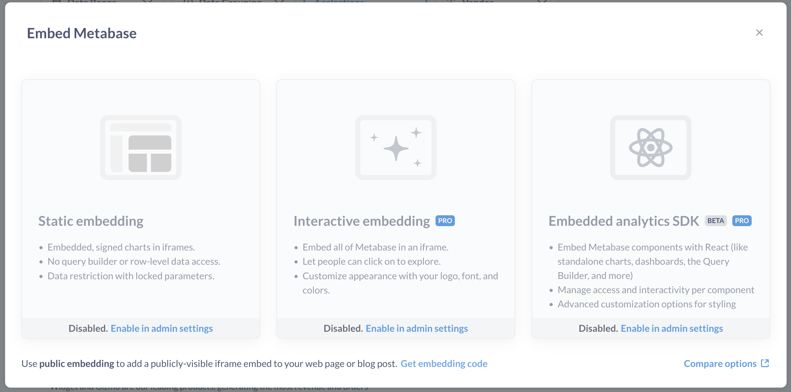
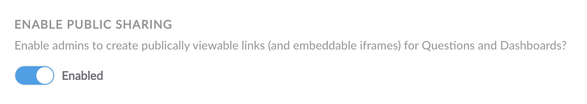
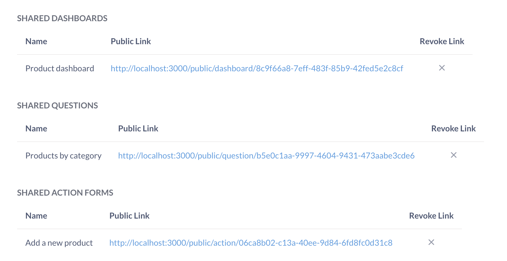

# Public sharing

> Only admins can create public links and iframes.

Admins can create and share public links (URLs) for questions, dashboards, and documents. People can view them as standalone destinations (URLs) or as embedded iframes in another page or app. Public items display view-only results of your question, dashboard, or document, so visitors won't be able to drill down into the underlying data on their own.

## Create a public link for a question



To create a public link for a question, admins can click on the **Share** icon at the top right of a question and select **Create a public link**. Copy the link and test it out by viewing the link in a private/incognito browser session.

## Public link to export question results in CSV, XLSX, JSON

This export option is only available for questions, not dashboards.

To create a public link that people can use to download the results of a question:

1. Click on the **Share** icon for the question.
2. Select **Create a public link**.
3. Click on the file format you want (below the **Public link** URL): CSV, XLSX, or JSON.



Open the public link in a new tab to test the download.

## Create a public link for a dashboard

To share a dashboard via a public link, admins can click on the **Share** button in the top right menu.



To embed a dashboard, see [guest embedding](./guest-embedding.md).

## Create a public link for a document

To share a document via a public link, admins can click on the **Share** button in the top right menu and select **Create a public link**.

Public documents are read-only: viewers cannot edit the content or add comments. For charts embedded in the document, viewers can download the results in CSV, XLSX, or JSON format using the **Download results** option in the chart menu.

## Exporting raw, unformatted question results

To export the raw, unformatted rows, you'll need to append `?format_rows=false` to the URL Metabase generates. For example, if you create a public link for a CSV download, the URL would look like:

```html
https://www.example.com/public/question/cf347ce0-90bb-4669-b73b-56c73edd10cb.csv?format_rows=false
```

By default, Metabase will export the results of a question that include any formatting you added (for example, if you formatted a column with floats to display as a percentage (0.42 -> 42%)).

See docs for the [export format endpoint](https://www.metabase.com/docs/latest/api#tag/public/GET/public/card/{uuid}/query/{export-format}).

## Simulating drill-through with public links

Metabase's automatic [drill-through](../questions/visualizations/drill-through.md) won't work on public dashboards because public links don't give people access to your raw data.

You can simulate drill-through on a public dashboard by setting up a [custom click behavior](../dashboards/interactive.md) that sends people from one public link to another public link.

1. Create a second dashboard to act as the destination dashboard.
2. [Create a public link](#create-a-public-link-for-a-dashboard) for the destination dashboard.
3. Copy the destination dashboard's public link.
4. On your primary dashboard, create a [custom destination](../dashboards/interactive.md#custom-destinations) with type "URL".
5. Set the custom destination to the destination dashboard's public link.
6. Optional: pass a filter value from the primary dashboard to the destination dashboard by adding a query parameter to the end of the destination URL:

```

/public/dashboard/?child_filter_name={{parent_column_name}}

```

For example, if you have a primary public dashboard that displays **Invoices** data, you can pass the **Plan** name (on click) to a destination public dashboard that displays **Accounts** data:



## Public embeds



If you want to embed your question or dashboard as an iframe in a simple web page or app:

1. Click on the **Share** icon for your question or dashboard.
2. Click **Embed**.
3. In the bottom of the embedding popup, click on **Get embedding code**.
4. Copy the iframe snippet Metabase generates for you.
5. Paste the iframe snippet in your destination of choice.

To customize the appearance of your question or dashboard, you can update the link in the `src` attribute with [public embed parameters](#public-embed-parameters).

Nobody signs in to view a public link or public embed, so a question that uses a [custom visualization](../questions/visualizations/custom.md) falls back to the default visualization for its results. To render custom visualizations, you'll need an authenticated [modular embed](./modular-embedding.md) with the visualization on your [allowlist](./custom-visualizations.md).

## Public embed parameters

To apply appearance or filter settings to your public embed, you can add parameters to the end of the link in your iframe's `src` attribute.

Note that it's possible to find the public link URL behind a public embed. If someone gets access to the public link URL, they can remove the parameters from the URL to view the original question or dashboard (that is, without any appearance or filter settings).

If you'd like to create a secure embed that prevents people from changing filter names or values, check out [guest embedding](./guest-embedding.md).

## Appearance parameters

To toggle appearance settings, add _hash_ parameters to the end of the public link in your iframe's `src` attribute. For example, this link shows a dashboard in dark mode, without a border, and with its title:

```
your_public_link#theme=night&bordered=false&titled=true
```

Separate multiple hash parameters with an ampersand (`&`). Query parameters for [filters](#filter-parameters) go before the `#`.

| Parameter name             | Possible values                                                                                                                                    |
| -------------------------- | -------------------------------------------------------------------------------------------------------------------------------------------------- |
| `background`               | `true` (default), `false`. Dashboards only.                                                                                                        |
| `bordered`                 | `true` (default), `false`.                                                                                                                         |
| `locale`\*                 | E.g., `ko`. See [list of locales](../configuring-metabase/localization.md#supported-languages)                                                     |
| `titled`                   | `true` (default), `false`.                                                                                                                         |
| `theme`                    | `null` (default), `night`. `theme=transparent` should work, but is deprecated (see [Transparent backgrounds](#transparent-backgrounds-for-embeds)) |
| `refresh` (dashboard only) | integer (seconds, e.g., `refresh=60`).                                                                                                             |
| `font`\*                   | [font name](../configuring-metabase/fonts.md)                                                                                                      |
| `downloads`\*\*            | `true` (default), `false`, `results`, `pdf`                                                                                                        |

\* Available on [Pro](https://www.metabase.com/product/pro) and [Enterprise](https://www.metabase.com/product/enterprise) plans

\*\* Disabling downloads is available on [Pro](https://www.metabase.com/product/pro) and [Enterprise](https://www.metabase.com/product/enterprise) plans.

The same hash parameters work on [static embeds](./static-embedding.md). For global appearance settings, such as the colors and fonts used across your entire Metabase instance, see [Customizing Metabase's appearance](../configuring-metabase/appearance.md).

### Set the language for a public or static embed



To change the UI language, set the `locale` hash parameter to one of the [supported locales](../configuring-metabase/localization.md#supported-languages). For example, to set a public dashboard's language to Korean, append `#locale=ko`:

```
https://metabase.example.com/public/dashboard/7b6e347b-6928-4aff-a56f-6cfa5b718c6b?category=&city=&state=#locale=ko
```

The `locale` parameter changes the language for Metabase UI elements, like the label of the **Export to PDF** button. To change the _content_'s language (like names of questions and dashboards), you'll need to [upload a translation dictionary](./translations.md).

### Transparent backgrounds for embeds

Making an embed transparent depends on what you're embedding:

- Dashboards: set `background=false`. You can combine it with `theme` (e.g., `background=false&theme=night`).
- Questions: set `theme=transparent` (deprecated, but still supported).

### Disable downloads for an embedded question or dashboard



By default, Metabase includes a **Download** button on embedded questions, and an **Export to PDF** option on embedded dashboards. The `downloads` hash parameter controls them:

- `true` (default): include both the Download and Export to PDF options.
- `false`: hide both the Download and Export to PDF options.
- `results`: show the Download option.
- `pdf`: show the Export to PDF option (dashboards only).

You can combine the explicit options: `downloads=results,pdf` is the same as `downloads=true`.

The `downloads` parameter replaces the legacy `hide_download_button` parameter.

## Filter parameters

You can display a filtered view of your question or dashboard in a public embed. Make sure you've set up a [question filter](../questions/query-builder/filters.md) or [dashboard filter](../dashboards/filters.md) first.

To apply a filter to your embedded question or dashboard, add a _query_ parameter to the end of the link in your iframe's `src` attribute, like this:

```
/dashboard/42?filter_name=value
```

For example, say that we have a dashboard with an "ID" filter. We can give this filter a value of 7:

```
/dashboard/42?id=7
```

To set the "ID" filter to a value of 7 _and_ hide the "ID" filter widget from the public embed:

```
/dashboard/42?id=7#hide_parameters=id
```

To specify multiple values for filters, separate the values with ampersands (&), like this:

```
/dashboard/42?id=7&name=janet
```

You can hide multiple filter widgets by separating the filter names with commas, like this:

```
/dashboard/42#hide_parameters=id,customer_name
```

To pass several values to one filter, repeat it:

```
/dashboard/42?category=Gadget&category=Gizmo
```

Note that the name of the filter in the URL should be specified in lower case, and with underscores instead of spaces. If your filter is called "Filter for User ZIP Code", you'd write:

```
/dashboard/42?filter_for_user_zip_code=02116
```

Values are case-sensitive and have to match your data. Replace spaces in values with underscores. For the date formats a date filter accepts, check out the [Parameters reference](./parameters-reference.md#date-formats).

For filter values that people can't remove from the URL, check out [locked parameters](./parameters.md#restrict-data-with-locked-parameters) on a guest or static embed.

### Maximum URL length

The maximum length of an embedding URL (including all parameters) is determined by your [`MB_JETTY_REQUEST_HEADER_SIZE`](../configuring-metabase/environment-variables.md#mb_jetty_request_header_size) environment variable. The default is 8192 bytes.

If your URL exceeds the maximum header size, you'll see a log message like `URI too long`. You can update the environment variable to accept larger headers. If you're using a proxy server, you may need to set a corresponding property on the server as well.

## Disable public sharing

Public sharing is enabled by default.



To disable public sharing:

1. Click the **grid** icon in the upper right.
2. Select **Admin**.
3. In the **Settings** tab, select **Public sharing**.
4. Toggle off **Public sharing**.

Once toggled on, the **Public sharing** section will display Metabase questions, dashboards, documents, and actions with active public links.

If you disable public sharing, then re-enable public sharing, all your previously generated public links will still work (as long as you didn't deactivate them).

## Deactivating public links and embeds

### Individual question or dashboard links and embeds

1. Visit the question or dashboard.
2. Click on the **Share** icon.
3. Select **Public link** or **Embed**.
4. Click **Remove public link**.

## Deactivating multiple public links and embeds

Admins can view and deactivate all public links for a Metabase.

1. Click the **grid** icon in the upper right.
2. Select **Admin**.
3. Go to the **Settings** tab.
4. Go to the **Public sharing** tab in the left sidebar.
5. For each item you want to deactivate, click on the **X** to revoke its public link.

## See all publicly shared content

Admins can see all publicly shared questions, dashboards, documents, and actions in **Admin > Public Sharing**.



## Further reading

- [Publishing data visualizations to the web](https://www.metabase.com/learn/metabase-basics/embedding/charts-and-dashboards).
- [Customizing Metabase's appearance](../configuring-metabase/appearance.md).
- [Embedding introduction](../embedding/start.md).
- [Custom visualizations in embeds](./custom-visualizations.md).
