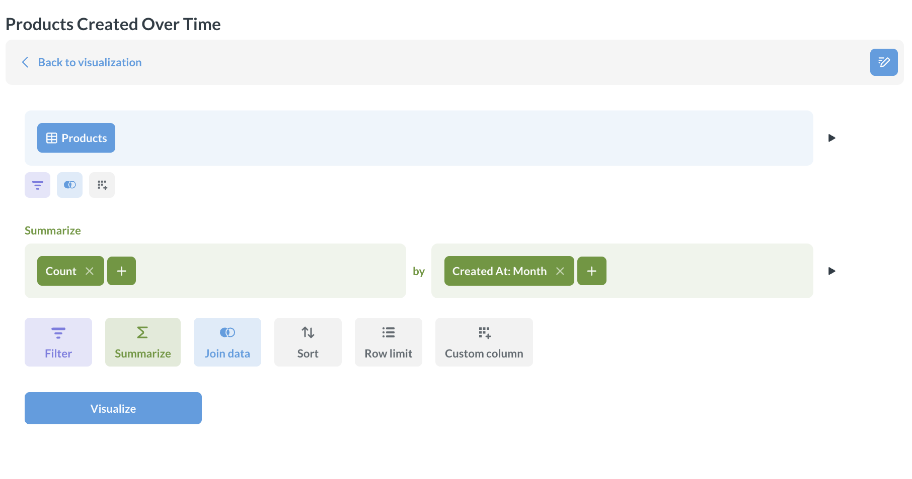
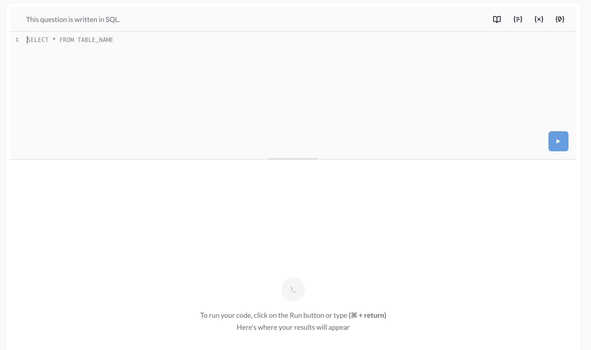

# Embed the query builder



You can embed one of Metabase's query editors so people can build questions from scratch.

- [Visual query builder](#embed-the-visual-query-builder)
- [SQL editor](#embed-the-sql-editor)

Both query editors need a logged-in Metabase account: to run a new query, Metabase has to know who's asking, so it can work out which data they're allowed to see. In an embed, [SSO](./introduction.md#components-with-sso-authentication) is how you provide that account, so neither editor works in a [guest embed](./introduction.md#components-with-guest-authentication). Check out [SSO or guest embeds](./introduction.md#comparison-between-sso-and-guest-authentication).

And because everyone queries through their own Metabase account, people can only build questions on databases their groups have permission to query. See [data permissions](../permissions/data.md).

Both query editors use the same `<metabase-question>` element as an embedded chart, so they take the same attributes and props. See the [Question component reference](./question-reference.md).

To embed an existing chart instead, check out [Embed a chart](./chart.md).

## Embed the visual query builder

To let people build new questions with the visual query builder, use `new` as the question ID.



As a web component:

```html
<metabase-question question-id="new"></metabase-question>
```

With the SDK:

```tsx

```

To narrow down what people can start from, list the entity types you want in the data picker with the `entity-types` attribute (web component) or the `entityTypes` prop (SDK). For example, `entity-types="['table']"` limits the picker to raw tables. The attribute takes `"table"`, `"model"`, or both.

## Embed the SQL editor



To let people write native SQL, use `new-native` as the question ID.

As a web component:

```html
<metabase-question question-id="new-native"></metabase-question>
```

With the SDK:

```tsx

```

## Let people save questions

### Saving with web components

With a web component, turn saving on with `is-save-enabled="true"`. `target-collection` is optional, but it's worth setting: it picks the collection that new questions land in, so people's work doesn't scatter across your Metabase.

```html
<metabase-question
  question-id="new"
  is-save-enabled="true"
  target-collection="5"
></metabase-question>
```

These examples use sequential IDs — the number in the item's URL. On Pro and Enterprise plans, you can use [entity IDs](../installation-and-operation/serialization.md#entity-ids-work-with-embedding) instead; they stay the same when you [serialize](../installation-and-operation/serialization.md) content from one Metabase to another, like from staging to production.

### Saving with the React SDK

With the SDK, saving is already on, so `targetCollection` is all you need. Setting `targetCollection` also hides the collection picker, so nobody has to decide where their question goes.

For the `isSaveEnabled`, `onBeforeSave`, and `onSave` props, check out [Let people save their changes](./chart.md#let-people-save-their-changes).

## Customize the query builder's layout

With the SDK, you can build your own layout out of the namespaced components inside `InteractiveQuestion`, like `<InteractiveQuestion.Editor />`. See [InteractiveQuestion components](./question-reference.md#react-sdk-interactivequestion-components).

## Further reading

- [Embed a chart](./chart.md)
- [Question component reference](./question-reference.md)
- [Embed a dashboard](./dashboard.md)
- [Dashboard component reference](./dashboard-reference.md)
- [Modular embedding](./modular-embedding.md)
- [Modular embedding SDK](./sdk/introduction.md)
- [Modular embedding components](./components.md)
- [Appearance](./appearance.md)
