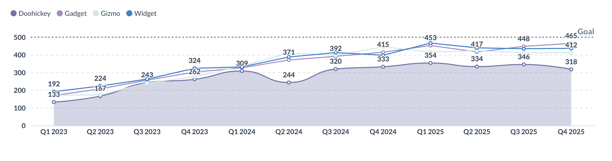
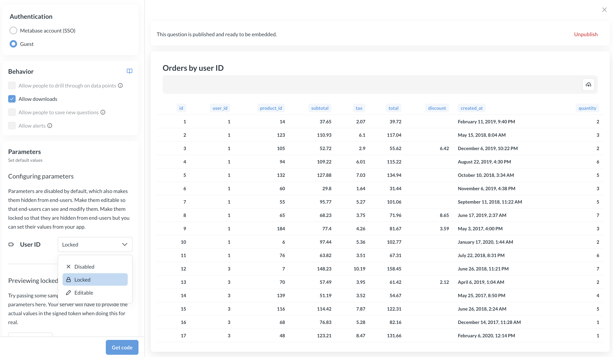
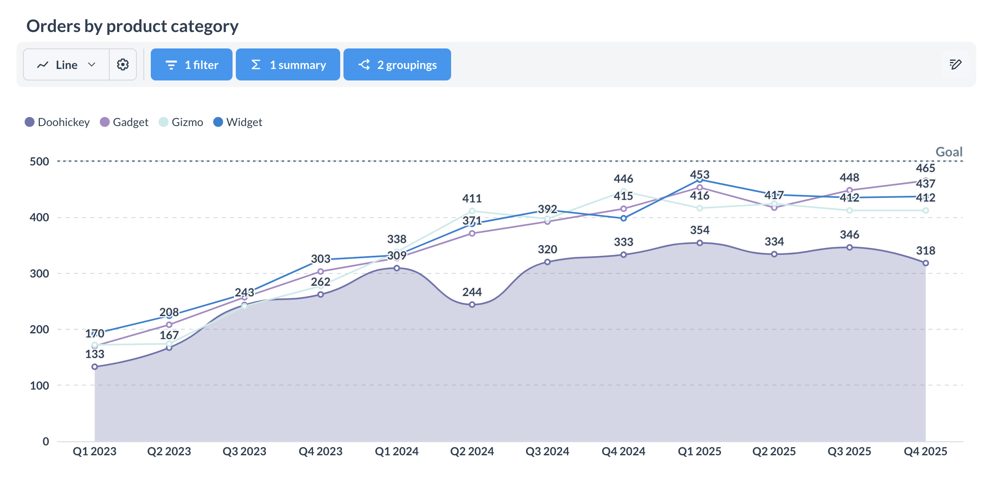
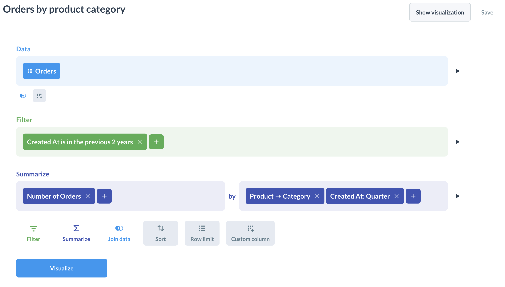

# Embed a chart

A question component embeds a single Metabase question (a chart, table, or other visualization) in your app. You can display a read-only chart, an interative chart,the graphical query builder, or the SQL editor.

- [View-only chart](#embed-a-view-only-chart)
- [Interactive chart](#embed-an-interactive-chart)\*
- [Query builder](#embed-the-query-builder)\*
- [SQL editor](#embed-the-sql-editor)\*

\* Only available on Pro and Enterprise plans. Requires logging people in to your Metabase via SSO, so Metabase knows what data each person is allowed to query.

For embedding an AI chat component, see [AI chat](./sdk/ai-chat.md).

## Embed a view-only chart



A view-only (a.k.a. "static") chart displays results without letting people explore the data. You can add editable filters that viewers can use to filter the chart. You can also lock filters to filter rows, for example to filter rows by user ID. 

With view-only charts, however, people won't be able to drill through the chart, or self-serve new queries.

- [Web components](#view-only-charts-using-a-web-component)
- [React SDK](#view-only-charts-using-the-react-sdk)

### View-only charts using a web component

You can use the in-app wizard to set up a view-only chart using web components.



Before you start, an admin needs to [turn on guest embedding](./guest-embedding.md#turning-on-guest-embedding-in-metabase).

1. Visit the question in your Metabase.
2. Click the **Share** icon in the upper right.
3. Select **Embed** to open the embedding wizard.
4. For authentication, choose **Guest**. This is the setting that makes the chart view-only. People who view this chart are treated as a guest, so your app won't need to log people in to your Metabase to view the question. Choose **Guest** before you publish; the **Publish** button only shows up once you've selected guest authentication.
5. Publish the question: click the **Publish** button. If you don't publish the question, none of this will work.
6. For behavior, select from the [following options](#question-attributes).
7. If you're embedding a SQL question with a variable, set the parameter to **Editable** or **Locked**. Parameters are **Disabled** by default, which hides them and prevents your server from setting them. See [Configuring parameters](./guest-embedding.md#configuring-parameters).
8. Customize the [appearance](./appearance.md).
9. Click the **Get code** button. You'll get both the frontend and backend code based on the selections you made in the wizard.
10. Copy the client code and paste it in your app.
11. Remove the hardcoded JWT tokens in your HTML. Fetch the token from your backend and pass the token to the component programmatically.

To keep an embed alive after its token expires, configure a token endpoint with [`guestEmbedProviderUri`](./guest-embedding.md#refreshing-or-initializing-the-jwt-from-your-server).

#### View-only chart example with web components

Say you have a question written in SQL, with a field filter to filter orders by `user_id`. You want to embed the question, and filter the orders that people see based on their user ID.

Here's the question.

```sql

SELECT
  *
FROM
  orders
WHERE
  {{user_id}}

```

Here's the frontend code. This example includes a theme that defines the chart's appearance.

```html
<script defer src="https://your-metabase.example.com/app/embed.js"></script>
<script>
function defineMetabaseConfig(config) {
  window.metabaseConfig = config;
}
</script>

<script>
  defineMetabaseConfig({
    "theme": {
      "colors": {
        "background-secondary": "hsla(240, 11%, 98%, 1)",
        "positive": "hsla(89, 48%, 40%, 1)",
        "negative": "hsla(358, 71%, 62%, 1)",
        "background": "hsla(0, 0%, 100%, 1.00)",
        "brand": "#509EE2",
        "text-tertiary": "hsla(204, 66%, 8%, 0.44)",
        "filter": "hsla(240, 65%, 69%, 1)",
        "text-primary": "hsla(204, 66%, 8%, 0.84)",
        "text-secondary": "hsla(204, 66%, 8%, 0.62)",
        "border": "hsla(195, 6%, 87%, 1)",
        "shadow": "hsla(204, 66%, 8%, 0.17)",
        "charts": [
          "#509EE3",
          "#88BF4D",
          "#A989C5",
          "#EF8C8C",
          "#F9D45C",
          "#F2A86F",
          "#98D9D9",
          "#7172AD"
        ],
        "summarize": "hsla(89, 48%, 40%, 1)",
        "background-disabled": "rgb(247, 247, 247)",
        "brand-hover": "rgb(185, 216, 243)",
        "brand-hover-light": "rgb(238, 245, 252)"
      }
    },
    "isGuest": true,
    "instanceUrl": "https://your-metabase.example.com"
  });
</script>

<!--
Fetch the JWT token from your backend and programmatically pass it to the 'metabase-question'.
-->
<metabase-question
  token="PASS_SIGNED_TOKEN_FROM_SERVER"
  with-title="true"
  with-downloads="true">
</metabase-question>
```

On the server side, you set the value for the locked parameter in the token, so people can't see or change it. That way you can show user 13 a question filtered to just the orders placed by user 13.

```js
// you will need to install via 'npm install jsonwebtoken' or in your package.json

const jwt = require("jsonwebtoken");

// Get your key from your Metabase at
// /admin/embedding/guest -> Embedding secret key
const METABASE_SECRET_KEY = "YOUR_SECRET_KEY"

// Here we lock a user_id parameter to 13
const payload = {
  resource: { question: 40956 },
  params: {
    "user_id": [
      13, // you can set this value programmatically based on who is logged into your app
    ],
  },
  exp: Math.round(Date.now() / 1000) + (10 * 60), // 10 minute expiration
};
const token = jwt.sign(payload, METABASE_SECRET_KEY);
```

You can generate the above code using the in-app wizard. Set the `user_id` parameter to **Locked** in the question's embed settings and publish the question. Parameters are **Disabled** by default. Metabase will reject a token that includes a value for a disabled parameter. See [Locked parameters](./guest-embedding.md#locked-parameters).

For all modular embeds, you can also set a `locale` in your page-level configuration to [translate embedded content](./translations.md).

For the full list of attributes, see [Question attributes](#question-attributes).

#### The "Powered by Metabase" banner

Metabase adds a "Powered by Metabase" banner to guest embeds (both charts and dashboards) on the OSS and Starter plans. To remove the banner, upgrade to a [Pro](https://www.metabase.com/product/pro) or [Enterprise](https://www.metabase.com/product/enterprise) plan.

### View-only charts using the React SDK



To embed a view-only chart with the [SDK](./sdk/introduction.md), use the `StaticQuestion` component. Wrap the component in a `MetabaseProvider` with your auth config.

```typescript

```

The component has a default height, which you can change with the `height` prop. To inherit the height from the parent container, pass `100%`.

#### `StaticQuestion` props



## Embed an interactive chart



An interactive chart lets people explore their data: they can drill through the chart, filter results, summarize and group them, and optionally save their changes. With SSO, people can self-serve their data (which means less work for you building bespoke charts).

- [Web components](#interactive-charts-using-a-web-component)
- [React SDK](#interactive-charts-using-the-react-sdk)

### Interactive charts using a web component

On an [SSO embed](./modular-embedding.md), reference an existing question by ID. [Drill-through](../questions/visualizations/drill-through.md) is on by default:

```html
<metabase-question question-id="1"></metabase-question>
```

Turn drill-through off with the `drills` attribute. Disabling drill-through also disables people's ability to add filters and summaries.

### Interactive charts using the React SDK

Use `InteractiveQuestion` when you want people to explore their data and customize the layout.



```typescript

```

#### `InteractiveQuestion` props



#### `InteractiveQuestion` components

These components are available via the `InteractiveQuestion` namespace (like `<InteractiveQuestion.Filter />`). Use them to [customize the layout](#customize-the-layout) of an interactive question.

- [InteractiveQuestion.AlertsButton](./sdk/api/InteractiveQuestion.html#alertsbutton)
- [InteractiveQuestion.Breakout](./sdk/api/InteractiveQuestion.html#breakout)
- [InteractiveQuestion.BreakoutDropdown](./sdk/api/InteractiveQuestion.html#breakoutdropdown)
- [InteractiveQuestion.ChartTypeDropdown](./sdk/api/InteractiveQuestion.html#charttypedropdown)
- [InteractiveQuestion.ChartTypeSelector](./sdk/api/InteractiveQuestion.html#charttypeselector)
- [InteractiveQuestion.DownloadWidget](./sdk/api/InteractiveQuestion.html#downloadwidget)
- [InteractiveQuestion.DownloadWidgetDropdown](./sdk/api/InteractiveQuestion.html#downloadwidgetdropdown)
- [InteractiveQuestion.Editor](./sdk/api/InteractiveQuestion.html#editor)
- [InteractiveQuestion.EditorButton](./sdk/api/InteractiveQuestion.html#editorbutton)
- [InteractiveQuestion.Filter](./sdk/api/InteractiveQuestion.html#filter)
- [InteractiveQuestion.FilterDropdown](./sdk/api/InteractiveQuestion.html#filterdropdown)
- [InteractiveQuestion.NavigationBackButton](./sdk/api/InteractiveQuestion.html#navigationbackbutton)
- [InteractiveQuestion.QuestionSettings](./sdk/api/InteractiveQuestion.html#questionsettings)
- [InteractiveQuestion.QuestionSettingsDropdown](./sdk/api/InteractiveQuestion.html#questionsettingsdropdown)
- [InteractiveQuestion.QuestionVisualization](./sdk/api/InteractiveQuestion.html#questionvisualization)
- [InteractiveQuestion.ResetButton](./sdk/api/InteractiveQuestion.html#resetbutton)
- [InteractiveQuestion.SaveButton](./sdk/api/InteractiveQuestion.html#savebutton)
- [InteractiveQuestion.SaveQuestionForm](./sdk/api/InteractiveQuestion.html#savequestionform)
- [InteractiveQuestion.SqlParametersList](./sdk/api/InteractiveQuestion.html#sqlparameterslist)
- [InteractiveQuestion.Summarize](./sdk/api/InteractiveQuestion.html#summarize)
- [InteractiveQuestion.SummarizeDropdown](./sdk/api/InteractiveQuestion.html#summarizedropdown)
- [InteractiveQuestion.Title](./sdk/api/InteractiveQuestion.html#title)
- [InteractiveQuestion.VisualizationButton](./sdk/api/InteractiveQuestion.html#visualizationbutton)

[InteractiveQuestion.BackButton](./sdk/api/InteractiveQuestion.html#backbutton) is deprecated. Use `InteractiveQuestion.NavigationBackButton` instead.

#### Customize the layout

By default, `InteractiveQuestion` comes with a layout that lets people view the question, apply filters and aggregations, and use the query builder:

```typescript

```

To build your own layout, use namespaced components inside `InteractiveQuestion` (like `<InteractiveQuestion.Filter />`):

```typescript

```

#### Customize what happens when someone clicks on a chart

When people click a data point in an interactive chart, Metabase shows a menu of actions. With the SDK, the [`mapQuestionClickActions`](./sdk/plugins.md) plugin lets you customize this: open the default menu, add custom actions, or perform an immediate action without a menu.

Use it globally on `MetabaseProvider`, or on individual `InteractiveQuestion` components:

```typescript

```

You can also customize how custom actions look in the menu:

```typescript

```

#### Let people save their changes

By default, the SDK's `InteractiveQuestion` lets people save changes. (The `<metabase-question>` web component is the opposite: saving is off unless you set `is-save-enabled="true"`.) To control saving:

- `isSaveEnabled` shows or hides the save button.
- `onBeforeSave` runs before a save (it can be async).
- `onSave` runs after a successful save. It receives the updated question and a context object with `isNewQuestion`.
- `targetCollection` pre-selects the collection to save to and hides the collection picker.

To prevent people from saving changes (or saving as a new question), set `isSaveEnabled={false}`:

```tsx

```

In the embed wizard, this corresponds to the **Allow people to save new questions** option.

## Embed the query builder

To let people build new questions with the visual query builder, use `new` as the question ID. This requires an SSO or SDK embed.



As a web component:

```html
<metabase-question question-id="new"></metabase-question>
```

With the SDK:

```tsx

```

To let people save the questions they build, set the collection with `target-collection` (web component) or `targetCollection` (SDK).

With web components, you also need `is-save-enabled="true"`, as saving is off by default:

```html
<metabase-question
  question-id="new"
  is-save-enabled="true"
  target-collection="5"
></metabase-question>
```

With the SDK, saving is on by default, so `targetCollection` is enough. To customize the layout, use the [namespaced components](#customize-the-layout).

## Embed the SQL editor

To let people write native SQL, use `new-native` as the question ID. This requires an SSO or SDK embed.

As a web component:

```html
<metabase-question question-id="new-native"></metabase-question>
```

With the SDK:

```tsx

```

As with the query builder, saving is on by default in the SDK, but off in web components until you set `is-save-enabled="true"`.

## Filter results based on who's viewing the chart

To show each person only their own data, you have two options, depending on how you authenticate.

**Guest embeds** can [lock a parameter](./guest-embedding.md#locked-parameters) so you can filter data without exposing the filter to the viewer. Set the parameter's value in the JWT on your server; it applies without the viewer seeing or changing it. This is handy for showing each customer only their own data.

```javascript
const payload = {
  resource: { question: 5 },
  params: {
    category: ["Gadget"], // Locked. The viewer can't see or change this.
  },
  exp: Math.round(Date.now() / 1000) + 10 * 60,
};

const token = jwt.sign(payload, METABASE_SECRET_KEY);
```

**SSO embeds** identify each viewer with their own Metabase account, so you can apply [data permissions](../permissions/embedding.md), [row and column security](../permissions/row-and-column-security.md), and [database routing](../permissions/database-routing.md) instead of locking parameters by hand.

## Use your app to control parameters

You can pass values to a question's [SQL parameters](../questions/native-editor/sql-parameters.md) in the format `{parameter_name: parameter_value}`, and keep your app in sync as people change them.

> SQL parameters only work with native SQL questions, not query-builder questions.

### With the SDK

`initialSqlParameters` sets the values once on load (uncontrolled). Your app won't know when people change them:

```typescript

```

`sqlParameters` with `onSqlParametersChange` works like a controlled `<input value onChange>`: your app holds the source of truth, and you get a callback whenever applied values change:

```typescript

```

`onSqlParametersChange` receives the [SQL question parameter change payload](./parameters.md#sql-question-parameter-change-payload). For how values are resolved (clearing, defaults, missing slugs), see [Modular embedding parameters](./parameters.md#how-parameter-values-are-resolved).

### With web components

Seed values once with the `initial-sql-parameters` attribute:

```html
<metabase-question
  question-id="42"
  initial-sql-parameters='{"product_id": 50}'
></metabase-question>
```

To push values at runtime (controlled), set the `sqlParameters` property on the element instead of the attribute, and listen for the `sql-parameters-change` event. See [Modular embedding parameters](./parameters.md#modular-embedding-web-components) for the full pattern.

To hide a parameter from the question's UI, use the `hidden-parameters` attribute (web component) or the `hiddenParameters` prop (SDK). Both require a Pro or Enterprise plan and an SSO embed; `hidden-parameters` has no effect on a guest embed. To hide a parameter on a guest embed, set the parameter to **Locked** or leave it **Disabled** in the question's embed settings.

## Let people set up alerts on a question

You can let people set up [alerts](../questions/alerts.md) on a saved question by passing `withAlerts` to `StaticQuestion` or `InteractiveQuestion`, or the `with-alerts` attribute on the web component.

Metabase only shows the alerts button when all of these are true:

- Your Metabase has [email set up](../configuring-metabase/email.md).
- The embed is an authenticated (SSO) embed. 
- The person viewing the embed has permission to create subscriptions and alerts.

Alerts created in an embedded context only send to the logged-in user and exclude links to Metabase items.

```tsx
<MetabaseProvider authConfig={authConfig}>
  <InteractiveQuestion questionId={42} withAlerts />
</MetabaseProvider>
```

## Question attributes



## Customize chart appearance

You can theme an embedded question and toggle parts of its UI. For the full set of theming options, see [Appearance](./appearance.md).

- **Title**: show or hide the question title with `with-title` (web component) or `title` (SDK).
- **Downloads**: show or hide download buttons with `with-downloads` / `withDownloads`. Defaults to `true` on OSS/Starter and `false` on Pro/Enterprise. Disabling downloads requires a [Pro](https://www.metabase.com/product/pro) or [Enterprise](https://www.metabase.com/product/enterprise) plan.
- **Chart type selector**: show or hide it with `withChartTypeSelector` (SDK).
- **Theme**: set a light or dark preset, or (on Pro/Enterprise) customize colors and fonts. The `question` component in the theme has its own overrides:

```js
{
  components: {
    question: {
      // Background color for all questions
      backgroundColor: "#2E353B",

      // Toolbar of the default interactive question layout
      toolbar: {
        backgroundColor: "#F3F5F7",
      },
    },
  },
}
```

Colors set in a question's visualization settings override theme colors.

## Further reading

- [Appearance](./appearance.md)
- [Modular embedding parameters](./parameters.md)
- [Guest embeds](./guest-embedding.md)
- [Authentication](./authentication.md)
- [Modular embedding SDK](./sdk/introduction.md)
- [AI chat](./sdk/ai-chat.md)
