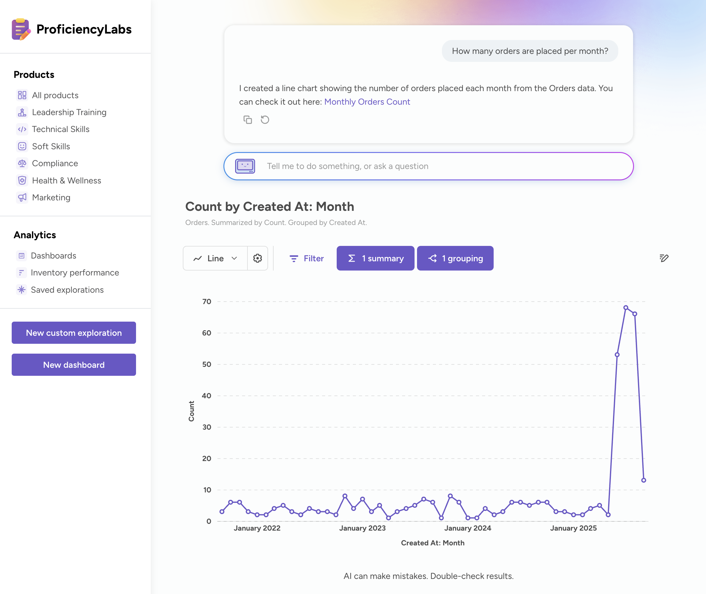

# Modular embedding SDK - AI chat





You can embed an AI chat in your application similar to [Metabot](../modular-embedding.md) in Metabase.

Embedded Metabot is a more focused version of [Metabot](../../ai/metabot.md) designed to work well in an embedded context. Embedded Metabot can only display ad-hoc questions and metrics; it doesn't know about dashboards.

To help embedded Metabot more easily find and focus on the data you care about most, select the collection containing the models and metrics it should be able to use to create queries.

If you're embedding the Metabot component in an app, you can specify a different collection that embedded Metabot is allowed to use for creating queries.

## Chat preview

You can check out a [demo of the AI chat component](https://embedded-analytics-sdk-demo.metabase.com/admin/analytics/new/ask-metabot) on our Shoppy demo site.

## Example

```typescript

```

## Props



## API reference

- [Component](./api/MetabotQuestion.html)
- [Props](./api/MetabotQuestionProps.html)

## Setting up AI chat

To configure your embedded AI chat in your Metabase:

1. Click the **gear** icon in the upper right.
2. Select **Admin settings**.
3. Click the **AI** tab.
4. In the left sidebar, click **Embedded Metabot**.

When embedding the Metabot component in your app, you should specify a collection that embedded Metabot is allowed to use for creating queries. Embedded Metabot will only have access to that collection.

For tips and more, see [Metabot settings](../../ai/settings.md).

## Layout

Use the `layout` prop to specify which layout to use for the Metabot component:

- `auto` (default): Metabot uses the `stacked` layout on mobile screens, and a `sidebar` layout on larger screens.
- `stacked`: the question visualization stacks on top of the chat interface.
- `sidebar`: the question visualization appears to the left of the chat interface, which is on a sidebar on the right.
