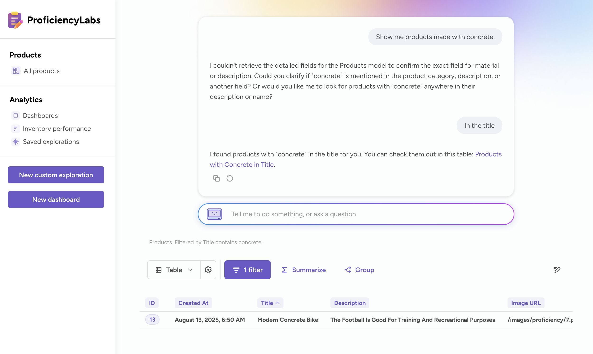

# Embedded analytics SDK - AI chat





You can embed an AI chat in your application similar to [Metabot](../embedded-analytics-js.md) in Metabase.

To help embedded Metabot more easily find and focus on the data you care about most, select the collection containing the models and metrics it should be able to use to create queries.

If you're embedding the Metabot component in an app, you can specify a different collection that embedded Metabot is allowed to use for creating queries.

## Chat preview

You can check out a [demo of the chat component](https://embedded-analytics-sdk-demo.metabase.com/admin/analytics/new/ask-metabot) on our Shoppy demo site.

## Example

```typescript

```

## Setting up AI chat

To configure your embedded AI chat in your Metabase:

1. Click the **gear** icon in the upper right.
2. Select **Admin settings**.
3. Click the **AI** tab.
4. In the left sidebar, click **Embedded Metabot**.

When embedding the Metabot component in your app, you can specify a collection that embedded Metabot is allowed to use for creating queries. Embedded Metabot will only have access to that collection.

For tips and more, see [Metabot settings](../../ai/settings.md).
