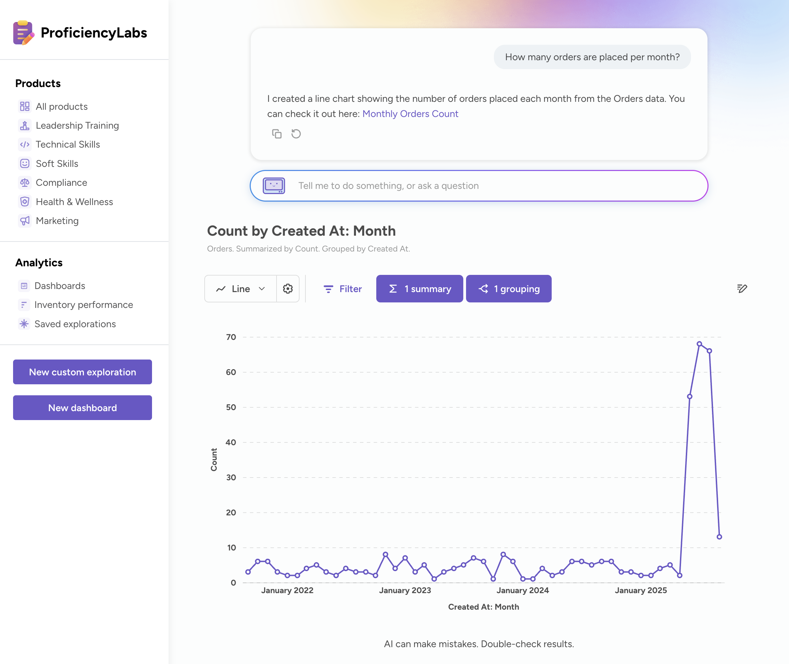
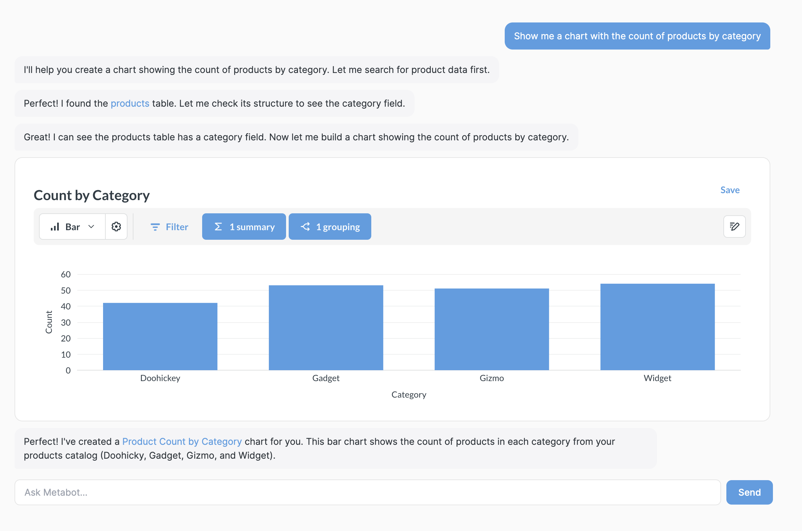
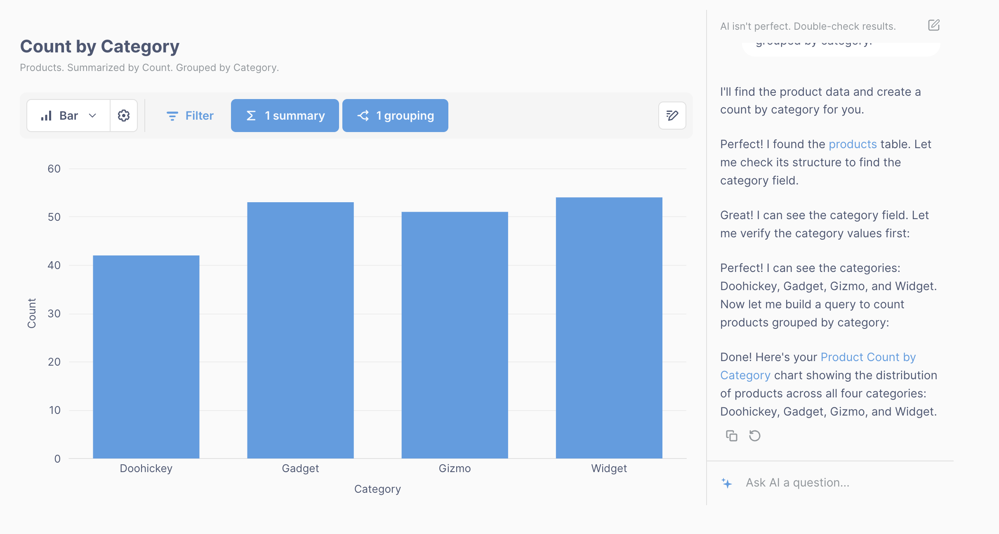

# Modular embedding SDK - AI chat





You can embed an AI chat in your application similar to [Metabot](../modular-embedding.md) in Metabase.

Embedded Metabot is a more focused version of [Metabot](../../ai/metabot.md) designed to work well in an embedded context. Embedded Metabot can only display ad-hoc questions and metrics; it doesn't know about dashboards.

To help embedded Metabot more easily find and focus on the data you care about most, select the collection containing the models and metrics it should be able to use to create queries.

If you're embedding the Metabot component in an app, you can specify a different collection that embedded Metabot is allowed to use for creating queries.

## Chat preview

You can check out a [demo of the AI chat component](https://embedded-analytics-sdk-demo.metabase.com/admin/analytics/new/ask-metabot) on our Shoppy demo site.

## Example

```typescript

```

## Props



## API reference

- [Component](./api/MetabotQuestion.html)
- [Props](./api/MetabotQuestionProps.html)

## Setting up AI chat

To configure your embedded AI chat in your Metabase:

1. Click the **grid** icon in the upper right.
2. Select **Admin**.
3. Click the **AI** tab.
4. In the left sidebar, click **Embedded Metabot**.

When embedding the Metabot component in your app, you should specify a collection that embedded Metabot is allowed to use for creating queries. Embedded Metabot will only have access to that collection.

For tips and more, see [Metabot settings](../../ai/settings.md).

## Layout

Use the `layout` prop to specify which layout to use for the Metabot component:

- `auto` (default): Metabot uses the `stacked` layout on mobile screens, and a `sidebar` layout on larger screens.
- `stacked`: the question visualization stacks on top of the chat interface.
- `sidebar`: the question visualization appears to the left of the chat interface, which is on a sidebar on the right.

## Building custom UIs with `useMetabot`

If `MetabotQuestion`'s built-in layouts don't fit your app, use the `useMetabot` hook to read Metabot's conversation state directly and render your own UI. The hook gives you the messages, the chart the agent most recently produced, processing and error state, and actions to submit, cancel, retry, or reset the conversation.

`useMetabot` returns `null` until the SDK bundle has loaded and `<MetabaseProvider>` has mounted. Always guard before use. If you don't guard it, the first render will throw `Cannot read properties of null` when you reach for `metabot.messages`, `metabot.submitMessage`, etc., because the SDK ships its Metabot internals via a code-split chunk that isn't available synchronously.

`MetabotQuestion` renders agent text messages internally, including markdown formatting, transcript scrolling, and input styling. The `useMetabot` hook hands you the raw conversation state. Which means you own the rendering. In particular, agent text messages (`message.type === 'text'`) contain **markdown**: links, bold, lists, inline code. The snippets below render `message.message` as plain text for brevity, but production usage should pass the text through a markdown renderer (`react-markdown`, `markdown-to-jsx`, or your own) so links and formatting display correctly.

The `Chart` component on each chart message, and the `CurrentChart` returned by the hook, accept the same props as [`StaticQuestion`](./questions.md#static-question) except `questionId`, `token`, and `query`, which the SDK already wires for you. Most apps will set `drills` (to allow click-actions on chart elements) and `height`. The `height="100%"` only works if the parent has a defined height. The dedicated-chart snippet below sets `height: 600` on the outer flex container for that reason.

### Inline charts



Each agent chart message carries a pre-wired `Chart` component. Walk the messages and render charts inline alongside the chat transcript:

```typescript

```

### Dedicated chart panel



`CurrentChart` is a pre-wired component bound to the latest chart the agent produced. Render it once on the side and it swaps as new charts arrive. Filter chart messages out of the transcript so they don't render twice:

```typescript

```

### Return shape



### API reference

- [Hook](./api/useMetabot.html)
- [`UseMetabotResult`](./api/UseMetabotResult.html)
- [`MetabotMessage`](./api/MetabotMessage.html)
- [`MetabotChartProps`](./api/MetabotChartProps.html)
- [`MetabotErrorMessage`](./api/MetabotErrorMessage.html)
