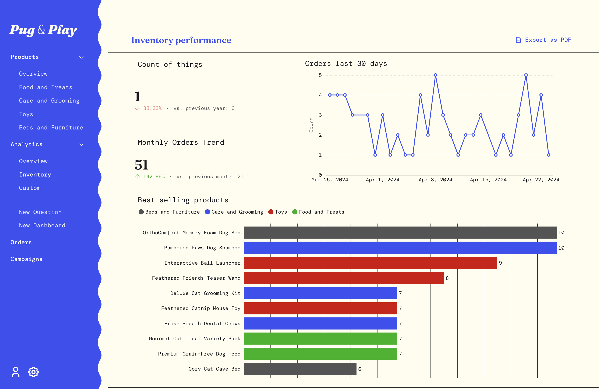

# Embedded analytics SDK



With the Embedded analytics SDK, you can embed individual Metabase components with React (like standalone charts, dashboards, the query builder, and more). You can manage access and interactivity per component, and you have advanced customization for seamless styling.

## Example apps built with the embedded analytics SDK

To give you an idea of what's possible with the SDK, we've put together example sites at [metaba.se/sdk-demo](https://metaba.se/sdk-demo). Navigate between different shop websites. Check them out and poke around their products and analytics sections, as well as the New Question and New Dashboard options.



Here's the [Shoppy source code](https://github.com/metabase/shoppy).

## Embedded analytics SDK prerequisites

- React application using React 17 or React 18.
- Nodejs 20.x or higher.
- Metabase version 1.52 or higher.

## Quickstarts

- [Quickstart](./quickstart.md) (If you have Metabase and an app)
- [Quickstart CLI](./quickstart-cli.md) (If you have an app, but no Metabase)
- [Quickstart with sample React app](./quickstart-with-sample-app.md) (If you don't have either)

## Installation

To use the SDK, you'll need to enable the SDK in Metabase, and install the SDK in your React app.

### Enable the SDK in Metabase

Enable the Embedded analytics SDK by going to **Admin settings > Settings > Embedding**. Toggle on the SDK, and hit **Configure**. Enter the origins for your website or app where you want to allow SDK embedding, separated by a space. Localhost is automatically included.

### Install the SDK in your React application

You can install the Embedded analytics SDK for React via npm. Make sure to use the dist-tag that corresponds to your Metabase version, example: 53-stable for Metabase 53:

```bash
npm install @metabase/embedding-sdk-react@53-stable
```

or with yarn:

```bash
yarn add @metabase/embedding-sdk-react@53-stable
```

## Developing with the Embedded analytics SDK

Start with one of the quickstarts, then see these pages for more info on components, theming, and more.

- [Authentication](./authentication.md)
- [Questions](./questions.md)
- [Dashboards](./dashboards.md)
- [Appearance](./appearance.md)
- [Collections](./collections.md)
- [Plugins](./plugins.md)
- [Config](./config.md)
- [Versioning](./version.md)
- [Notes on Next.js](./next-js.md)

## Embedded analytics SDK source code

You can find the [Embedded analytics SDK source code in the Metabase repo](https://github.com/metabase/metabase/tree/master/enterprise/frontend/src/embedding-sdk).

## Changelog

View the SDK's changelog:

* [54-nightly](https://github.com/metabase/metabase/blob/master/enterprise/frontend/src/embedding-sdk/CHANGELOG.md)
* [53-stable](https://github.com/metabase/metabase/blob/release-x.53.x/enterprise/frontend/src/embedding-sdk/CHANGELOG.md)
* [52-stable](https://github.com/metabase/metabase/blob/release-x.52.x/enterprise/frontend/src/embedding-sdk/CHANGELOG.md)

## Embedded analytics SDK on NPM

Check out the Metabase Embedded analytics SDK on NPM: [metaba.se/sdk](https://metaba.se/sdk).

## SDK limitations

The SDK doesn't support:

- Verified content
- Official collections
- Subscriptions
- Alerts
- Server-side rendering (SSR)
- Multiple _interactive_ dashboards on the same application page. If you need to embed multiple dashboards on the same application page, you can embed static dashboards.
- React 19

## Issues, feature requests and support

[Bugs](https://github.com/metabase/metabase/issues/?q=is%3Aissue%20state%3Aopen%20label%3AType%3ABug%20label%3AEmbedding%2FSDK) and [feature requests](https://github.com/metabase/metabase/issues/?q=is%3Aissue%20state%3Aopen%20label%3AEmbedding%2FSDK%20label%3A%22Type%3ANew%20Feature%22) are tracked on GitHub. 

You can upvote an existing feature request by leaving a thumbs up emoji reaction on the issue. Feel free to leave comments with context that could be useful. [Read more](https://www.metabase.com/docs/latest/troubleshooting-guide/requesting-new-features).

Before creating new issues, please make sure an issue for your problem or feature request doesn't already exist.
 
To seek help:

- Paid customers can contact our success team through the usual channels.
- People using the open-source edition can post on our [discussion forums](https://discourse.metabase.com/).
