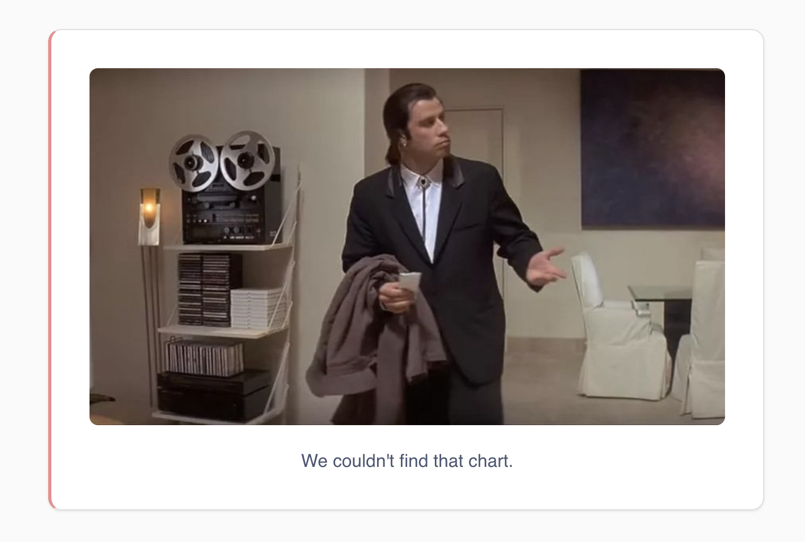

# Customize loading, error, and empty states





While an embedded component is loading, when it fails, or when a query comes back with no rows, the [modular embedding SDK](./introduction.md) renders a screen of its own. You can swap in your own React components and images instead, so all three states match the rest of your app.

These customizations are SDK only. `loaderComponent` and `errorComponent` are props on `MetabaseProvider`, the no-results image comes from a [plugin](./plugins.md), and there's no web component equivalent for any of them.

## Replace the loading and error components

Pass `loaderComponent` and `errorComponent` to `MetabaseProvider`. Every embedded component inside that provider picks them up.

```tsx



```

`loaderComponent` receives an optional `label` prop with the loading message, which you can render or ignore. `errorComponent` receives the error details, so you can decide how much of the error to show, and where to put it.

## Error component props

These are the props Metabase passes to your `errorComponent`. The `type` prop tells you how Metabase intended to display the error: `relative` errors sit in the flow of the component, while `fixed` errors are meant to overlay the page, like a toast.



## Replace the no-results illustration

By default, Metabase displays a sailboat image when a query returns no results. To use a different image, set the `getNoDataIllustration` and `getNoObjectIllustration` plugins.

Unlike `loaderComponent` and `errorComponent`, these are [plugins](./plugins.md), so they go in `pluginsConfig` rather than being props of their own. And instead of a React component, each one returns a base64-encoded image:

```typescript

```

`getNoDataIllustration` covers a query that came back with no rows. `getNoObjectIllustration` covers a search that turned up nothing, like a search page or an entity picker with no matches. Both can only be set [globally](./plugins.md#plugin-scope), on the provider.

## Further reading

- [Modular embedding SDK plugins](./plugins.md)
- [Appearance](../appearance.md)
- [Modular embedding SDK config](./config.md)
- [Modular embedding components](../components.md)
