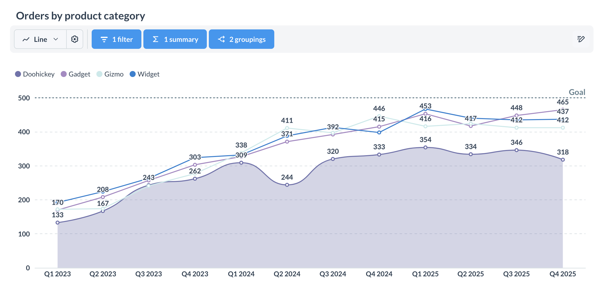
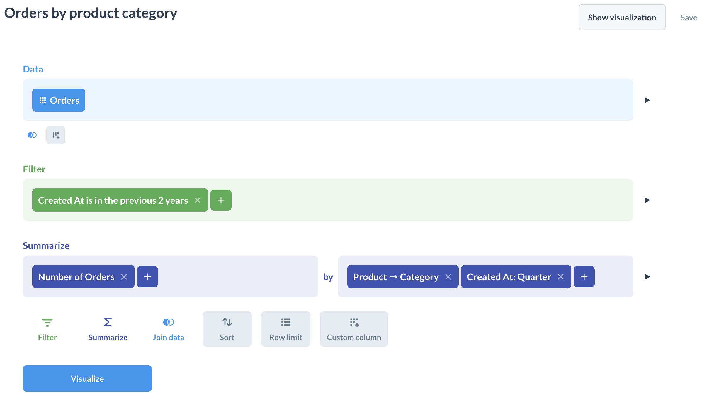

# Modular embedding SDK - questions



There are different ways you can embed questions:

- [Static question](#staticquestion). Embeds a chart. Clicking on the chart doesn't do anything.
- [Interactive question](#interactivequestion). Create new questions or edit existing ones with the visual query builder or SQL editor. Clicking on the chart gives you the drill-through menu.

## Embedding a question

You can embed a question using the one of the question components:

### `StaticQuestion`

A lightweight question component. Use this component when you want to display results without letting people interact with the data.


The component has a default height, which can be customized by using the `height` prop. To inherit the height from the parent container, you can pass `100%` to the height prop.

#### API Reference

- [Component](./api/StaticQuestion.html)
- [Props](./api/StaticQuestionProps.html)

#### Example

```typescript

```

#### Props



### `InteractiveQuestion`

Use this component when you want to allow people to explore their data and customize question layout.



#### API Reference

- [Component](./api/InteractiveQuestion.html)
- [Props](./api/InteractiveQuestionProps.html)

#### Example

```typescript

```

#### Props



## Pass SQL parameters to SQL questions with `initialSqlParameters`

You can pass parameter values to questions defined with SQL via the `initialSqlParameters` prop, in the format of `{parameter_name: parameter_value}`. Learn more about [SQL parameters](../../questions/native-editor/sql-parameters.md).

```typescript

```

`initialSqlParameters` can't be used with questions built using the query builder.

## Enable alerts on embedded questions

You can let people set up [alerts](../../questions/alerts.md) on embedded questions by passing the `withAlerts` prop to `StaticQuestion` or `InteractiveQuestion`. Alerts require [email setup](../../configuring-metabase/email.md), and the question must be saved (not a new question).

Alerts created in an embedded context only send to the logged-in user and exclude links to Metabase items.

```tsx
<StaticQuestion questionId={42} withAlerts />
```

## Questions with natural language

See [AI chat](./ai-chat.md).

## Customizing interactive questions

By default, the modular embedding SDK provides a default layout for interactive questions that allows you to view your questions, apply filters and aggregations, and access functionality within the query builder.

Here's an example of using the `InteractiveQuestion` component with its default layout:

```typescript

```

To customize the layout, use namespaced components within the `InteractiveQuestion` component. For example:

```typescript

```

### Interactive question components

These components are available via the `InteractiveQuestion` namespace (e.g., `<InteractiveQuestion.Filter />`).

#### API Reference:

- [InteractiveQuestion.BackButton](./api/InteractiveQuestion.html#backbutton)
- [InteractiveQuestion.Breakout](./api/InteractiveQuestion.html#breakout)
- [InteractiveQuestion.BreakoutDropdown](./api/InteractiveQuestion.html#breakoutdropdown)
- [InteractiveQuestion.ChartTypeDropdown](./api/InteractiveQuestion.html#charttypedropdown)
- [InteractiveQuestion.ChartTypeSelector](./api/InteractiveQuestion.html#charttypeselector)
- [InteractiveQuestion.Editor](./api/InteractiveQuestion.html#editor)
- [InteractiveQuestion.EditorButton](./api/InteractiveQuestion.html#editorbutton)
- [InteractiveQuestion.Filter](./api/InteractiveQuestion.html#filter)
- [InteractiveQuestion.FilterDropdown](./api/InteractiveQuestion.html#filterdropdown)
- [InteractiveQuestion.QuestionSettings](./api/InteractiveQuestion.html#questionsettings)
- [InteractiveQuestion.QuestionSettingsDropdown](./api/InteractiveQuestion.html#questionsettingsdropdown)
- [InteractiveQuestion.QuestionVisualization](./api/InteractiveQuestion.html#questionvisualization)
- [InteractiveQuestion.ResetButton](./api/InteractiveQuestion.html#resetbutton)
- [InteractiveQuestion.SaveButton](./api/InteractiveQuestion.html#savebutton)
- [InteractiveQuestion.SaveQuestionForm](./api/InteractiveQuestion.html#savequestionform)
- [InteractiveQuestion.Summarize](./api/InteractiveQuestion.html#summarize)
- [InteractiveQuestion.SummarizeDropdown](./api/InteractiveQuestion.html#summarizedropdown)
- [InteractiveQuestion.DownloadWidget](./api/InteractiveQuestion.html#downloadwidget)
- [InteractiveQuestion.DownloadWidgetDropdown](./api/InteractiveQuestion.html#downloadwidgetdropdown)
- [InteractiveQuestion.Title](./api/InteractiveQuestion.html#title)

## Interactive question plugins

You can use [plugins](./plugins.md) to add custom functionality to your questions.

### `mapQuestionClickActions`

When people click on a data point in the embedded interactive chart, Metabase shows them a menu of actions by default. The plugin `mapQuestionClickActions` allows you to customize this behavior. You can choose to:

- Open the default Metabase menu.
- Add custom actions to that click-through menu.
- Perform immediate action without opening a menu.

Use `mapQuestionClickActions` globally at the provider level, or on individual `InteractiveQuestion` or `InteractiveDashboard` components. For more on provider scope, see [Plugins](./plugins.md)

The example below shows all the options for click action behavior. This example will:

- Open a menu with custom actions when "Last Name" column is clicked.
- Perform an immediate action (show an alert) when the "Plan" column is clicked.
- Shows the default menu (available as `clickActions`) in all other cases.

The behavior is determined by what `mapQuestionClickActions` returns: array of actions to open a menu, or a single action to trigger an immediate action.

```typescript

```

You can also customize the appearance of custom actions in the click menu. The example below shows an example of a click menu with default actions, a custom action, and a custom action with customized appearance:

```typescript

```

## Prevent people from saving changes to an `InteractiveQuestion`

To prevent people from saving changes to an interactive question, or from saving changes as a new question, you can set `isSaveEnabled={false}`:

```tsx

```

## Create and edit questions with the query builder



The `InteractiveQuestion` component supports three modes:

- `questionId="new"` — opens the visual query builder for creating new questions.
- `questionId="new-native"` — opens the SQL editor for creating new questions.
- A numeric `questionId` (e.g., `questionId={42}`) — embeds an existing question. People can click the edit button to modify it, which opens the appropriate editor (visual or SQL) based on the question type.

### Embed the visual query builder

To embed the query builder for creating new questions, pass `questionId="new"` to the `InteractiveQuestion` component. You can use the [`children` prop](#customizing-interactive-questions) to customize the layout.

```tsx

```

### Embed the SQL editor

To embed the SQL editor for creating new questions, pass `questionId="new-native"` to the `InteractiveQuestion` component:

```tsx

```

To customize the question editor's layout, use the `InteractiveQuestion` component [directly with a custom `children` prop](#customizing-interactive-questions).
