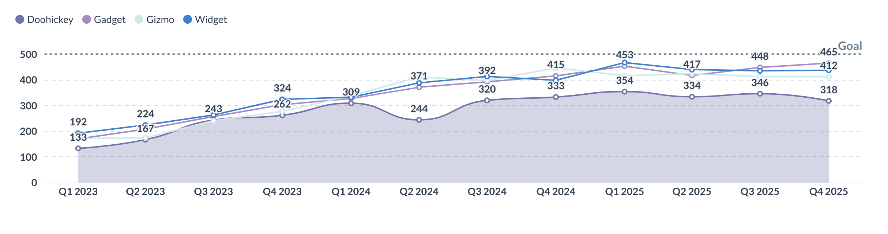

# Embedded analytics SDK - questions



There are different ways you can embed questions:

- [Static question](#staticquestion). Embeds a chart. Clicking on the chart doesn't do anything.
- [Interactive question](#interactivequestion). Clicking on the chart gives you the drill-through menu.
- [Query builder](#embedding-the-query-builder-for-creating-new-questions). Embeds the graphical query builder without a pre-defined query.

## Embedding a question

You can embed a question using the one of the question components:

### `StaticQuestion`

A lightweight question component. Use this component when you want to display results without letting people interact with the data.



The component has a default height, which can be customized by using the `height` prop. To inherit the height from the parent container, you can pass `100%` to the height prop.

#### API Reference
- [Component](./api/StaticQuestion.html)
- [Props](./api/StaticQuestionProps.html)

#### Example

```typescript

```

#### Props



### `InteractiveQuestion`

Use this component when you want to allow people to explore their data and customize question layout.


#### API Reference
- [Component](./api/InteractiveQuestion.html)
- [Props](./api/InteractiveQuestionProps.html)

#### Example

```typescript

```

#### Props



## Pass SQL parameters to SQL questions with `initialSqlParameters`

You can pass parameter values to questions defined with SQL via the `initialSqlParameters` prop, in the format of `{parameter_name: parameter_value}`. Learn more about [SQL parameters](../../questions/native-editor/sql-parameters.md).

```typescript

```

`initialSqlParameters` can't be used with questions built using the query builder.

## Customizing interactive questions

By default, the Embedded analytics SDK provides a default layout for interactive questions that allows you to view your questions, apply filters and aggregations, and access functionality within the query builder.

Here's an example of using the `InteractiveQuestion` component with its default layout:

```typescript

```

To customize the layout, use namespaced components within the `InteractiveQuestion` component. For example:

```typescript

```

### Interactive question components

These components are available via the `InteractiveQuestion` namespace (e.g., `<InteractiveQuestion.Filter />`).

#### API Reference:
- [InteractiveQuestion.BackButton](./api/InteractiveQuestion.html#backbutton)
- [InteractiveQuestion.Breakout](./api/InteractiveQuestion.html#breakout)
- [InteractiveQuestion.BreakoutDropdown](./api/InteractiveQuestion.html#breakoutdropdown)
- [InteractiveQuestion.ChartTypeDropdown](./api/InteractiveQuestion.html#charttypedropdown)
- [InteractiveQuestion.ChartTypeSelector](./api/InteractiveQuestion.html#charttypeselector)
- [InteractiveQuestion.Editor](./api/InteractiveQuestion.html#editor)
- [InteractiveQuestion.EditorButton](./api/InteractiveQuestion.html#editorbutton)
- [InteractiveQuestion.Filter](./api/InteractiveQuestion.html#filter)
- [InteractiveQuestion.FilterDropdown](./api/InteractiveQuestion.html#filterdropdown)
- [InteractiveQuestion.QuestionSettings](./api/InteractiveQuestion.html#questionsettings)
- [InteractiveQuestion.QuestionSettingsDropdown](./api/InteractiveQuestion.html#questionsettingsdropdown)
- [InteractiveQuestion.QuestionVisualization](./api/InteractiveQuestion.html#questionvisualization)
- [InteractiveQuestion.ResetButton](./api/InteractiveQuestion.html#resetbutton)
- [InteractiveQuestion.SaveButton](./api/InteractiveQuestion.html#savebutton)
- [InteractiveQuestion.SaveQuestionForm](./api/InteractiveQuestion.html#savequestionform)
- [InteractiveQuestion.Summarize](./api/InteractiveQuestion.html#summarize)
- [InteractiveQuestion.SummarizeDropdown](./api/InteractiveQuestion.html#summarizedropdown)
- [InteractiveQuestion.DownloadWidget](./api/InteractiveQuestion.html#downloadwidget)
- [InteractiveQuestion.DownloadWidgetDropdown](./api/InteractiveQuestion.html#downloadwidgetdropdown)
- [InteractiveQuestion.Title](./api/InteractiveQuestion.html#title)

## Interactive question plugins

You can use [plugins](./plugins.md) to add custom functionality to your questions.

### `mapQuestionClickActions`

This plugin allows you to add custom actions to the click-through menu of an interactive question. You can add and
customize the appearance and behavior of the custom actions.

```typescript

```

## Prevent people from saving changes to an `InteractiveQuestion`

To prevent people from saving changes to an interactive question, or from saving changes as a new question, you can set `isSaveEnabled={false}`:

```tsx

```

## Embedding the query builder for creating new questions


You can embed the query builder for creating new questions by passing the `questionId="new"` prop to the `InteractiveQuestion` component. You can use the [`children` prop](#customizing-interactive-questions) to customize the layout for creating new questions.

```tsx

```

To customize the question editor's layout, use the `InteractiveQuestion` component [directly with a custom `children` prop](#customizing-interactive-questions).
