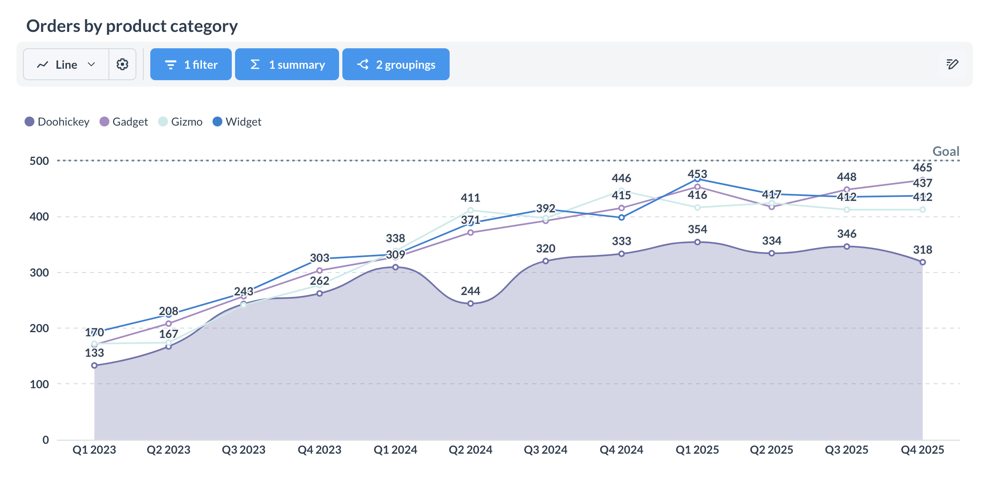

# Modular embedding SDK - quickstart with sample app



This guide sets up the modular embedding SDK with a [sample React app](https://github.com/metabase/metabase-nodejs-react-sdk-embedding-sample/tree/{{page.version | remove: "v0."}}-stable), but you can follow along with your own application.



## Prerequisites

- [Node.js 20.x LTS or higher](https://nodejs.org/en) (for the sample application).
- [Metabase version v1.52 or higher](https://github.com/metabase/metabase/releases).
- [A Metabase Pro or Enterprise license](https://www.metabase.com/pricing/) (If you don't have a license, check out [this quickstart](./quickstart.md) that lacks the paid JWT SSO setup.)
- (Optional): [Docker](https://www.docker.com/)

## Clone the sample app repo

1. Clone the [sample React app](https://github.com/metabase/metabase-nodejs-react-sdk-embedding-sample/tree/{{page.version | remove: "v0."}}-stable).

```bash
git clone git@github.com:metabase/metabase-nodejs-react-sdk-embedding-sample.git
```

2. Check out the branch in the [metabase-nodejs-react-sdk-embedding-sample](https://github.com/metabase/metabase-nodejs-react-sdk-embedding-sample/tree/{{page.version | remove: "v0."}}-stable) repo that corresponds to your Metabase version.

```bash
git checkout {{page.version}}-stable
```

E.g., if you're running Metabase 1.57 make sure the sample app repo is on the `57-stable` branch. You can find your Metabase version in the Metabase UI by clicking on the gears icon in the upper right and selecting **About Metabase**.

## Two ways to set up the sample app with Metabase

- [Quick setup with Docker](#quick-setup-with-docker) (includes a sample Metabase)
- [Walkthrough setup](#walkthrough-setup) (bring your own Metabase, or spin up a new one)

## Quick setup with Docker

This setup will run a Docker container with the sample app and a sample Metabase.

1. Copy the environment template file:

   In the cloned directory, run:

```bash
cp .env.docker.example .env.docker
```

2. In the `.env.docker` file, replace `<your_enterprise_token>` with your premium embedding token.

3. In the top-level directory, run:

```bash
yarn start
```

This script will:

- Pull a Metabase Docker image and run it in a container.
- Set up [JWT SSO in Metabase](../../people-and-groups/authenticating-with-jwt.md)
- Build and run the sample application with an embedded question.

4. The app will start on [http://localhost:4400](http://localhost:4400).

That's it!

If you want to log in to the sample Metabase this command set up, visit [http://localhost:4300](http://localhost:4300). You can log in with email and password as Rene Descartes:

- email: rene@example.com
- password: foobarbaz

## Walkthrough setup

We're going to do some setup in Metabase, and then in the sample application. You can also bring your own Metabase, in which case you can skip the installation step.

Here's a quick overview of what you'll be doing:

### Set up Metabase for embedding

1. [Install Metabase Enterprise Edition](#install-metabase-enterprise-edition) (if you haven't already)
2. [Activate your license](#activate-your-license)
3. [Enable embedding](#enable-embedding-in-metabase)
4. [Enable SSO with JWT](#enable-sso-with-jwt)

### Start up the sample application

5. [Set up the application environment](#set-up-the-application-environment).
6. [Run the app server](#set-up-the-application-server) to handle authentication with JWT and serve the embedded Metabase components.
7. [Run the client application](#set-up-the-client-application) that will contain Metabase components built with the SDK.

And then fiddle around with styling.

Let's go.

## Install Metabase Enterprise Edition

You can run Metabase Pro on a Cloud plan with a [free trial](https://www.metabase.com/pricing/).

Or run it locally. Here's a [docker](../../installation-and-operation/running-metabase-on-docker.md) one-liner:

```bash
docker run -d -p 3000:3000 --name metabase metabase/metabase-enterprise:latest
```

You can also [download the JAR](https://downloads.metabase.com/enterprise/latest/metabase.jar), and run it like so:

```bash
java --add-opens java.base/java.nio=ALL-UNNAMED -jar metabase.jar
```

By default, Metabase will run at `http://localhost:3000`.

If you get stuck, check out our [installation docs](../../installation-and-operation/installing-metabase.md).

## Activate your license

To enable SSO with JWT when self-hosting, you'll need to [activate your license](../../installation-and-operation/activating-the-enterprise-edition.md). Metabase Pro plans on Cloud take care of this for you.

## Enable embedding in Metabase

From any Metabase page, click on the **gear** icon in the upper right and select **Admin Settings** > **Embedding**.

Turn on:

- Modular embedding SDK

Otherwise, this whole thing is hopeless.

## Enable SSO with JWT

We'll also need to update our JWT Provider URI in Metabase. By default, this URI is where the SDK will redirect login requests.

From any Metabase page, click on the **gear** icon in the upper right and select **Admin Settings** > **Settings** > **Authentication**.

On the card that says **JWT**, click the **Setup** button.

### JWT Identity provider URI

In **JWT IDENTITY PROVIDER URI** field, paste

```txt
http://localhost:9090/sso/metabase
```

Or substitute your Cloud URL for `http://localhost`.

### String used by the JWT signing key

Click the **Generate key** button.

Copy the key and paste it in your `.env` file into the env var `METABASE_JWT_SHARED_SECRET`.

The application server will use this key to sign tokens so Metabase knows the application's requests for content are authorized.

## Save and enable JWT

Be sure to hit the **Save and enable** button, or all is void.

## Set up the sample application

## Set up the application environment

[Clone the sample app](#clone-the-sample-app-repo) and `cd` into it.

In the sample app's main directory, copy the `.env.example` template to `.env`.

```sh
cp .env.example .env
```

In `.env`, make sure `VITE_METABASE_INSTANCE_URL` and `METABASE_INSTANCE_URL` point to your Metabase instance URL, e.g., `http://localhost:3000`.

Your `.env` will look something like:

```txt
# FRONTEND
CLIENT_PORT=3100
VITE_METABASE_INSTANCE_URL="http://localhost:3000"

# BACKEND
AUTH_PROVIDER_PORT=9090
METABASE_INSTANCE_URL="http://localhost:3000"
METABASE_JWT_SHARED_SECRET="TODO"
```

## Set up the application server

Change into the `server` directory:

```sh
cd server
```

Install packages:

```sh
npm install
```

Start the server:

```sh
npm start
```

## Set up the client application

In a different terminal, change into the `client` directory:

```sh
cd client
```

Install dependencies:

```sh
npm install
```

This command will install the [Metabase modular embedding SDK](https://www.npmjs.com/package/@metabase/embedding-sdk-react), in addition to the application's other dependencies.

You can also install a [different version of the SDK](./version.md). Just make sure that the major version of the SDK matches the major version of the Metabase you're using.

Start the client app:

```sh
npm start
```

Your browser should automatically open the app. By default, the app runs on [http://localhost:3100](http://localhost:3100).

## At this point, you should be up and running

In your app, you'll see an embedded `InteractiveQuestion` component.

```javascript

```



## Next steps

To style the components, try changing some of the `theme` options in the client app at `client/src/App.jsx`. For more on theming, check out [Appearance](../appearance.md).
