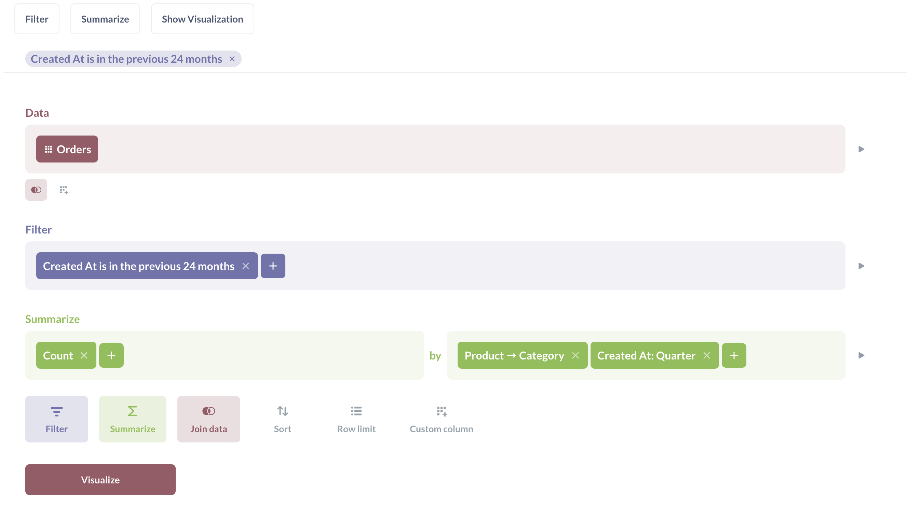

# Embedded analytics SDK quickstart guide

This guide sets up the embedded analytics SDK with the [sample React app](https://github.com/metabase/metabase-nodejs-react-sdk-embedding-sample), but you can follow along with your own application.

## Prerequisites

- [Node.js 18.x LTS or higher](https://nodejs.org/en) (for the sample application).

## Overview of the quickstart

We're going to do some setup in Metabase, and in the sample application.

### Set up Metabase for embedding

1. [Set up Metabase Enterprise Edition](#set-up-metabase-for-embedding) (if you haven't already)
2. [Enable embedding](#enable-embedding-in-metabase)
3. [Enable SSO with JWT](#enable-sso-with-jwt)

### Set up the sample application

4. [Get the sample application](#get-the-sample-application).
5. [Set up the application environment](#set-up-the-application-environment).
6. [Run the app server](#set-up-the-application-server) to handle authentication with JWT and server the embedded Metabase components.
7. [Run the client application](#set-up-the-client-application) that will contain Metabase components built with the SDK.

And then fiddle around with styling.

Let's go.

## Set up Metabase for embedding

- [Run Metabase Pro on a Cloud plan (with a free trial)](https://www.metabase.com/pricing)
- Run Metabase Enterprise Edition locally. This sample app is compatible with [Metabase version v1.50 or higher](https://www.metabase.com/docs/latest/releases). When running locally, you'll need to [activate your license](https://www.metabase.com/docs/latest/paid-features/activating-the-enterprise-edition) to enable SSO with JWT.

You can also use your existing Metabase, if you prefer.

### Enable embedding in Metabase

From any Metabase page, click on the **gear** icon in the upper right and select **Admin Settings** > **Settings** > **Embedding**.

Turn on:

- Embedded analytics SDK
- Static embedding

Otherwise, this whole thing is hopeless.

### Enable SSO with JWT

From any Metabase page, click on the **gear** icon in the upper right and select **Admin Settings** > **Settings** > **Authentication**.

On the card that says **JWT**, click the **Setup** button.

#### JWT Identity provider URI

In **JWT IDENTITY PROVIDER URI** field, paste

```
localhost:9090/sso/metabase
```

Or substitute your Cloud URL for /localhost.

#### String used by the JWT signing key

Click the **Generate key** button.

Copy the key and paste it in your `.env` file into the env var `METABASE_JWT_SHARED_SECRET`.

The application server will use this key to sign tokens so Metabase knows the application's requests for content are authorized.

### Save and enable JWT

Be sure to hit the **Save and enable** button, or all is void.

## Set up the sample application

Clone the [Metabase Node JS React SDK embedding sample app](https://github.com/metabase/metabase-nodejs-react-sdk-embedding-sample).

```sh
git clone git@github.com:metabase/metabase-nodejs-react-sdk-embedding-sample.git
```

## Set up the application environment

In the sample app's main directory, copy the `.env.example` template to `.env`.

```sh
cp .env.example .env
```

In `.env`, make sure `REACT_APP_METABASE_INSTANCE_URL` and `METABASE_INSTANCE_URL` point to your Metabase instance URL, e.g., `http://localhost:3000`.

You're `.env` will look something like:

```
# FRONTEND
PORT=3100
REACT_APP_METABASE_INSTANCE_URL="http://localhost:3000"
REACT_APP_JWT_PROVIDER_URI="http://localhost:9090/sso/metabase"

# BACKEND
BACKEND_PORT=9090
METABASE_INSTANCE_URL="http://localhost:3000"
METABASE_JWT_SHARED_SECRET="TODO"
```

## Set up the application server

Change into the `server` directory:

```sh
cd server
```

Install packages:

```sh
npm install
```

Start the server:

```sh
npm start
```

## Set up the client application

Change into the `client` directory.

Install packages:

```sh
npm install
```

This command will install the [Metabase embedded analytics SDK](https://metaba.se/sdk), in addition to the application's other dependencies.

## Start the client

In a different terminal, change into the `client` directory:

```sh
cd client
```

Install dependencies:

```sh
npm install
```

Start the client app:

```sh
npm start
```

Your browser should automatically open the app. By default, the app runs on [http://localhost:3100](localhost:3100).

## At this point, you should be up and running

In your app, you'll see an embedded `InteractiveQuestion` component.

```javascript
<MetabaseProvider config={config} theme={theme}>
  <InteractiveQuestion questionId={questionId} />
</MetabaseProvider>
```



Try changing some of the `theme` options in the [client app](https://github.com/metabase/metabase-nodejs-react-sdk-embedding-sample/blob/main/client/src/App.js) to style the components.

