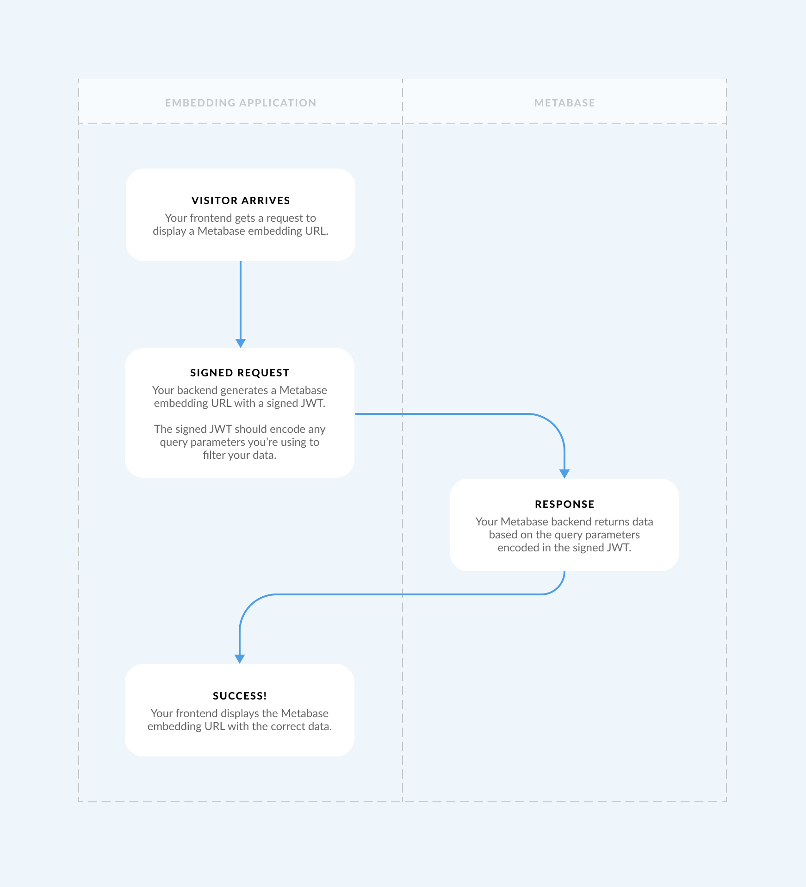
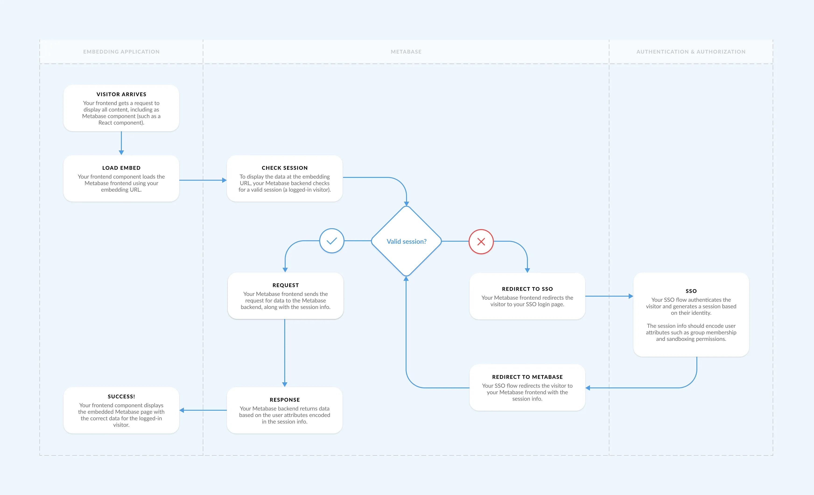

# Securing embedded Metabase

## Securing embeds with authentication and authorization

There are two basic ways to secure stuff on the internet:

1. **Authentication** looks at _who_ someone is (using standards such as [JWT](../people-and-groups/authenticating-with-jwt.md) or [SAML](../people-and-groups/authenticating-with-saml.md)).
2. **Authorization** looks at _what_ someone has access to (using standards such as OAuth 2.0).

In this guide, we'll talk primarily about authentication.

## Public embedding

[Public embedding](public-links.md#public-embeds) doesn't involve any authentication or authorization. A public embed displays a public link with a unique string at the end, like this:

```plaintext
https://my-metabase.com/public/dashboard/184f819c-2c80-4b2d-80f8-26bffaae5d8b
```

The string (in this example: `184f819c-2c80-4b2d-80f8-26bffaae5d8b`) uniquely identifies your Metabase question or dashboard. Since public embeds don't do any authentication or authorization, anyone with the URL can view the data.

### Example: filters in public links don't secure data

So, how could someone exploit a public embed? Say we have a dashboard that displays Accounts data:

| Account ID | Plan    | Status   |
| ---------- | ------- | -------- |
| 1          | Basic   | Active   |
| 2          | Basic   | Active   |
| 3          | Basic   | Inactive |
| 4          | Premium | Inactive |
| 5          | Premium | Active   |

We want to add a "Status = Active" filter and display the dashboard's public link in an embed:

| Account ID | Plan    | Status |
| ---------- | ------- | ------ |
| 1          | Basic   | Active |
| 2          | Basic   | Active |
| 5          | Premium | Active |

To apply and hide the "Status = Active" filter, we'll add [query parameters](public-links.md#public-embed-parameters) to the end of the public link in our embed:

```plaintext
https://my-metabase.com/public/dashboard/184f819c-2c80-4b2d-80f8-26bffaae5d8b?status=active#hide_parameters=status
```

Even though we've hidden the filter from the embed, someone could take the public link used in the embed, and remove the query parameter `?status=active`:

```plaintext
https://my-metabase.com/public/dashboard/184f819c-2c80-4b2d-80f8-26bffaae5d8b
```

Loading the public link without the query parameter would remove the "Status = Active" filter from the data. The person would get access to the original Accounts data, including the rows with inactive accounts.

## Guest embeds are authorized with JWT

Guest embedding uses a [JWT authorization flow](#guest-embedding-with-jwt-authorization) to do two things:

- Sign resources (e.g., the URLs of charts or dashboards) to ensure that only your embedding application can ask for data from your Metabase.
- Sign parameters (e.g., dashboard filters) to prevent people from [changing the filters](#example-filters-in-public-links-dont-secure-data) and getting access to other data.

### Guest embeds don't have user sessions

Guest embeds don't authenticate people's identities on the Metabase side, so people can view a guest embed without creating a Metabase account. However, without a Metabase account, Metabase won't have a way to remember a user or their session, which means:

- Metabase [permissions](../permissions/introduction.md) and [row and column security](../permissions/row-and-column-security.md) won't work --- if you need to lock down sensitive data, you must set up [locked parameters](#example-securing-data-with-locked-parameters-on-a-guest-embed) for _each_ of your guest embeds.
- Any filter selections in a guest embed will reset once the signed JWT expires.
- All guest embed usage will show up in [usage analytics](../usage-and-performance-tools/usage-analytics.md) under "External user".

## Security in guest embedding vs. modular and full app embedding

Guest embedding only guarantees authorized access to your Metabase data (you decide _what_ is accessible).

If you want to secure your guest embeds based on someone's identity (you decide _who_ gets access to _what_), you'll need to set up your own authentication flow and manually wire that up to [locked parameters](#example-sending-user-attributes-to-a-locked-parameter) on each of your guest embeds. Note that locked parameters are essentially filters, so you can only set up **row-level** restrictions in a guest embed.

If you want an easier way to embed different views of data for different customers (without allowing the customers to see each other’s data), learn how [Modular and full app embedding authenticates and authorizes people in one flow](#modular-and-full-app-embedding-auth-with-jwt-or-saml).

### Guest embedding with JWT authorization



This diagram illustrates how an embed gets secured by a signed JWT:

1. **Visitor arrives**: your frontend gets a request to display a Metabase [embedding URL](./static-embedding.md#adding-the-embedding-url-to-your-website).
2. **Signed request**: your backend generates a Metabase embedding URL with a [signed JWT](./guest-embedding.md#how-guest-embedding-works). The signed JWT should encode any query [parameters](./static-embedding-parameters.md) you're using to filter your data.
3. **Response**: your Metabase backend returns data based on the query parameters encoded in the signed JWT.
4. **Success**: your frontend displays the embedded Metabase page with the correct data.

### Example: securing data with locked parameters on a guest embed

In the [public embedding example](#example-filters-in-public-links-dont-secure-data), we showed you (perhaps unwisely) how someone could exploit a unique public link by editing its query parameters.

Let's go back to our Accounts example:

| Account ID | Plan    | Status   |
| ---------- | ------- | -------- |
| 1          | Basic   | Active   |
| 2          | Basic   | Active   |
| 3          | Basic   | Inactive |
| 4          | Premium | Inactive |
| 5          | Premium | Active   |

Remember, we can filter the data in a public embed by including a query parameter at the end of the embedding URL:

```plaintext
https://my-metabase.com/public/dashboard/184f819c-2c80-4b2d-80f8-26bffaae5d8b?status=active
```

| Account ID | Plan    | Status |
| ---------- | ------- | ------ |
| 1          | Basic   | Active |
| 2          | Basic   | Active |
| 5          | Premium | Active |

With guest embeds, we can "lock" the filter by encoding the query parameter in a signed JWT. For example, say we set up the "Status = Active" filter as a [locked parameter](./static-embedding-parameters.md#restricting-data-in-a-static-embed-with-locked-parameters). The `?status=active` query parameter will be encoded in the signed JWT, so it won't be visible or editable from the guest embedding URL:

```plaintext
https://my-metabase.com/dashboard/your_signed_jwt
```

If someone tries to add an (unsigned) query parameter to the end of the guest embedding URL like this:

```plaintext
https://my-metabase.com/dashboard/your_signed_jwt?status=inactive
```

Metabase will reject this unauthorized request for data, so the inactive account rows will remain hidden from the embed.

### Example: sending user attributes to a locked parameter

Let's say that we want to expose the Accounts table to our customers, so that customers can look up a row based on an Account ID.

| Account ID | Plan    | Status   |
| ---------- | ------- | -------- |
| 1          | Basic   | Active   |
| 2          | Basic   | Active   |
| 3          | Basic   | Inactive |
| 4          | Premium | Inactive |
| 5          | Premium | Active   |

If we want to avoid creating a Metabase login for each of our customers, we'll need:

- An [embeddable dashboard](./static-embedding.md#making-a-question-or-dashboard-embeddable) with the Accounts data.
- A [locked parameter](./static-embedding-parameters.md) for the Account ID filter.
- A login flow in our embedding application (the web app where we want to embed Metabase).

The flow might look something like this:

1. A customer logs into our web app.
2. Our app backend looks up the customer's `account_id` based on the account email used during login.
3. Our app backend uses Metabase's [secret key](./guest-embedding.md#regenerating-the-embedding-secret-key) to [generate the embedding URL](./guest-embedding.md#how-guest-embedding-works) with a signed JWT. The signed JWT encodes the query parameters to filter the Accounts dashboard on `Account ID = account_id`.
4. Metabase returns the filtered dashboard at the guest embedding URL.
5. Our app frontend displays the filtered dashboard in an iframe.

## Modular and full app embedding auth with JWT or SAML



Modular embedding (including using the [SDK](./sdk/introduction.md)), and [full-app embedding](./full-app-embedding.md) integrate with SSO (either [JWT](../people-and-groups/authenticating-with-jwt.md) or [SAML](../people-and-groups/authenticating-with-saml.md)) to authenticate and authorize people in one flow. The auth integration makes it easy to map user attributes (such as a person's role or department) to granular levels of data access, including:

- [Tables](../permissions/data.md)
- [Rows](../permissions/row-and-column-security.md#row-level-security-filter-by-a-column-in-the-table)
- [Columns](../permissions/row-and-column-security.md#custom-row-and-column-security-use-a-sql-question-to-create-a-custom-view-of-a-table)
- [Other data permissions](../permissions/data.md), such as data download permissions or SQL access.



This diagram shows you how a full app embed gets secured with [SSO](../people-and-groups/start.md#sso-for-metabase-pro-and-enterprise-plans):

1. **Visitor arrives**: your frontend gets a request to display all content, including a Metabase component (such as a React component).
2. **Load embed**: your frontend component loads the Metabase frontend using your [embedding URL](./full-app-embedding.md#pointing-an-iframe-to-a-metabase-url).
3. **Check session**: to display data at the embedding URL, your Metabase backend checks for a valid session (a logged-in visitor).
4. **If there's no valid session**:
   - **Redirect to SSO**: your Metabase frontend redirects the visitor to your SSO login page.
   - **SSO auth**: your SSO flow authenticates the visitor and generates a session based on their identity. The session info should encode user attributes such as group membership and [row and column security](../permissions/row-and-column-security.md) permissions.
   - **Redirect to Metabase**: your SSO flow redirects the visitor to your Metabase frontend with the session info.
5. **Request**: your Metabase frontend sends the request for data to the Metabase backend, along with the session info.
6. **Response**: your Metabase backend returns data based on the user attributes encoded in the session info.
7. **Success**: your frontend component displays the embedded Metabase page with the correct data for the logged-in visitor.

The mechanics of step 4 will vary a bit depending on whether you use [JWT](../people-and-groups/authenticating-with-jwt.md) or [SAML](../people-and-groups/authenticating-with-saml.md) for SSO.

### Example: securing data with SSO and row and column security

In our guest embedding example, we used [locked parameters](#example-securing-data-with-locked-parameters-on-a-guest-embed) to display secure filtered views of the Accounts table.

The nice thing about modular and full app embedding and [SSO](../people-and-groups/start.md#sso-for-metabase-pro-and-enterprise-plans) integration is that we don't have to manually manage locked parameters for each embed. Instead, we can map user attributes from our identity provider (IdP) to [permissions](../permissions/introduction.md) and [row and column security](../permissions/row-and-column-security.md) in Metabase. People can get authenticated and authorized to self-serve specific subsets of data from their very first login.

Let's expand on our Accounts example to include a Tenant ID. The Tenant ID represents the parent org for a group of customers:

| Tenant ID | Account ID | Plan    | Status   |
| --------- | ---------- | ------- | -------- |
| 999       | 1          | Basic   | Active   |
| 999       | 2          | Basic   | Active   |
| 999       | 3          | Basic   | Inactive |
| 777       | 4          | Premium | Inactive |
| 777       | 5          | Premium | Active   |

We still want to expose the Accounts table to our customers, but with a few extra requirements:

- Individual customers can only view the data for their own Account ID.
- Tenants can view all of their child accounts (but not the data of other tenants).

To set up these multi-tenant permissions, we'll need to:

1. Create an `primary_id` attribute in our IdP to uniquely identify all tenants and customers.
2. Create a user attribute in our IdP called `role` and set that to `tenant` or `customer` for each person who will be using Metabase.
3. Create two groups in Metabase: Tenants and Customers.
4. Synchronize group membership between Metabase and our IdP so that:
   - People with `role=tenant` are assigned to the Tenant group.
   - People with `role=customer` are assigned to the Customers group.
5. Set up row-level security on the Accounts table for each group:
   - For the Customers group, the Accounts table will be restricted with `Account ID = primary_id`.
   - For the Tenants group,, the Accounts table will be restricted with `Tenant ID = primary_id`.

When Tenant A logs in with SSO for the first time:

- Metabase will create an account for them.
- Our IdP will send the `role=tenant` and `primary_id=999` attributes to Metabase.
- Metabase will automatically assign Tenant A to the Tenant group.
- Tenant A will get the Tenant group's permissions (including row and column security).
- Tenant A will see a restricted view of the Accounts table everywhere in Metabase:

| Tenant ID | Account ID | Plan  | Status   |
| --------- | ---------- | ----- | -------- |
| 999       | 1          | Basic | Active   |
| 999       | 2          | Basic | Active   |
| 999       | 3          | Basic | Inactive |

When Customer 1 logs in, they'll see a different filtered version of the Accounts table based on their `role` and `primary_id` attributes:

| Tenant ID | Account ID | Plan  | Status |
| --------- | ---------- | ----- | ------ |
| A         | 1          | Basic | Active |

## Sample apps

- [Modular embedding demo](https://embedded-analytics-sdk-demo.metabase.com)
- [Modular embedding with SDK reference app](https://github.com/metabase/metabase-nodejs-react-sdk-embedding-sample)
- [Full app embedding demo](https://embedding-demo.metabase.com/)
- [Full app embedding reference app](https://github.com/metabase/sso-examples/tree/master/app-embed-example)
- [Guest embedding reference app](https://github.com/metabase/embedding-reference-apps)

## Further reading

- [Configuring permissions for different customer schemas](../permissions/embedding.md)
