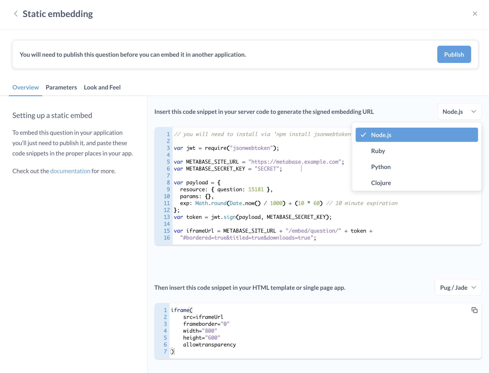

# Signed embedding

Also known as: standalone embedding.

In general, embedding works by displaying a Metabase URL inside an iframe on your website. A **signed embed** (or standalone embed) is an iframe that's secured with a signed JSON Web Token (JWT). The signed JWT will prevent website visitors from poking around in your Metabase through the iframe.

Signed embeds can't be used with [data sandboxes](../permissions/data-sandboxes.md) or [auditing tools](../usage-and-performance-tools/audit.md) because signed JWTs don't create user sessions (server-side sessions).

To restrict data in signed embeds for specific people or groups, set up [locked parameters](./signed-embedding-parameters.md#restricting-data-in-a-signed-embed) instead.

## How signed embedding works

If you want to set up interactive Metabase filters in your iframe, your web server will need to make requests to Metabase for updated data each time a website visitor updates the filter widget.

To ask for updated data from Metabase, your web server will generate a new Metabase [embedding URL](#adding-the-embedding-url-to-your-website). For example, if a website visitor enters the value "true" in an [embedded filter widget](./signed-embedding-parameters.md#adding-a-filter-widget-to-a-signed-embed), your web server will generate a new embedding URL with an extra parameter:

```
your_metabase_embedding_url?filter=true
```

To prevent people from editing the embedding URL to get access to other parts of your Metabase (e.g., by changing the parameter to `filter=company_secrets`), your web server will add a signed JWT to the new embedding URL:

```
your_metabase_embedding_url/your_signed_jwt?filter=true
```

The signed JWT is generated using your [Metabase secret key](#regenerating-the-secret-key). It tells Metabase that the request for filtered data can be trusted, so it's safe to display the results at the new embedding URL.

If you want to embed charts with additional interactive features, like [drill-down](https://www.metabase.com/learn/questions/drill-through) and [self-service querying](../questions/query-builder/introduction.md), see [Full-app embedding](./full-app-embedding.md).

## Enabling the embedding feature in Metabase

1. Go to **Settings** > **Admin settings** > **Embedding**.
2. Click **Enable**.

## Making a question or dashboard embeddable

1. Go to the question or dashboard that you want to embed in your website.
2. Click on the **sharing icon** (square with an arrow pointing to the top right).
3. Select **Embed this item in an application**.
4. Optional: [Preview the appearance of the embed](#customizing-the-appearance-of-signed-embeds).
5. Optional: [Add parameters to the embed](./signed-embedding-parameters.md).
6. Click **Publish**.


## Adding the embedding URL to your website

The embedding URL for a question or dashboard is the Metabase URL that'll be displayed in your website's iframe. It's generated by your web server using your [Metabase site URL](../configuring-metabase/settings.md#site-url), [signed JWT](#how-signed-embedding-works), and [parameters](./signed-embedding-parameters.md):

```
metabase_site_url/embed/question/your_jwt_token?parameter_name=value
```

Once you've made a question or dashboard [embeddable](#making-a-question-or-dashboard-embeddable), you'll need to put the embedding URL for that question or dashboard on your website:

1. Go to the question or dashboard > **sharing icon** > **Embed this item in an application**.
2. Click **Code**.
3. Optional: [Preview the server code](#previewing-the-frontend-code-for-an-embed).
4. Add the server code to the file that builds your website.
5. Optional: [Preview the frontend code](#previewing-the-frontend-code-for-an-embed).
6. Add the frontend code to the HTML file where you want your signed embed to appear.

For more examples, see our [reference apps repo](https://github.com/metabase/embedding-reference-apps).

## Previewing the server code for an embed

1. Go to the question or dashboard > **sharing icon** > **Embed this item in an application**.
2. Click **Code**.
3. In the top code block, you'll find the sample code for your web server.
4. Optional: Select your web framework from the dropdown menu.

When you make changes to the style, appearance, or parameter preview settings, the server code sample will update as well. Make sure to copy these changes to your actual server code.



## Previewing the frontend code for an embed

1. Go to the question or dashboard > **sharing icon** > **Embed this item in an application**.
2. Click **Code**.
3. In the bottom code block, get the sample code for your frontend.
4. Optional: Select your template language from the dropdown menu.

## Editing an embedded question or dashboard

If you change the [parameters](./signed-embedding-parameters.md) of your embedded item:

1. Click **Publish** again.
2. [Update the code](#adding-the-embedding-url-to-your-website) on your server so that it matches the code generated by Metabase (**Code** > top block).

## Disabling embedding for a question or dashboard

You can find a list of all embedded questions and dashboards from **Admin settings** > **Embedding**.

1. Go to the embeddable question or dashboard.
2. Click on the **sharing icon** (square with an arrow pointing to the top right).
3. Select **Embed this item in an application**.
4. Click **Unpublish**.

## Customizing the appearance of signed embeds

You can change the way an embedded question or dashboard looks in an iframe (which won't change how it looks in your Metabase instance). Settings include:

- Border
- Title
- Theme (light, dark, transparent)
- Font¹
- Download data²

¹ Available on [paid plans](https://www.metabase.com/pricing).

² Available on [paid plans](https://www.metabase.com/pricing) and hides the download button on questions only (not dashboards).

To update the appearance of a signed embed:

1. Optional: Preview the appearance changes from your question or dashboard's embedding settings (**sharing icon** > **Embed this item in an application**).
2. Optional: Click **Code** to find the updated server code snippet in the top code block.
3. Change the [parameters](./signed-embedding-parameters.md#customizing-the-appearance-of-a-signed-embed) in your actual server code.

For global appearance settings, such as the colors and fonts used across your entire Metabase instance, see [Customizing Metabase's appearance](../configuring-metabase/appearance.md).

## Removing the "Powered by Metabase" banner


The banner appears on signed embeds created with the Metabase open source version. You'll need to upgrade to a [paid plan](https://www.metabase.com/pricing) to remove the banner.

## Regenerating the secret key

Your embedding secret key is used to sign JWTs for all of your [embedding URLs](#adding-the-embedding-url-to-your-website). You can find it under **Settings** > **Admin settings** > **Embedding**.

**Regenerate key** will create a new secret key, and break any embedding URLs that used the old key.

## Resizing dashboards to fit their content

Dashboards are a fixed aspect ratio, so if you'd like to ensure they're automatically sized vertically to fit their contents you can use the [iFrame Resizer](https://github.com/davidjbradshaw/iframe-resizer) script. Metabase serves a copy for convenience:

```
<script src="http://metabase.example.com/app/iframeResizer.js"></script>
<iframe src="http://metabase.example.com/embed/dashboard/TOKEN" onload="iFrameResize({}, this)"></iframe>
```

## Further reading

- [Parameters for signed embeds](./signed-embedding-parameters.md).
- [Reference apps repo](https://github.com/metabase/embedding-reference-apps).
- [Strategies for delivering customer-facing analytics](https://www.metabase.com/learn/embedding/embedding-overview).
- [Publishing data visualizations to the web](https://www.metabase.com/learn/embedding/embedding-charts-and-dashboards).
- [Customizing Metabase's appearance](../configuring-metabase/appearance.md).
