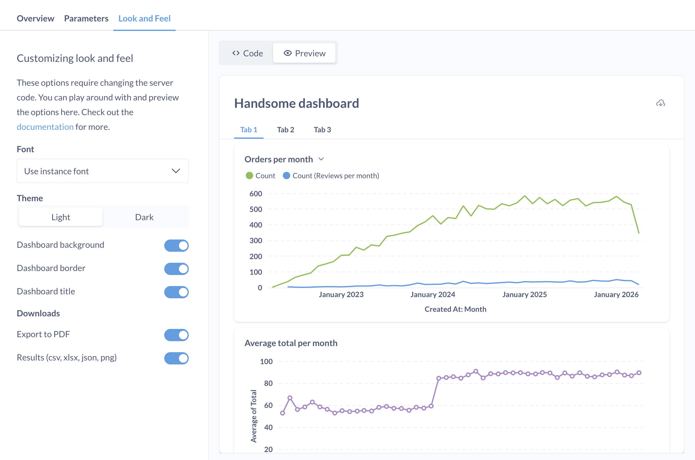
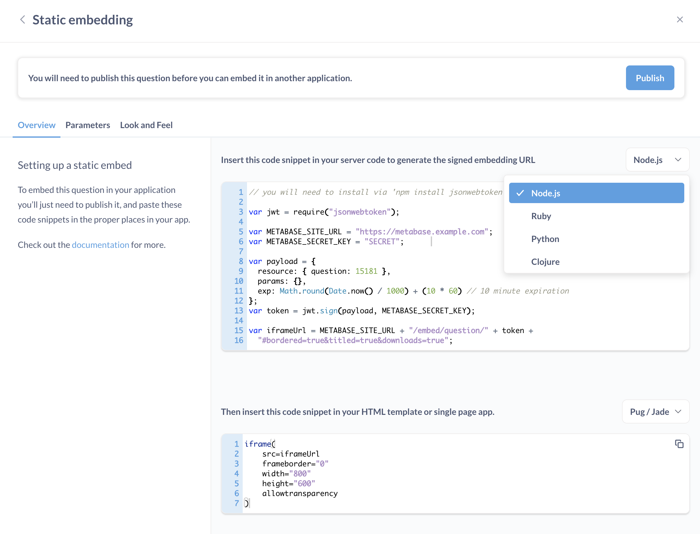

# Static embedding

Also known as: standalone embedding, or signed embedding.

In general, embedding works by displaying a Metabase URL inside an iframe in your website. A **static embed** (or signed embed) is an iframe that's loading a Metabase URL secured with a signed JSON Web Token (JWT). Metabase will only load the URL if the request supplies a JWT signed with the secret shared between your app and your Metabase. The JWT also includes a reference to the resource to load, e.g., the dashboard ID, and any values for locked parameters.

You can can't use static embeds with [data sandboxes](../permissions/data-sandboxes.md), [drill-through](https://www.metabase.com/learn/questions/drill-through), and user-specific data isn't captured in [usage analytics](../usage-and-performance-tools/usage-analytics.md) because signed JWTs don't create user sessions (server-side sessions). For those features, check out [interactive embedding](./interactive-embedding.md).

You can, however, restrict data in static embeds for specific people or groups by [locking parameters](./static-embedding-parameters.md#restricting-data-in-a-static-embed).

## How static embedding works

If you want to set up interactive Metabase filters in your iframe, your web server will need to make requests to Metabase for updated data each time a website visitor updates the filter widget.

To ask for updated data from Metabase, your web server will generate a new Metabase [embedding URL](#adding-the-embedding-url-to-your-website). For example, if a website visitor enters the value "true" in an [embedded filter widget](./static-embedding-parameters.md#adding-a-filter-widget-to-a-static-embed), your web server will generate a new embedding URL with an extra parameter:

```
your_metabase_embedding_url?filter=true
```

To prevent people from editing the embedding URL to get access to other parts of your Metabase (e.g., by changing the parameter to `filter=company_secrets`), your web server will add a signed JWT to the new embedding URL:

```
your_metabase_embedding_url/your_signed_jwt?filter=true
```

The signed JWT is generated using your [Metabase secret key](#regenerating-the-static-embedding-secret-key). The secret key tells Metabase that the request for filtered data can be trusted, so it's safe to display the results at the new embedding URL. Note that this secret key is shared for all static embeds, so whoever has access to that key will have access to all embedded artifacts.

If you want to embed charts with additional interactive features, like [drill-down](https://www.metabase.com/learn/questions/drill-through) and [self-service querying](../questions/query-builder/introduction.md), see [Interactive embedding](./interactive-embedding.md).

## Turning on the embedding feature in Metabase

1. Go to **Settings** > **Admin settings** > **Embedding**.
2. Toggle the **Enable embedding**.

## Making a question or dashboard embeddable

To create a static embed:

1. Go to the question or dashboard that you want to embed in your website.
2. Click on the **sharing icon**. On dashboards, the icon is in the top right. On questions, it's in the bottom right.
3. Select **Embed**.
4. On the **Static embed** card, click the button: **Set this up**.
5. Optional: [Preview the appearance of the embed](#customizing-the-appearance-of-static-embeds).
6. Optional: [Add parameters to the embed](./static-embedding-parameters.md).
7. Click **Publish**.



## Adding the embedding URL to your website

The embedding URL for a question or dashboard is the Metabase URL that'll be displayed in your website's iframe. It's generated by your web server using your [Metabase site URL](../configuring-metabase/settings.md#site-url), [signed JWT](#how-static-embedding-works), and [parameters](./static-embedding-parameters.md):

```
metabase_site_url/embed/question/your_jwt_token?parameter_name=value
```

Once you've made a question or dashboard [embeddable](#making-a-question-or-dashboard-embeddable), you'll need to put the embedding URL for that question or dashboard on your website:

1. Go to the question or dashboard > **sharing icon** > **Embed**.
2. Make any changes and copy the code.
3. [Preview the code](#previewing-the-code-for-an-embed)
4. Add the code to the server code that builds your website.
5. Add the frontend code to the code that generates the page where you want the embedded item to appear.

For more examples, see our [reference apps repo](https://github.com/metabase/embedding-reference-apps).

## Previewing the code for an embed

1. Go to the question or dashboard > **sharing icon** > **Embed this item in an application**.
2. Click **Code**.
3. In the top code block, you'll find the sample code for your web server. You'll also find the iframe snippet to plug into your HTML template or single page app.

When you make changes to the style, appearance, or parameter preview settings, Metabase will update the code and highlight the changes. Make sure to copy these changes to your actual server code.



Metabase generates server code for:

- Clojure
- Node.js
- Python
- Ruby

For iframe snippets:

- ERB
- JSX
- Mustache
- Pug/Jade

## Editing an embedded question or dashboard

If you change the [parameters](./static-embedding-parameters.md) of your embedded item:

1. Click **Publish** again.
2. [Update the code](#adding-the-embedding-url-to-your-website) on your server so that it matches the code generated by Metabase (**Code** > top block).

## Disabling embedding for a question or dashboard

You can find a list of all embedded questions and dashboards from **Admin settings** > **Embedding**.

1. Go to the embeddable question or dashboard.
2. Click on the **sharing icon** (square with an arrow pointing to the top right).
3. Select **Embed this item in an application**.
4. Click **Unpublish**.

## Customizing the appearance of static embeds

You can change the way an embedded question or dashboard looks in an iframe (which won't change how it looks in your Metabase instance).

When setting up a static embed, click on the **Appearance** tab, and play around with the different appearance settings.

Settings include:

- Border
- Title
- Theme (light, dark, transparent)
- Font\*
- Download data (questions only)\*

\* Available on [Pro](https://www.metabase.com/product/pro) and [Enterprise](https://www.metabase.com/product/enterprise) plans.

When you make changes to the embed's appearance, Metabase will highlight the changes it made to the code.

For global appearance settings, such as the colors and fonts used across your entire Metabase instance, see [Customizing Metabase's appearance](../configuring-metabase/appearance.md).

## Auto-refreshing the results of an embedded dashboard

> Auto-refreshing is only available for dashboards, not questions.

To refresh the results of a dashboard at a specific cadence, you can parameterize the embedded URL with `refresh`. For example, to set an embedded dashboard to refresh every 60 seconds, you would append `refresh=60` to the URL.

For example, the following code for generating an iframe URL for a dashboard would display the dashboard's title and refresh its results every 60 seconds.

```js
var iframeUrl =
  METABASE_SITE_URL + "/embed/dashboard/" + token + "#titled=true&refresh=60";
```

For the full list options you can parameterize, see [customizing the appearance of a static embed](./static-embedding-parameters.md#customizing-the-appearance-of-a-static-embed).

## Removing the "Powered by Metabase" banner


The banner appears on static embeds created with Metabase's open-source version. To remove the banner, you'll need to upgrade to a [Pro](https://www.metabase.com/product/pro) or [Enterprise](https://www.metabase.com/product/enterprise) plan.

## Regenerating the static embedding secret key

Your embedding secret key is used to sign JWTs for all of your [embedding URLs](#adding-the-embedding-url-to-your-website).

1. Go to **Settings** > **Admin settings** > **Embedding**.
2. On the **Static embedding** card, click on **Manage**.
3. Under **Regenerate secret key**, click **Regenerate key**.

This key is shared across all static embeds. Whoever has access to this key could get access to all embedded artifacts, so keep this key secure. If you regenerate this key, you'll need to update your server code with the new key.

## Resizing dashboards to fit their content

Dashboards are a fixed aspect ratio, so if you'd like to ensure they're automatically sized vertically to fit their contents you can use the [iFrame Resizer](https://github.com/davidjbradshaw/iframe-resizer) script. Metabase serves a copy for convenience:

```
<script src="http://metabase.example.com/app/iframeResizer.js"></script>
<iframe src="http://metabase.example.com/embed/dashboard/TOKEN" onload="iFrameResize({}, this)"></iframe>
```

## Custom destinations on dashboards in static embeds

You can only use the **URL** option for [custom destinations](..//dashboards/interactive.md#custom-destinations) on dashboards with static embedding. External URLs will open in a new tab or window.

You can propagate filter values into the external URL, unless the filter is locked.

## Further reading

- [Parameters for static embeds](./static-embedding-parameters.md).
- [Reference apps repo](https://github.com/metabase/embedding-reference-apps).
- [Strategies for delivering customer-facing analytics](https://www.metabase.com/learn/embedding/embedding-overview).
- [Publishing data visualizations to the web](https://www.metabase.com/learn/embedding/embedding-charts-and-dashboards).
- [Customizing Metabase's appearance](../configuring-metabase/appearance.md).
