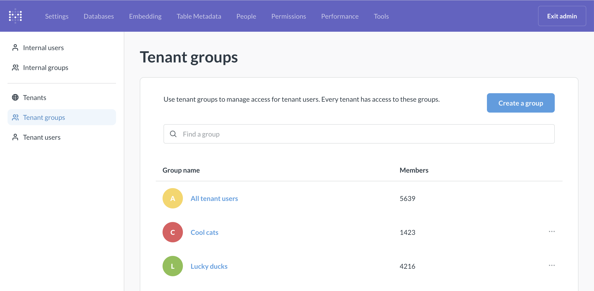
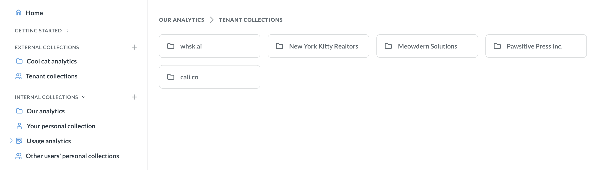
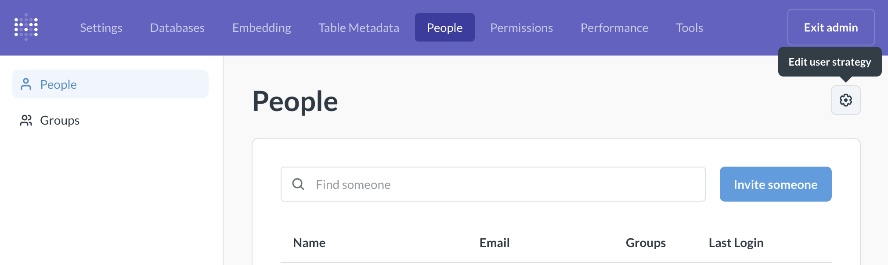
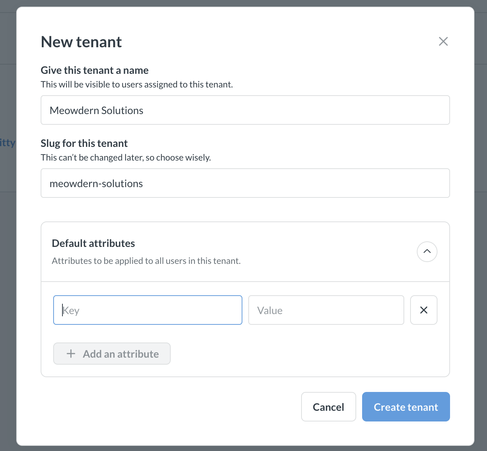
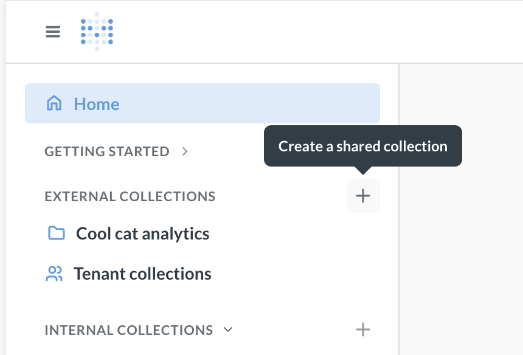
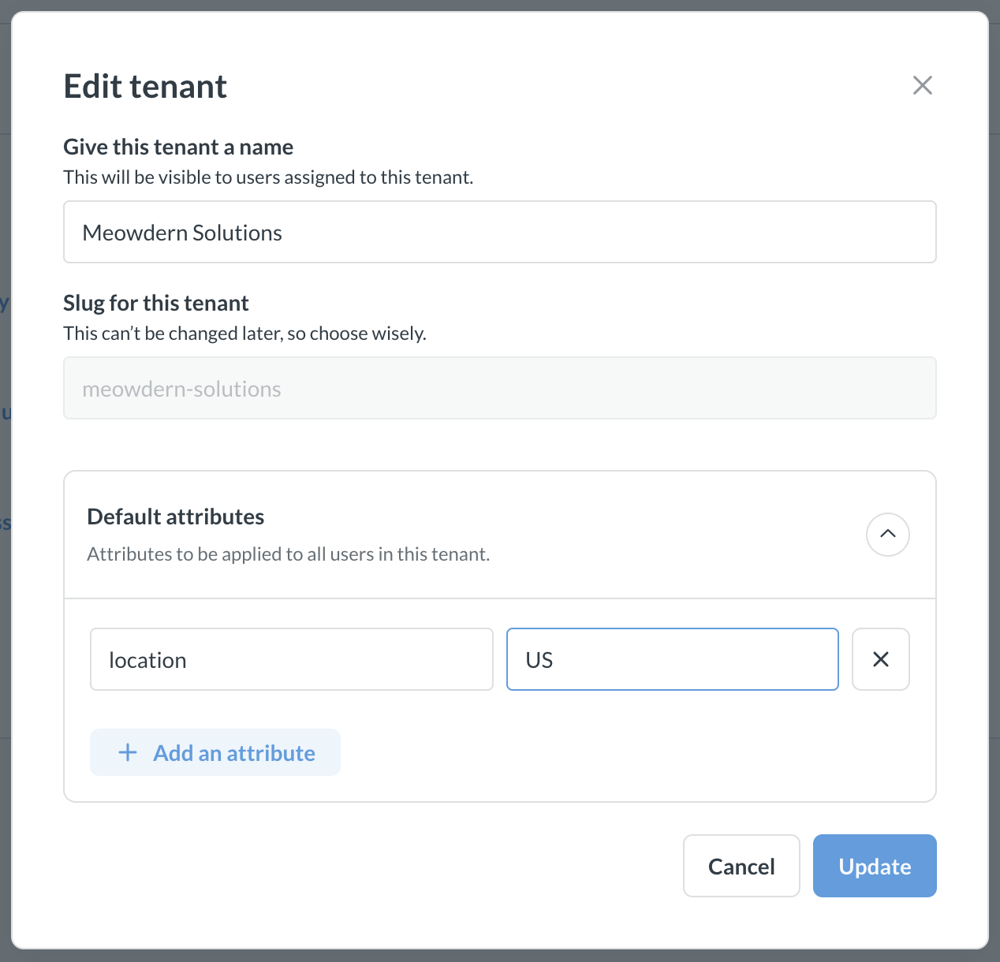
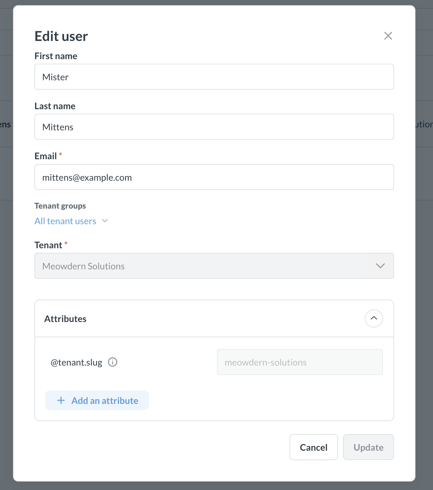

# Tenants



Tenants give you a way to group users and keep them isolated from users in other tenants. If you're building a SaaS app with embedded Metabase dashboards, you can assign the customers of your SaaS to tenants.

The big advantage of grouping users into tenants is that you can use the same content and group permissions for all tenants, so you don't have to create all new stuff for each tenant, and each tenant only ever sees their own data.


You can use tenants to:

- Simplify bulk permissions through tenant groups and attributes.
- Create collections of shared assets to avoid duplicating dashboards.
- Provision tenants with SSO.

To get started with tenants:

1. [Get familiar with tenant concepts](#concepts).
2. [Enable tenants](#enable-multi-tenant-strategy).
3. Create a [tenant](#create-new-tenants-in-metabase) and [tenant users](#create-tenant-users-in-metabase), or [provision them with SSO](#provisioning-and-assigning-tenants-with-jwt).
4. [Create shared collections](#create-shared-collections-for-tenants).
5. Set up [data](#data-permission-overview) and [collection](#collection-permissions-for-tenants) permissions.

## Concepts

**Tenant** is an abstraction representing groups of users that share some properties but should be isolated from other users. For example, if you're building a SaaS app with embedded Metabase dashboards, the customers of your SaaS are tenants.

While working with tenants in Metabase, you'll encounter different user and group types, and some special collection types. Let's establish some terminology.

### User types

- **Tenant users** are the end users. In a B2B SaaS context, these are your customer's users. Usually tenant users interact with Metabase through an intermediate app (for example, through an embedded dashboard).

- **Internal users** are "normal" Metabase users who don't belong to any tenant. Think Metabase admins, or devs building the dashboards that will be shared with tenants.

### Group types

Tenant users and internal users can be organized into Metabase [groups](../people-and-groups/managing.md#groups).



- **All tenant users** is a special group representing all individual end users across all tenants.

  This group can be used to [configure permissions](#data-permissions-for-tenants) for all tenant users. If you need more granular permission controls within each tenant, you can also create tenant groups.

- **Tenant groups** can be used to create additional permission levels for tenant users.

  For example, if you're making recruiting software, every end user can be a recruiter (with access to all data about all open roles) or a hiring manager (with access to analytics for a specific role). So in Metabase, you can create two tenant groups - "Recruiters" and "Hiring managers" and configure appropriate permissions.

  Every tenant will be able to use tenant groups (so for example, every customer can have "Recruiters" and "Hiring managers").

- **All internal users** is a special group for all people who _aren't_ members of a tenant.

  These are the people working directly in Metabase. This group is equivalent to the "All users" group when multi-tenancy is not enabled.

- **Internal groups** are additional groups for internal users.

  For example, you might have a special internal group "Analytics developers" who only have access to create dashboards that will be later shared with tenants, but don't have full admin access to your whole Metabase.

Tenant users are completely isolated from internal users: tenant users can't be added to internal user groups, and internal users can't be added to tenant groups.

### Collection types

Collections are like folders that can contain charts, dashboards, and models. They also serve as an organizational unit for permission management: if a certain group of people should have access to a certain set of assets, you should put those assets into a collection.



- **Shared collections** contain dashboards and charts that are shared between all tenants.

  For example, every tenant of a recruiting app should be able to see the number of job applications by date. You can create a [Metabase question](../questions/start.md) for "Count of applications by date" and save it into a shared collection.

  You'll need to [configure data permissions](#data-permissions-for-tenants) so that each tenant only sees _their_ job applications, and not _everyone's_ job applications (that would be bad).

  You can create many shared collections (or no shared collections at all, for that matter). For example, you can have a shared collection for analytics around recruitment and a separate shared collection for analytics around interviews.

  Shared collections can be optionally [synced to GitHub](#sync-shared-collections-to-github).

- **Tenant collections** are collections specific to each tenant. They are created automatically for each tenant.

  If you have special customers with bespoke analytics that only this customer gets, you can put those bespoke dashboards and charts into the tenant's collection. Tenant collections can also serve as a place for the tenant users to create and save new questions that can be shared with their fellow tenant users (but not with users from other tenants).

- **Internal collections**. Internal collections are exclusively an internal user concern. These are "normal" collections where you and other users internal to your Metabase can put the stuff that you don't want your end users to see (dashboards in development, internal metrics, maybe even analytics _about_ your tenants). Tenant users can't access any internal collections.

- **Personal collection**. Every Metabase user, including tenant users, gets a personal collection - their own space to save new questions and dashboards (of course, if they otherwise have the permissions to build and save new questions).

See [Collection permissions](#collection-permissions-for-tenants) for configuring access to different collection types.

## End user experience

End users who are members of tenants will not know that they are members of tenants.
In the experiences that expose users to Metabase collections (e.g. when using full-app embedding, modular embedding components with save enabled, or if tenant users are logging in directly into Metabase), tenant users see all the tenant and shared collections they have access to as just collections.

## Enable multi-tenant strategy

_Admin settings > People_

You can create and manage your tenants exclusively through Metabase UI, or, if that's not your jam, [through SSO](#provisioning-and-assigning-tenants-with-jwt). Regardless of how you manage your tenants, you'll need to enable multi-tenant strategy in Metabase first.



1. Go to **Admin settings > People**.
2. Click on the **gear** icon above the list of people.
3. Choose **Multi-tenant strategy**.

Changing Metabase to multi-tenant strategy enables special [user](#user-types) and [collection](#collection-types) types. You can create new tenants, tenant groups, and collections, and you get some additional admin settings in the People and Permissions tabs.

If you have an existing permissions and collection setup that you'd like to translate to use tenants, see [Changing tenant strategy](#changing-tenant-strategy).

Once you enable multi-tenant strategy, keep in mind that switching _from_ multi-tenant to single-tenant is a destructive action: all your tenant users and your tenant and shared collections will be disabled. See [Changing tenant strategy](#changing-tenant-strategy).

## Create new tenants in Metabase

_Admin settings > People > Tenant_



To create new tenants in Metabase:

1. [Enable multi-tenant strategy](#enable-multi-tenant-strategy), if you haven't yet.
2. Go to **Admin settings > People** .
3. Select **Tenants** on the left sidebar and click **New tenant**.
4. Fill out the information for the tenant:
   - **Tenant name**: Display name for the tenant that will be displayed to _internal_ users. Not exposed to external users. This name can be changed later.
   - **Tenant slug**: Unique identifier of the tenant. It can be used to [match JWT claims](#use-tenant-claim-to-sign-in-users) and for setting up [data permissions](#use-tenant-attributes-for-data-permissions). See [Tenant slug](#special-tenant-slug-attribute) for more information.
   - **Tenant attributes**: you can define tenant attributes that will be inherited by every tenant user, see [Tenant attributes](#tenant-attributes).

You can avoid manually setting up tenants in Metabase by [provisioning tenants with JWT](#provisioning-and-assigning-tenants-with-jwt).

## Create tenant groups

_Admin settings > People > Tenant groups_

Tenant groups are applicable across tenants. For example, you can have tenant groups "Basic users" and "Premium users", and every tenant will be able to use those groups. Groups can be used to configure permissions so that, among the tenant's users, some get Basic permissions while others get Premium. See [Tenant concepts](#concepts) for more information.

To create a tenant group:

1. [Enable multi-tenant strategy](#enable-multi-tenant-strategy), if you haven't yet.
2. Go to **Admin settings > People**.
3. Select **Tenant groups** on the left sidebar and click **Create a group**.
4. Name your group.

To add people to tenant groups, see [Add people to groups](../people-and-groups/managing.md#adding-people-to-groups).

## Create tenant users in Metabase

_Admin settings > People > Tenant users_

Tenant users are the end users in tenants. In a B2B SaaS context, these are your customer's users. Usually tenant users interact with Metabase through an intermediate app (for example, through an embedded dashboard).
To add tenant users in Metabase:

1. [Create a tenant](#create-new-tenants-in-metabase).
2. Go to **Admin settings > People** .
3. Select **Tenant users** on the left sidebar and click **New tenant user**.
4. Fill out the user information, including the tenant and tenant groups.

   If your tenant has [tenant attributes](#tenant-attributes), they'll be inherited by the user, but you can override the value in "Attributes".

You can also [provision tenant users with JWT](#provisioning-and-assigning-tenants-with-jwt).

## Create shared collections for tenants



Shared collections contain dashboards and charts that are shared between all tenants. If you're using shared collections, make sure that you configure [data permissions](#data-permissions-for-tenants) so that tenants can only see _their data_ in the shared collections. See [Tenant concepts](#concepts) for more information.

To create a shared collection:

1. [Enable multi-tenant strategy](#enable-multi-tenant-strategy), if you haven't yet.
2. Open Metabase navigation sidebar by clicking on the **three lines** in the top left (that's regular Metabase, not Admin settings).
3. You should see "External collections" in the sidebar. If you don't, make sure you have enabled multi-tenant strategy.
4. Click on the **+** next to "External collections" to create a shared collection.

You can have multiple shared collections and nested shared collections. You can also [sync shared collections to GitHub](#sync-shared-collections-to-github).

## Sync shared collections to GitHub

_Admin settings > Remote Sync_

You can set up [Remote sync](../installation-and-operation/remote-sync.md) for shared collections. This means you'll be able to develop shared content in one Metabase, push it to a GitHub repo, and then have the shared content in your production Metabase always synced with that repo. See [Remote sync docs](../installation-and-operation/remote-sync.md) for more details.

## Tenant attributes

_Admin settings > People > Tenants_

You can create tenant-level [user attributes](#tenant-attributes) which all users of the tenant inherit. This is useful for configuring attribute-based data permissions like [row-level security](../permissions/row-and-column-security.md), [impersonation](../permissions/impersonation.md), or [database routing](../permissions/database-routing.md).



To add a tenant attribute:

1. Go to **Admin settings > People**
2. Select **Tenants** on the left sidebar.
3. Click on **three dots** next to the tenant.
4. Input the attribute key and value.

Once you add a tenant attribute, all users of that tenant will inherit the attribute, but the value can be overridden for any particular user, see [Edit user attributes](../people-and-groups/managing.md#adding-a-user-attribute).

Currently, you can't assign custom tenant attributes with SSO. The only way to assign attributes is through the Metabase UI (but you can provision attributes for _individual users_ through SSO, see [JWT user attributes](../people-and-groups/authenticating-with-jwt.md)). However, if you're using user attribute to set permissions, then you can use the [special slug attribute](#special-tenant-slug-attribute) which Metabase creates automatically.

### Special tenant slug attribute

Each tenant user will get a system-defined attribute `@tenant.slug` that corresponds to the slug of the tenant. For example, if you created a tenant "Meowdern Solutions" with the slug `meowdern_solutions`, then every user from this tenant will get a special attribute `@tenant.slug : "meowdern_solutions"`.



If you create Metabase tenants through Metabase UI, you can choose the slug when creating the tenant. If you're [using JWT to provision tenants](#provisioning-and-assigning-tenants-with-jwt), tenant slug is the value of the `@tenant` claim for JWT (or another tenant assignment attribute you selected). Slug cannot be changed later.

The special `@tenant.slug` attribute can be used just like a normal attribute to configure attribute-based permissions like [row-level security](../permissions/row-and-column-security.md), [impersonation](../permissions/impersonation.md), or [database routing](../permissions/database-routing.md). Your chosen tenant slug should correspond to how the tenant is actually identified in your setup.

For example, if you want to use row-level security, and tenants are identified in your tables by their IDs (instead of names), then your tenant slug should be an ID as well.

For example, if your data looks like this:

```
| Customer ID | Order number | Order date | Order total |
| ----------- | ------------ | ---------- | ----------- |
| 175924      | 3            | 2025-10-13 | 175.34      |
| 680452      | 7            | 2025-10-13 | 34.56       |
```

and you want to enforce row-level security by `Customer ID`, then the tenant slug should have the form `175924` so that it could be matched to the Customer ID in your table.

Similarly, if you want to use tenant slug for impersonation, you'll have to map the tenant slug to a database role, and for database routing - to a database.

## Provisioning and assigning tenants with JWT

### Use tenant claim to sign in users

You can [set up JWT SSO](../people-and-groups/authenticating-with-jwt.md) and use the JWT to sign in tenant users.

Once you [enable multi-tenant user strategy](#enable-multi-tenant-strategy), Metabase will look for a `@tenant` claim in your JWT to determine if the user is a tenant user, and which tenant the user belongs to. The value of `@tenant` key should be the tenant's slug. Here's an example of a JWT claim to sign in a tenant user:

```json
{
  "email": "mittens@example.com",
  "first_name": "Mister",
  "last_name": "Mittens",
  "@tenant": "meowdern_solutions"
}
```

If the user has already been assigned to a tenant (for example, through Metabase UI), then the JWT _must_ contain the tenant claim to sign the user in.

### Customize tenant claim

By default, Metabase looks for a `@tenant` key in your JWT. To set up a different key:

1. Go to **Admin** > **Settings** > **Authentication** > **JWT** > **User attribute configuration**
2. Change the **Tenant assignment attribute** key to your preferred identifier.

### Provisioning tenants and users

You can [turn on JWT user provisioning](../people-and-groups/authenticating-with-jwt.md) so that Metabase will automatically create users and tenants mentioned in the JWT.

When user provisioning with JWT is enabled:

1. Metabase reads the tenant identifier from the JWT claim. By default, this is the `@tenant` key (you can configure this).
2. If the tenant doesn't exist, Metabase automatically creates it. Metabase will use the value of the `@tenant` key (or your chosen assignment attribute) as the tenant slug.
3. New users are automatically assigned to the tenant from their JWT.

### Troubleshooting JWT authentication with tenants

Some common auth error messages and what they mean:

- **Cannot add tenant claim to internal user**: JWT includes a tenant, but the user is an internal user. Only tenant users can have a tenant.
- **Tenant claim required for external user**: JWT lacks a tenant claim, but the user is an external user.
- **Tenant ID mismatch with existing user**: JWT has a different tenant than the user's assigned tenant.
- **Tenant is not active**: The tenant exists but has been deactivated.

## Data permissions for tenants

_Admin settings > Permissions_

Data permissions control what data people can see on charts and dashboards, and what they can do with that data. To control _which_ charts people see, you can use [collection permissions](#collection-permissions-for-tenants) instead.

### Data permission overview

For an overview of how data permissions work in Metabase, see [Data permissions](../permissions/data.md). Here are the highlights (but please do read the full [Data permissions](../permissions/data.md) documentation):

- **"View data"** controls which data each user group can see on dashboards and charts.

  For example, if your tenant data is commingled in one database, then you can use [**Row and column security**](../permissions/row-and-column-security.md) or [**Impersonation**](../permissions/impersonation.md) "View data" permissions to provide tenant users with access to only certain rows and columns.

  If every tenant has their data in a separate database, then instead of using permissions for data access control, you can use [**database routing**](../permissions/database-routing.md) to route queries to appropriate databases directly.

- **Create queries** controls whether tenant users can create queries on the data they see. If you want to give your tenant users the ability to drill through (e.g., through `drills` parameter in [modular embedding](../embedding/modular-embedding.md)), you need to give them "Create queries" permissions, because a drill through is a new query.

- **Download results** controls, unsurprisingly, whether people can download results of queries. You need to set download permissions if you want to give your users the option to download their data as a spreadsheet (for example, through `with-downloads` parameter in [modular embedding](../embedding/modular-embedding.md)).

Data permissions in Metabase can be specified on database or table level and are granted to groups. You'll need to use the special **All tenant users**, and your tenant groups (if any) to assign data permissions. Keep in mind that Metabase permissions are additive, so if someone is a member of two different groups, they will be granted the _most_ permissive access. In particular, if "All tenant users" has "Can view" access to an entire table, but another tenant group has restricted access (e.g. "Row and column security"), then the users of the tenant group will still see all the data in the table because they get it via the "All tenant users" group. If you're using tenant groups, we recommend revoking access for "All tenant users" and configuring access on group-by-group basis.

Please review [Data permissions documentation](../permissions/data.md) for more details on permissions setup.

### Use tenant attributes for data permissions

[Row and column security](../permissions/row-and-column-security.md), [Impersonation](../permissions/impersonation.md), and Database routing require user attributes. You can [specify custom tenant attributes](#tenant-attributes) to configure data permissions based on attribute values. See [Tenant attributes](#tenant-attributes). Alternatively, you can use the special tenant slug attribute, see [Special slug attribute](#special-tenant-slug-attribute).

## Collection permissions for tenants

Collection permissions control which entities (dashboards, questions, models etc) people can see.

To configure what _data_ can people see in those entities, and what they can do with that data, see [Data permissions](#data-permissions-for-tenants) instead.

In Metabase, there are different levels of collection permissions: **No** access, **View**-only access, and **Curate** access (allows for creating and saving new entities like dashboards). For more general information about collection permissions in Metabase, see [Collection permissions](../permissions/collections.md).

Permissions are granted to groups. Which permissions are available to each group depend on the type of the group (external/tenant or internal) and the type of the collection.

### Tenant user collection permissions

- For **internal collections**, tenant users will have **No** access.
- For **shared collections**, tenant users can only have **View** or **No** access. This means that at _most_, tenant users can see existing entities but not create new ones.

  Different tenant groups can have different levels of access to different shared collections. For example, you can have a "Basic analytics" shared collection viewable by all users, and "Advanced analytics" collection only viewable by tenant group "Premium users".

  See [Configuring shared collection permissions](#configuring-shared-collections-permissions).

- For **tenant collections**, tenant users will always have **Curate** permissions, which means that tenant users will always be able to save new questions in their tenant collection.

  If you don't want your tenant users to create and save their own charts, you'll need to disable "Create queries" [data permissions](#data-permissions-for-tenants) for tenant users, and, if you're embedding Metabase, configure the embedded UI components to disable saving.

- For their own **personal collections**, tenant users will always have **Curate** permissions.

### Internal user collection permissions

- Metabase Admins will have **Curate** access to all shared collections and all tenant collections.
- Other internal groups can be granted **View** or **Curate** access to **shared collections**, see [Configuring shared collection permissions](#configuring-shared-collections-permissions).
- Non-admin internal users will have **No** access to tenant-specific collections. Currently, this can't be configured.

For configuring permissions to _internal_ collections for internal users, see [general docs on collection permissions](../permissions/collections.md).

### Configuring shared collections permissions

_Admin settings > Permissions_

To configure access to shared collections for tenant and internal groups, go to **Admin settings > Permissions > Shared collections**.

You can configure access for each shared collection and their subcollections for both internal and external users. See general docs on [collection permissions](../permissions/collections.md).

Special **Root shared collection** controls who has access to _all_ shared collections. For example, if you want to make sure your internal users don't have access to any tenant shared collections, you can revoke permissions from the Root shared collection.

When configuring permissions, remember that in Metabase, all permissions are additive, so if someone is a member of two different groups, they will be granted the _most_ permissive access. In particular, if "All tenant users" has "View" access to a shared collection, but another tenant group has "No" access to that collection specified in the permission settings, the users of the tenant group will still get "View" access because they have it via the "All tenant groups". If you're using tenant groups, we recommend revoking access for "All tenant users" and configuring access on group-by-group basis.

## Subscription permissions for tenants

_Admin settings > Permissions_

By default, all tenant users will be created with **No** [subscription permissions](../permissions/application.md#subscriptions-and-alerts). If you want your users to be able to create subscriptions (either in full-app embedding, modular embedding, or by logging in directly to Metabase), you'll need to change the Subscription and alerts permissions to "Yes".

## Deactivate a tenant

_Admin settings > People > Tenants_

**Deactivating a tenant will also deactivate all users who belong to this tenant**.

To deactivate a tenant:

1. Go to **Admin settings > People**.
2. Select **Tenants** on the left sidebar.
3. Click on **three dots** next to the tenant.
4. Choose **Deactivate tenant**.

All tenant users will be deactivated and won't be able to sign in anymore. Tenant users will not be permanently deleted (Metabase does not delete users, only deactivates), so even though the tenant users will be deactivated, you won't be able to create new users with the same email.

## Changing tenant strategy

### From single-tenant to multi-tenant

When you enable multi-tenant strategy, all users that currently exist in Metabase will be considered "internal" users. If you don't want any of those users to become [tenant users](#concepts), you can just proceed with tenant setup as if you had a fresh new instance (create tenants, create collections, set up permissions, etc).

However, if you want to assign some existing users to tenants, you'll need to:

1. Mark them as tenant users using the API call:

   ```sh
   PUT /api/user/:id
   {"tenant_id": 1}
   ```

2. If you're using JWT for SSO, [add a `@tenant` claim to your JWT](#provisioning-and-assigning-tenants-with-jwt).
3. Set up [tenant groups](#concepts), [data permissions](#data-permissions-for-tenants), and [collection permissions](#collection-permissions-for-tenants) because you won't be able to use existing internal groups for tenant permissions.

### From multi-tenant to single-tenant

If you disable multi-tenant strategy, _all your tenant users will be deactivated_ and _all collections will be deleted_ (although you'll get both users and collections back if you reactivate multi-tenant strategy later). So if you want to keep the active users but just disable tenancy features, you'll need some extra prep.

1. Replicate the tenant setup you have with regular groups and collections (instead of tenant groups and shared collections). Review documentation for Data permissions, Collection permissions, and User groups. Make sure to thoroughly test your setup with test users. A [development instance](../installation-and-operation/development-instance.md) might come in handy.
2. If you're using any tenant groups, remove the tenant group memberships of all tenant users.
3. Change the tenant users to internal users using API:

   ```sh
   PUT /api/user/:id
   {"tenant_id": null}
   ```

   **If you don't do this step, all your users will be deactivated.**

4. Finally, disable the feature once everything is verified to work.

## Limitations

- **Tenant collections and personal collections can't be disabled**.

  If you don't want your tenant users to create and save their own charts, you can disable "Create queries" [data permissions](#data-permissions-for-tenants), and, if you're embedding Metabase, configure the embedded UI components to disable saving.

- **Tenant users can't change tenants.** Once an external user is assigned to a tenant, they cannot switch to another tenant.

- **If you disable multi-tenant strategy, deactivated tenant users will not show up in "Deactivated users"**, but Metabase will still keep track of them and won't allow creating new users with the same email.

- **There are no tenant-specific groups**. Tenant groups are shared between all tenants. If you need a special group for just some of your tenants, create a tenant group but don't add any members from the tenants that the group isn't applicable to.

## Further reading

- [Embedding overview](./start.md)
- [JWT authentication](../people-and-groups/authenticating-with-jwt.md)
- [Permissions overview](../permissions/start.md)
