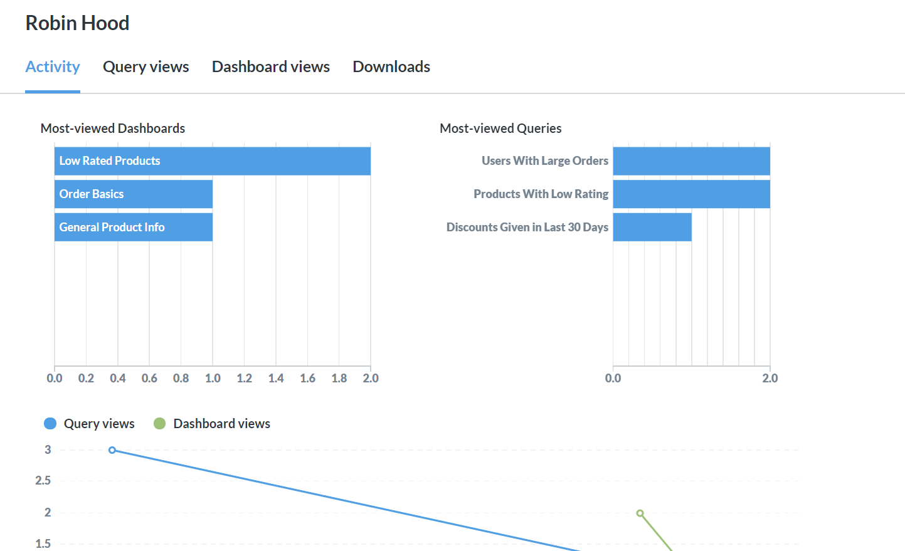
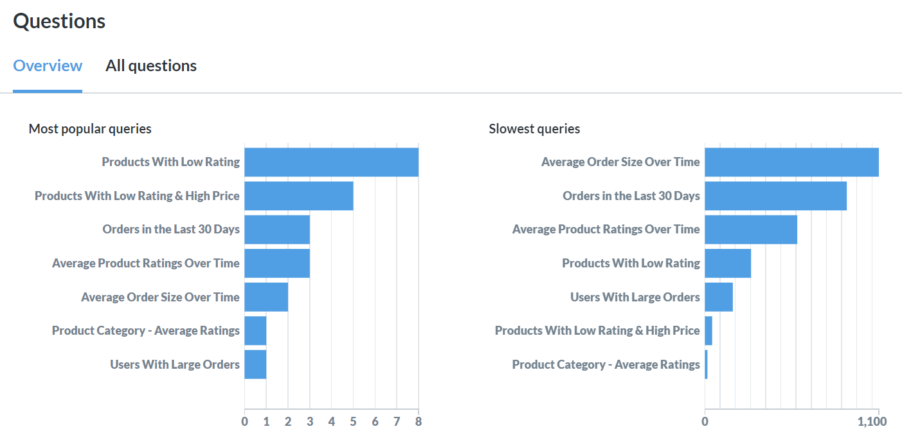
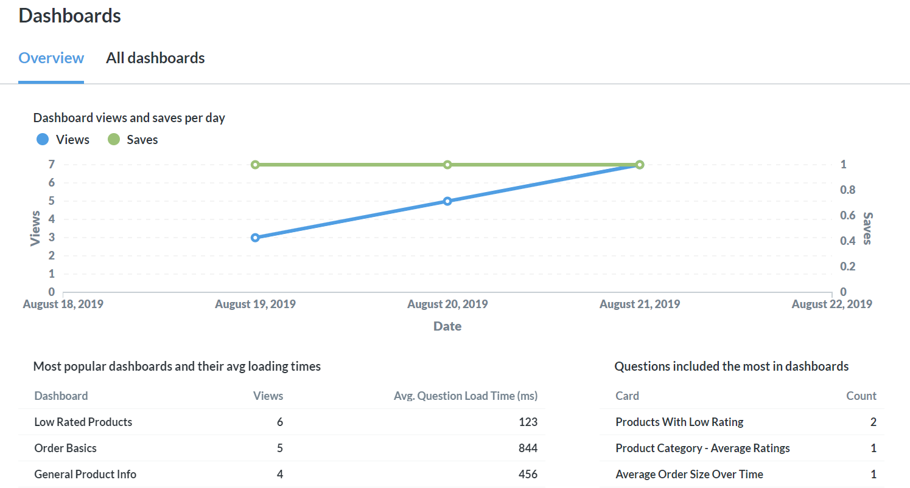

## Audit Logs

As an administrator of Metabase, you already know the importance of using data to understand your users. With the Audit tool, you can use Metabase to understand your Metabase users' usage. It's, well, meta! 

Access the tool by clicking the gear icon in the upper right and then clicking Audit in the top navigation. There's a lot of data available, not only about your people, but also about your questions, dashboards, databases and more! We'll walk you through each of the sections below.

### People

Use the People section to gain a better understanding of how your end-users are interacting with Metabase. You'll want to pay attention to the Overview tab, especially when you first launch Metabase at your organization — it will give you data around how many active and newly created users you have each day. Further down the page, you'll see charts showing you which of your users are most engaged. Use these charts to find your power users!

The Team Members panel has a view of other options for viewing your team's usage data. The All Members tab will give you a list of your team members, and stats about their activity, such as when they were last active.

The Audit Log tab will display, in chronological order, each query, who viewed it, and when. Note that if the user did not save their query, its name will be listed as `Ad-hoc`. Each query name can be clicked to view more details about your users' interactions with it, including a full revision history. You will also be able to view the query in Metabase. Note that this link will always show the latest version of the query - use the revision history to see changes over time.

#### Drilling In

Throughout the People section, names can be clicked to access the profile of a specific user’s activity. This profile includes:

- Dashboard views
- Query views
- Downloads

### Data

The Data section focuses on your databases, schemas and tables, and is divided into corresponding sections. Look here if you're trying to uncover queries and schemas that need optimization. Each section provides visualizations around the use and speed of querying against your databases, schemas or tables. You will also be able to view lists of stats about all of your databases, schemas and tables.

### Items

The Items section focuses on questions, dashboards and downloads, and is divided into corresponding sections. Use these pages to gain a better understanding of what your users are interacting with.

#### Questions

The Questions section will show you your most popular queries, as well as your slowest queries. If queries you think are important aren't appearing on your most popular queries list, you may want to make sure your team is focusing on the right things.

If important queries are appearing on the list of slowest queries, you will want to look at optimizing them. One option is to adjust your [caching settings](../administration-guide/14-caching.md), but there are plenty of other options as well. To help you determine if your optimization efforts are heading in the right direction, use the `Query views and speed per day` visualization at the bottom of the page.

A list of all of your questions is available as well, and you can see various data points about each question at a glance, such as number of views and cache TTL.

#### Drilling In

You can also click on any question to drill into a more detailed profile showing:

- View activity
- Revision History
- A full audit log of who viewed the question, and when

#### Dashboards

The Dashboards section is another great way to understand what your users who are dashboard-focused are looking at, and to make sure they're having a smooth experience. If you notice that a popular dashboard has a high average question loading time, you can investigate further using the Questions section outlined above.

A list of all of your dashboards is available as well, and you can see various data points about each dashboard at a glance, such as number of views and average question execution time.

#### Downloads

Use the Downloads section to understand which of your users are downloading (or exporting) data and the size (number of rows) of the downloads they're performing. This section contains some visualizations, as well as a list of all downloads.
