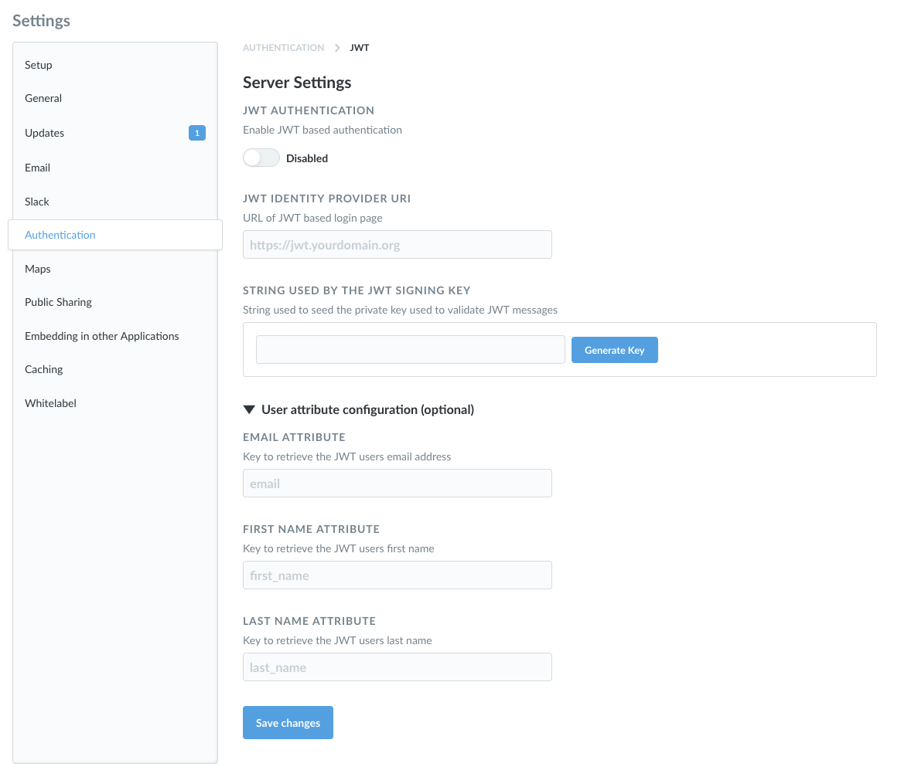

## JWT-based Authentication

You can connect Metabase to your JWT-based identity provider to allow your Metabase users to authenticate through it.

### Enabling JWT authentication
First, navigate to the Settings section of the Admin area, then click on the Authentication tab. Click the `Configure` button in the JWT section of this page, and you'll see this form:

Click the toggle at the top of the form to enable JWT-based authentication, then fill in the form with the information about your identity provider. **Make sure to turn this on**, otherwise JWT authentication won't work, even if all of your settings are right.

Here's a breakdown of each of the settings:

**Identity Provider URI:** This is where Metabase will redirect login requests. That is, it's where your users go to log in through your identify provider.

**String Used by the JWT Signing Key:** This is a string used to seed the private key that is used to validate JWT messages.

#### User attribute configuration (optional)
These are additional settings you can fill in to pass user attributes to Metabase.

**Email attribute:** the key to retrieve each JWT user's email address.

**First Name attribute:** the key to retrieve each JWT user's first name.

**Last Name attribute:** if you guessed that this is the key to retrieve each JWT user's last name, well then you have been paying attention.

#### Group Schema

You can use your JWT to assign Metabase users to custom groups by following these steps:

1. Add this to your JWT: `groups: ["group_name"]`
2. In the Admin Panel in Metabase, go to the Authentication tab of the Settings section and click the Configure button on JWT. On this screen, turn on the toggle under "SYNCHRONIZE GROUP MEMBERSHIPS".
3. Next, click Edit Mappings. In this modal, type in the name of one of your groups as defined in the JWT, then click Add. In the row that appears, click the dropdown to pick the Metabase group that this should map to. Repeat this for each of the groups you want to map.

### Disabling Password Log-in

Once you have configured your JWT authentication, you can choose to disable the option for users to log in via username and password. To do this, return to the main Authentication settings page and scroll to the bottom. A toggle will now be visible allowing you to make this change.

---

## Next: Creating data sandboxes for your user groups
Data sandboxes automatically filter specific tables for your users based on who they are. We'll show you [how to set these up](data-sandboxes.md) next.
